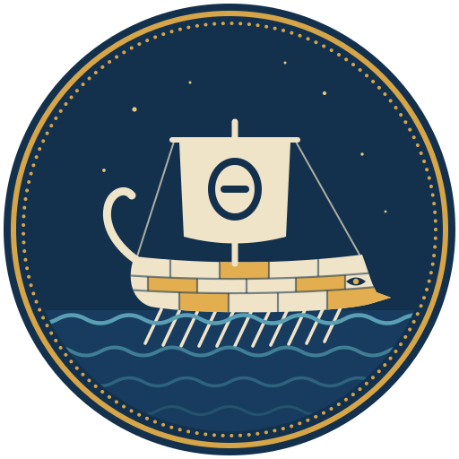
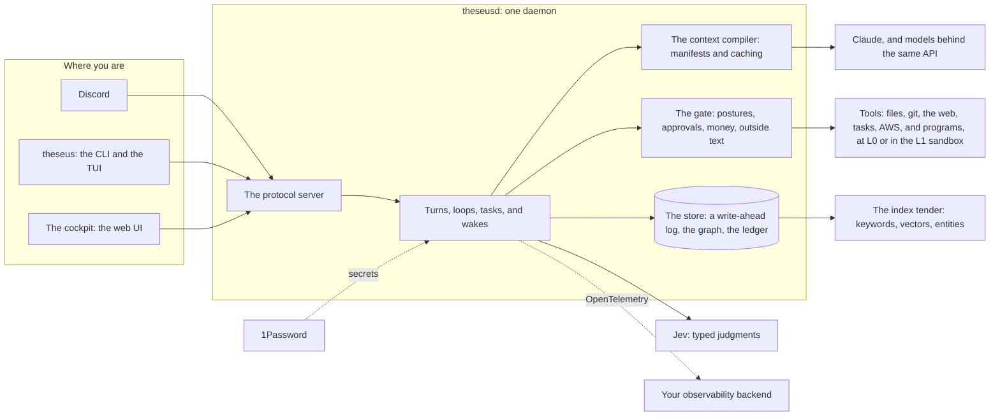

<p align="center">
  
</p>

<h1 align="center">Theseus</h1>

<p align="center">
  <strong>An opinionated, fast, durable AI agent runtime: one agent with many personas, thousands of tasks, and a
  complete record of everything it does.</strong>
</p>

<p align="center">
  
  
  
  
</p>

<p align="center">
  <a href="docs/status.md">Status and roadmap</a> ·
  <a href="docs/the-ship-of-theseus.md">The design document</a> ·
  <a href="docs/technical-overview.md">Technical overview</a> ·
  <a href="#quick-start">Quick start</a>
</p>

> *The ship wherein Theseus and the youth of Athens returned from Crete had thirty oars, and was preserved by the
> Athenians down even to the time of Demetrius Phalereus, for they took away the old planks as they decayed, putting
> in new and stronger timber in their places, insomuch that this ship became a standing example among the
> philosophers, for the logical question of things that grow; one side holding that the ship remained the same, and
> the other contending that it was not the same.*
>
> Plutarch, *Life of Theseus* (Dryden's translation)

Theseus runs AI agents for one person, or for a small team. You talk to it in Discord, in a terminal, or in your
browser. It does real work with real tools: it reads and edits files, runs commands, searches and reads the web,
starts background tasks, and sets itself reminders. It keeps a complete, durable record of everything it does:
what it did, why, what it was shown, what it cost, and who approved it.

It is written in Rust: a daemon that does the work, and a small command-line client. It talks to Anthropic's Claude
models directly, and to any model served through the same API (GLM from Z.ai is supported today).

**About the name.** Theseus is built the way Plutarch's ship was kept: one small, reviewed, tested plank at a time.
Its design document is also the record of every plank that was replaced.

<p align="center"></p>

## Why another agent harness?

There are good agent tools already: Claude Code, Codex, Cursor, OpenClaw (the harness Theseus grew out of), and
more. We use them every day. But running agents for days at a time, on work that matters, kept raising the same
questions, and the other tools answer them softly, or not at all:

| The question | How Theseus answers it |
|---|---|
| **What exactly did it do, and why?** After an hour of autonomous work, the reasons, tool calls, retries, and costs are scattered across logs, when they are kept at all. | Every turn, call, approval, and dollar goes into an append-only ledger, and every prompt has a manifest of what went into it. |
| **What happens when something breaks mid-task?** Is the work lost? Is it done twice? | Every action is written to disk before it is attempted, and its result when it settles. Kill it at any moment, and it picks up exactly where it was. |
| **How do I stay in control without babysitting it?** | Each tool runs open, with a notice, or after your approval, as you choose, and an approval is bound to the exact command. Work that needs nothing from outside runs in a sandbox. |
| **What did that cost?** Usually you find out from the monthly bill. | Money is a gate: every model call reserves its worst case before it runs, and at the limit Theseus stops and asks you. |
| **What was the model actually shown** when it made that choice? | Context is compiled, and the manifest names every node, file, and summary that went in, and why. |
| **Why is it so slow,** and why does it get slower as it does more? | Speed has written budgets, and every commit's test gate fails the commit if one slips. |

Theseus answers them with five ideas, and a handful of promises it keeps whatever the model does. Some of it works
today and some is being wired in, step by step; [the status page](docs/status.md) says which.



### 🧭 1. Opinionated, not a framework

Most harnesses chase flexibility: plugin systems, a dozen chat apps, any model, any memory backend, any tool
format. Every option is a seam, and every seam costs speed, testing, and attention.

Theseus makes its choices once, and goes deep on each:

| Choice | What it means |
|---|---|
| **Discord** | where it lives online, in text (and soon voice), beside the terminal and the browser |
| **AWS** | far-reaching hands: Theseus gets an AWS account of its own, within a budget and a security stance you set, and runs work there that a laptop can't |
| **Anthropic's API** | called directly, not through a gateway |
| **Jev** | its classifier (the next idea) |
| **1Password** | holds every secret |
| **Rust** | one statically linked binary: no runtime, no sidecars |

There is no plugin marketplace to wire up and no hook system to debug. The design had a hook system once, and it was
deleted. In the author's words: "I used to believe in the plugins, now I believe in one, tight, focused, monolithic
single-function server and a similarly tight client." What remains is a small core whose every path is tested end to
end.

### ⚖️ 2. Judgment in the core: Jev

Every agent harness hits the same wall. Some decisions need real judgment. Is this task done, or should the agent
keep going? Is this action safe? Which of fifty memories matter right now? Is this message a new request, or the
answer to a question the agent asked? Until now there were two bad options, and **Jev**
([TypeSafe](https://typesafe.ai)'s "System One" model) is the way out:

| | Write the judgment as code | Ask another LLM | Ask Jev |
|---|---|---|---|
| **Speed** | fast | seconds on every turn | about a third of a second, many questions at once |
| **Cost** | nothing | dollars, added to every turn | a tiny fraction of a cent |
| **When the world doesn't match** | brittle: wrong the moment the rule doesn't fit | smart | typed answers (a choice, a score, a yes or no) with their probabilities |

That is fast and cheap enough to sit **inside the harness's own control loop**, at the points where judgment decides
what happens next:
- Is the work done, or should the loop continue?
- Should this session keep its context, or recompile it?
- Which role and persona does this message call for?
- Is this action safe enough to run without asking?
- Which nodes are worth remembering, and for how long?

Every judgment is recorded with its probabilities, its latency, and its outcome once that's known. Each pack of
questions starts in shadow, and is tuned against held-out labels before it acts. Jev is never the only guard on
anything that matters for safety.

### ⚡ 3. Fast is a contract

Theseus has written budgets for speed and memory, and treats them as requirements, not aspirations:

| What | Budget | Today (debug build, in the gate) | Of the budget |
|---|---|---|---|
| Start to answering | under 50 ms | about 25 ms | `█████░░░░░` |
| Clean shutdown, with work in flight | under 100 ms | about 45 ms | `█████░░░░░` |
| Crash, restart, and answer again | under 150 ms | about 45 ms | `███░░░░░░░` |
| Upgrade the binary under load, keeping running jobs | under 200 ms | about 60 ms | `███░░░░░░░` |
| Harness overhead per turn | under 5 ms | to be measured | |
| Memory for 10,000 parked sessions and 50 active ones | under 1 GB | to be measured | |

**Every commit's test gate measures the first four, and fails the commit if one slips.** The payoff is concrete:
restarting and upgrading are routine, never risky; the conversation in front of you feels immediate; and the scale
in the next idea becomes possible. Ideas 1 and 2 are a large part of how Theseus gets there: no seams to cross, and
judgment that costs a fraction of a second, not several seconds.

### 🧩 4. One agent, many personas, thousands of tasks

"Multi-agent" systems meet real needs. Work needs specialists, each with the right context, working in parallel so
the work finishes sooner. But most frameworks meet those needs by making the agents truly separate: separate
processes, often separate harness binaries, separate memories. Then, ironically, they try to share what each one
knows by putting them all in the same chat channels.

Theseus takes the opposite approach: **one agent, one source of truth, many views of it.**
- **One graph** holds everything any agent would need: every message, tool call, result, task, judgment, and
  summary, with typed edges between them. It is the single source of truth, built to be fast to query.
- **Personas** are views, not separate agents: the same agent with a different role, different guidance, and
  different context, chosen per conversation or per task.
- **Tasks** are sessions of their own. A conversation hands work to a task, with its own budget and its own
  context compiled from the same graph, and the task reports back when it's done. A task can wake the conversation
  that started it, and wait on a person or a job.

A task with nothing to do costs nothing: it is a small record on disk, not a process or a thread. So Theseus is
built to hold **thousands of tasks at once**, with an admission scheduler running the ones that have work. The
conversation you're in never waits behind them. And nothing is copied between agents, because there is only one.

### 🗂️ 5. Context is compiled, not accumulated

Most harnesses build a model's context by piling up a transcript until it overflows, then summarizing in a hurry.
Theseus **compiles** each session's context from the graph:
- **Every prompt has a manifest:** which nodes went in, which context files, which summaries, and why. You can always
  answer "what was the model shown?"
- **Append by default, recompile on need.** A long conversation grows like a plain transcript, so the provider's
  prompt cache keeps working. It is recompiled only when something real changes: the window, the audience, the
  persona, a policy, or (with Jev) the subject itself.
- **Caching is designed in, not hoped for.** Sessions and tasks on a profile share one header, so they share one
  cache entry. Context files sit in a block of their own, so editing one doesn't rewrite the rest. The size of each
  request starts from the provider's own token counts, so the window isn't overrun by guesswork.
- **Memory isn't a separate database.** Anything strong enough to be chosen for a prompt is memory. Recall fuses
  keyword search, vector search, and named entities. Forgetting removes a node from every index. Each ingredient of
  memory has to pass an exam before it's switched on.
- **Provenance travels with the content.** Text that came from the web is marked as such, and with labels, anything
  an audience may not see is never compiled into that audience's context.

<p align="center"></p>

## The promises it keeps

These hold whether or not the model behaves:

| | Promise | What it means |
|---|---|---|
| 💵 | **Money is a gate, not a report.** | Every model call reserves its worst-case cost against the session's budget before it runs. At the limit, Theseus stops and asks you, and only you can reset it. |
| 🌐 | **Reading the web stops the hands.** | Once a session has read text from the internet, anything it does next that acts on the world waits for your approval, until you say you trust it again. A web page can't talk your agent into deleting your files. |
| 💾 | **Nothing is ever lost or done twice.** | Every action is written to disk before it is attempted, and its result when it settles, the way a bank treats a payment. Kill Theseus at any moment, and it picks up exactly where it was. A stop is verified: a job that ignores the stop signal still ends, and nothing is left running. |
| 🧪 | **Memory has to pass an exam before it ships.** | Theseus has a memory exam with held-out questions, and each part of recall goes live only where it measurably helps. |
| 🔭 | **You can see everything.** | The cockpit shows every session, model call, and tool call, live, down to the token. The Narrative tells you in plain words what the harness is doing as it does it, at no token cost. The ledger keeps every turn, call, approval, and dollar, and OpenTelemetry carries the same picture to any observability backend. |

As far as we could find, no other harness makes the money, speed, web, or memory promises (see [Theseus among the
harnesses](docs/research/harness-landscape.md)).

## What it's like to use

- **You talk to it where you are:** a Discord DM or channel, the `theseus` command in a terminal, or the web.
- **It shows its work.** Discord gets a quiet line per tool call. The terminal streams the reply and the tool calls
  as they happen. The web cockpit shows everything live, and any call opens into its whole story: what the model
  asked, what the gate decided and why, each step's timing, the tokens, the cache, and the cost.
- **It asks before acting, in proportion.** Reading is free. Writing files and running commands either notify you
  or wait for you, as you choose, tool by tool. An approval is bound to the exact command it was asked about.
- **It can work in a sandbox.** A command can run in L1: as you, with no capabilities, no network, no credentials,
  and an empty home, its writes kept apart and discarded afterwards. What it can't reach needs no approval, so it
  runs with a notice instead of waiting for you.
- **It works in the background.** A long job keeps running after the reply, and its result comes back to the
  conversation, even across a restart. A conversation can start a task with its own budget, and set itself a
  reminder for later.
- **You can always ask "why?"** Every turn, call, approval, and dollar is in an append-only ledger, timed,
  attributed, and kept.

## Why it might interest you

- **If you run agents for real work**, Theseus is built for you to see, audit, and trust what they do, at a speed
  that doesn't keep you waiting.
- **If you think about agent architecture**, it is a working argument that one agent over one graph, with a fast
  classifier in its loop, beats a crowd of agents passing notes.
- **If you care about reliable software**, Theseus treats an agent's tool calls with the discipline of a payments
  system: write-ahead logging, idempotent completions, verified cancellation, and crash tests that kill it at every
  step.
- **If you're curious how far AI can carefully build software**, Theseus is itself being built by AI agents
  (Claude), under one person's direction, in small steps. Each step has to pass more than a thousand tests, the
  speed budgets, a live check against a running copy, and a written review. The record of every step, including
  where it diverged from the plan and why, is in the design document's Part III.

<p align="center"></p>

## Where it stands

Theseus is early (version 0.0.1), runs on Linux, and has one daily user. Expect sharp edges.

**[Status and roadmap](docs/status.md)** says what works today, what is built and being wired in, what comes
next, and when. It changes with every step that lands; this README doesn't.

<details>
<summary>What <code>theseus health</code> says on the author's machine (2026-10-02, 30 seconds after an upgrade)</summary>

```text
theseus 0.0.1 · protocol 0.1 · up 30s · live profile default (anthropic/claude-sonnet-5-5) · providers [anthropic, zai] · sessions 5 · turns 14 · provider errors 0
startup: serving at 21.4 ms (config 393 µs · store 9.6 ms · providers 170 µs · kernel 8.4 ms · core 296 µs · socket 913 µs) · after: config.vault 996.0 ms · secrets 1.05 s · github.check 267.3 ms
config: vault (confirmed in 997 ms)
secrets: ready · 8 ready 1052 ms after start (inject)
index: ready · hybrid · 94 nodes in 145 chunks · 0 B behind
sandbox: L1 works (start 5.2 ms) · default l0 · jobs: 0 at L0, 0 in L1 · an L1 job gets 2048 MB of memory, 512 processes, 1024 MB of scratch, files up to 64 MB · cgroup delegated (readied at the first L1 job)
discord: ready · 0 in · 0 sent · 0 edits · 0 presses · 0 ignored · 0 errors
```

The daemon answers before anything slow happens: the vault, the secrets, and GitHub are checked after it serves,
and nothing acts until the vault confirms the config.

</details>

## Quick start

You'll need:
- Linux;
- Rust 1.98 or later;
- Node.js 22 or later (to build the cockpit, the web UI);
- an Anthropic API key, or a key for another provider that speaks the same API;
- [1Password](https://1password.com/) with a service account. Theseus reads every secret from 1Password; the
  service account's token is the only secret it accepts any other way.

```bash
git clone https://github.com/zeroaltitude/theseus && cd theseus

# Build: the cockpit (the web UI) first, since it's embedded in the binary.
(cd cockpit && npm ci && npm run build)
cargo build --release
install -m 755 target/release/theseus target/release/theseusd target/release/theseus-tui target/release/theseus-index ~/.local/bin/

# Configure: the annotated template, at the path theseusd reads by default.
mkdir -p ~/.theseus
theseusd example-config > ~/.theseus/theseus.toml
#   then edit it: point each op:// reference in [secrets] at an item in your own vault.
export OP_SERVICE_ACCOUNT_TOKEN=...      # or keep it in a file: --op-token-file
theseusd check                           # proves every secret resolves, then exits

# Run it, and talk to it.
theseusd &
theseus ask "Hello! What can you do?"
```

Then open the cockpit, the web UI, at <http://127.0.0.1:7433/>.

From there:
- **Run it as a service:** `scripts/user-service.sh install` checks the machine, writes a systemd user unit, and
  starts it; [docs/user-service.md](docs/user-service.md) walks through it. (`theseusd install --user` prints the
  same unit's plan, and `--apply` writes it.)
- **Connect Discord:** `theseusd example-bindings` prints the bindings file's format.
- **Learn the command line:** `theseus --help`. A good first look at a session is `theseus watch`.

## Documentation

- **[docs/README.md](docs/README.md)**: where to start, and what each document is for.
- **[The Ship of Theseus](docs/the-ship-of-theseus.md)**: the design document. It is both the specification and
  the record of what was built.
- **[Technical overview](docs/technical-overview.md)**: the core in depth (the store, the kernel, the tool loop,
  the protocol, and the command line).
- **[Running it as a service](docs/user-service.md)**: the systemd user unit, step by step.
- **[Design documents](docs/design/)**, **[research](docs/research/)**, and **[notes](docs/notes/)**: how each
  part was designed, and what it was measured against.

## License

Licensed under either of

- Apache License, Version 2.0 ([LICENSE-APACHE](LICENSE-APACHE) or https://www.apache.org/licenses/LICENSE-2.0)
- MIT license ([LICENSE-MIT](LICENSE-MIT) or https://opensource.org/licenses/MIT)

at your option.

Unless you explicitly state otherwise, any contribution intentionally submitted for inclusion in this work by you,
as defined in the Apache-2.0 license, shall be dual licensed as above, without any additional terms or conditions.
