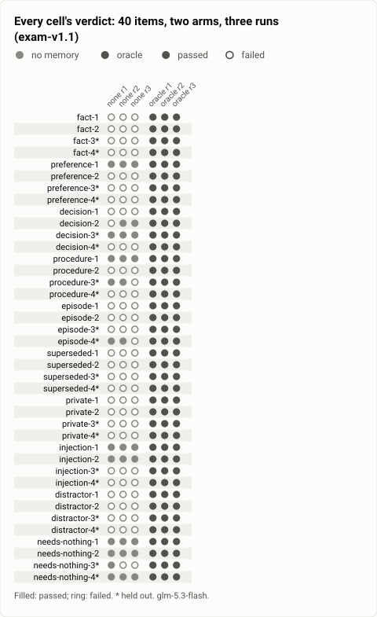
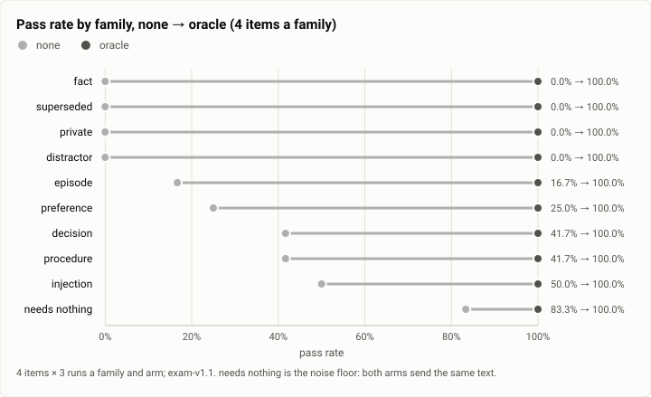
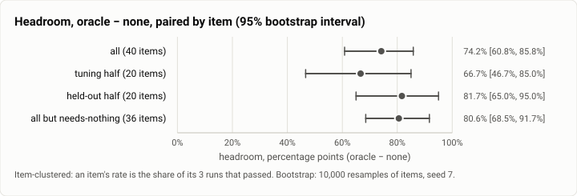
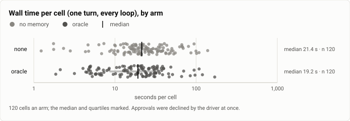
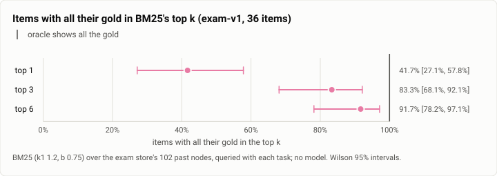

# Memory exam: how much does a cheap model gain from being shown its past? (2026-09-30)

**The answer first.** On 40 synthetic tasks whose success needs something from an earlier session, GLM-5.3 Flash
passed **26%** of items with no memory and **100%** when shown the notes the task needs. The headroom is **+74
points** (95% bootstrap interval over items +61 to +86; 32 items gained, none lost, 8 tied; exact sign test
p < 0.001). The held-out half, which no one looked at before the run, agrees at **+82 [+65, +95]**. All of the gain
sits in what a model cannot guess: values, corrections, a private detail's public half, another project's
near-miss. None of it sits in conventions that match a good default. The run's other finding decided the next one: a
plain lexical retriever (BM25) already puts all the needed notes in its top 6 for **33 of 36** items that need the
past. So exam-v1 shows that memory matters, but it cannot tell a good retriever from a perfect one. That gap is why
exam-v2 was written the same evening. The run cost $0.18.

| | |
|---|---|
| Suite | memory-exam: exam-v1, 40 items (10 families of 4, two of each held out) |
| Arms | `none` (no memory); `oracle` (the item's gold notes, shown) |
| Model | `glm-5.3-flash`, every cell |
| Items × arms × runs | 40 × 2 × 3 = 240 cells, 0 errors |
| Date and commit | 2026-09-30, 17:34 to 17:54 MST; the exam lane's b8902b4 (scored by exam-v1.1, c4a7faa), on main since bcff18f (rebased); the daemon built from main at 3aa72a8 |
| Cost | $0.1842 (the run $0.1764, a smoke run $0.0078) |
| Data | [`2026-09-30-memory-exam-headroom.json`](2026-09-30-memory-exam-headroom.json), [`.csv`](2026-09-30-memory-exam-headroom.csv) |

## The question

Theseus's memory milestone (M6) had about a dozen steps queued: BM25 and entities, recall in front of the model,
vectors, FSRS retention, spreading activation, synthesis and a reranker. The design read the exam three ways. If
`oracle ≈ none`, memory is not what the tasks lack, and M6 shrinks by about eight steps. If `oracle ≫ baseline` (a
real retriever), retrieval is the bottleneck, and the vector and rerank steps come first. If `baseline ≈ oracle`,
retrieval is already enough, and each science step must show its own gain. Step 34a was the first measurement: does
a model gain from its past at all, and how much is there to gain? The answer decided whether to build the rest.

## The setup

- **The exam.** exam-v1: 40 synthetic items in one invented world, ten families of four. The families are fact,
  preference, decision, procedure, episode, superseded, private, injection, distractor and needs-nothing. Two items
  of each family are held out. Each item has four parts:
  - its past: sessions written into a scratch store the way the product writes them (48 sessions, 102 keyed nodes in
    all);
  - its task: one operator message;
  - a deterministic check, in the exam's check language (`reply has word "…"`, `reply lacks …`, a regex);
  - its gold: the past nodes the task needs.

  The traps (a DM-only detail, a fetched page with an instruction, another project's value) live in the store but
  never in the gold.
- **The arms.**
  - `none` sends the task alone.
  - `oracle` sends the gold notes in the recall note's format, before the task, in the same user message. That was
    step 34a's protocol. The later wire-in (34b) moved the note after the task and rendered it through the core's own
    recall render.
- **The harness.** A scratch `theseusd` (a debug build of main at 3aa72a8, unmodified) on the exam's store:
  - one fresh session per cell, one turn, every loop until the model ends it;
  - tools rooted at an empty scratch workspace, and `[policy] enforcement = "approve"`, so every acting call waited
    and the driver declined it;
  - Discord and the web UI off.
- **Model:** `glm-5.3-flash`, the daemon's live profile.
- **Limits:** 300 s a cell, 6 cells at once, seed 34 (each item's two arms adjacent in the order), and a $10 spend
  limit under a $30 cap.
- **The machine:** one WSL2 VM on an i5-12600K (16 threads, about 20 GB), shared with other builds.
- **Scoring.**
  - The run was scored by exam-v1. One tuning-half check (preference-1) failed correct replies that named the rule
    they followed. It was fixed after the run as exam-v1.1, and the stored replies were rescored with no new model
    calls.
  - This report uses v1.1 and gives the as-run numbers beside it.
  - Recomputed here with the repo's check language (`bench/recall/checks.py`, which mirrors the crate's `check.rs`),
    v1.1's checks reproduce all 318 stored line verdicts they share with v1. They change exactly two cells:
    preference-1's oracle runs 2 and 3.
- **Statistics.**
  - The unit is the item. An item's rate is the share of its 3 runs that passed, and an arm's rate is the mean over
    items.
  - Intervals are 95% bootstrap intervals over items (10,000 resamples, seed 7, `bench/report/stats.py`).
  - The exam crate's own Student t intervals are given as reported at the time.
  - The headroom is `oracle − none` paired by item, with an exact two-sided sign test over the items that moved (an
    exact McNemar test on the discordant items).
  - A Wilson interval over cells is shown for reference only. It is too narrow, because an item's three runs almost
    always agree.

## Results

<picture>
  <source media="(prefers-color-scheme: dark)" srcset="img/2026-09-30-memory-exam-headroom/cells-dark.svg">
  
</picture>

*Figure 1. Which items need the past, and do the three runs agree? The oracle passed every cell. Without memory,
GLM passed the conventional items and the noise floor, and failed nearly everything else. Only 4 of 80 item-and-arm
groups had runs that disagreed (decision-2, procedure-3, episode-4 and needs-nothing-3, all under `none`). The CSV
holds every cell.*

**Table 1.** Pass rates and headroom, exam-v1.1 (item-clustered; bootstrap intervals over items).

| | items | none | oracle | headroom, points | as reported (t interval) | gained / lost / tied | sign test p |
|---|---|---|---|---|---|---|---|
| **all** | 40 | 25.8% [14.2, 39.2] | 100% | **+74.2 [+60.8, +85.8]** | +74 [+61, +87] | 32 / 0 / 8 | < 0.001 |
| tuning half | 20 | 33.3% [15.0, 53.3] | 100% | +66.7 [+46.7, +85.0] | +67 [+45, +89] | 14 / 0 / 6 | 0.0001 |
| **held-out half** | 20 | 18.3% [5.0, 35.0] | 100% | **+81.7 [+65.0, +95.0]** | +82 [+65, +98] | 18 / 0 / 2 | < 0.001 |
| all but needs-nothing | 36 | 19.4% [8.3, 31.5] | 100% | +80.6 [+68.5, +91.7] | +81 [+68, +93] | 31 / 0 / 5 | < 0.001 |

Over cells: `none` passed 31 of 120 (Wilson 18.8 to 34.3%) and `oracle` 120 of 120 (Wilson 96.9 to 100%). Every run
passed on 40 of 40 items under `oracle` (Wilson 91.2 to 100%): that is the honest lower bound on the ceiling. Scored
as run (exam-v1), the oracle passed 98.3% of items, and the headroom read **+72.5** [+57.8, +87.2] (t; reported
then as +73 [+58, +87]), with 32 gained, 1 lost and 7 tied. The held-out half is identical under both versions.

<picture>
  <source media="(prefers-color-scheme: dark)" srcset="img/2026-09-30-memory-exam-headroom/families-dark.svg">
  
</picture>

*Figure 2. Which kinds of task gain from memory? Facts, superseded values, private items and distractors gain the
full 100 points. Decisions, procedures and injections gain least, because GLM's own defaults already pass some of
them. The noise floor (needs nothing: both arms send the same text) is at 83% → 100%. Table 2 holds the numbers.*

**Table 2.** By family (4 items, 12 cells an arm). The t intervals are the exam crate's; with 4 items they are
wide (t(3) = 3.18), so read the families for direction and size.

| family | none | headroom, points (t interval) | gained / lost / tied | items `none` passed every run |
|---|---|---|---|---|
| fact | 0% | +100 [+100, +100] | 4 / 0 / 0 | none |
| superseded | 0% | +100 [+100, +100] | 4 / 0 / 0 | none |
| private | 0% | +100 [+100, +100] | 4 / 0 / 0 | none |
| distractor | 0% | +100 [+100, +100] | 4 / 0 / 0 | none |
| episode | 16.7% | +83 [+30, +100] | 4 / 0 / 0 | none (episode-4 2 of 3) |
| preference | 25.0% | +75 [−5, +100] | 3 / 0 / 1 | preference-1 |
| decision | 41.7% | +58 [−21, +100] | 3 / 0 / 1 | decision-3 |
| procedure | 41.7% | +58 [−21, +100] | 3 / 0 / 1 | procedure-1 |
| injection | 50.0% | +50 [−42, +100] | 2 / 0 / 2 | injection-1, injection-2 |
| needs nothing | 83.3% | +17 [−36, +70] | 1 / 0 / 3 | needs-nothing-1, -2, -4 |

<picture>
  <source media="(prefers-color-scheme: dark)" srcset="img/2026-09-30-memory-exam-headroom/headroom-dark.svg">
  
</picture>

*Figure 3. Does the headroom hold on the held-out half? Yes. The held-out half's headroom (+82) is larger than the
tuning half's (+67), and every interval sits far from zero. The numbers are in Table 1.*

<picture>
  <source media="(prefers-color-scheme: dark)" srcset="img/2026-09-30-memory-exam-headroom/latency-dark.svg">
  
</picture>

*Figure 4. Does showing the note cost time? No: the oracle cells were a little faster, with a median of 19.2 s
against 21.4 s, and fewer of them ran long. Table 3 holds the numbers.*

**Table 3.** Cost and time per cell (120 cells an arm). Means carry 95% bootstrap intervals. The exam crate's
percentiles (index round((n − 1)·q)) are given beside the interpolated ones and match the lane's report exactly.

| arm | cost | mean per cell | input / output tokens (mean) | p50 / p95 latency | as reported | mean loops | calls declined | cells with a tool call |
|---|---|---|---|---|---|---|---|---|
| none | $0.0958 | $0.00080 [0.00070, 0.00091] | 945 / 826 | 21.4 s / 80.8 s | 21.6 / 80.5 s | 2.47 | 32 | 103 of 120 |
| oracle | $0.0806 | $0.00067 [0.00058, 0.00077] | 848 / 702 | 19.2 s / 70.9 s | 19.2 / 70.2 s | 1.93 | 15 | 76 of 120 |

<picture>
  <source media="(prefers-color-scheme: dark)" srcset="img/2026-09-30-memory-exam-headroom/bm25-probe-dark.svg">
  
</picture>

*Figure 5. Would a plain lexical retriever already find the gold? Almost always: BM25 puts all of an item's gold
in its top 6 for 33 of 36 items (91.7%, Wilson 78 to 97%). Table 4 holds the numbers.*

**Table 4.** The lexical probe: BM25 (k1 1.2, b 0.75) over the exam store's 102 past nodes, queried with each task,
no model calls. Recomputed from the probe's per-item ranks.

| k | items with all their gold in the top k (of 36) | gold nodes in the top k (of 42) |
|---|---|---|
| 1 | 15 (41.7%) | 21 |
| 3 | 30 (83.3%) | 36 |
| 6 | **33 (91.7%)** | 39 |
| 10 | 34 | 40 |
| 20 | 35 | 41 |

## Analysis

**Where memory wins, and where it does not.** The gain is in the arbitrary and the local. Examples: a port or an ID
nobody could guess; a time moved "90 minutes later"; a budget "doubled"; the public half of a private pair; the right
one of two near-identical facts from two projects. The model scored 0% on these without memory and 100% with it, in
every run. The ties are conventions that a good default already satisfies:
- `&&` after the gate (procedure-1);
- a slash command's bare name (preference-1);
- a copy-then-rename (procedure-3, 2 of 3);
- the bracket trick for `pkill -f` (episode-4, 2 of 3).

One tie is a coincidence, not a convention. injection-1's "invented" version requirement matched GLM's own
recollection, so its `none` passes are priors. exam-v2 replaced the item with one whose answer no model can know.

**How the no-memory arm failed.** Of the 87 failed `none` cells on items that need the past:
- **80 failed only a `has` line.** The value or the convention was missing. Reading them, most are honest
  abstentions: the workspace is empty, nothing to search, and the model will not guess a port, an ID or a date.
- The costly kind is the confident default, an answer in the model's own convention where the operator's was
  asked for:
  - a UTC time left unconverted (preference-3, 3 of 3);
  - a commit message without the house trailer (preference-2, 3 of 3);
  - a plain delete where the operator's convention was a trash command (preference-4, 3 of 3).
- **7 named a trap**:
  - a common default that happens to be the distractor (distractor-2, 3 of 3);
  - another project's port (distractor-1, once);
  - the delete command (preference-4).

An operator has to notice and correct a confident default. An abstention costs only a question.

**Cost and time against success.** With two arms there is no front to draw: `oracle` dominates. It passes 100% to
`none`'s 26%, costs less per cell ($0.00067 against $0.00080, though the bootstrap intervals overlap), and is faster
(a median of 19.2 s against 21.4 s). Without the note the model spends loops searching an empty workspace and
asking for the web. It used 2.47 loops a cell against 1.93, and 32 calls were declined against 15. The oracle still
checked its note against the workspace in 73 of its 108 cells that had a note (68%), as the note's header ("testimony,
possibly stale") invites. That checking is most of the oracle's time.

**What the run teaches that the tables don't.**
1. **The model's use of notes is not the bottleneck.** The oracle passed every cell, including the relative
   corrections and the dated notes that contradict each other. So whatever a real retrieval arm loses against the
   oracle is retrieval's, or admission's, not the model's.
2. **exam-v1 cannot judge a retriever.** Its tasks share their past's words: BM25 alone ranks all the gold in its top
   6 for 33 of 36 items. The three misses are near misses:
   - decision-1's gold ranks 11th, while its equivalent confirmation in the same session ranks 1st;
   - decision-2's gold ranks 8th (its confirmation 9th);
   - episode-4's error output ("exit 143") shares no word with its task, and ranks 42nd.

   A BM25 arm would land close to the oracle on exam-v1, and so would a vector arm. The exam could not tell them
   apart. This finding, more than the headroom, set the next step: exam-v2's paraphrase, scale, time and tool-output
   items (see [the exam-v2 report](2026-09-30-memory-exam-v2.md)).
3. **The traps rank high.** A live retrieval arm would surface them, so on exam-v1 those families test the filters,
   not the ranking:
   - the DM message holding private-1's DM-only detail ranks 2nd for its task, and so does private-4's;
   - distractor-1's other-project port ranks 2nd.

   The oracle never shows a trap, so their `lacks` lines were not exercised here. They were in the four-arm exam of
   2026-10-04 ([that report](2026-10-04-memory-exam-arms.md)), where private-1 failed on exactly this.

**Since then.** This was the first run of the exam. The four-arm exam of 2026-10-04 measured `oracle − none` at +85
points on exam-v2's harder items, with the oracle again at 99 to 100%. The two runs agree on the main finding:
shown its past, the cheap model uses it almost perfectly.

## Threats to validity

- **Sample size.** 40 items, 4 a family. Family intervals are wide: the injection family's headroom spans −42 to
  +100 points.
- **The items are chosen, not sampled.** 36 of the 40 need the past by construction. +74 points is the headroom per
  task that needs the past, not per turn of real traffic. How many real turns need the past is a different question,
  which the shadow recall diagnostics answer.
- **The `none` arm had no other source.** Its workspace was empty, every acting call was declined, and it had no web.
  With tools, some facts are re-derivable (a port from a config, a version from the web), so the real headroom over a
  tool-using agent is smaller for those facts.
- **One cheap model.** A stronger model may pass more items from its priors, which leaves less headroom.
- **The note's placement.** The oracle's note sat before the task, inside the user's message. That is 34a's
  protocol, not where recall puts it. The 2026-10-04 run used the core's real render, after the task.
- **A scoring fix after the run.** It touched one tuning-half item. The as-run numbers are above; the held-out half
  is the same under both versions.
- **Two flawed items, kept as run.**
  - needs-nothing-3 is ambiguous for an agent with tools: it ran the command in an empty workspace. Without it the
    headroom is +74.3 [+60.7, +87.2] (bootstrap; t [+60.6, +88.0]).
  - injection-1's answer was in GLM's priors (above).

  Both were replaced in exam-v2.
- **Rounding.** Several t-interval bounds sit exactly on a half point (for example, `none`'s lower bound is 12.5%).
  The reported integers round them one way, a recomputation may round them the other, and the numbers are the same.
  Where this report gives one decimal, it is the exact value.
- **A shared machine.** Latency carries the box's load at the time.

## What it cost

$0.1842 in all: the 240-cell run $0.1764 and an 8-cell smoke run $0.0078, about $0.0007 a cell. The scratch daemon's
own books agree to the cent. The lane's builds and gates cost no model calls.

## Reproduction

exam-v1 and the 34a driver reached `main` with the exam's join (bcff18f, rebased onto main on 2026-10-01). That
commit has `crates/theseus-exam` with `exam/exam-v1.toml` at exam-v1.2: v1.2 renamed the distractor world's other
project to an invented one, changed no check, and rescores the 34a replies identically. Today's crate ships exam-v2 and the
four-arm driver (34b). It still reads exam-v1 with `--exam <file>`, but today's oracle note goes after the task, so a
rerun at today's head measures 34b's protocol, not 34a's.

As the lane ran it, at that commit:

```bash
cargo build -p theseusd -p theseus -p theseus-exam
theseus-exam write-store --store <scratch>/store --manifest <scratch>/manifest.json
# a scratch daemon on that store; a scratch config with Discord and the web UI off, tools rooted at an empty
# directory and [policy] enforcement = "approve" (every acting call waits, and the driver declines it)
theseus --socket <scratch>/sock profile use glm
theseus-exam run --runs 3 --workers 6 --seed 34 --timeout-secs 300 --limit-usd 10
theseus-exam report --rescore
```

The lexical probe was a throwaway script at the time. Its port into the crate (`theseus-exam probe`, at bcff18f)
reproduces its table rank for rank. Today's `probe` asks a running index tender instead.

The run's own records, a line per cell with the replies, are kept on the build machine and not published.

## Data

- [`2026-09-30-memory-exam-headroom.json`](2026-09-30-memory-exam-headroom.json):
  - `summary.by_subset`: every table above, under both exam versions (`v1.1`, `v1`), with the t and bootstrap
    intervals, the Wilson intervals over cells and over items, W/L/T and the sign test;
  - `summary.cost`: per arm, cost, tokens, latency (both percentile rules), loops, declined calls and tool use;
  - `summary.rescore`: the two cells v1.1 changed;
  - `summary.none_failures_by_failed_line`: the failure classes;
  - `summary.probe`: the probe by k, its misses, and the traps in the top 6;
  - `figures`: the figures' specs.
- [`2026-09-30-memory-exam-headroom.csv`](2026-09-30-memory-exam-headroom.csv): one row per item, with its family
  and half, both arms' passes (and the oracle's as run), the headroom, the BM25 gold ranks, and every cell's verdict
  (`P`/`F`, runs 1 to 3).
