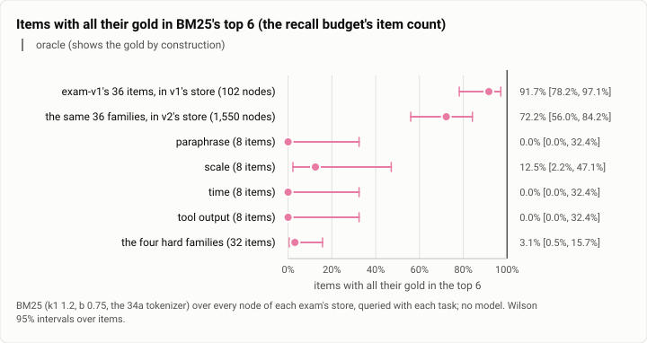
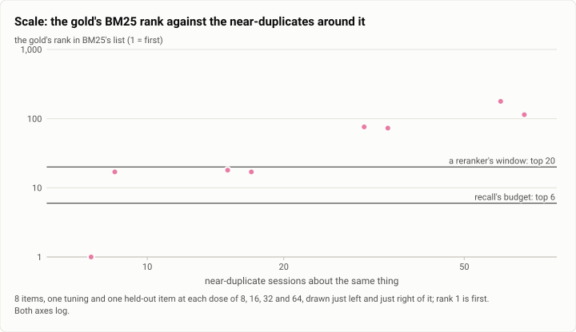
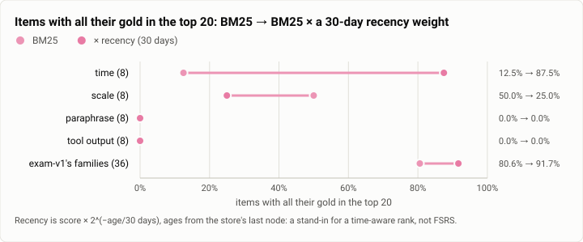

# Memory exam v2: items built so that retrieval is hard (2026-09-30)

**The answer first.** exam-v2 separates a lexical retriever from the oracle, which exam-v1 could not. BM25 over the
whole exam store puts all of an item's gold in its top 6 for **1 of the 32 new hard items** (3.1%, Wilson 0.6 to
15.7%), against 33 of exam-v1's 36 (91.7%). Even its top 20 holds only 5 of 32. Each hard family fails for its own
reason:
- **paraphrase:** the gold shares no word with its task, so BM25 scores it zero, 0 of 8 at every k;
- **scale:** the gold sinks behind near-duplicates in a clean dose-response, from rank 1 behind 8 to rank 178
  behind 64;
- **time:** a stale restatement, or a later mention with no value, ranks first for all 8 items;
- **tool output:** the gold is a command's output, and the operator's own question ranks first for 7 of 8. 0 of 8 at
  every k.

The bigger store alone also costs exam-v1's own items: 92% → 72% at k = 6, without a word of them changed. On
GLM-5.3 Flash the gap is a gap in task success, not only in ranking: shown the gold, the model passed **all 34** new
items in every run, and without it **none of the 33** that need the past. A crude recency weight lifts the time
family from 1 to 7 of 8 in the top 20, but halves the scale family. The four-arm exam four days later confirmed every
family's prediction. The run cost $0.12.

| | |
|---|---|
| Suite | memory-exam: exam-v2, 72 items (exam-v1.2's 38, 2 replacements, and four hard families of 8) |
| Arms | the lexical probe (BM25, no model), on every item with gold; `none` and `oracle` on GLM for the 34 new items |
| Model | `glm-5.3-flash` (the GLM run) |
| Items × runs | probe: 68 items with gold (32 hard); GLM: 34 items × 2 arms × 3 runs = 204 cells, 0 errors |
| Date and commit | 2026-09-30, 21:21 to 22:20 MST (the GLM run 22:04 to 22:14); the exam lane's 0c77ea4 and 0407230, on main since bcff18f (rebased) |
| Cost | $0.1182 (the run $0.1122, a smoke run $0.0060) |
| Data | [`2026-09-30-memory-exam-v2.json`](2026-09-30-memory-exam-v2.json), [`.csv`](2026-09-30-memory-exam-v2.csv) |

## The question

The [exam-v1 run](2026-09-30-memory-exam-headroom.md) that afternoon found +74 points of headroom. It also found
that BM25 alone ranked the gold in its top 6 for 33 of 36 items. A retrieval arm would score near the oracle on
exam-v1, and so would every refinement of one. The owner's decision that evening held the builds of the memory
science steps: vectors (29c), the reranker (32c), FSRS retention and activation (32a, 32b), and synthesis (31b).
They were held until an exam could tell retrieval from the oracle. exam-v2 was written to be that exam. Its own
question is whether it is hard where it was built to be hard, and whether that difficulty is a difficulty for the
model too, not only for the ranking.

## The setup

- **The exam.** exam-v2 has 72 items.
  - **exam-v1.2's ten families**: 38 items word for word, and 2 replacements:
    - needs-nothing-5 replaces needs-nothing-3, which was ambiguous for an agent with tools;
    - injection-5 replaces injection-1, whose "invented" answer was in the model's priors.

    v1.2 itself renamed the distractor world's other project to an invented one.
  - **Four hard families of 8**, half held out:
    - **paraphrase:** one statement, in other words; the task shares no content word with the gold, stemmed, under
      either tokenizer;
    - **scale:** one statement among near-duplicate sessions about the same thing that never give its value. The
      doses are 8, 16, 32 and 64 sessions, one tuning and one held-out item at each, plus ten sessions giving
      siblings' values;
    - **time:** a value stated and restated tersely for months, changed, then corrected in the gold. Six items have
      three later mentions with no value, and one correction is relative ("five more minutes");
    - **tool output:** the operator asks, a tool answers, and the agent replies about something else; the gold is the
      tool's result.
  - **Load-time checks.** Each family's definition is checked when the exam loads. For every hard item, the answer
    appears in no node outside the gold, anywhere in the store, and never in the task.
- **The store.** 758 sessions and 1,550 keyed nodes, from March to September 2026:
  - 562 sessions belong to items, written out or generated from seeded templates;
  - 196 are a background no item owns (gates, reviews, restarts, weekly summaries).

  exam-v1's store had 48 sessions and 102 nodes.
- **The probe.**
  - BM25 (k1 1.2, b 0.75, exam-v1's tokenizer) over every node of each exam's store, the tool results and fetched
    text included, queried with each task. There is no model.
  - Ties keep the store's key order, so a gold with no word in common ranks after every node that scores.
  - k is 1, 3, 6 (the recall budget's item count), 10 and 20 (the window a reranker reorders).
  - Two robustness rankers: a simple tokenizer (split on every non-alphanumeric, like tantivy's default), and BM25
    times a recency weight, 2^(−age/half-life) with half-lives of 30 and 7 days, ages from the store's last node.
- **The GLM run.** As in exam-v1:
  - a scratch daemon (a debug build of main at 3aa72a8) on the v2 store, tools rooted at an empty workspace, every
    acting call declined, Discord and the web UI off;
  - `glm-5.3-flash`, seed 35, 6 cells at once, 300 s a cell, a $9 limit (with the smoke run, under the lane's $10
    cap);
  - the arms as in exam-v1: `oracle` shows the gold before the task.
- **The machine:** one WSL2 VM on an i5-12600K (16 threads, about 20 GB), shared with other builds.
- **Statistics.** Probe shares carry Wilson 95% intervals over items. The GLM run's rates are item-clustered (an
  item's rate is the share of its 3 runs that passed) with exact sign tests over the items that moved. Every probe
  number below was recomputed from the probe's per-item ranks, and all 70 of the lane's own summary rows match.

## Results

**Table 1.** Items with all their gold in BM25's top k: exam-v1's families in exam-v1's store, the same families in
exam-v2's store, and the hard families.

| | items | @1 | @3 | @6 | @10 | @20 |
|---|---|---|---|---|---|---|
| exam-v1's families, v1's store (102 nodes) | 36 | 15 (42%) | 30 (83%) | **33 (92%)** | 34 (94%) | 35 (97%) |
| exam-v1's families, v2's store (1,550 nodes) | 36 | 15 (42%) | 26 (72%) | **26 (72%)** | 27 (75%) | 29 (81%) |
| paraphrase | 8 | 0 | 0 | 0 | 0 | 0 |
| scale | 8 | 1 | 1 | 1 | 1 | 4 |
| time | 8 | 0 | 0 | 0 | 0 | 1 |
| tool output | 8 | 0 | 0 | 0 | 0 | 0 |
| **the four hard families** | 32 | 1 (3%) | 1 (3%) | **1 (3%)** | 1 (3%) | 5 (16%) |

(In v2's store the injection row has injection-5 in place of injection-1. Gold nodes rather than items: 39 of 42 in
the top 6 on v1, 2 of 33 for the hard families.)

<picture>
  <source media="(prefers-color-scheme: dark)" srcset="img/2026-09-30-memory-exam-v2/bm25-top6-dark.svg">
  
</picture>

*Figure 1. Does exam-v2 make retrieval hard where exam-v1 did not? Yes. BM25's top 6 holds all the gold for 1 of 32
hard items, against 33 of 36 on exam-v1. The bigger store also pulls exam-v1's own items from 92% to 72%. The
numbers are in Table 1.*

**Table 2.** Each hard item's gold rank under BM25 (time-4 has two gold nodes). Tuning items 1 to 4, held out 5
to 8.

| family | tuning | held out | the item's own best-ranked non-gold node |
|---|---|---|---|
| paraphrase | 701, 469, 485, 547 | 477, 685, 667, 504 | the gold scores 0: it sits after every node that scores |
| scale (doses 8, 16, 32, 64) | **1**, 18, 76, 178 | 17, 17, 73, 114 | a near-duplicate at rank 1 for 7 of 8 |
| time | 25, 48, 46, (2 and 84) | 48, 51, 20, 38 | a stale restatement, or a later mention with no value, at rank 1 for all 8 |
| tool output | 1,529, 1,533, 23, 1,538 | 1,541, 1,547, 119, 1,550 | the operator's question at rank 1 for 7 of 8 (the agent's reply for the eighth) |

<picture>
  <source media="(prefers-color-scheme: dark)" srcset="img/2026-09-30-memory-exam-v2/scale-dose-dark.svg">
  
</picture>

*Figure 2. How fast does a lexical rank lose the gold as near-duplicates pile up? Fast. Behind 8 near-duplicates the
gold ranks 1st and 17th. Behind 16 it is just inside a reranker's top 20 (17th and 18th). Behind 32 and 64 it is at
73 to 178, out of any window. The eight ranks are in Table 2.*

**Table 3.** Robustness: items with all their gold in the top k under four rankers (the hard families, and the time
family alone).

| ranker | hard families @6 | @10 | @20 | time @6 | time @20 | scale @20 | exam-v1's families @6 |
|---|---|---|---|---|---|---|---|
| BM25, exam-v1's tokenizer | 1 / 32 | 1 | 5 | 0 / 8 | 1 / 8 | 4 / 8 | 26 / 36 |
| BM25, simple tokenizer | 3 | 3 | 7 | 0 | 1 | 4 | 29 |
| BM25 × recency, 30-day half-life | 2 | 4 | 9 | 2 | **7** | **2** | 31 |
| BM25 × recency, 7-day half-life | 4 | 6 | 8 | 4 | **7** | **1** | 28 |

<picture>
  <source media="(prefers-color-scheme: dark)" srcset="img/2026-09-30-memory-exam-v2/recency-dark.svg">
  
</picture>

*Figure 3. Does a crude sense of time fix the time family, and what does it cost elsewhere? It lifts the time family
from 1 to 7 of 8 in the top 20, and exam-v1's families from 81% to 92%. It halves the scale family (4 → 2 of 8) and
does nothing for paraphrase or tool output. Table 3 holds the numbers.*

**Table 4.** The GLM run on the 34 new items, item-clustered.

| | items | none | oracle | headroom, points | gained / lost / tied | sign test p |
|---|---|---|---|---|---|---|
| **all** | 34 | 2.9% (3 of 102 cells: needs-nothing-5) | 100% (102 of 102) | +97.1 [+91.1, +100] | 33 / 0 / 1 | < 0.001 |
| tuning half | 17 | 0% | 100% | +100 | 17 / 0 / 0 | < 0.001 |
| held-out half | 17 | 5.9% | 100% | +94.1 [+81.6, +100] | 16 / 0 / 1 | < 0.001 |
| paraphrase, scale, time, tool output (each) | 8 | 0% | 100% | +100 | 8 / 0 / 0 | 0.008 |
| injection-5 | 1 | 0% | 100% | +100 | 1 / 0 / 0 | 1.0 |
| needs-nothing-5 (the noise floor) | 1 | 100% | 100% | 0 | 0 / 0 / 1 | 1.0 |

(t intervals, as the exam crate computes them. Every one of the 68 item-and-arm groups had runs that agreed. Over
cells, the oracle's 102 of 102 has a Wilson lower bound of 96.4%. The smoke run beforehand, one tuning item per hard
family, went 4 of 4 for the oracle and 0 of 4 without memory.)

| arm | cost | mean per cell | input / output tokens | p50 / p95 latency | mean loops | calls declined | the model's own searches |
|---|---|---|---|---|---|---|---|
| none | $0.0571 | $0.00056 [0.00052, 0.00061] | 484 / 449 | 17.1 s / 33.7 s | 2.56 | 21 | 99 greps, 118 listings |
| oracle | $0.0552 | $0.00054 [0.00049, 0.00059] | 525 / 512 | 16.0 s / 30.1 s | 1.99 | 5 | 91 greps, 58 listings |

## Analysis

**Why each family is hard, and what that means for an arm.**
- **A zero score is not a rank.** Every paraphrase gold, and 6 of 8 tool-output golds, share no word with their
  tasks. BM25 scores them zero, and they sit, in key order, after every node that scores (ranks 469 to 1,550). No k
  reaches them. Whatever finds them is not lexical: this is the family that can judge vectors.
- **The trap ranks first.** In three families BM25's first hit is the item's own trap:
  - a near-duplicate for 7 of 8 scale items;
  - a stale restatement, or a later mention with no value, for all 8 time items;
  - for tool output, the operator's own question, in the gold's own turn, for 7 of 8 (the agent's reply for the
    eighth).

  A model shown those answers with the stale value, or says it cannot tell. A ranker that only measures likeness
  cannot fix this, because the trap means the same thing as the gold.
- **The turn holds the answer.** The tool-output finding points at a cheap rule rather than a better ranker. The
  question BM25 does find sits in the same turn as the result it needs. A recall that admits a hit's turn-mates (the
  tool results of the turn) would recover the gold at no ranking cost.
- **Scale has a window.** At doses 8 and 16 the gold is inside BM25's top 20 but out of its top 6, for 3 of 8 items.
  A reranker over the top 20 can reach those. At 32 and 64 it is out of the window.
- **Time and relative corrections pull against each other.** The recency weight that fixes the time family buries
  time-4's base value: set in June, it falls from 2nd to 55th at a 30-day half-life, and to 178th at 7 days. Its
  relative correction ("five more minutes") needs that base.

**What the exam can judge, and what it cannot.**
- It can judge vectors on paraphrase (and likely tool output), a reranker on scale at the lower doses, and a
  time-aware rank on time, each on 8 items with a held-out half.
- It cannot judge FSRS's use-driven half or activation's spreading. The store has no recall history (no node was
  ever recalled or used in a later turn), and each task arrives alone, with no conversation to spread from.

**How the model failed and passed.**
- Without memory, GLM abstained ("the workspace is empty; where should I look?"). It never offered a value it could
  not know: the answers are unguessable by construction, injection-5's included.
- With the gold it passed everything. That includes time-4's relative correction (600 s, then five more minutes, so
  900 s) and the tool results' raw output.
- The oracle still searched its empty workspace, with 91 greps and 58 listings over its 102 cells, as the note's
  "testimony" header invites.
- The two arms cost the same per cell. On these items `none` gives up quickly instead of searching long, unlike on
  exam-v1.

**The retrospective: the prediction held.** The four-arm exam of 2026-10-04 ran the real recall pipeline over this
exam ([that report](2026-10-04-memory-exam-arms.md)). Its pass rates by family, for `none` / `bm25` / `baseline`
(BM25, entities and vectors) / `oracle`:

| family | none | bm25 | baseline | oracle |
|---|---|---|---|---|
| paraphrase | 0% | **0%** | **75%** | 96% |
| tool output | 0% | 25% | 50% | 100% |
| scale | 0% | 12.5% | 42% | 100% |
| time | 0% | **0%** | **0%** | 100% |

- Paraphrase was invisible to BM25 and mostly recovered by vectors, as predicted.
- Scale and tool output moved partway.
- **Time stayed at zero for both retrieval arms.** Similarity cannot tell a stale restatement from the correction,
  exactly as this probe's traps said. The family is the unclaimed headroom: 100 points, waiting for a sense of time.

## Threats to validity

- **A synthetic world.** Every fact is invented, and the hard families are hard by construction, checked on load.
  They measure what a retriever does with those shapes, not how often real traffic has them.
- **The probe is not the product's index.** The probe's BM25 reads the keyed nodes' text with the 34a tokenizer.
  The product's tender uses tantivy's tokenizer, also indexes tool calls, and ranks chunks. The next day's tender
  probe found its BM25 at 1 of 16 held-in hard items at k = 6, the same picture
  ([the retrieval report](2026-10-01-retrieval-fusion.md)).
- **The difficulty is pinned.** A test in the crate fails if BM25's top 6 ever holds all the gold for more than 4 of
  the 32 hard items. That is deliberate: an edit that made v2 easy should fail.
- **Sample size.** 8 items a family, 4 held out. A family's share moves 12.5 points per item.
- **One cheap model, and no other source.** As in exam-v1, `none` had an empty workspace and no acting calls. In
  real traffic some tool outputs can be fetched again (re-running `uname` is cheaper than remembering it). The
  family measures memory where the fact cannot be re-derived.
- **The recency weight is a stand-in**, not FSRS and not activation.

## What it cost

$0.1182: the 204-cell run $0.1122 and an 8-cell smoke run $0.0060. The probe calls no model. The daemon's own books
agree to the cent.

## Reproduction

The lexical probe with its tokenizers and recency weights, the generator and exam-v2 reached `main` with the exam's
join (bcff18f, rebased onto main on 2026-10-01). At that commit:

```bash
cargo build -p theseus-exam
theseus-exam probe --against v1 --items                 # Tables 1 and 2: v2 against v1, every item's ranks
theseus-exam probe --tokenizer simple --items           # Table 3, the simple tokenizer
theseus-exam probe --half-life-days 30 --items          # Table 3, recency (and 7)
```

The GLM run used 34a's driver at that commit, on a scratch daemon over `theseus-exam write-store`'s v2 store, with
seed 35, 3 runs, 6 workers, a 300 s cell timeout and a $9 limit, over the 32 hard items and the 2 replacements.

Today's `theseus-exam probe` asks a running index tender instead (`--tender <socket> --manifest <file> --arm
bm25,entity`). It ranks with the product's tokenizer and chunks, so its numbers differ from this probe's. exam-v2 is
the crate's built-in exam (`crates/theseus-exam/exam/exam-v2.toml`). The run's records, with replies, are kept on
the build machine and not published.

## Data

- [`2026-09-30-memory-exam-v2.json`](2026-09-30-memory-exam-v2.json):
  - `summary.probe`: every ranker's table by family, with the check that the recomputation matches each file's own
    rows;
  - `summary.scale_dose`, `summary.trap_ranked_first`, `summary.gold_unreachable_by_bm25_rank_over_400`;
  - `summary.glm`: Table 4, with t and bootstrap intervals and Wilson intervals over cells;
  - `summary.glm_cost` and `summary.spend`;
  - `figures`.
- [`2026-09-30-memory-exam-v2.csv`](2026-09-30-memory-exam-v2.csv): one row per item with gold:
  - its family, half and scale dose;
  - its BM25 gold ranks in v2's store (and v1's), under each tokenizer and recency weight;
  - its trap and the trap's rank;
  - the GLM run's passes under each arm.
