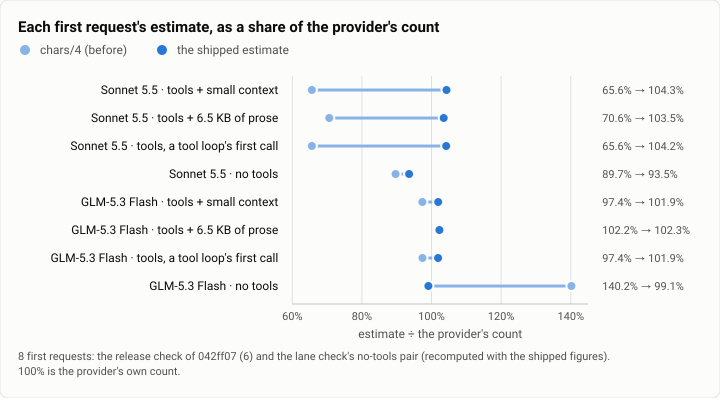
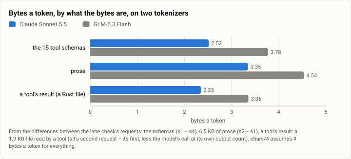
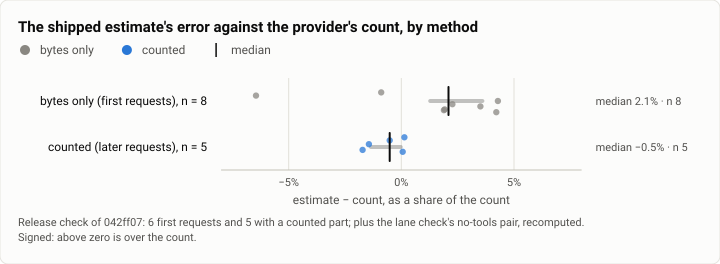

# Context: how far off was the token estimate, and how close is it now? (2026-10-01)

**The answer first.** Until 2026-10-01 the context compiler estimated a request's tokens as its bytes over four
(chars/4). Against the provider's own count, chars/4 read every tool-carrying first request on Claude Sonnet 5.5 at
**65.6 to 70.6%** of the count, 29 to 34% low (six requests over two checks). The same bytes on GLM-5.3 Flash read at
97.4 to 102.2%. The error was not noise. Between 58 and 86% of such a request's bytes are JSON (the tool schemas),
and Claude's tokenizer reads them at about 2.5 bytes a token, where GLM's reads 3.8 and chars/4 assumes 4. The fix
counts on the provider's own count of the compilation's last request, and estimates only what was added since, by
class, at per-model figures. On the shipped build (042ff07), first requests read **+1.9 to +4.3%** over the count
(n = 6; two no-tools requests recomputed at −6.5% and −0.9%), and requests with a counted part read **within 1.7%**
(n = 5). Every bound covered its count. One caution decides how to read it: the figures were fitted on these same
requests, so the first-request accuracy is in-sample. What holds out of sample is the counted method, whose error
does not depend on the figures much (its estimated part is 0.3 to 16% of the estimate). The two checks cost $0.057.

| | |
|---|---|
| Suite | context: the compiler's token estimate against the provider's count of the same request |
| Estimates | chars/4 (before); the class estimate (after): bytes only on a compilation's first request, counted after it |
| Models | `claude-sonnet-5-5` (Anthropic), `glm-5.3-flash` (Z.ai) |
| Requests | the lane's check: 4 request shapes × 2 models, 12 rows; the release check: 3 shapes × 2 models, 11 rows |
| Date and commit | 2026-10-01: the lane's check 14:36 to 14:38 MST (its tree, before f9509f3); the release check 15:42 (042ff07, after the join) |
| Cost | $0.0571 ($0.0289 and $0.0282) |
| Data | [`2026-10-01-context-token-estimate.json`](2026-10-01-context-token-estimate.json), [`.csv`](2026-10-01-context-token-estimate.csv) |

## The question

The compiler's estimate decides three things before a request leaves:
- **the overflow ring.** It rings when the estimate passes the window, less the reply's cap and 4,096 tokens. An
  estimate that runs low lets a request past the window, and the provider refuses it. At the time, nothing handled
  that refusal, so a session past its window got a 400 every turn until someone recompiled it by hand;
- **the budget's reservation** of a call's input dollars;
- **`context.compiled`'s figure**, and the turn's narrative "about N tokens".

The question came from the second caching lane's live check earlier that day (13:04 to 13:07 MST). One first request (15
tools, a small context file, one short message), estimated at 3,422 tokens by chars/4, was counted at 5,204 by
Sonnet 5.5 (×1.52) and at 4,274 by Haiku 4.5 (×1.25, from 3,415). GLM-5.3 Flash counted it at 3,514 (×1.02, as
the issue reports it). So the tokens lane (theseus-f5hf) asked how to make the estimate honest on Claude's
tokenizers: deterministic, with no tokenizer download, no network and no model call, and never low by more than a
stated margin.

## The setup

- **The checks.**
  - The lane's: a scratch daemon of the lane's build, before its first commit, in two phases. Phase a ran three
    sessions on each model (14:36 to 14:37), phase b the no-tools pair (14:38).
  - The release check: the same driver and the same inputs, phase a only, on the release build of the joined
    commit 042ff07 (15:42).
  - The second caching lane's check above, which found the problem: one request, three tokenizers.
- **The requests.** Each a session's first turn, "Reply with the single word ok.", unless noted:
  - s1 / g1: the tools and a small context file (107 bytes);
  - s2 / g2: the same, with 6.5 KB of prose (a short story written for the check) in the context file;
  - s3 / g3: "Use the fs_read tool to read ledger.rs, then reply with the single word read." Its first request
    is a first request. Its second carries the tool call and its result: a 1.9 KB Rust file written for the check,
    line-numbered by the tool. The next turn ("again") is counted too;
  - s4 / g4 (phase b only): no tools, the small context file.
- **The daemon.** The owner's own config (its 15 tools and its header), with Discord and the web UI off, its
  context files replaced by the check's, and its tools rooted at a scratch directory. Two profiles: `s5x`
  (`claude-sonnet-5-5`, effort low) and `gx` (`glm-5.3-flash`), each at 3 loops and 1,024 output tokens at most.
- **What is compared.** Each loop's `context.compiled` row (the estimate: method, census, counted and estimated
  parts, bound) against its `provider.call` row.
  - The count is the request's input as billed: input, plus cache reads, plus cache writes.
  - chars/4 is the request's serialized bytes over four, rounded down, as the old `estimate_tokens` computed it.
  - The shipped estimate (crates/theseus-core: `provider::Census::tokens`, `catalog::TokenRates`):
    - JSON bytes (tool schemas, tool inputs, tool results) at 2.4 bytes a token on Claude and 3.7 on GLM;
    - text bytes at 3.3 and 4.4;
    - 3 tokens a message, 1 a content block, and 15 a tool call id.

    From a compilation's second call on, it is the provider's count of the last request, plus that answer's
    output tokens (at which it re-enters as input), plus the new messages estimated as above. Its bound adds 40%
    to the estimated part only.
- **Recomputed here.** The release build's logged estimates are reproduced exactly by the shipped formula, all 11.
  The lane build's own estimates came from figures it refitted on these same rows before it committed. So the
  no-tools pair is recomputed through the shipped formula, as the repo's test of the figures does.
- **Statistics.** These are few requests, each measured once. The tables give every request, and ranges are
  min-max.

## Results

<picture>
  <source media="(prefers-color-scheme: dark)" srcset="img/2026-10-01-context-token-estimate/first-requests-dark.svg">
  
</picture>

*Figure 1. How far below the provider's count did chars/4 read Theseus's first requests, and where does the shipped
estimate land? chars/4 read Claude's tool-carrying requests at 66 to 71% of the count, and GLM's at 97 to 102%. The
shipped estimate lands at 104% and 102%, and within 7% on the no-tools pair. Table 1 holds the numbers.*

**Table 1.** First requests (a compilation's first call: the estimate is bytes only). Release check of 042ff07,
and the lane check's no-tools pair (*) recomputed with the shipped figures.

| model | request | the provider's count | chars/4 | share | the shipped estimate | error | its bound |
|---|---|---|---|---|---|---|---|
| Sonnet 5.5 | the tools, small context | 5,248 | 3,444 | 65.6% | 5,473 | +4.3% | 7,663 |
| Sonnet 5.5 | the tools, 6.5 KB of prose | 7,208 | 5,090 | 70.6% | 7,461 | +3.5% | 10,446 |
| Sonnet 5.5 | the tools, a tool loop's first call | 5,265 | 3,456 | 65.6% | 5,487 | +4.2% | 7,682 |
| Sonnet 5.5 | no tools* | 155 | 139 | 89.7% | 145 | −6.5% | 203 |
| GLM-5.3 Flash | the tools, small context | 3,537 | 3,444 | 97.4% | 3,605 | +1.9% | 5,047 |
| GLM-5.3 Flash | the tools, 6.5 KB of prose | 4,983 | 5,090 | 102.2% | 5,096 | +2.3% | 7,135 |
| GLM-5.3 Flash | the tools, a tool loop's first call | 3,548 | 3,456 | 97.4% | 3,615 | +1.9% | 5,061 |
| GLM-5.3 Flash | no tools* | 112 | 157 | 140.2% | 111 | −0.9% | 156 |

The lane check's own six tool-carrying first requests (the same requests, with 33 fewer bytes of header text) gave
the same shares for chars/4: 65.6 to 70.6% on Sonnet, 97.5 to 102.2% on GLM.

<picture>
  <source media="(prefers-color-scheme: dark)" srcset="img/2026-10-01-context-token-estimate/bytes-per-token-dark.svg">
  
</picture>

*Figure 2. Why was chars/4 a third low on Claude and nearly right on GLM? Because the bytes are mostly JSON, and
Claude's tokenizer reads JSON at 2.4 to 2.5 bytes a token, against 3.4 to 3.8 for GLM's. On prose the two are
3.3 and 4.5. Table 2 holds the numbers.*

**Table 2.** Bytes a token by what the bytes are, from the differences between the lane check's requests. The
release check reproduces the prose and the tool's result exactly.

| what | how | Sonnet 5.5 | GLM-5.3 Flash | the shipped figure (Claude / GLM) |
|---|---|---|---|---|
| the 15 tool schemas (with the provider's own tool prompt) | s1 − s4: 11,898 bytes, less the 1,187 more bytes of system text (the tools note) at the prose figure | **2.52** (4,726 tokens) | 3.78 (3,151) | JSON: 2.4 / 3.7 |
| prose | s2 − s1: 6,560 bytes | 3.35 (1,960 tokens) | 4.54 (1,446) | text: 3.3 / 4.4 |
| a tool's result (the 1.9 KB file, line-numbered) | s3's second request − its first: 2,383 bytes of JSON, less the model's call at its own output count, the framing and the two ids | **2.35** (1,014 tokens) | 3.36 (710) | JSON: 2.4 / 3.7 |

(The tool-result rows include the call's few dozen bytes of arguments, so they read a little sparse.)

<picture>
  <source media="(prefers-color-scheme: dark)" srcset="img/2026-10-01-context-token-estimate/error-by-method-dark.svg">
  
</picture>

*Figure 3. Does counting on the provider's last count tighten the estimate? Yes. Bytes-only first requests sit
between −6.5% and +4.3%. Requests with a counted part sit between −1.7% and +0.1%. Tables 1 and 3 hold the numbers.*

**Table 3.** Requests with a counted part (release check of 042ff07).

| model | request | the provider's count | counted | estimated | the estimate | error | its bound |
|---|---|---|---|---|---|---|---|
| Sonnet 5.5 | the tool loop's second request | 6,370 | 5,318 | 1,019 | 6,337 | −0.5% | 6,745 |
| Sonnet 5.5 | the next turn's first request | 6,386 | 6,373 | 17 | 6,390 | +0.1% | 6,397 |
| GLM-5.3 Flash | the tool loop's second request | 4,363 | 3,614 | 674 | 4,288 | −1.7% | 4,558 |
| GLM-5.3 Flash | the next turn's first request | 4,375 | 4,366 | 15 | 4,381 | +0.1% | 4,387 |
| GLM-5.3 Flash | the next turn's second request | 5,211 | 4,462 | 674 | 5,136 | −1.4% | 5,406 |

The lane build's four counted requests read −1.3% to +0.2%.

## Analysis

**Why chars/4 failed, and only on Claude.** A Theseus request that carries the tools is mostly tool schemas: 11,898
of 13,778 bytes in s1. Claude's tokenizer reads that JSON at 2.52 bytes a token and a tool's result at 2.35. GLM's
reads them at 3.78 and 3.36, close enough to four that chars/4 landed within 3%. So one constant could not be right
for both providers, and a figure fitted to GLM, or to prose, would have stayed a third low on Claude. The no-tools
pair shows the other side. On a 444-byte prompt, chars/4 also counts the request's JSON envelope (113 bytes of keys
and punctuation in Sonnet's request, 187 in GLM's), and read it at 90% of Sonnet's count and 140% of GLM's.

**Why the fix counts instead of modelling.** The renderer is append-only within a compilation, so from its second
call on the request is the last request plus what was added. The provider has already counted the last request.
So the estimate carries the provider's own figure and guesses only the tail: 15 to 17 tokens for a new turn's
message, 674 to 1,019 for a tool's 2.4 KB result. That is why Table 3's errors are 4 to 75 tokens, whatever the
figures. The figures matter on a compilation's first call: a new session, or a recompile after a
change of model, system or tools.

**What "within 7%" meant.** The lane's commit says every first request's estimate was within 7% of its count. That
holds for the shipped figures, recomputed on the lane check's bytes: −6.5% to +4.3%, which the repo's test of the
figures pins. It does not hold for the lane build's own logged estimates, made before the figures were refitted:
−13.5% (Sonnet, no tools) to +7.9% (GLM, prose). And because the figures were fitted on these requests, their
in-sample error says little about other content. The release check re-ran the same inputs, so it confirms the
build, not the figures.

**The margin, and which way to err.** The bound adds 40% to the estimated part. On Claude's JSON figure that covers
content as dense as 1.71 bytes a token (2.4 ÷ 1.4). Over-estimating is cheap: the ring trims a little early, and
the reservation holds a little more. Under-estimating is what broke sessions. Two gaps were filed with the fix:
content denser than the margin covers (hex dumps, base64 text, digests) as a class of its own, and handling the
provider's "prompt is too long" refusal as an overflow, which a lane fixed the same evening.

**Cost and time.** The new estimate is a pass over the request's bytes, where chars/4 serialized the request to
count it. The lane reported 0.19 ms against 121 ms on a 5.4 MB request. Its timing run was not kept, so this report
does not reproduce that number.

**Since then.** The recall bench made chars/4's mistake again four days later. Its generator sized a long build log
at four bytes a token, and the log tokenized 1.8 to 3.2 times denser. Theseus refused the turn as past its window,
and the smoke's compaction came a turn late. The bench's fix mirrors this report's constants in its own code, read by
a test against the Rust source ([the recall smokes' report](2026-10-05-recall-smokes.md)).

## Threats to validity

- **Few requests, one config.** Four request shapes on two models, each measured once per check. They span a
  tools-heavy header, prose, a code file and a bare prompt. They do not span dense tool output (hex, base64,
  digests), long conversations, images or thinking-heavy turns.
- **In-sample figures.** The per-model figures were fitted on these requests. The first-request errors in Table 1
  are a fit's residuals, not a prediction.
- **Haiku 4.5 is extrapolated.** Its figures are Claude's × 1.22, from the second caching lane's one request
  (4,274 against 5,204). No class was measured on it.
- **The provider's hidden prompt.** The count includes the provider's own tool-use prompt, so the schema figure
  folds it in. A provider that changes that prompt moves the figure.
- **Synthetic inputs.** The prose and the Rust file were written for the check. Real code and logs may be denser.

## What it cost

$0.0571: the lane's check $0.0289 (10 turns) and the release check $0.0282 (8 turns), each the sum of its turns'
own `cost_usd`. The second caching lane's finding came from calls that lane made for its own check.

## Reproduction

The figures and their test are in the repo: `crates/theseus-core/src/catalog.rs` (`TokenRates`, and the test
`the_figures_hold_for_recorded_first_requests`, which holds the eight first requests above) and
`crates/theseus-core/src/provider.rs` (`Census`). To measure on a new build or a new model, with keys for both
providers:

```bash
cargo test -p theseus-core the_figures_hold_for_recorded_first_requests
cargo build --release -p theseusd -p theseus
theseusd example-config > <scratch>/config.toml
# edit it: Discord and the web UI off; [context] files = one small file; [tools] projects_dir = a scratch
# directory holding a source file; two profiles, one per model, each with max_loops = 3
theseusd --config <scratch>/config.toml --socket <scratch>/sock --state-dir <scratch>/state &
theseus --socket <scratch>/sock ask -P <profile> "Reply with the single word ok."
theseus --socket <scratch>/sock ask -P <profile> "Use the fs_read tool to read <file>, then reply with the single word read."
theseus --socket <scratch>/sock --json ledger -n 200 -k context.compiled   # each loop's estimate
theseus --socket <scratch>/sock --json ledger -n 200 -k provider.call      # each call's count
```

The checks' driver and their rows are kept on the build machine. This report's data file carries every row's
census, count, chars/4 and estimates.

## Data

- [`2026-10-01-context-token-estimate.json`](2026-10-01-context-token-estimate.json):
  - `summary.first_requests` and `summary.counted_requests`: the ranges above;
  - `summary.lane_build_first_requests`: the lane build's own estimates beside the shipped formula's;
  - `summary.bytes_per_token`: Table 2, from both checks;
  - `summary.finding`: the second caching lane's request;
  - `summary.cost`;
  - `rows` (Tables 1 and 3) and `lane_rows` (the lane check's 12);
  - `figures`.
- [`2026-10-01-context-token-estimate.csv`](2026-10-01-context-token-estimate.csv): one row per request and check,
  with its census, the count, chars/4, and the logged and shipped estimates.
