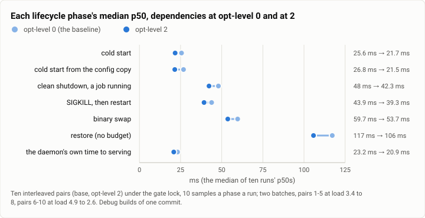
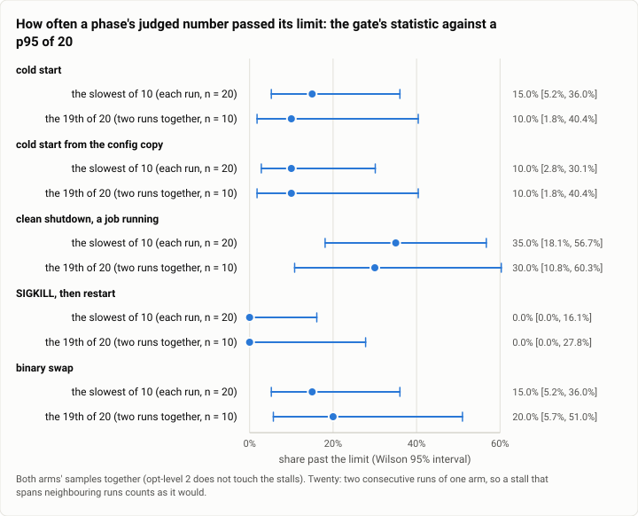

# Gate bench: dependencies at opt-level 2 in debug builds, an A/B of the lifecycle bench (2026-10-01)

**The answer first.** Building the dependencies at opt-level 2 (the workspace's own crates still at opt-level 0, with
debug assertions) made the start path measurably faster and left the gate's misses exactly where they were. Over ten
interleaved pairs of runs, a cold start's median p50 fell from 25.6 to 21.7 ms (faster in 9 of 10 pairs, sign test
p = 0.021; median paired difference −3.4 ms, bootstrap 95% interval −5.9 to −2.1), the start from the config copy
from 26.8 to 21.5 ms (10 of 10 pairs, p = 0.002), and the daemon's own time to serving from 23.2 to 20.9 ms (9 of
10). The stop, kill and swap phases' medians were 10 to 12% lower too, but no pair-by-pair test can tell them from
noise (6 or 7 of 10 pairs faster, p 0.34 to 0.75). Strict misses were the same in both builds: 4 of 10 runs for the
baseline and 5 of 10 for opt-level 2, each set by one or a few slow samples. The test suite ran 90.7 s against 96.9 s
(one fair pair), the target shrank from 7.8 to 6.8 GB, and a cold build cost 3.0 times the CPU. And on these runs'
own samples, a p95 of twenty runs instead of the slowest of ten would have caught nearly as many misses (7 of 40 run
pairs against 15 of 80 runs, phase by phase), because the slow samples came in bunches.

| | |
|---|---|
| Suite | `gate-bench`: `theseus-sim bench lifecycle --runs 10`, A/B, no `--check` |
| Arms | one commit, two builds: the baseline (`[profile.dev.package."*"]` at opt-level 0) and opt-level 2; debug, each build's own `theseus-sim` and `theseusd` |
| Model | none |
| Runs | 10 interleaved pairs in two batches (base 1, opt2 1, base 2, …), 10 samples a phase a run, under the gate lock with `sync` first |
| Date and commit | 2026-10-01, 10:57 to 11:21 MST; the change joined `main` as `adbeda4` at 11:50 |
| Cost | nothing in dollars; about 40 minutes of builds (a cold build each) and 2 minutes of benches |
| Data | `2026-10-01-gate-bench-opt-level-2.json`, `2026-10-01-gate-bench-opt-level-2.csv` (each run's p50 and p95 per phase) |

## The question

A review of the gate (review 2's S3) found the FAST check with no headroom: a debug cold start's p95 had reached
56.7 ms against its 57 ms limit at one commit, and the gate benches debug binaries, where unoptimized serde, sha2 and
redb do much of what it times. Its proposal was to build the dependencies optimized, keep the workspace's crates in
debug (so the debug-only checks stay), and keep a history of every gate's p95s. This A/B asked: what does opt-level 2
for the dependencies buy the bench, the suite and the disk, what does it cost the build, and does it stop the gate
failing on noise?

## The setup

- **Two builds of one commit** (the lane's history commit, `05424c4`): the baseline in its own target directory, with
  `main`'s profile, and the change, `opt-level = 2` added to `[profile.dev.package."*"]`. Both built cold, without
  sccache (so the two builds compare, and the compilers' memory is visible to `time -v`), 3 jobs, nice 19, ionice
  idle.
- **The bench:** `theseus-sim bench lifecycle --runs 10` on an empty store, every phase (cold, vault, shutdown, kill,
  swap, restore), each build running its own binaries as its gate would; base and opt-level 2 alternated, five pairs a
  batch, two batches: pairs 1 to 5 at 10:57 to 10:59 (load 3.4 rising to 8), pairs 6 to 10 at 11:20 to 11:21 (load 4.9
  falling to 2.6). Each run under the shared gate lock, `sync` first. Four other lanes were building on the machine.
- **The suite:** `cargo nextest run --workspace --test-threads 4` after a warm build, under the gate lock, nice 19,
  interleaved, two rounds.
- **The machine:** one WSL2 VM, 16 vCPUs, shared with four lanes' builds.
- **Statistics:** each run's p50 and p95 by the bench's own rule (nearest rank: the p50 is the 5th of 10 samples, the
  p95 the 10th). Paired by pair; the bootstrap is over the ten pairs (10,000 resamples, seeded), the sign test an
  exact binomial on the pairs that moved.

## Results

<picture>
  <source media="(prefers-color-scheme: dark)" srcset="img/2026-10-01-gate-bench-opt-level-2/p50-by-phase-dark.svg">
  
</picture>

*Figure 1. How much faster is each phase with the dependencies optimized? 10 to 20% at the median, but only the two
cold starts and the daemon's own time to serving move in nearly every pair; the stop-side phases move within their
noise.*

| Phase | p50, baseline | p50, opt-level 2 | Change | Median paired difference [95%] | Pairs faster | Sign test p | p95, baseline (range) | p95, opt-level 2 (range) |
|---|---:|---:|---:|---|---:|---:|---|---|
| cold start | 25.6 | 21.7 | −15.2% | −3.4 [−5.9, −2.1] | 9 of 10 | 0.021 | 33.0 (25.9 to 79.1) | 30.5 (22.1 to 74.6) |
| cold start from the copy | 26.8 | 21.5 | −19.8% | −4.6 [−10.0, −3.2] | 10 of 10 | 0.002 | 30.5 (26.5 to 70.4) | 25.8 (22.3 to 63.9) |
| clean shutdown | 48.0 | 42.3 | −11.8% | −2.8 [−9.1, +1.7] | 7 of 10 | 0.34 | 79.3 (51.1 to 157.9) | 68.8 (49.0 to 249.3) |
| SIGKILL, then restart | 43.9 | 39.3 | −10.5% | −4.4 [−6.5, +11.3] | 7 of 10 | 0.34 | 50.4 (44.2 to 119.6) | 46.9 (39.8 to 164.7) |
| binary swap | 59.7 | 53.7 | −10.2% | −3.1 [−8.0, +21.5] | 6 of 10 | 0.75 | 74.3 (65.0 to 165.4) | 68.7 (65.3 to 284.7) |
| restore (no budget) | 117.2 | 105.8 | −9.7% | −7.2 [−13.0, +38.0] | 7 of 10 | 0.34 | 134.9 (121.8 to 373.2) | 125.2 (108.2 to 445.6) |
| the daemon's own time to serving | 23.2 | 20.9 | −9.9% | mean −4.5 [−8.3, −0.4] | 9 of 10 | | | |

ms; the first two columns are the median of the ten runs' p50s. The paired means are pulled by a few slow pairs (for
the swap, +9.8 ms [−9.2, +34.3], against a median of −3.1), so the table gives the median of the paired differences.

**The misses**, each run's p95 against the gate's limits (57.08, 57.08, 104, 175.08, 202 ms):

| | Runs that missed | Wilson 95% | Which phases, run by run |
|---|---|---|---|
| baseline | 4 of 10 | 16.8% to 68.7% | shutdown; cold, vault, shutdown; shutdown; cold |
| opt-level 2 | 5 of 10 | 23.7% to 76.3% | shutdown; shutdown, swap; swap; cold, vault, shutdown, swap; shutdown |

### Would a p95 of twenty runs have stopped one stall from deciding a phase?

<picture>
  <source media="(prefers-color-scheme: dark)" srcset="img/2026-10-01-gate-bench-opt-level-2/runs-10-or-20-dark.svg">
  
</picture>

*Figure 2. On the A/B's own samples, would a p95 of twenty runs stop one stall from deciding a phase? Barely: the
slow samples came in bunches, so the 19th of twenty was past the limit nearly as often as the slowest of ten.*

| Phase | Samples past the limit (of 200) | The slowest of 10 past it (runs) | The 19th of 20 past it (two consecutive runs) | Resampled as if independent: of 10 / of 20 | Slow samples in each run that missed |
|---|---:|---|---|---|---|
| cold start | 5 | 3 of 20 | 1 of 10 | 22.3% / 8.8% | 1, 1, 3 |
| from the copy | 4 | 2 of 20 | 1 of 10 | 18.6% / 5.9% | 1, 3 |
| clean shutdown | 13 | 7 of 20 | 3 of 10 | 48.6% / 37.8% | 1, 1, 1, 1, 2, 2, 5 |
| SIGKILL, then restart | 0 | 0 of 20 | 0 of 10 | 0 / 0 | |
| binary swap | 5 | 3 of 20 | 2 of 10 | 22.5% / 9.0% | 1, 1, 3 |

If the slow samples were independent, a p95 of twenty (its 19th sample) would cut the miss rate by half to two
thirds (the resampled column). They were not: 6 of the 15 misses had two or more slow samples in the same run, and a
slow stretch spanned neighbouring runs, so on the runs as they happened the twenty-sample statistic missed 7 times in
40 run pairs, against 15 in 80 runs for the gate's own statistic. The samples are both builds' together; opt-level 2
does not touch the stalls.

### The build, the suite and the disk

| | Baseline | opt-level 2 | Ratio |
|---|---:|---:|---:|
| cold build of the workspace's tests, CPU (user + system) | 610.1 s | 1,838.4 s | 3.0× |
| its wall clock (the loads differed: 2 to 6 against 9 to 18) | 7 m 09 s | 12 m 19 s | |
| then the bench's binaries, CPU | 220.3 s | 456.1 s | 2.1× |
| peak memory of one process (`time -v`, cold build) | 1.34 GiB | 1.31 GiB | |
| the test suite, round 1 (load 8.0 against 0.9 at the start) | 101.0 s | 87.9 s | |
| the test suite, round 2 (back to back, load 3.6 and 3.9) | 96.9 s | 90.7 s | −6.4% |
| the target directory (the lane's `du`) | 7.8 GB | 6.8 GB | |
| `theseusd` | 143.8 MB | 104.4 MB | |

## Analysis

**What opt-level 2 buys is CPU on the start path.** The two cold starts and the daemon's own clock move in nearly
every pair, by 3 to 5 ms: unoptimized serde, sha2 and redb cost the debug start about 15% of its p50. What is left of a
21 ms debug start is mostly the disk: redb's two fsyncs in the store's open and one frame's fsync in the kernel's
`accepting` step, about 15 ms by the daemon's clock, which no opt-level touches. The stop-side phases are dominated by
syncs too, which is why their medians move 10% and their pairs do not agree.

**What it does not buy is a gate that stops failing on noise.** Both builds missed a limit in about half their runs on
a machine with four lanes compiling, each miss set by one or a few slow samples (shutdown 121 to 249 ms, swap 234 to
285, cold 71 to 79). The near-miss that prompted the review (56.7 ms at one commit) is the size of one such stall, not
of the 4 ms that unoptimized dependencies cost. So the lane, and its review, left every margin as it was.

**The retrospective's addition: twenty runs would not have fixed it either.** The open question since this A/B
(theseus-zay1, still open on Oct 6) is whether to re-derive the margins from a week of history or to judge the p95 of
twenty runs, so that one stall no longer decides a phase. On these 400 samples, stalls were not single samples: they
came as slow stretches (one baseline run had a cold p50 of 48.8 ms, its whole run slow), and the twenty-sample p95 was
past the limit in 7 of 40 run pairs against the ten-sample maximum's 15 of 80 runs. An estimate that treats samples as
independent would promise a two-thirds cut; the runs as they happened show almost none. On a busy machine a longer
bench measures a longer neighbour. The gate's later answer was different: wait for a quiet machine (`settle()`), and
give a calibrated allowance when none comes (FAST's history report).

**The cost was paid once.** A cold build at three times the CPU is paid per worktree when the profile changes, and
shared through the compiler cache after that; the incremental rebuild after it is no slower (the lane measured 8.5 s
against 9.9 s for one touched crate). The smaller target (1 GB less) mattered on a machine whose disk had filled that
morning.

**What changed since the last comparable run.** The margins themselves came from five gate runs in September (cold's
p95 spread 23.3 to 30.1 ms). Here, in twenty runs beside four builders, the cold p95 ranged 22.1 to 79.1 ms: the
September spread described a quiet machine that the gate no longer has.

## Threats to validity

- **Ten pairs, two batches, a busy machine.** The pairs alternate, so a slow minute lands on both arms in turn, but a
  stall still falls on one run of a pair: the stop-side phases' paired differences are within that noise. The second
  batch (quieter) agrees with the first on the start phases.
- **One commit.** Both builds are one commit with one profile line changed; the binaries differ only in how the
  dependencies were compiled.
- **The build times are single measurements**, on different loads (the wall clocks are not comparable; the CPU totals
  are). The target sizes and the incremental rebuilds are the lane's own measurements, quoted, not recomputed (their
  raw output was not kept beyond the lane's report; the CPU and memory figures here were recomputed from its timing
  files, and the baseline's peak memory reads 1.34 GiB there, where the lane wrote 1.37 GB).
- **Debug builds, an empty store,** as the gate runs them: release builds and real stores are faster and slower
  respectively, and neither was measured here.

## What it cost

Nothing in dollars. Two cold builds (about 2,450 s of CPU between them, uncached), the bench's 20 runs (about 8 s
each), and four suite runs (about 6 minutes) under the gate lock.

## Reproduction

```
# the baseline: main's profile, in its own target directory
CARGO_TARGET_DIR=<base target> cargo build -p theseusd -p theseus-sim --config 'profile.dev.package."*".opt-level=0'
# the change: [profile.dev.package."*"] opt-level = 2 (in Cargo.toml since adbeda4)
cargo build -p theseusd -p theseus-sim
# alternate the two, under the gate's lock, sync first
<build>/theseus-sim bench lifecycle --theseusd <build>/theseusd --runs 10 \
    --record ab-history.csv --label "<build> <n>" --json ab-<build>-<n>.json
```

The lane's per-run reports (every sample of every phase), its build timing files and its suite log are kept on the
build machine, not published; this report's numbers were recomputed from them.

## Data

- `2026-10-01-gate-bench-opt-level-2.json`: per phase, both arms' medians, the paired differences with their
  intervals and sign tests, the p95 ranges; the misses run by run; the runs-10-or-20 comparison (empirical and
  resampled); the build, suite and size numbers; both figures' specs.
- `2026-10-01-gate-bench-opt-level-2.csv`: one row per run (20): the arm, the pair, each phase's p50 and p95, the
  daemon's time to serving, and the phases past their limits.
