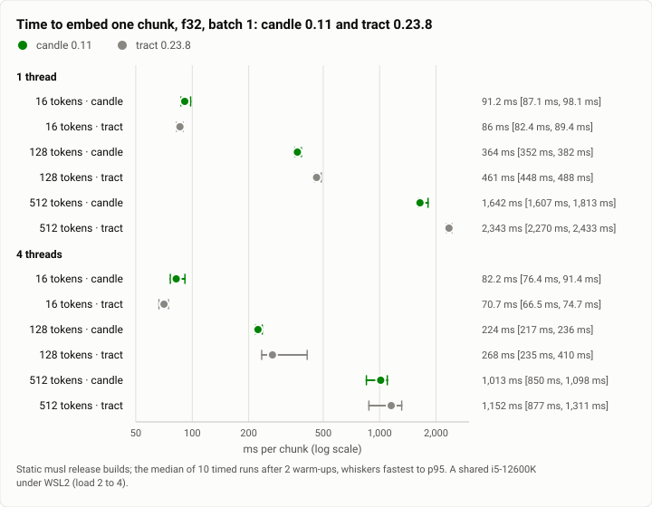
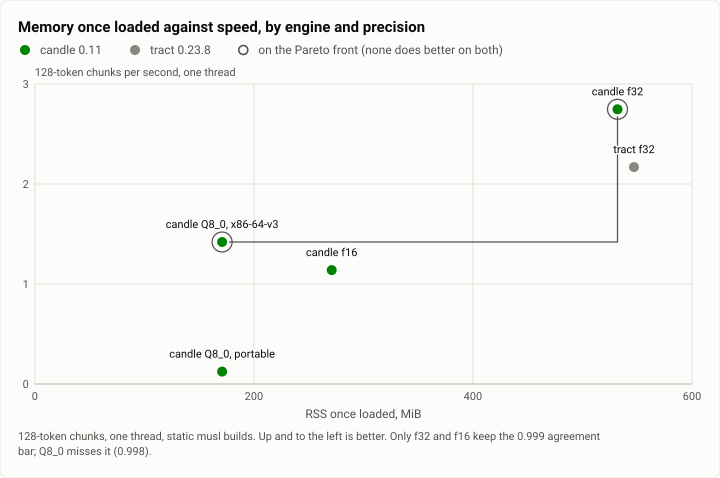

# Retrieval: which engine embeds for the index, candle or tract? (2026-10-01)

**The answer first.** For Nomic Embed v1.5 on one CPU thread, candle 0.11 at f32 embeds a 128-token chunk in
**351 to 364 ms**, against tract 0.23.8's **461 to 491 ms** (1.27 to 1.40 times faster over two passes). It embeds a
512-token chunk in 1.61 to 1.64 s, against 2.29 to 2.34 s (1.42 to 1.43 times). On a short query the two are level
(84 to 91 ms). The engines agree on every vector to within 4 × 10⁻¹² of a cosine of 1. candle adds 1.6 MiB to the
static binary, against tract's 22.4, and loads in 0.25 to 0.41 s, against 1.1 to 1.4 s. In candle, f32 is also the
fast precision: f16 halves the memory and runs at half the speed, and int8 (Q8_0) is slower still and misses the
agreement bar. So the index ships candle at f32 on one thread. Read with what came after, the spike's most important
number is one it did not headline: its own 128-token row already priced the design's real recall query (about 115
word pieces) at about 350 ms, past recall's 250 ms deadline. The recall lane measured exactly that the same morning.

| | |
|---|---|
| Suite | retrieval: an embedding-engine micro-benchmark (20 sentences; chunks of 16, 128 and 512 tokens) |
| Arms | candle 0.11 (candle-core and candle-nn, a port of Nomic BERT); tract 0.23.8 (the ONNX export) |
| Model | `nomic-embed-text-v1.5` (no language model was called) |
| Runs | the median of 10 timed runs after 2 warm-ups per row; the rows the verdict leans on, run twice |
| Date and commit | 2026-10-01, 02:11 to 02:40 MST (run 2); the throwaway probes at 61ef202, never joined |
| Cost | no model calls: CPU time on the build machine |
| Data | [`2026-10-01-retrieval-embedding-engines.json`](2026-10-01-retrieval-embedding-engines.json), [`.csv`](2026-10-01-retrieval-embedding-engines.csv) |

## The question

The memory milestone's vector step (29c) needed an embedding engine inside the index tender. The design's open
question was "candle or tract?", with a default of safetensors at f16 and about 275 MB resident. A spike (29a)
answered it before any code was written for the product. It had to settle which engine is faster where the index
spends its CPU (one thread, backfilling chunks), which builds smaller and cleaner into the static musl binary, and
which precision to ship.

## The setup

- **The probes.** Four small binaries in their own cargo workspace, sharing everything but the engine:
  - the tokenizer, masked mean pooling, Nomic's layer norm, the Matryoshka cut to 256 and L2 normalisation;
  - `probe-candle`: a 167-line port of Nomic BERT on candle-core and candle-nn 0.11, from `model.safetensors`;
  - `probe-tract`: the ONNX export on tract-onnx 0.23.8. It needs a 40-line replacement for tract's `Range` op to
    keep a symbolic sequence length;
  - a base probe (no engine) and an empty one, for the sizes.
- **The data.** 20 sentences: six queries, six paraphrases that share few of their words, and eight distractors (four
  sharing a query's vocabulary but not its meaning). Timings used chunks of 16, 128 and 512 tokens.
- **The builds.** Static musl release builds (`lto = "fat"`, one codegen unit), the way `theseusd` ships. An
  x86-64-v3 build was measured beside the portable one.
- **Threads.** 1, 2, 4 and 8, set through `RAYON_NUM_THREADS` and `CANDLE_NUM_THREADS` (candle) or tract's
  multithread executor. One thread is the design's setting: the tender backfills on one embedding thread.
- **Precisions.** candle f32, f16 and Q8_0 linears; tract f32, its fused-attention transform, f16, and Q4.
- **Measured per row:** the median, fastest and p95 of the timed runs, the CPU time per batch, the RSS once loaded
  and its peak during the load, and the load average when the row finished.
- **The machine:** one WSL2 VM on an i5-12600K (6 performance cores, 4 efficiency cores, 16 threads; AVX2, FMA,
  AVX-VNNI, no AVX-512), about 19 GiB. It was shared with other builds, at a load of 2 to 9.

## Results

<picture>
  <source media="(prefers-color-scheme: dark)" srcset="img/2026-10-01-retrieval-embedding-engines/latency-dark.svg">
  
</picture>

*Figure 1. Which engine embeds a chunk faster on the one thread the design budgets? candle, by 1.27 to 1.43 times on
128- and 512-token chunks; the two are level on a 16-token query. At four threads tract gains more, and is faster on
a query. Table 1 holds the numbers.*

**Table 1.** Milliseconds per chunk, f32, batch 1: the median of 10 runs (the repeat pass's median in brackets).
On one thread the CPU time equals the wall time (91 against 91 ms, 1,664 against 1,642), so no row waited for a
core.

| threads | tokens | candle | tract | tract ÷ candle |
|---|---|---|---|---|
| 1 | 16 | 91.2 (87.0) | 86.0 (84.1) | 0.94 (0.97) |
| 1 | 128 | **364.2 (351.2)** | 461.0 (490.5) | **1.27 (1.40)** |
| 1 | 512 | **1,642 (1,606)** | 2,343 (2,285) | **1.43 (1.42)** |
| 4 | 16 | 82.2 (69.5) | 70.7 (50.7) | 0.86 (0.73) |
| 4 | 128 | 224.4 (214.7) | 268.2 (217.0) | 1.20 (1.01) |
| 4 | 512 | 1,013 (755) | 1,152 (867) | 1.14 (1.15) |

<picture>
  <source media="(prefers-color-scheme: dark)" srcset="img/2026-10-01-retrieval-embedding-engines/precision-dark.svg">
  
</picture>

*Figure 2. What does each precision buy, in memory and in speed? Only two variants are on the front:
candle f32 (fast) and candle Q8_0 on an x86-64-v3 build (small). Q8_0 misses the agreement bar, so f32 is the only
fast choice. f16 halves the memory but is slower than f32 and larger than Q8_0. Table 2 holds the numbers.*

**Table 2.** Each engine and precision, one thread: memory, load, and milliseconds per chunk.

| variant | RSS loaded | peak during load | 16 tokens | 128 tokens | 512 tokens | agreement with f32 (min cosine, 768-d) |
|---|---|---|---|---|---|---|
| candle f32 | 532 MiB | 1,054 MiB | 91 | 364 | 1,642 | (the reference) |
| candle f32, x86-64-v3 | 533 MiB | 1,055 MiB | 85 | 367 | 1,616 | the same code path at f32 |
| candle f16 | 271 MiB | 800 MiB | 267 | 878 | 3,466 | 0.9999987 |
| candle f16, x86-64-v3 | 271 MiB | 800 MiB | 345 | 791 | 3,057 | |
| candle Q8_0, x86-64-v3 | 171 MiB | 699 MiB | 105 | 704 | 3,383 | **0.99829**, below the 0.999 bar |
| candle Q8_0, portable | 171 MiB | 699 MiB | 1,230 | 8,034 | 23,185 | (scalar kernels) |
| tract f32 | 547 MiB | 1,063 MiB | 86 | 461 | 2,343 | 1 − 3.9 × 10⁻¹² against candle f32 |
| tract f32, fused attention | 546 MiB | 1,065 MiB | 83 | 449 | 2,196 | identical to tract f32 |
| tract f16 | | | | | | **NaN in all 20 vectors** |

At four threads one variant embedded a query in under 60 ms: candle Q8_0 on the x86-64-v3 build, at 48 ms. It
misses the agreement bar.

**Table 3.** Loading, one thread (two cold loads, with the weights evicted from the VM's page cache, and two warm).

| engine | load, cold | load, warm | first query after it | ready to answer, cold |
|---|---|---|---|---|
| candle f32 | 407, 365 ms | 250, 257 ms | 86 to 92 ms | about 0.5 s |
| candle f16 | 597, 535 ms | 455, 412 ms | 254 to 270 ms | about 0.9 s |
| tract f32 | 1,393, 1,315 ms | 1,157, 1,069 ms | 80 to 91 ms | about 1.5 s |

**Table 4.** Batching, ms per chunk (the median batch over its size), one thread, 128-token chunks.

| engine | batch 1 | 4 | 8 | 16 |
|---|---|---|---|---|
| candle, first pass | 379 | 348 | 336 | 334 |
| candle, repeat | 417 | 321 | 325 | |
| tract, first pass | 539 | 1,301 | 1,072 | 1,297 |
| tract, repeat | 465 | 474 | 485 | |

**Agreement and ranking.**
- **candle f32 against tract f32**, over the 20 sentences: every cosine is within 3.9 × 10⁻¹² of 1 at 768-d (3.3 ×
  10⁻¹² at 256-d). The largest coordinate difference of the unit vectors is 3.3 × 10⁻⁷.
- **candle's port against candle-transformers' own `nomic_bert`:** bit-identical.
- **Paraphrase top-1 over the six queries:** 5 of 6 at 768-d and 6 of 6 at 256-d, for both engines and candle f16.
  Q8_0 got 5 of 6 at both.

**Binary size** (static musl, release, stripped; the spike's own table, since the binaries were not kept):
- an empty probe, 432,568 bytes;
- adding the tokenizer, 3,537,800;
- adding candle, 5,226,248 (**+1.61 MiB**);
- adding tract instead, 27,000,456 (**+22.38 MiB**).

## Analysis

**Where each engine wins.**
- candle wins where the index spends its CPU: chunks, on one thread, at 1.27 to 1.43 times.
- tract scales better with threads, and at four threads it is faster on a query (51 to 71 ms against 70 to 82). The
  design's one embedding thread does not spend that advantage.
- The rest goes candle's way:
  - it loads the published weights with an architecture its own model zoo already ships (the port matches that
    model bit for bit);
  - it loads in a quarter of tract's time, since tract parses, types and optimizes the graph on every start;
  - it has memory levers that run (f16, Q8_0), where tract's f16 overflows to NaN and its Q4 segfaulted;
  - it is a fourteenth of tract's size in the binary. Most of tract's 22 MiB survives the linker, because its ops and
    kernels register themselves at start-up.
- Against candle: candle-core pulls in a C regex library as dead code (0 bytes in the binary, about 39 CPU-seconds of
  a cold build).

**Precision, against speed.** The surprise is that f32 is candle's fast precision.
- f16 keeps the vectors exact (cosine 0.9999987) and halves the memory. It runs at half speed: candle's CPU matmul
  converts f16 to f32 as it packs, and its f16 element-wise ops convert one value at a time.
- Q8_0's kernel is built for a language model's one new token: it walks the rows one at a time. It is slower than
  f32 on chunks, needs a build that assumes AVX2 to be usable at all, and moves the vectors past the agreement bar
  (0.998).
- Figure 2's front has only f32 and Q8_0 on it, and only f32 passes the bar. The design's default (f16, about 275 MB)
  became f32, about 530 MiB resident, with the idle unload as the memory lever.

**Batching.** candle gains 7 to 12% a chunk from batching 4 to 16 short chunks on one thread, and nothing at 512
tokens, where a chunk's matmuls are already tall. tract gains nothing. Its first pass seemed to lose two times at
batch 4 to 16, but the repeat did not reproduce that: on this box a run can land on an efficiency core, or on a busy
core's second thread. The one-thread rows agree across the two passes to within 7%, which is the check that matters.

**What the run teaches that the tables don't: the query is not 16 tokens.** The spike's advice to the recall step
quoted the 16-token row as "a query": 85 to 91 ms, past the 60 ms p95 target but inside the 250 ms deadline. The
design's actual recall query is the turn's new text plus 500 characters of the previous reply, about 115 word
pieces. That is the spike's own 128-token row: 351 to 364 ms on one thread, past the deadline itself. The recall
lane measured the long query at 320 to 350 ms the same morning ([the retrieval report](2026-10-01-retrieval-fusion.md)),
and the next step had to choose a shorter vector query. The number was in this table all along; the question asked
of it was the wrong length.

**Since then.** The vector step shipped this verdict: candle 0.11 pinned, the port, f32, one thread. It reproduces
the spike's stored vectors with the real weights, worst cosine 1.000000000000. On the shipped static tender, a
short query embeds at a p50 of 74 to 75 ms and a p95 of 86 to 94 ms, consistent with this spike's 85 to 91 ms.

## Threats to validity

- **A shared, hybrid CPU.** WSL2 on a box with performance and efficiency cores, at a load of 2 to 9. Medians of 10
  runs; the verdict's rows were run twice, and the one-thread rows agree to within 7%. Thread scaling on another
  machine may differ. The one-thread rows are the portable ones.
- **Twenty sentences are not recall quality.** They show that the engines agree and that paraphrases rank. Recall
  quality on real items is the retrieval report's question.
- **"Cold" is cold to the VM only.** WSL2's disk is a file on the host, whose cache may have held the 547 MB weights.
  A truly cold disk adds its read time to the load.
- **Lengths between 128 and 512 tokens were not measured** for batching.
- **The probes are the spike's own code.** The tract probe carries a replacement op that upstream does not have.
- **The first run died with the VM** (00:32). Its rows, taken as the load climbed to 11.6, are kept but not used.

## What it cost

No model or API calls. The probes' builds and timings were CPU time on the build machine, about 40 minutes of
wall clock for the timing suite.

## Reproduction

The probes were throwaway, on a branch that never joined `main`, and their result files are kept on the build
machine (`results/bench-*.json` and `agree-*.json`, which this report's extraction reads). The verdict lives in
`crates/theseus-index`:
- `model.rs` is the port;
- `embedder.rs` pins candle 0.11 and the weights' SHA-256;
- the ignored test `embedder::the_real_model_gives_the_spike_s_vectors` reproduces the spike's vectors with the real
  weights.

To time the shipped engine on any machine:

```bash
cargo build --release -p theseus-index
# nomic-embed-text-v1.5's model.safetensors and tokenizer.json under <weights dir>/nomic-embed-text-v1.5/
# (the default weights dir is the user's model cache; nothing is downloaded)
theseus-index serve --store <state>/store --index <state>/index --weights-dir <weights dir> --threads 1 &
theseus-index warm --socket <state>/index/sock
theseus-index embed --socket <state>/index/sock --task search_query "a short query"
# the shipped embedder against the spike's stored vectors (THESEUS_SPIKE_VECTORS: its agree-candle-f32-t4.json)
cargo test --release -p theseus-index -- --ignored the_real_model_gives_the_spike_s_vectors
```

## Data

- [`2026-10-01-retrieval-embedding-engines.json`](2026-10-01-retrieval-embedding-engines.json):
  - `summary.latency`: every timing row, f32 at 1, 2, 4 and 8 threads, both passes;
  - `summary.variants`: every precision and build, with RSS, peak and load;
  - `summary.loads`, `summary.batching`;
  - `summary.agreement`: the cosines and coordinate differences, recomputed from the stored vectors;
  - `summary.ranking_top1`, `summary.sizes_as_reported`;
  - `figures`.
- [`2026-10-01-retrieval-embedding-engines.csv`](2026-10-01-retrieval-embedding-engines.csv): one row per timing
  row (engine, threads, pass, tokens, median, fastest, p95, n, CPU time, load).
