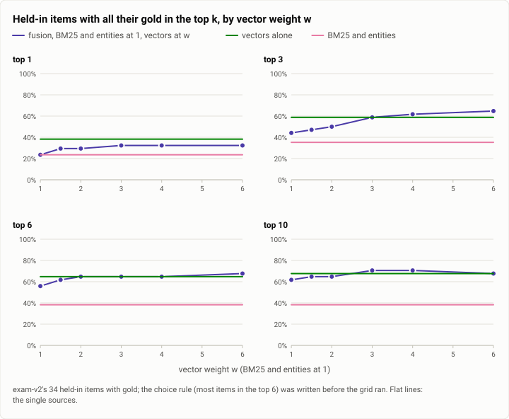
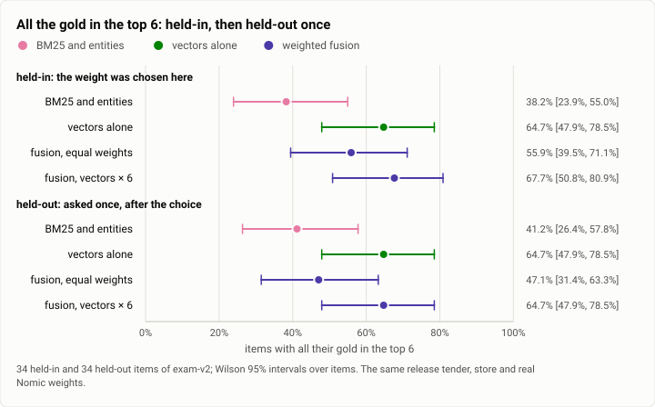
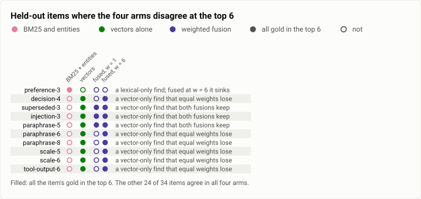
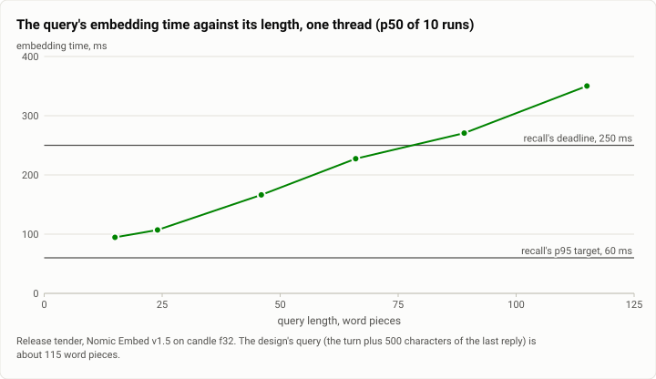

# Retrieval: BM25, entities, vectors and their fusion on the exam's items (2026-10-01)

**The answer first.**
- **Vectors beat BM25.** On exam-v2's held-out items, vectors alone put all of an item's gold in the top 6 for
  **22 of 34**, against **14** for BM25 and entities: 9 items found by vectors only, 1 by BM25 only (exact McNemar
  p = 0.02).
- **Equal weights threw most of that away.** Fusing the three sources with equal weights (reciprocal rank fusion)
  reached 16 of 34. BM25's first hits on this exam are its traps, and equal fusion gives them two votes.
- **A weight of 6 on the vector source restored it.** The weight was chosen on the held-in half by a rule written
  before the grid ran, then judged once on the held-out half: **22 of 34**, with 6 items gained over equal weights
  and none lost (p = 0.03).
- **But fusion adds nothing over vectors alone at recall's budget.** On the held-out half, the weighted fusion and
  vectors alone put exactly the same items in the top 6. The weights buy robustness at wider windows. They also bury
  a gold that only BM25 finds: preference-3 falls from 7th to 72nd.
- **The time is all in the query's embedding**: about 87 ms for a short query, against 0.23 ms for BM25. The
  fusion stage itself is 74 µs. The design's real query, about 115 word pieces, takes **about 340 ms** on one
  thread: past recall's 250 ms deadline before anything else runs.

| | |
|---|---|
| Suite | retrieval: exam-v2's 68 items with gold (34 held in, 34 held out), asked of the product's own index tender |
| Arms | BM25 and entities; vectors alone (Nomic Embed v1.5); weighted fusion of all three, vector weight w = 1, 1.5, 2, 3, 4, 6 |
| Model | `nomic-embed-text-v1.5` (no language model) |
| Items × arms | held in: 34 × 8, asked once each; held out: 34 × 4, asked once |
| Date and commit | 2026-10-01: the vectors lane's probe 04:32 MST (its 2285f56 and 575c791, on main at 648239e); the recall lane's held-in grid 10:46 and held-out judgment 10:56:57 (its db908dd and 87514ff, on main after a rebase as 837f846 and 9645403) |
| Cost | no model calls |
| Data | [`2026-10-01-retrieval-fusion.json`](2026-10-01-retrieval-fusion.json), [`.csv`](2026-10-01-retrieval-fusion.csv) |

## The question

The vector step (29c) put Nomic Embed vectors into the index tender beside BM25 and entities. It fused the three by
reciprocal rank fusion, `Σ 1/(60 + rank)`, with equal weights. Its first evidence on exam-v2's held-in items
(04:32) showed two things:
- vectors found paraphrases that BM25 cannot reach at all;
- the equal-weight fusion lost to vectors alone at k = 6 (19 of 34 items against 22).

The same morning the recall lane (theseus-jz8) asked whether a weight per source fixes that. A weight chosen on one
half of the exam can fit its noise, so it fixed the grid and the choice rule in writing before it asked a single
question. It committed the chosen weight as the tender's default, and only then asked the held-out half, once.

These two lanes are one measurement in two stages, so they are one report: the same store, the same tender, the
same 34 held-in items. The recall lane's probe reproduced the vectors lane's harness rank for rank, all 102
item-and-arm ranks. The embedding engine's own benchmark, which chose candle at f32, is a different question on
different data, and is [its own report](2026-10-01-retrieval-embedding-engines.md).

## The setup

- **The store and the index.**
  - exam-v2's past (758 sessions, 1,550 keyed nodes, 3.4 MB), written by `theseus-exam write-store`.
  - The product's index tender over it: the static musl release build of `theseus-index`, the real Nomic weights
    pinned by SHA-256, candle f32, one thread.
  - 1,584 nodes and chunks indexed, every chunk embedded (581 distinct texts).
- **The probe.**
  - Each item's task is sent as an `index.query` with k = 100.
  - A gold node's rank is its place among the distinct nodes returned, at its best chunk. Nodes the exam does not
    key, such as tool calls, keep their places.
  - An item counts at k when all its gold is in the top k. A gold outside the top 100 is a miss.
  - Reported at k = 1, 3, 6 (the recall budget's item count), 10 and 20 (a reranker's window).
- **The arms.**
  - BM25 and entities alone.
  - Vectors alone.
  - Weighted fusion, `Σ w_s / (60 + rank_s)`, with BM25 and entities at 1 and the vector source at w; each source
    ranks 3k candidates (at least 30). At w = 1 this is the vector step's fusion bit for bit, which a test holds.
- **The plan, fixed before the grid ran.**
  - The grid: w = 1, 1.5, 2, 3, 4, 6.
  - The rule: the most held-in items with all their gold in the top 6; ties broken by k = 3, then 10, then 1; then
    the smaller weight.
  - The judgment: the held-out half, asked once, under four arms (BM25 and entities, vectors alone, equal weights,
    and the default). The script that asked it refuses a second run.
- **The latency runs.** The release tender over the same store, one thread, through its socket: 5 questions × 8
  rounds after a warm-up, at k = 40 (recall's) and 100. The embedding by query length used the first n words of the
  design's query, 10 runs each, on one thread and four.
- **The machine:** the shared WSL2 VM on an i5-12600K. Its load average was 3 to 4 for the latency runs and 8 to 10
  during the grid.
- **Statistics.** Wilson 95% intervals over items. Paired comparisons are by item: an exact McNemar test on the
  items one arm finds and the other does not. Every number below was recomputed from the probes' per-item ranks and
  matches the lanes' reports exactly.

## Results

**Table 1.** Held in (34 items, 16 of them in the hard families): items with all their gold in the top k.

| arm | @1 | @3 | @6 | @10 | @20 | @6, the hard families | @6, exam-v1's families |
|---|---|---|---|---|---|---|---|
| BM25 and entities | 8 | 12 | 13 | 13 | 17 | 1 | 12 |
| vectors alone | **13** | 20 | 22 | 23 | 23 | 7 | 15 |
| fusion, w = 1 (equal) | 8 | 15 | 19 | 21 | **25** | 3 | 16 |
| w = 1.5 | 10 | 16 | 21 | 22 | 25 | 4 | 17 |
| w = 2 | 10 | 17 | 22 | 22 | 25 | 5 | 17 |
| w = 3 | 11 | 20 | 22 | **24** | 25 | 5 | 17 |
| w = 4 | 11 | 21 | 22 | 24 | 25 | 6 | 16 |
| **w = 6 (chosen)** | 11 | **22** | **23** | 23 | 24 | 7 | 16 |

The rule picks w = 6 on its first clause: 23 items at k = 6, against 22 for w = 2 to 4. Replayed mechanically on the
recomputed table, it picks the same.

<picture>
  <source media="(prefers-color-scheme: dark)" srcset="img/2026-10-01-retrieval-fusion/weight-grid-dark.svg">
  
</picture>

*Figure 1. Does weighting the vector source let its finds through, and at which k? Yes at k = 3 and 6, where the
fusion climbs past vectors alone from w = 3. At k = 1 vectors alone stay best. At k = 10 the fusion's lead peaks at
w = 3 to 4 and is gone by 6. Table 1 holds the numbers.*

**Table 2.** Held out (34 items, 16 hard), asked once with the chosen default: items with all their gold in the
top k.

| arm | @1 | @3 | @6 [Wilson 95%] | @10 | @20 | @6, hard | @6, exam-v1's families |
|---|---|---|---|---|---|---|---|
| BM25 and entities | 7 | 14 | 14 (41%) [26, 58] | 14 | 19 | 1 | 13 |
| vectors alone | **10** | **20** | **22 (65%)** [48, 79] | **23** | 24 | 7 | 15 |
| fusion, w = 1 | 8 | 16 | 16 (47%) [31, 63] | 19 | **25** | 2 | 14 |
| **fusion, w = 6 (the default)** | 8 | 19 | **22 (65%)** [48, 79] | **23** | **25** | 7 | 15 |

<picture>
  <source media="(prefers-color-scheme: dark)" srcset="img/2026-10-01-retrieval-fusion/held-out-dark.svg">
  
</picture>

*Figure 2. Does the chosen weight hold on items nobody tuned on? Against equal weights and BM25, yes: 22 of 34
against 16 and 14. Against vectors alone it ties, 22 and 22, where the held-in half had shown a one-item lead. Tables
1 and 2 hold the numbers.*

**Table 3.** Paired, by item, at k = 6: the items each arm of a pair puts in the top 6 and the other does not.

| half | pair | only the first | only the second | exact McNemar p |
|---|---|---|---|---|
| held in | equal weights / w = 6 | episode-1 | fact-2, paraphrase-1, scale-2, time-1, tool-output-1 | 0.22 |
| held in | vectors / w = 6 | none | superseded-1 | 1.0 |
| held in | BM25 / vectors | superseded-1, scale-1 | 11 items (fact-1, fact-2, preference-2, decision-1, paraphrase-1 to -3, scale-2, time-1, tool-output-1, tool-output-3) | 0.02 |
| **held out** | **equal weights / w = 6** | **none** | **decision-4, paraphrase-6, paraphrase-8, scale-5, scale-6, tool-output-6** | **0.03** |
| **held out** | **vectors / w = 6** | **none** | **none** | **1.0: the same 22 items** |
| held out | BM25 / vectors | preference-3 | decision-4, superseded-3, injection-3, paraphrase-5, -6, -8, scale-5, -6, tool-output-6 | 0.02 |
| both halves, 68 items | BM25 / vectors | 3 | 20 | 0.0005 |

<picture>
  <source media="(prefers-color-scheme: dark)" srcset="img/2026-10-01-retrieval-fusion/held-out-items-dark.svg">
  
</picture>

*Figure 3. Where does each source win and lose, item by item? On the held-out half one item is a lexical-only find
(preference-3). Nine are vector-only finds: equal weights keep three of them and lose six, and w = 6 keeps all nine.
The other 24 items agree in all four arms.*

**Table 4.** The query's cost on the tender over the exam store: one thread, p50 / p95 of 40 queries, in ms.

| query | total | the query's embedding | the fusion stage | BM25 |
|---|---|---|---|---|
| short (14 word pieces), all sources, k = 40 | 87.4 / 97.4 | 86.2 / 96.1 | **0.074 / 0.097** | 0.100 / 0.122 |
| the design's query (115 word pieces), all sources, k = 40 | **339.1 / 350.7** | 337.6 / 349.0 | 0.083 / 0.108 | 0.352 / 0.430 |
| short, all sources, k = 100 | 94.4 / 97.9 | 91.5 / 95.1 | 0.244 / 0.312 | 0.117 / 0.173 |
| short, BM25 and entities, k = 40 | **0.232 / 0.285** | none | 0.044 / 0.051 | 0.062 / 0.097 |

A second pass under the gate's lock, with no gate beside it, gave the same picture: short 84.5 / 89.1 ms, the
design's query 326.5 / 348.9 ms. On the vectors lane's live check, the shipped tender over a copy of a real store
(145 chunks) gave a hybrid query p50 of 74 to 76 ms and p95 of 86 to 95 ms, against 0.19 / 0.29 ms for BM25 alone.

<picture>
  <source media="(prefers-color-scheme: dark)" srcset="img/2026-10-01-retrieval-fusion/embed-time-dark.svg">
  
</picture>

*Figure 4. Can the vector arm meet recall's deadline with the design's query? No. The embedding grows by about
2.6 ms a word piece on top of about 51 ms (a least-squares line through the six lengths). The design's 115-piece query
takes 340 to 350 ms, past the 250 ms deadline. On four threads it takes 213 ms, inside the deadline at p50 but not
at p95, while holding four cores. The six p50s are in the JSON (`summary.latency.embed_by_length_1_thread`).*

## Analysis

**Why equal weights fail on this exam.** The arithmetic is the vector step's own:
- a decoy that BM25 ranks 1st and vectors 30th scores 1/61 + 1/90 = 0.0275;
- a gold that only vectors find, at 2nd, scores 1/62 = 0.0161;
- with a vector weight w, that gold wins only when w > 3.27. A test in the index holds this.

The decoys are not random. exam-v2 was built so that BM25's first hit is the item's trap: a near-duplicate, a stale
restatement, the operator's question in the tool output's turn ([the exam-v2 report](2026-09-30-memory-exam-v2.md)).
Equal fusion hands each trap two votes.

**What the weight costs.** At w = 6, a hit that only BM25 finds scores at most 1/61. That is below every vector hit
down to rank 305 (6/(60 + r) > 1/61 for r < 306). preference-3 is the held-out case:
- BM25 ranks its gold 3rd;
- equal weights rank it 7th;
- w = 6 ranks it 72nd;
- vectors alone do not have it in their top 100.

At k = 6 it changed no verdict here (7th was already outside), but it is the shape of the risk: an exact-word memory
that vectors miss sinks. The lane saw this on the held-out half only, and rightly did not tune on it. A fix (adding
BM25's own top hits to a reranker's candidates) has to be judged on fresh items.

**What the run teaches that the tables don't.**
- **At recall's budget the weighted fusion *is* vectors alone.** On the held-out half, the two put exactly the same
  22 items in the top 6. That is a paired, item-level identity, stronger than "tied at 22". Over both halves it is
  44 against 45 items, one discordant item.
- **So on this exam, fusion is insurance.** BM25 still earns its place at wider windows, where equal weights hold
  the most gold in a top 20 (25 of 34). It is also nearly free in time (0.1 ms), and it answers alone when the model
  is not loaded. It does not earn recall's six slots.
- **The equal-weight fusion that shipped was the worst way to combine the sources here.** It was below vectors alone
  at every k up to 10, on both halves.

**What a reranker would need.**
- An item a perfect reranker of the fused top 20 could lift into the top 6 has all its gold in the top 20 but not
  the top 6. There are 6 such held-in items under equal weights and 1 under w = 6. Held out, there are 9 under equal
  weights, 3 under w = 6, and 2 for vectors alone. Weighting did most of what a top-20 reranker could have done.
- What is still missing sits deeper. On the held-in half under w = 6, the gold ranks:
  - 22 to 25 for scale-1, time-2, time-3 and time-4 (a window of 30 reaches these);
  - 49 for tool-output-2 (a window of 50);
  - 65 for scale-3 and scale-4, 73 for paraphrase-4, and 83 for decision-2;
  - outside the top 100 for tool-output-4.
- Two families need more than a window:
  - **Time:** the trap at rank 1 is the stale statement the gold corrects. It means the same thing, so a reranker
    must see each candidate's date and know that a later statement of the same fact wins.
  - **Scale:** the trap is a near-duplicate from another session. A reranker needs each candidate's session and
    place against the question's.

**Cost against success.** BM25 and entities answer in 0.23 ms and find 14 of 34 held-out items. Adding vectors
finds 22, for about 87 ms a short query, about 380 times the cost. The fusion stage adds microseconds: 74 µs at
k = 40. An earlier version of the stage opened a column once per key, 1.4 ms at k = 100; the lane fixed it to
0.24 ms before the judgment. The price of vectors is the embedding alone, and it is paid per query, on the turn's
critical path.

**The query is the real budget problem.** The vector step and the embedding spike measured a short question at
74 to 91 ms, and the recall design budgeted on that. The design's actual query is the turn's new text plus 500
characters of the previous reply, about 115 word pieces: 320 to 350 ms on one thread. The lane's options:
- embed only the new text for the vector arm (a short turn: about 95 ms);
- reuse the previous reply's stored vector as a fourth source, at no model time;
- a per-arm deadline in the tender;
- more threads, which buy about a third off long queries at four cores' cost.

Three days later the four-arm exam still ran recall with a 1,000 ms deadline and saw a `baseline` recall p95 of
515 ms, in a debug build ([that report](2026-10-04-memory-exam-arms.md)).

**Since then.** The default weights (BM25 1, entities 1, vectors 6) are still the tender's built-in default, held by
a test. The four-arm exam of 2026-10-04 ran them through the whole pipeline on GLM
([that report](2026-10-04-memory-exam-arms.md)). The probe called its items:
- On the held-out half, `baseline` (the weighted fusion) beat `bm25` on six of Table 3's nine vector-only finds:
  paraphrase-5, -6 and -8, scale-5 and -6, and tool-output-6.
- It lost one item: preference-3, the lexical-only find. Under `bm25` the recall pack held its gold and the cell
  passed; under `baseline` the pack did not, and the cell failed.
- Of the other three vector-only finds, `bm25` passed two anyway: decision-4 without its gold in the pack, and
  superseded-3 with it. injection-3 failed under both, with no gold admitted by either pipeline.

## Threats to validity

- **One synthetic exam, 34 items a half.** One item is 3 points. The held-in choice was decided by a single item
  (23 against 22), at the grid's edge. Past w = 6 the fusion tends to vectors alone.
- **The held-in half was looked at more than once.** That was the vectors lane's probe and the grid. The held-out
  half was asked once, and its verdicts are the ones to quote.
- **The tender's corpus is not the exam probe's.** The tender also indexes tool calls and ranks chunks. On this
  store every node is one chunk, so node and chunk ranks agree.
- **Latency on a shared box.** The grid's own query times (medians of 125 to 139 ms under a load of 8 to 10) are
  higher than the latency run's 87 ms at a load of 3 to 4. Table 4 is the cleaner measurement.
- **Not in this report.** The vectors lane also asked eight hand-written paraphrase questions of a copy of a real
  store: vectors ranked the answer first for 4 of 8. Eight questions on a private store are an anecdote, and they are
  not published.

## What it cost

No language-model calls. Embedding the exam store took 44 s of one core: 581 texts, 74 batches, 12,743 tokens. The
grid took 75 s with the wait for the embedding, and the judgment 11 s.

## Reproduction

Today's crates do all of it:

```bash
cargo build --release -p theseus-index -p theseus-exam
theseus-exam write-store --store <state>/store --manifest <state>/manifest.json
theseus-index serve --store <state>/store --index <state>/index --weights-dir <weights dir> --threads 1 &
# the held-in grid: every weight named, so the tender's own defaults do not enter
theseus-exam probe --tender <state>/index/sock --manifest <state>/manifest.json --half in --k 100 --items \
  --arm bm25,entity --arm vector --arm bm25:1,entity:1,vector:1 --arm bm25:1,entity:1,vector:1.5 \
  --arm bm25:1,entity:1,vector:2 --arm bm25:1,entity:1,vector:3 --arm bm25:1,entity:1,vector:4 \
  --arm bm25:1,entity:1,vector:6 --json grid-held-in.json
# the held-out half, once: the tender's defaults are the chosen weights
theseus-exam probe --tender <state>/index/sock --manifest <state>/manifest.json --half out --k 100 --items \
  --arm bm25,entity --arm vector --arm bm25:1,entity:1,vector:1 --arm bm25,entity,vector --json judge-held-out.json
# one query's timings
theseus-index query --socket <state>/index/sock -k 40 --json "<a question>"
```

The weights need the model's `model.safetensors` and `tokenizer.json`, which the index pins by hash and never
downloads. The lanes' raw probe outputs are kept on the build machine. This report's data file carries every item's
ranks.

## Data

- [`2026-10-01-retrieval-fusion.json`](2026-10-01-retrieval-fusion.json):
  - `summary.held_in` and `summary.held_out`: every arm's items in the top k, by family, hard families and exam-v1's;
  - `summary.choice_rule`: the rule's keys per weight, and its choice;
  - `summary.paired_held_in_k6`, `summary.paired_held_out_k6`, `summary.pooled_both_halves_k6`;
  - `summary.rerank_room`, `summary.missing_at_6_under_w6_held_in`, `summary.lexical_only_finds_that_sink_held_out`;
  - `summary.latency`: Table 4, the embedding by length on one thread and four, the fitted line, and the owner-store
    check's timings;
  - `summary.forget`: a live `index.forget` of one node, 42 ms, its vector's bytes gone;
  - `summary.vectors_lane_vs_recall_probe_ranks`: 102 of 102 equal;
  - `figures`.
- [`2026-10-01-retrieval-fusion.csv`](2026-10-01-retrieval-fusion.csv): one row per item and half, with every arm's
  gold ranks (`-` outside the top 100).
