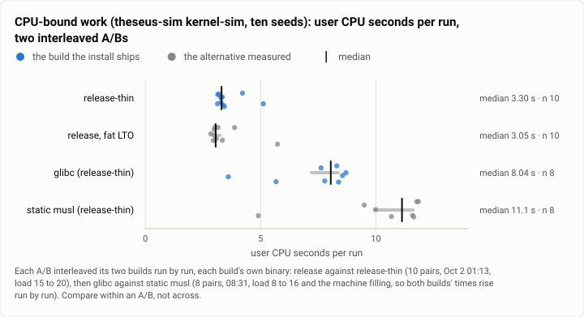
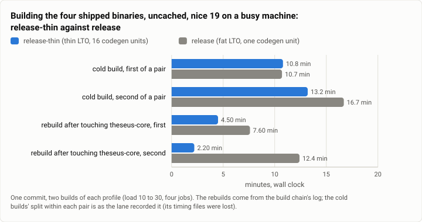
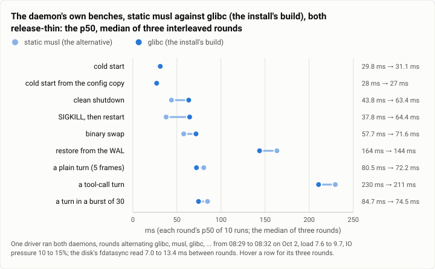
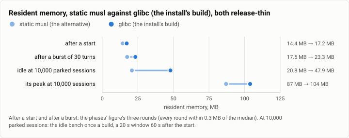

# Gate bench: the install's build profile and libc, measured (2026-10-02)

**The answer first.** Two choices for the build the owner installs were each measured against their alternative, run
for run, on one commit. Thin LTO (`release-thin`) made CPU-bound work about 7% slower (the median ratio of 10
interleaved `kernel-sim` pairs was 1.07; thin was slower in 8 of 10, sign test p = 0.11; the lane's own estimator, the
least run of each, said 10%). It also made `theseusd` 23% bigger (28.8 MB against 23.4, under §9's 60). In exchange
it rebuilt after a change to the core 1.7 and 5.7 times faster (4.5 and 2.2 minutes against 7.6 and 12.4), and an
install rebuilds after every reviewed step. Static musl, against glibc (both `release-thin`), cost `kernel-sim` 28% to
67% more user CPU in every one of 8 pairs (median 38%, p = 0.008) and 3.0 to 4.7 times the system time. It saved 16%
of the resident memory after a start and 25% after a burst of turns, in every round, and more than half on an idle
store of 10,000 sessions (20.8 against 47.9 MB, one run). The daemon's own lifecycle and turn benches could not tell
the CPU costs apart, because a turn is five fsyncs on this disk. So the install ships glibc `release-thin`, a call
that rests on CPU and on installing what was tested. One finding from the time does not hold up on its own numbers:
the lane read musl as starting and stopping 20 to 40% faster. Over its three rounds only the binary swap separated in
all three. The clean stop's median gain is one round's 22 ms, the kill's restart's mostly one round's 45 ms, and the
cold start did not move, though that is where a static binary's missing loader would show first. The new turn, idle and size benches read on
their first release rows: a plain turn 42.4 ms at exactly its 5-frame budget, an idle daemon 8.3 ms of CPU in 30 s
with no frame written, `theseusd` 28.9 MB of its 60. On a store of 10,000 parked sessions the idle daemon never
went quiet (4.5% of a core).

| | |
|---|---|
| Suite | `gate-bench`: `theseus-sim kernel-sim` (CPU-bound), the lifecycle, turn, idle and size benches, on release builds; two A/Bs |
| Arms | four release builds of one commit: `release-thin` (thin LTO, 16 codegen units) against `release` (fat LTO, one unit); then glibc against static musl, both `release-thin` |
| Model | none (the turn bench's stand-in) |
| Runs | `kernel-sim`: 10 interleaved pairs, then 8; the daemon's benches: three interleaved rounds an A/B (10 runs a phase, 10 turns of each kind); idle and size: one run a build; builds: two cold and two incremental a profile |
| Date and commit | 2026-10-02, 00:04 to 08:51 MST, on the bench2 lane's commits before its rebase (on `main`: the profile is `0cd880c`, the measurements `ede2add`); joined `main` at `34be7e2`, 09:42 |
| Cost | nothing in dollars; about 2 h of builds and 30 min of benches on the shared machine |
| Data | `2026-10-02-gate-bench-install-builds.json` |

## The question

A review of the tree (review 2) asked for three things this run measured. S7: an install profile with thin
LTO, expected to be "a little slower" and far quicker to rebuild, with a measurement asked for before it was adopted.
The spec's §3.18, which said both binaries are static musl, while the install recipe built glibc and only CI built
musl. And S4: benches for what runs (what a turn costs, what an idle daemon costs, how big the binaries are). It
mattered because the install is rebuilt after every reviewed step and `main` waits on it, so build time is part of the
loop's speed. And FAST's budgets are judged on debug builds while the owner runs the install. The questions: what does
each build choice cost and buy the daemon the owner runs, and which should the install ship?

## The setup

- **The builds.** Each A/B on one commit, every build from `git archive` into a fresh directory with a fresh target
  and no compile cache (the reproducible-build check's method), at nice 19 with four jobs. `release` is fat LTO and one
  codegen unit; `release-thin` inherits it with thin LTO and 16 codegen units (cargo reserves the name `install`). The
  thin/fat A/B built the four shipped binaries. The glibc/musl A/B built the whole workspace, musl with
  `--target x86_64-unknown-linux-musl` (a static-pie binary, the machine's musl-tools 1.2.2).
- **CPU-bound work:** `theseus-sim kernel-sim --seeds 10 --p-race 0`, the kernel under a virtual clock, deterministic.
  Each build ran its own binary, interleaved A B A B, with user and system CPU from `/usr/bin/time`: 10 pairs for
  thin/fat (01:13), 8 for glibc/musl (08:31). A first, shorter thin/fat pass ran 5 pairs of 6 seeds.
- **The daemon's own benches:** one driver ran both builds' `theseusd`, in three rounds alternating the builds. The
  thin/fat rounds (01:33) ran `bench turn --runs 10` with no burst, and `bench lifecycle --runs 10` for the cold start,
  the start from the config copy and the kill's restart. The glibc/musl rounds (08:29) ran the turn bench with a burst
  of 30 turns and every lifecycle phase. One full run of each thin/fat build (01:23, 01:30; not interleaved) added the
  sizes, every phase, a burst and the idle bench.
- **The idle bench** (`bench idle`): an idle daemon's CPU (every thread's `schedstat`), wakeups, frames written and
  resident memory, over 30 s on an empty store and 20 s on a synthetic store of 10,000 parked sessions, after up to
  60 s for it to go quiet.
- **The first rows:** at 08:27 the lane recorded the glibc `release-thin` build's size, turn and idle results into the
  gate's bench history, the first rows of those kinds.
- **The machine:** one WSL2 VM, 16 vCPUs, shared with the spine's gates and other lanes' builds. The load was 5 to 20
  during the benches and 10 to 30 during the builds. IO pressure was 3 to 4% at 01:33 and 10 to 15% at 08:29.
- **Statistics:** pairs by interleaving. The sign test on pairs (`stats.mcnemar_exact`); the pairs' ratios and
  differences, with the mean difference's bootstrap 95% interval (10,000 resamples, seeded) where there are 8 or more
  pairs; min-max ranges and per-round counts for the three-round benches.

## Results

### CPU-bound work

<picture>
  <source media="(prefers-color-scheme: dark)" srcset="img/2026-10-02-gate-bench-install-builds/kernel-sim-cpu-dark.svg">
  
</picture>

*Figure 1. What does each build choice cost CPU-bound work? Thin LTO about 7% (8 of 10 pairs slower), static musl
28% to 67% (every pair), and the install took the first cost and declined the second.*

| `kernel-sim`, ten seeds, user CPU | `release-thin` against `release` (10 pairs) | static musl against glibc (8 pairs) |
|---|---|---|
| the least run of each | 3.13 s against 2.84 (+10.2%) | 4.90 s against 3.60 (+36.1%) |
| the median of each | 3.305 against 3.05 (+8.4%) | 11.13 against 8.04 (+38.4%) |
| pairs where the second build was slower | 8 of 10 (sign test p = 0.11) | 8 of 8 (p = 0.008) |
| the pairs' ratio, median (range) | 1.07 (0.74 to 1.32) | 1.38 (1.28 to 1.67) |
| the pairs' difference, mean [bootstrap 95%] | +0.15 s [−0.29, +0.52] | +2.91 s [+2.35, +3.37] |
| the quieter middle eight pairs (runs 2 to 9) | +0.22 s [+0.12, +0.33]; 7 of 8 slower (p = 0.07) | |
| system CPU, the median of each | 0.81 s against 0.81 | 11.32 s against 3.10 (3.0 to 4.7 times, pair by pair) |

The first and last thin/fat pairs ran both builds slow (5.73 and 4.21 s, then 3.87 and 5.12 s; the A/B began at a load
of 20), so they dominate the mean. The first, shorter pass (5 pairs of 6 seeds) read thin 18% slower by the least run, 4 of 5 pairs, a
median ratio of 1.11. The glibc/musl runs grew slower through the ten minutes as the machine filled (glibc 3.60 to
8.70 s), but each pair shared its minute, and every pair's ratio sits between 1.28 and 1.67.

### Building

<picture>
  <source media="(prefers-color-scheme: dark)" srcset="img/2026-10-02-gate-bench-install-builds/build-times-dark.svg">
  
</picture>

*Figure 2. What does each profile cost to build, cold and after a change to the core? Cold, the same (10.8 and 10.7
minutes, the first of each pair); after a change to `theseus-core`, `release-thin` rebuilt 1.7 and 5.7 times faster.*

| Wall clock, four shipped binaries | `release-thin` | `release` | `release` / `release-thin` |
|---|---:|---:|---:|
| cold build, the first of a pair | 10 m 47 s | 10 m 44 s | 1.00 |
| cold build, the second (a longer path; `release`'s paused by the spine's gate) | 13 m 11 s | 16 m 41 s | 1.27 |
| CPU a cold build costs, user and system | about 1,600 s | about 1,460 s | 0.91 |
| rebuild after touching `theseus-core`, first | 4 m 30 s | 7 m 37 s | 1.69 |
| rebuild after touching `theseus-core`, second | 2 m 11 s | 12 m 27 s | 5.70 |
| a pair of cold builds, end to end | 24 m 05 s | 27 m 31 s | 1.14 |

The rebuilds and the pairs' end-to-end times are from the build chain's log. The split of each pair and the CPU
seconds are as the lane recorded them: its timing files went with a scratch build directory that the nightly prune
deleted. The lane's "2 to 6 times faster" incrementally is 1.7 and 5.7 here, and the same rebuild of `release` took
7 m 37 s and then 12 m 27 s, so the machine's load sets much of that spread.

### The daemon's own benches

<picture>
  <source media="(prefers-color-scheme: dark)" srcset="img/2026-10-02-gate-bench-install-builds/musl-vs-glibc-phases-dark.svg">
  
</picture>

*Figure 3. Where would a static musl build be faster or slower than the glibc build the install ships? Faster at the
binary swap in all three rounds, at the clean stop and the kill's restart mostly by one round's difference, and no
better at the start, the restore or a turn.*

Each round's p50 (ms), glibc and static musl, rounds alternating, one driver:

| Phase | glibc's three rounds | musl's three rounds | Median, musl and glibc | musl lower in |
|---|---|---|---|---|
| cold start | 24.8, 50.9, 31.1 | 30.0, 29.8, 26.8 | 29.8 and 31.1 | 2 of 3 |
| cold start from the config copy | 26.7, 36.1, 27.0 | 27.7, 30.5, 28.0 | 28.0 and 27.0 | 1 of 3 |
| clean shutdown, a job running | 63.4, 80.2, 46.6 | 41.6, 82.9, 43.8 | 43.8 and 63.4 | 2 of 3 |
| SIGKILL, then restart | 79.6, 64.4, 47.3 | 34.9, 64.5, 37.8 | 37.8 and 64.4 | 2 of 3 |
| binary swap | 125.7, 60.2, 71.6 | 57.0, 57.8, 57.7 | 57.7 and 71.6 | 3 of 3 |
| restore from the WAL | 146.5, 102.6, 143.7 | 163.5, 185.9, 110.0 | 163.5 and 143.7 | 1 of 3 |
| a plain turn (5 frames) | 89.3, 72.2, 70.0 | 83.9, 80.5, 49.5 | 80.5 and 72.2 | 2 of 3 |
| a tool-call turn | 197.3, 214.7, 210.7 | 231.9, 229.7, 137.9 | 229.7 and 210.7 | 1 of 3 |
| a turn in a burst of 30 | 74.5, 94.9, 67.7 | 114.8, 84.7, 82.1 | 84.7 and 74.5 | 1 of 3 |
| the disk's fdatasync probe | 7.9, 13.3, 12.5 | 12.7, 13.4, 7.0 | | |

`release-thin` against `release`, three rounds (p50, ms; the turn bench without a burst):

| Phase | `release`'s rounds | `release-thin`'s rounds | thin lower in |
|---|---|---|---|
| cold start | 29.8, 35.5, 24.5 | 31.6, 32.5, 24.1 | 2 of 3 |
| cold start from the config copy | 36.1, 22.1, 18.6 | 42.7, 34.6, 30.9 | 0 of 3 |
| SIGKILL, then restart | 69.2, 44.5, 41.0 | 62.0, 45.5, 37.6 | 2 of 3 |
| a plain turn (5 frames) | 52.8, 60.6, 46.5 | 79.8, 82.0, 49.6 | 0 of 3 |
| a tool-call turn | 206.6, 211.3, 148.7 | 210.1, 195.6, 216.7 | 1 of 3 |
| the disk's fdatasync probe | 7.3, 9.5, 6.5 | 11.6, 7.3, 6.8 | |

In the single full runs (one each, not interleaved, loads near 9 and 10), thin's plain turn read faster instead (39.6
against 47.3 ms), and its start from the config copy the same (34.3 against 34.7 ms). Frames were 5 in every plain turn
of both A/Bs.

### Memory

<picture>
  <source media="(prefers-color-scheme: dark)" srcset="img/2026-10-02-gate-bench-install-builds/musl-vs-glibc-memory-dark.svg">
  
</picture>

*Figure 4. How much memory would a static musl build save? 2.8 MB (16%) after a start and 5.8 MB (25%) after a burst
of 30 turns, in every round; at 10,000 parked sessions, 27 MB, more than half.*

| Resident memory, MB | glibc | static musl | `release` (fat), one run | `release-thin` (glibc), one run |
|---|---:|---:|---:|---:|
| after a start (three rounds) | 17.2 (17.1 to 17.4) | 14.4 (14.3 to 14.4) | 14.9 | 17.0 |
| after a burst of 30 turns (three rounds) | 23.3 (23.1 to 23.7) | 17.5 (17.5 to 17.6) | 21.3 | 23.2 |
| idle, empty store, 30 s | 17.2 | 14.4 | 14.1 | 17.5 |
| idle at 10,000 parked sessions (its peak) | 47.9 (103.9) | 20.8 (87.0) | 45.9 (99.2) | 65.6 (104.2) |
| CPU of that idle daemon at 10,000 sessions | 4.5% of a core | 7.5% | 7.3% | 4.3% |
| CPU of an idle daemon on an empty store, in 30 s | 8.7 ms | 5.5 ms | 7.5 ms | 7.2 ms |

No idle daemon wrote a frame. The daemon at 10,000 sessions never went quiet: 4.3% to 7.5% of a core in release
builds, 5.8% still at 300 s after its start (`release-thin`), and 31.2% in a debug build.

### Size, linkage and reproducibility

| | `release` | `release-thin`, glibc | static musl (`release-thin`) | §9 budget |
|---|---:|---:|---:|---:|
| `theseusd` | 23.39 MB | 28.84 MB (four binaries), 28.86 (the workspace) | 29.00 MB | 60 MB |
| `theseus` | 2.68 | 3.53 | 3.64 | 60 |
| `theseus-tui` | 2.17 | 2.48 | 2.60 | 60 |
| `theseus-sim` | 3.73 | 4.63 (4.64) | 4.77 | 60 |
| linkage | dynamic; glibc 2.34 or newer | dynamic; glibc 2.34 or newer | static-pie; none | |
| two uncached builds in two directories, byte for byte | identical | identical (four binaries, and the whole workspace) | built once | |

### The new benches' first numbers

| Bench | Build, when | The numbers | Budget |
|---|---|---|---|
| size | `release-thin` glibc, Oct 2 08:27 | `theseusd` 28.86 MB, `theseus` 3.53, `theseus-tui` 2.48, `theseus-sim` 4.64 | 60 MB each (§9) |
| turn | debug, Oct 1 23:34 (the lane's first run, as its report gives it) | plain p50 61.7 ms, p95 87.8, 5 frames; tool-call p50 219.0 ms, p95 373.8, 10 to 12 frames; the disk's fdatasync 7.4 ms | 5 frames, plain |
| turn | `release-thin`, Oct 2 08:28 (the history's first turn row) | plain p50 42.4 ms, p95 67.9, 5 frames; tool-call p50 145.9 ms, p95 526.3 (3.6 times its p50), 11 to 12 frames; 20.2 MB after the start, 25.4 after a burst of 30 | 5 frames, plain |
| idle | `release-thin`, empty store, 30 s | 8.3 ms of CPU (0.028% of a core), 4.5 wakeups a second, 0 frames, 14.2 MB | none |
| idle | debug, 10,000 parked sessions, 20 s from 60 s | 31.2% of a core, never quiet, 0 frames, 71.8 MB (peak 124.4) | none |

## Analysis

**The gate's benches measure the disk, not the CPU.** A plain turn is five fsyncs, and this disk's fdatasync read 6.5
to 13.4 ms between rounds, so about 33 to 67 ms of a 47 to 89 ms turn is the disk. The harness's own CPU in a turn is about
15 ms. A 10% CPU difference is then about 1.5 ms, under what three rounds resolve. Thin's plain turn read 3 to 27 ms
slower in the rounds and 7.7 ms faster in the single runs, which is the machine. The start from the config copy read
slower with thin in all three rounds (by 7 to 13 ms) and the same in the single runs, so that is not called either.
What this teaches FAST: a CPU-bound regression would pass the lifecycle and turn benches and show only in
`kernel-sim`, which the gate does not time. The FAST budgets guard the start, the stop and the syncs, not the code's
CPU cost.

**musl, read again.** Two of musl's effects are solid: the memory (16% and 25% less, every round, to the tenth) and
the CPU cost (every pair, 1.28 to 1.67 times the user time and 3.0 to 4.7 times the system time). The lane read the
lifecycle as a third: "a clean shutdown, a SIGKILL restart, and a swap are 20 to 40% quicker by the median (a static
binary has no dynamic loader to run, the likely reason)". On its own rounds, only the swap separates: musl's three
rounds agree to 0.8 ms (57.0 to 57.8) while glibc's spread from 60.2 to 125.7. The clean stop's 20 ms is one glibc
round (63.4 against 41.6; the other two differ by 3 ms either way). The kill's 27 ms is mostly one round too: 79.6
against 34.9, then 64.4 against 64.5, then 47.3 against 37.8. The loader explanation does not fit either. A static binary saves its dynamic loading at
exec, so the cold start would show it first, and the cold start did not move (31.1 against 29.8 ms; musl slower in
round 1). If musl's stop side is faster, the reason is elsewhere, perhaps in how the allocator returns memory at
exit. Three rounds on a machine at load 8 to 10 cannot say.

**The decision held, for the reasons that held.** The install ships glibc `release-thin`. The lane's reasons, in its
order: what is installed is what was tested (the gate, the join's benches and the live checks run glibc builds);
musl's CPU cost lands on the work that grows (allocation-heavy indexing, and a busy idle daemon at 10,000 sessions:
7.5% of a core against 4.5%); and static portability buys nothing on the machine that built it. None of them rests on
the lifecycle phases, so the weaker stop-side reading changes nothing. Two follow-ups were filed and are still open: a
global allocator for the musl build, then this comparison rerun (theseus-w6hg), and a musl build run through the
benches somewhere that recurs (theseus-3yu1).

**What changed since.** `scripts/build.sh` builds the five shipped binaries by default since Oct 3 (theseus-o8nk, a
cold build 18% less CPU), and the gate checks that this gives no shipped crate fewer features than the tests built.
The voice crate, and with it the TLS root setting a whole-workspace build used to add, left the workspace the same
day. The idle daemon at 10,000 sessions was fixed by the perf1 lane the same morning: 5.05% of a core to 0.10%
([the start path at 10,000 sessions](2026-10-02-gate-bench-start-path-10k.md)). The turn bench joined the gate
with this lane. In FAST's week a plain turn kept its 5 frames (one gate's 6 was the bench's own bug), and a
tool-call turn got a budget of 9 on Oct 3
([FAST's history](2026-10-06-gate-bench-fast-history.md)). The history's very first release turn row already had a
lone slow run (a tool-call turn's p95 3.6 times its p50), the pattern that report counts on `main`.

## Threats to validity

- **A busy, shared machine.** Loads of 5 to 20 and IO pressure up to 15% during the benches. Interleaving pairs each
  run with its neighbour's minute, which protects the ratios, not the absolute times. The two `kernel-sim` A/Bs ran
  at different loads and cannot be compared with each other.
- **Small n.** Three rounds a phase; one idle run and one size run a build; two builds of each profile. The CPU
  verdicts have 10 and 8 pairs. The thin/fat one is not significant by a sign test at the 5% level (p = 0.11), and
  its interval of the mean includes zero; the middle eight pairs' does not.
- **Lost files.** The cold builds' split and their CPU seconds are the lane's recorded numbers: the timing files were
  deleted with a scratch build directory. The lane's first debug turn and idle numbers are as its report gives them.
- **One CPU-bound workload.** `kernel-sim` is allocation-heavy, so it may overstate musl's cost for other work. No
  profile was taken to say where musl's time goes.
- **Not tested.** Name resolution and TLS through musl's resolver (a build session has no network), and
  reproducibility across machines and users (two directories on one machine cannot show that).
- **The driver.** The thin/fat rounds used the debug `theseus-sim` to drive both daemons; the glibc/musl rounds used
  the glibc build's. Each A/B used one driver for both arms.

## What it cost

Nothing in dollars: no model was called. The machine's time: the first build chain ran 1 h 31 min (00:03 to 01:34:
two pairs of cold builds, four rebuilds, a whole-workspace build and a musl build), the second 33 min (a musl build
and a pair of glibc builds), and the benches about 30 minutes, all at nice 19 or between other lanes' work.

## Reproduction

From the repo, on one commit:

```
scripts/build.sh --profile release-thin                                     # the install's build (glibc)
scripts/build.sh --profile release-thin --target x86_64-unknown-linux-musl  # static musl
scripts/build.sh --profile release                                          # fat LTO
scripts/repro.sh --profile release-thin                                     # two uncached builds, compared byte for byte

# CPU-bound, interleaved, each build's own theseus-sim:
for i in $(seq 1 10); do for b in A B; do
  /usr/bin/time -f "$b run $i: %U user %S sys %e wall" "$b/theseus-sim" kernel-sim --seeds 10 --p-race 0 >/dev/null
done; done

# the daemon's benches, one driver for both builds, rounds alternating A B A B A B:
theseus-sim bench turn --theseusd "$b/theseusd" --runs 10 --burst 30
theseus-sim bench lifecycle --theseusd "$b/theseusd" --runs 10
theseus-sim bench idle --theseusd "$b/theseusd" --seconds 30
theseus-sim bench idle --theseusd "$b/theseusd" --seconds 20 --sessions 10000
theseus-sim bench size --dir "$b"
```

Today `scripts/build.sh` builds the five shipped binaries by default; at the time it built the four shipped binaries
(the thin/fat A/B) or the whole workspace (the glibc/musl A/B). The lane's drivers, build chains and logs are kept on
the build machine, not published; every number here was recomputed from its measurement files by this report's
extraction script, and matches the lane's report except where said.

## Data

`2026-10-02-gate-bench-install-builds.json`: every `kernel-sim` run of both A/Bs and the first pass, with the pairs'
statistics; every round of the daemon's benches for both A/Bs (each phase's p50 and p95, the turns, the fdatasync
probe, the load and IO pressure) and the per-round comparisons; the single full runs; the idle and size results; the
build chains' step times and the recorded cold builds; the first rows recorded into the bench history; and the four
figures' specs.
