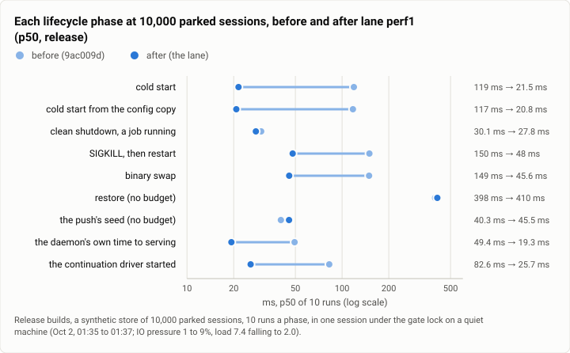

# Gate bench: the start path at 10,000 parked sessions, before and after the perf1 lane (2026-10-02)

**The answer first.** On a store of 10,000 parked sessions, release builds, the perf1 lane cut a cold start's p50
from 119.1 to 21.5 ms (to 18% of what it took), the start from the config copy from 117.4 to 20.8 ms, a SIGKILL's
restart from 149.9 to 48.0 ms and a binary swap from 149.2 to 45.6 ms; in each of the four, the slowest of the lane's
ten runs was faster than the fastest of the baseline's (exact Mann-Whitney, two-sided p = 0.00001 each). The daemon's
own clock agrees: serving 49.4 to 19.3 ms after the process began, the kernel's part 35.8 to 7.6 ms. An idle daemon
on that store went from 5.05% of a core to 0.10%, and 50 turns in flight at once peaked at 104 MB of resident memory
against 230 MB. Two phases did not improve: a restore (397.6 against 410.5 ms) and the push's seed (40.3 against 45.5
ms, a read moved off the start path, as FAST asks). Every phase now sits far inside §9's budgets at that size (250 ms
for a cold start, 350 for a kill's restart, 200 for a swap).

| | |
|---|---|
| Suite | `gate-bench`: `theseus-sim bench lifecycle --runs 10 --sessions 10000`, plus the lane's idle, memory and health probes |
| Arms | before: `main` at `9ac009d`; after: the perf1 lane (its third batch of builds; joined `main` as `4ea47e1`) |
| Model | none (the memory probe's 50 turns use the stand-in) |
| Runs | 10 runs a phase an arm; idle: one 20 s window each after a 60 s settle; memory: 50 turns at once, once each |
| Date and commit | 2026-10-02, 01:35 to 01:37 (the bench) and 08:05 to 08:07 (idle), MST; joined at 08:34 as `4ea47e1` |
| Cost | nothing in dollars |
| Data | `2026-10-02-gate-bench-start-path-10k.json` |

## The question

§9's cold-start budget grows with the store: under 50 ms at today's sizes and under 250 ms at 10,000 sessions. The
gate only ever benches an empty store, so nothing checked the larger end. Review 2 suspected that the start path read
history that grows with use (every execution, every action) before it served. The lane (theseus-cvd0, with nine items:
lv2, 2qt, 0dq, 02k, 26r, hanu, byu, u6xg and ndw) asked: at 10,000 parked sessions, where does a start's time go, does
it fit the budget, and what does an idle daemon cost on that store?

## The setup

- **The store:** a synthetic store of 10,000 parked sessions (`theseus-sim synth-store`), the same store for both
  arms, each run starting from it.
- **Builds:** release builds of `9ac009d` and the lane (its tree at `5f0762e`, batch 3), the same profile.
- **The bench:** `theseus-sim bench lifecycle --runs 10 --sessions 10000` with each build, in one session under the
  gate lock on a quiet machine (the account's usage limit had stopped every other agent: IO pressure 1 to 9%, CPU 0%,
  load 7.4 falling to 2.0 on 16 cores).
- **Idle:** each build serving its own 10,000-session store, no turns, Discord and the web UI off; after the first
  answer, a 60 s settle, then CPU time across a 20 s window, every thread.
- **Memory:** the lane's build on a store it wrote, 10,000 parked sessions, 50 turns in flight at once against the
  stand-in model.
- **The machine:** one WSL2 VM, 16 vCPUs.

## Results

<picture>
  <source media="(prefers-color-scheme: dark)" srcset="img/2026-10-02-gate-bench-start-path-10k/start-path-at-10k-dark.svg">
  
</picture>

*Figure 1. What did the perf1 lane change on a store of 10,000 parked sessions? Every start-side number fell to a
fifth or a third of what it was; the stop, the restore and the seed did not move, or moved the other way.*

| Phase | Before p50 / p95 (range of 10) | After p50 / p95 (range of 10) | After / before | §9 budget at 10,000 sessions |
|---|---|---|---:|---:|
| cold start to the first answer | 119.1 / 124.7 (116.6 to 124.7) | 21.5 / 32.8 (20.8 to 32.8) | 0.18 | 250 |
| cold start from the config copy | 117.4 / 123.0 (113.4 to 123.0) | 20.8 / 23.1 (20.5 to 23.1) | 0.18 | 250 |
| clean shutdown, a job running | 30.1 / 48.3 (23.8 to 48.3) | 27.8 / 33.6 (26.5 to 33.6) | 0.92 | 100 |
| SIGKILL, then restart | 149.9 / 153.2 (139.8 to 153.2) | 48.0 / 89.2 (46.9 to 89.2) | 0.32 | 350 |
| binary swap | 149.2 / 171.0 (142.8 to 171.0) | 45.6 / 47.5 (44.6 to 47.5) | 0.31 | 200 |
| restore from a local WAL | 397.6 / 608.4 (361.1 to 608.4) | 410.5 / 962.7 (402.8 to 962.7) | 1.03 | none |
| the push's seed | 40.3 / 45.6 (37.3 to 45.6) | 45.5 / 49.2 (41.4 to 49.2) | 1.13 | none |

ms, release. For the cold starts, the kill and the swap the two arms' ten samples do not overlap: the exact two-sided
Mann-Whitney p is 2 / C(20, 10) = 0.00001.

| The daemon's own clock (p50 over 51 starts) | Before | After |
|---|---:|---:|
| serving, ms after the process began | 49.4 | 19.3 |
| the kernel's part of the start | 35.8 | 7.6 |
| the continuation driver started, ms after the process began | 82.6 | 25.7 |

| An idle daemon at 10,000 sessions | Before | After |
|---|---:|---:|
| CPU in a 20 s window, after a 60 s settle | 1,010 ms | 20 ms |
| share of one core | 5.05% | 0.10% |
| context switches a second | 4.9 | 4.8 |
| first answer after the start (the idle probe's own start) | 341.8 ms | 180.4 ms |

| Memory, 10,000 parked sessions | Before | After |
|---|---:|---:|
| idle resident memory | 62 MB | 16.3 MB |
| 50 turns in flight at once, the peak (VmHWM) | 230.5 MB | 104.1 MB (103.0 in a second run) |

## Analysis

**The start read history; now it does not.** The before build's kernel spent 27 ms of its 36 ms start in one step that
read every execution, and its first health answer read every record; the lane reads only the queued executions and
those a due time may wake, and builds what health needs after serving. That is the FAST rule as written in the repo's
`AGENTS.md` ("nothing before the socket answers waits on ... work that grows with history"), and at 10,000 sessions
it is the difference between a cold start at half its budget and one at a twelfth. The kill's restart and the swap
fell for the same reason: each is a start.

**The idle number is the bigger story for a daemon that runs all day.** The before build's driver decoded every open
execution, all 10,000 parked ones, twice a second, and every health answer read every execution, action and session:
5% of a core doing nothing. The lane's wakes are as frequent (4.8 a second) and do almost no work, a fiftieth of the
CPU. The bench2 lane had found it the night before, on another commit: 4.5% to 7.5% of a core 60 s after a start,
and 5.8% after 300 s, with no frames written.

**What did not move, and why.** A restore is dominated by the open (397 ms of a 514 ms wall, in the lane's 30-run
probe), which reads the whole WAL; nothing in the lane touched it. The seed's first read is about 5 ms slower because
the start no longer reads every execution before serving, so the seed's first read pays for warming the store's
caches, after serving; read after an `execution.list`, the lane's seed is no slower (36.7 against 37.8 ms). That is
the move FAST asks for, not a regression. A clean stop was already a chain of syncs, not of reads (27.8 against 30.1
ms), and the lane's change to it (a stop pays one commit's syncs, not two) shows in the gate's empty-store bench
rather than here: FAST's history report measures it as −11 ms at the join.

**What changed since the last comparable run.** There was no earlier 10,000-session bench of record. The lane's own
first pass (01:22, beside its own release build compiling) read both arms slower and the same way round: a cold start
of 177.5 ms before and 84.6 after, a swap of 238.5 and 81.5; its baseline run alone an hour earlier read a cold start
of 126.0 ms. The pass above, on a quiet machine, is the lane's run of record. In the gate's own empty-store bench, this
lane's join moved the clean shutdown's p50 from 42.9 to 31.6 ms (FAST's history report).

## Threats to validity

- **One run of ten an arm**, on one synthetic store, on a quiet machine. The start-side effects are four- to
  six-fold with no overlap; the stop, restore and seed differences are within what one run of ten can show (the lane's
  restore p95 of 962.7 ms is one stall in ten, and none came in its 30-run probe).
- **A synthetic store.** 10,000 parked sessions with little history each; a real store's history (ledger rows, nodes)
  is measured in the ledger-reads report.
- **Release builds**, unlike the gate's debug bench; the lane's own debug run of the gate's bench on the empty store
  passed with the cold start at 20.0 ms p50, `main`'s number.
- **The memory peak depends on glibc's arenas** and on what the harness's own listing left behind (the lane's notes:
  a 5.4 MB `session.list` answer takes the daemon to about 100 MB, and the allocator keeps it).

## What it cost

Nothing in dollars. The bench took under two minutes under the gate lock; the lane's builds (two release builds and
its debug builds) ran in its own target.

## Reproduction

```
theseus-sim synth-store --dir <store> --sessions 10000
target/release/theseus-sim bench lifecycle --theseusd target/release/theseusd --runs 10 --sessions 10000 --json <out>.json
target/release/theseus-sim bench idle --sessions 10000        # the repo's idle bench; the lane used its own probe
```

The lane's per-run reports (every sample), its idle and memory probes' reports and its logs are kept on the build
machine, not published; the numbers here were recomputed from them and match the lane's report.

## Data

`2026-10-02-gate-bench-start-path-10k.json`: per phase, both arms' p50, p95 and range of ten samples, the ratio and
the exact test where the samples separate; the daemon's own clock; the idle CPU; the memory peaks; the figure's spec.
