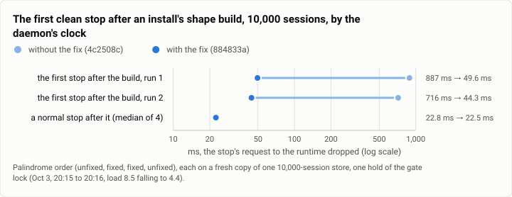
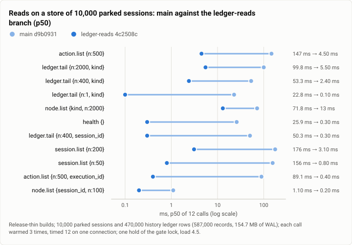

# Gate bench: the ledger-reads branch, its slow stop that was the disk, its first stop that was not, and its reads at 10,000 sessions (2026-10-03)

**The answer first.** A branch that serves the polled reads through the ledger's index failed its join gate twice in
the clean-shutdown phase (p50 88.0 and 70.8 ms against the usual 31 to 35), and its lane found the branch was not the
cause: in A/Bs with frozen builds in one hold of the gate lock, `main` and the branch stopped alike (the median of the
runs' shutdown p50s 45.8 ms for `main` and 39.6 for the branch, 8 runs each, at loads from 6 to 34), and the failing
gate's own startup frame, one fdatasync, had taken 13.7 to 15.5 ms at a load near 10, a time the A/Bs saw only at
loads of 17 to 34 (11.3 to 15.0 ms) and never in their quieter rounds (7.4 to 10.3 ms). A planted IO load reproduced
the misses in `main`. The one stop the branch did slow was found on the way: the
first stop after an install's shape build on a 10,000-session store took 716 and 887 ms by the daemon's clock
(redb's close writing the build's 200 MB of pages), and the fix, a durable checkpoint at the build's end, made it 44
and 50 ms. The branch's reads held at 10,000 sessions: `action.list` 146.9 to 4.5 ms, a filtered `ledger.tail` 99.8
to 5.5 ms, `health` 25.9 to 0.3 ms, every call 5.5 to 228 times faster at the p50, and the daemon's peak memory 353
to 92 MB.

| | |
|---|---|
| Suite | `gate-bench`: the lifecycle bench (A/B), a first-stop A/B and a reads bench, each the lane's harness around `theseus-sim` |
| Arms | `main` (`1abf099` for the stop A/Bs, `d9b0931` for the reads), the branch as merged (`50b5922`, and the join's `d3b5793`), and the fix (`884833a`) |
| Model | none |
| Runs | stop A/Bs: 24 bench runs in four A/Bs (palindrome order); first stop: 2 runs an arm on fresh copies of one store; reads: 11 calls × 12 timed calls an arm |
| Date and commit | 2026-10-03, 18:21 to 20:16 MST; the branch and its fix joined `main` at `fe371af` (21:49) |
| Cost | nothing in dollars |
| Data | `2026-10-03-gate-bench-ledger-reads.json` |

## The question

The branch (theseus-vm3n.5 and two more) moves `ledger.tail` and the polled lists onto the index, so they no longer
read history that grows. Its join gate at 17:21 missed the clean-shutdown budget on both runs and the join was parked.
Was a clean stop slower with the branch, and if so, why? And did its read speed-ups, measured in a cloud session on a
synthetic store, hold on this machine?

## The setup

- **Frozen builds.** Each arm's `theseus-sim`, `theseusd` and `theseus-index` copied out of its target, so no build
  could change them mid-run; debug builds for the gate's bench, release-thin builds for the 10,000-session runs.
- **The stop A/Bs:** `theseus-sim bench lifecycle --runs 10` (every phase, so the store had the gate's own history
  by the shutdown phase), in one hold of the gate lock per A/B, palindrome order, `sync` before each run, the daemon's
  stop phases logged. ab2 (18:26, load 17 to 12), ab3 (18:35, load 17 to 34, a warm-up run first), ab4 (18:52, a quiet
  window: load 8 to 6, IO pressure 5 to 8%, with the join's own commit as a third arm) and ab5io (19:11, a background
  writer of 4 MB chunks, each fdatasynced, beside every run; load 56 to 68).
- **The first stop after a build:** a store of 10,000 parked sessions and 470,000 history ledger rows (587,000
  records, 154.7 MB of WAL), whose index a `main` build had replayed; each arm on a fresh copy: the first start, the
  shape build (4.3 to 5.2 s), the first stop after it, two normal stops; palindrome order, one lock hold (20:15 to
  20:16, load 8.5 falling to 4.4). Stops are read by the daemon's own clock (the stop's request to the runtime
  dropped): the harness's wall clock quantizes stops to its process wait's ticks (it read 31.6, 31.7 or 63.7 ms for
  every normal stop).
- **The reads:** the same store, release-thin builds of `main` and the branch, each serving it in turn; 11 calls,
  each warmed 3 times and timed 12 on one connection; one lock hold (19:32, load 4.5).
- **The machine:** one WSL2 VM, 16 vCPUs, busy with other lanes most of the evening.

## Results

### The clean stop: the same in both builds

| A/B | Arm and round | Load | IO pressure | Clean shutdown p50 (p95), ms | The startup frame's fdatasync, p50 ms |
|---|---|---:|---:|---|---:|
| ab2 | main, 1 | 17.4 | 6% | 73.2 (121.6) | 10.3 |
| ab2 | branch, 1 / 2 | 16.8 / 13.9 | 6 / 7% | 35.7 (45.7) / 31.5 (62.8) | 8.3 / 7.8 |
| ab2 | main, 2 | 12.2 | 7% | 32.9 (39.6) | 7.9 |
| ab3 | main, 4 rounds | 17.6 to 34.2 | 0 to 4% | 40.3, 63.3, 47.8, 49.3 | 12.7 to 14.5 |
| ab3 | branch, 4 rounds | 17.3 to 31.6 | 2 to 4% | 43.5, 45.9, 49.2, 55.1 | 11.3 to 15.0 |
| ab4 | main, 1 / 2 | 8.3 / 6.0 | 8 / 5% | 32.1 (36.3) / 43.8 (224.5, a miss) | 7.6 / 10.1 |
| ab4 | the join's commit, 1 / 2 | 7.4 / 6.3 | 7 / 6% | 33.9 (44.8) / 35.8 (43.0) | 7.4 / 7.9 |
| ab4 | branch, 1 / 2 | 6.9 / 6.5 | 5% | 30.8 (85.8) / 33.7 (42.7) | 8.1 / 8.0 |
| ab5io, planted IO | main, 1 / 2 | 68.5 / 56.2 | 2 / 12% | 59.5 (102.4) / 51.2 (81.7) | 17.5 / 17.1 |
| ab5io, planted IO | branch, 1 / 2 | 67.0 / 66.6 | 3 / 11% | 62.7 (79.6) / 76.5 (441.9, a miss) | 16.6 / 17.1 |

Over ab2 to ab4, the median of the runs' shutdown p50s was 45.8 ms for `main` (8 runs, 32.1 to 73.2), 39.6 for the
branch (8 runs, 30.8 to 55.1) and 34.8 for the join's commit (2 runs). `main` missed in the quiet window (ab4, p95
224.5 ms). The failing join gate itself measured the startup frame at 13.7 to 15.5 ms p50 at loads of 10.9 and 8.2,
with IO pressure at 7 to 9% (settle had waited 85 s for it to fall under 10%); the A/Bs read that frame at 7.4 to 10.3
ms in their quieter rounds and 11.3 to 15.0 ms only at loads of 17 to 34. With the planted writer the frame reads 16.6
to 17.5 ms, and both builds stop in 51 to 77 ms at the p50, as the gate did.

### The first stop after a build

<picture>
  <source media="(prefers-color-scheme: dark)" srcset="img/2026-10-03-gate-bench-ledger-reads/first-stop-after-build-dark.svg">
  
</picture>

*Figure 1. Did the fix take redb's write-back out of the first stop after a build? Yes: 887 and 716 ms became 50 and
44 ms; the normal stops after were 22 ms in both.*

| | Without the fix (runs 0 and 3) | With the fix (runs 1 and 2) |
|---|---|---|
| the shape build, ms | 4,282, 4,787 | 5,156, 5,076 (its own durable checkpoint included) |
| the first stop after the build, to the runtime dropped, ms | 887.4, 716.3 | 49.6, 44.3 |
| of it, redb's close, ms | 879.3, 702.1 | 39.6, 36.2 |
| normal stops after (4 each), to the runtime dropped, ms | 23.4, 43.5, 22.3, 22.1 | 22.5, 22.6, 27.8, 22.0 |

The fix moves the cost, it does not remove it: the build's own checkpoint (0.6 to 0.8 s at this size, on the blocking
pool, after serving) holds the store's append path once per build. A stop in the middle of a build is unchanged (it
took 615.4 ms; a gap filed as theseus-4ur7).

### The reads at 10,000 sessions

<picture>
  <source media="(prefers-color-scheme: dark)" srcset="img/2026-10-03-gate-bench-ledger-reads/reads-at-10k-dark.svg">
  
</picture>

*Figure 2. How much faster are the polled reads through the ledger's index, at 10,000 sessions? 5.5 to 228 times at
the p50; nine of eleven calls answer in under 6 ms.*

| Call | main p50 / p95 | branch p50 / p95 | p50 ratio | Answer, main / branch |
|---|---|---|---:|---|
| `action.list {n:500}` | 146.9 / 156.2 | 4.5 / 5.5 | 33× | 165.5 KB |
| `ledger.tail {n:2000, kind}` | 99.8 / 109.5 | 5.5 / 6.3 | 18× | 178.8 KB |
| `ledger.tail {n:400, kind}` | 53.3 / 58.2 | 2.4 / 3.4 | 22× | 71.5 KB |
| `ledger.tail {n:1, kind}` | 22.8 / 25.2 | 0.1 / 0.1 | 228× | 0.2 KB |
| `node.list {kind, n:2000}` | 71.8 / 84.6 | 13.0 / 15.8 | 5.5× | 771.5 KB |
| `health {}` | 25.9 / 28.5 | 0.3 / 0.6 | 86× | 7.0 / 6.5 KB |
| `ledger.tail {n:400, session_id}` | 50.3 / 52.3 | 0.3 / 0.4 | 168× | 0.4 / 9.2 KB |
| `session.list {n:200}` | 176.2 / 203.0 | 3.1 / 4.9 | 57× | 5,428.7 / 108.7 KB |
| `session.list {n:50}` | 155.5 / 184.3 | 0.8 / 0.9 | 194× | 5,428.7 / 27.2 KB |
| `action.list {n:500, execution_id}` | 89.1 / 98.5 | 0.4 / 0.6 | 223× | 16.0 KB |
| `node.list {session_id, n:100}` | 1.1 / 2.7 | 0.2 / 0.2 | 5.5× | 1.4 KB |
| the daemon's peak resident memory | 353.5 MB | 91.6 MB | | |

ms, 12 timed calls each. Ratios under 0.1 ms are coarse (the log rounds to 0.1 ms).

## Analysis

**A stop is a chain of syncs, so it doubles with them.** The daemon's own stop phases were the same in both builds:
the stop's row and checkpoint end at 16 to 19 ms (the stopping frame's fdatasync), redb's close takes 16 to 17 ms, and
the runtime drops at 31 to 35. Twice the sync time puts a stop at 60 to 75 ms with a tail past 100, which is exactly
what the failing gate read. Under strace the branch's close wrote about 16 KB more (four pages) in the same four
fdatasyncs: a few pages, no new sync. The gate's own startup frame, one fdatasync, is the cheapest witness of the
disk's state: it read twice its quiet time in the failing gate, at a load where the A/Bs' arms read it quiet. (The
lane's report put the A/Bs' frame at 7.4 to 9.5 ms in every arm; re-read from its logs, the busy ab3 rounds read
11.3 to 15.0 ms, in both arms alike, which strengthens the point that the frame tracks the disk, not the branch.)

**The lesson for the gate**, which FAST's history report draws over the whole week: a miss whose own run shows the
startup frame near 15 ms instead of 8 is the disk, and the next quiet window's rerun decides it. A shared machine
makes a single gate's reading the machine's minute; an A/B in one lock hold, frozen builds, palindrome order, is what
tells a branch from its neighbours.

**The first stop after a build is the one a person would feel**, because it is the stop after an install: 0.7 to 0.9 s
of redb writing back a 200 MB build. Moving that write into the build's own checkpoint, after serving, took it out of
the stop without touching the bench's numbers (the gate's empty store never builds a shape).

**The reads stopped growing with history.** The calls that read the newest rows (`ledger.tail` by kind, `action.list`,
the session lists) were 50 to 180 ms on `main` at 10,000 sessions; through the index they are 0.1 to 5.5 ms. One
answer is larger on the branch and more correct: `ledger.tail {n:400, session_id}` on `main` reads the newest 20,000
rows and filters them, so an older session gets a short answer (0.4 KB); the index answers that session's newest 400
rows wherever they are (9.2 KB). An aside, one sample each: the 10,000-session store's cold start was 72.4 ms on
`main` (past the gate's 57 ms limit for an empty store) and 18.1 ms on the branch.

**What changed since the last comparable run.** The cloud session's own measurements (a different machine, release
builds) read `action.list` 165 to 3.8 ms and `health` 46 to 0.5 ms; here, 146.9 to 4.5 and 25.9 to 0.3. Every call
but one agrees with the cloud's within about 1.4 ms on the branch; the exception is `node.list {kind}`, which matched
nothing in the cloud's store and 2,000 nodes here.

## Threats to validity

- **Busy windows.** ab3 ran at load 17 to 34 and ab5io at 56 to 68; the arms rose and fell together, but the p50 of 10
  stops swings by ±15 ms between runs of one build under that load. ab4 is the quiet A/B and the one to trust.
- **Two runs an arm for the first stop**, on one store. The effect is fifteen-fold and both runs agree; the size of the
  build's own checkpoint (0.6 to 0.8 s) depends on this disk.
- **The reads are one store, one connection, 12 calls a measure;** the p95 of 12 is the 12th. The answers differ in
  size for three calls (above), so those ratios compare different work.
- **Synthetic history.** The 10,000 sessions and 470,000 rows were written by a synthesizer, not by use.

## What it cost

Nothing in dollars. The A/Bs held the gate lock for a few minutes each (about 15 minutes in all), and the lane ran
from 18:01 to 20:33 with a six-minute stop when the account's spend limit was hit (no run was affected).

## Reproduction

```
theseus-sim synth-store --dir <store> --sessions 10000 --ledger-rows 470000      # the synthetic store
# the stop A/B: frozen builds, one lock hold, palindrome order
<arm>/theseus-sim bench lifecycle --theseusd <arm>/theseusd --runs 10        # with THESEUS_LOG=...startup=debug
# the reads: each build serves a copy of the store; each call warmed 3 times and timed 12 on one connection
```

The lane's harness (its A/B script, its first-stop driver and its reads client) and every log are kept on the build
machine, not published; the numbers here were recomputed from those logs and match the lane's report.

## Data

`2026-10-03-gate-bench-ledger-reads.json`: every stop A/B run (arm, round, load, IO pressure, the phases' p50 and
p95, the startup frame's fdatasync), the first-stop runs (the build, the first stop, its close, the normal stops),
the reads table for both builds with the answers' sizes, the peak memory, and both figures' specs.
