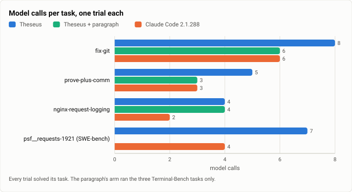
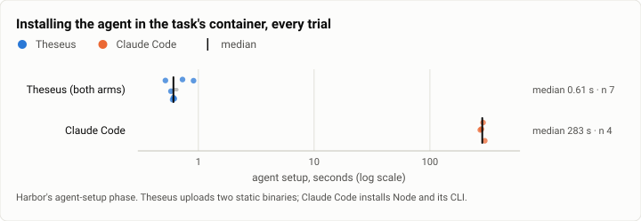
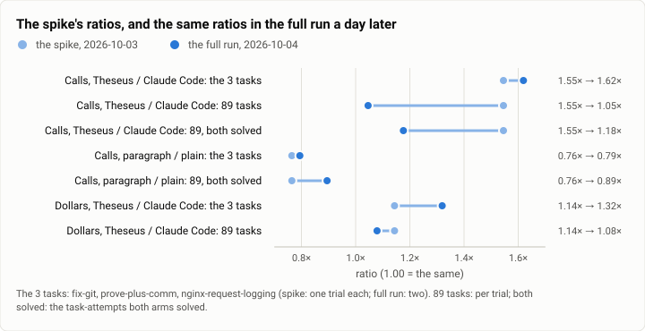

# Harbor: can Theseus run public benchmarks at all? The worth spike (2026-10-03)

**The answer first.** Yes. Through Harbor 0.23, with a 193-line adapter, two static binaries and a 70-line secrets
change, Theseus solved three Terminal-Bench 2.0 tasks and one SWE-bench Verified task, as Claude Code 2.1.288 did
with the same model (Claude Sonnet 5.5): 11 of 11 trials, $0.42 in all. Four tasks prove that it runs, not how well:
4 of 4 gives a 95% interval of 51% to 100%. The spike's real finding was a call-count gap: Theseus made 17 model
calls on the three Terminal-Bench tasks to Claude Code's 11 (1.55 times), with its own work only 1.3% to 4.6% of a
turn, so the gap was the model's way of working under Theseus's prompt and tools. One paragraph of system text cut it
to 13. A day later the full run reproduced those per-task counts almost exactly (5.67 calls a trial on the same three
tasks, both days) but showed the generalisation was wrong: over all 89 tasks Theseus made only 1.05 times Claude
Code's calls, and it lost 9.6 points of success to failures that easy tasks never trigger.

| | |
|---|---|
| Suite | Harbor samples: Terminal-Bench 2.0 (`fix-git`, `prove-plus-comm`, `nginx-request-logging`) and SWE-bench Verified (`psf__requests-1921`) |
| Arms | Theseus (a bench config) · Theseus + one batching paragraph (the three Terminal-Bench tasks) · Claude Code 2.1.288, Harbor's own adapter |
| Model | Claude Sonnet 5.5 (`anthropic/claude-sonnet-5-5`) in every arm |
| Tasks × attempts | 4 tasks × 1 attempt (the paragraph: 3 × 1): 11 trials |
| Date and commit | 2026-10-03 15:46 to 16:17 (UTC−7); Theseus at `dc3387f` with the spike's secrets change (`60dfb45`) |
| Cost | $0.42 (Theseus $0.277 over 7 trials, Claude Code $0.140 over 4) |
| Data | [`2026-10-03-harbor-worth-spike.json`](2026-10-03-harbor-worth-spike.json), [`.csv`](2026-10-03-harbor-worth-spike.csv) (one row per trial) |

## The question

Could Theseus be measured on public benchmarks at all, and if so, what would it take? Before this spike nothing
benchmark-shaped existed: no headless exit codes, secrets only from a vault, no Harbor adapter, no static build for a
task's container. The spike had to answer whether the plumbing was hours or weeks, and give a first, rough look at
Theseus beside Claude Code on the same tasks, so the first full run could be sized and its arms chosen.

## The setup

- **Theseus:** a Harbor agent written for the spike (`theseus_agent.py`, 193 lines, outside the repository then;
  its cleaned-up successor is `bench/harbor/theseus_agent.py`). Its install uploads static musl builds of `theseus`
  and `theseusd`; its run writes a bench config (no vault, the model's key from the environment, every tool open,
  roots at `/`, L0, the output capped at 32,000 tokens a call, a command allowed to hold the turn for 900 s, 200
  loops, $2.00 a session) and runs one `theseus --spawn theseusd --json ask -`.
- **Theseus + paragraph:** the same, with one paragraph of system text asking the model to work alone and to put
  related shell steps into one script per call (quoted in the
  [first full run's report](2026-10-04-terminal-bench-first-full-run.md), where it was arm B).
- **Claude Code 2.1.288:** Harbor's own adapter (`-a claude-code`) with Harbor's defaults: no budget or turn cap.
- **Model:** Claude Sonnet 5.5 for all three.
- **Tasks:** two of Terminal-Bench 2.0's four easy tasks (`fix-git`, `prove-plus-comm`), one medium task that starts
  a daemon (`nginx-request-logging`, to test that a background server outlives its call), and one easy SWE-bench
  Verified instance. One attempt each. The paragraph's arm ran the three Terminal-Bench tasks.
- **Harness:** Harbor 0.23.0, the tasks from local copies (`-p`), one trial at a time.
- **Machine:** one WSL2 VM, 16 vCPUs, Docker, shared with five compiling lanes at the time.
- **When:** 2026-10-03, 15:46 to 16:17 (UTC−7). **Commit:** `dc3387f` with the spike's `env:` and `file:` secret
  sources (`60dfb45`, merged into the repository later that day).

AgentDojo was read, not run: it needed MCP tools inside a turn, which Theseus did not have then. The spike also
probed six language servers for a later LSP feature; those numbers measure the servers, not Theseus, and are not
reported here.

## Results

| Arm | Solved (Wilson 95%) | Model calls, 3 Terminal-Bench tasks | Agent time, 3 tasks | Dollars, 3 tasks | Model calls, all | Dollars, all | Install per trial | Read from the cache |
|---|---|---|---|---|---|---|---|---|
| Theseus | 4/4 (51.0% to 100%) | 17 | 63.1 s | $0.121 | 24 | $0.167 | 0.52 to 0.91 s | 70.4% to 83.8% |
| Theseus + paragraph | 3/3 (43.9% to 100%) | 13 | 47.8 s | $0.110 | 13 | $0.110 | 0.58 to 0.62 s | 64.6% to 78.6% |
| Claude Code | 4/4 (51.0% to 100%) | 11 | 37.9 s | $0.106 | 15 | $0.140 | 273 to 298 s | 80.5% to 92.6% |

All 11 trials solved their task, so success says nothing that separates the arms: with 4 of 4, the 95% interval runs
from 51% to 100%.

<picture>
  <source media="(prefers-color-scheme: dark)" srcset="img/2026-10-03-harbor-worth-spike/calls-by-task-dark.svg">
  
</picture>

*Figure 1. How many model calls did each arm make on each task? Theseus made more than Claude Code on every task,
1.3 to 2 times as many; the paragraph brought it level with Claude Code on two of the three Terminal-Bench tasks.*

<picture>
  <source media="(prefers-color-scheme: dark)" srcset="img/2026-10-03-harbor-worth-spike/setup-time-dark.svg">
  
</picture>

*Figure 2. How long does each harness take to install in a task's container? Theseus 0.5 to 0.9 s (two static
binaries uploaded), Claude Code 273 to 298 s (Node and its CLI installed through apt and npm), about 460 times as
long. Its numbers are the setup column of the table below.*

| Task | Arm | Reward | Agent time | Install | Whole trial | Model calls | Tool calls | Dollars | Input: uncached / cache read / cache write | Output | Read from the cache |
|---|---|---|---|---|---|---|---|---|---|---|---|
| `fix-git` | Theseus | 1 | 21.7 s | 0.5 s | 52 s | 8 | 11 | $0.0480 | 18 / 49,102 / 9,454 | 1,447 | 83.8% |
| `prove-plus-comm` | Theseus | 1 | 12.5 s | 0.6 s | 59 s | 5 | 5 | $0.0328 | 12 / 23,786 / 6,992 | 1,049 | 77.2% |
| `nginx-request-logging` | Theseus | 1 | 28.9 s | 0.9 s | 54 s | 4 | 3 | $0.0407 | 10 / 19,027 / 7,992 | 1,685 | 70.4% |
| `psf__requests-1921` | Theseus | 1 | 19.3 s | 0.7 s | 137 s | 7 | 7 | $0.0457 | 16 / 45,715 / 9,128 | 1,373 | 83.3% |
| `fix-git` | Theseus + paragraph | 1 | 16.4 s | 0.6 s | 37 s | 6 | 6 | $0.0453 | 14 / 38,637 / 10,488 | 1,136 | 78.6% |
| `prove-plus-comm` | Theseus + paragraph | 1 | 7.8 s | 0.6 s | 39 s | 3 | 2 | $0.0242 | 8 / 11,496 / 6,277 | 619 | 64.6% |
| `nginx-request-logging` | Theseus + paragraph | 1 | 23.6 s | 0.6 s | 45 s | 4 | 3 | $0.0400 | 10 / 19,668 / 8,248 | 1,546 | 70.4% |
| `fix-git` | Claude Code | 1 | 12.8 s | 272.5 s | 307 s | 6 | 5 | $0.0450 | 12 / 90,735 / 7,197 | 880 | 92.6% |
| `prove-plus-comm` | Claude Code | 1 | 7.9 s | 287.8 s | 336 s | 3 | 3 | $0.0283 | 6 / 41,184 / 5,679 | 587 | 87.9% |
| `nginx-request-logging` | Claude Code | 1 | 17.2 s | 297.7 s | 343 s | 2 | 1 | $0.0329 | 4 / 26,098 / 6,324 | 1,183 | 80.5% |
| `psf__requests-1921` | Claude Code | 1 | 10.1 s | 279.0 s | 392 s | 4 | 3 | $0.0338 | 8 / 58,399 / 6,438 | 606 | 90.1% |

Where Theseus's turn time went, from each turn's own trace:

| Task | Arm | Turn | Provider calls | Tool calls | The harness's own (admission, outbox, settle, compile) |
|---|---|---|---|---|---|
| `fix-git` | Theseus | 21.16 s | 19.12 s | 1.56 s | 0.48 s (2.3%) |
| `prove-plus-comm` | Theseus | 12.00 s | 11.42 s | 0.39 s | 0.19 s (1.6%) |
| `nginx-request-logging` | Theseus | 28.28 s | 14.35 s | 13.55 s | 0.38 s (1.3%) |
| `psf__requests-1921` | Theseus | 18.50 s | 16.39 s | 1.27 s | 0.84 s (4.6%) |
| `fix-git` | Theseus + paragraph | 15.89 s | 14.67 s | 0.81 s | 0.41 s (2.6%) |
| `prove-plus-comm` | Theseus + paragraph | 7.32 s | 6.46 s | 0.59 s | 0.27 s (3.7%) |
| `nginx-request-logging` | Theseus + paragraph | 23.03 s | 12.07 s | 10.64 s | 0.32 s (1.4%) |

The harness's own work (admission, the outbox, settling and compiling each call) was 0.19 to 0.84 s a turn, 1.3% to
4.6% of it (median 2.3%). The provider's calls were most of every turn; the tools' share was large only where a
command ran long (`nginx-request-logging`'s package install).

## Analysis

**What the spike proved.** Integrability: the full run a day later used the same shape (a static build, a bench
profile, one headless turn per trial) for 356 Theseus trials. And the cause of the call gap: Claude Code wrote one
long shell script per step (one call did all of `nginx-request-logging`), while Theseus's model split the work across
several `proc.run` calls, each a round trip of 2 to 4 seconds. The traces rule out the harness as the slow part.

**What it got right and wrong, against the full run a day later** (the [first full run](2026-10-04-terminal-bench-first-full-run.md),
89 tasks, 2 attempts each, the same model):

<picture>
  <source media="(prefers-color-scheme: dark)" srcset="img/2026-10-03-harbor-worth-spike/spike-against-full-run-dark.svg">
  
</picture>

*Figure 3. Did the spike's call and dollar ratios hold at full scale? On its own three tasks, yes (1.55 then 1.62
times Claude Code's calls); over all 89 tasks, no: the call gap fell to 1.05 times per trial and 1.18 times on the
tasks both solved.*

| Ratio | The spike (2026-10-03) | The full run (2026-10-04) |
|---|---|---|
| Calls, Theseus / Claude Code: the 3 tasks | 1.55 | 1.62 |
| Calls, Theseus / Claude Code: 89 tasks | 1.55 | 1.05 |
| Calls, Theseus / Claude Code: 89, both solved | 1.55 | 1.18 |
| Calls, paragraph / plain: the 3 tasks | 0.76 | 0.79 |
| Calls, paragraph / plain: 89, both solved | 0.76 | 0.89 |
| Dollars, Theseus / Claude Code: the 3 tasks | 1.14 | 1.32 |
| Dollars, Theseus / Claude Code: 89 tasks | 1.14 | 1.08 |

| Arm | The spike: calls per trial | The full run, same 3 tasks: calls per trial | Dollars per trial, spike / full run | Agent time per trial, spike / full run |
|---|---|---|---|---|
| Theseus | 5.67 | 5.67 (6/6 solved) | $0.0405 / $0.0371 | 21.0 s / 20.8 s |
| Theseus + paragraph | 4.33 | 4.50 (6/6 solved) | $0.0365 / $0.0370 | 15.9 s / 18.1 s |
| Claude Code | 3.67 | 3.50 (6/6 solved) | $0.0354 / $0.0281 | 12.6 s / 13.8 s |

- **Right: the measurements.** On the same three tasks the next day, Theseus averaged 5.67 calls a trial again,
  Claude Code 3.50 against 3.67, the paragraph 4.50 against 4.33. Install times held too: about a second against
  about 5 minutes, over 534 trials.
- **Wrong: the generalisation.** On easy tasks two extra calls are half the work, so the ratio is large. Over the
  full set the gap in calls nearly vanished, and the paragraph's cut shrank from 0.76 to 0.89 times on the tasks both
  solved, with no measurable change in success.
- **Missed: where the success gap would come from.** The spike said "capability: no signal yet", rightly. The full run
  found a 9.6-point gap, and most of it came from failures four easy tasks could not show: refusals with no
  fallback, the 32,000-token output cap, an approval no one could give, an unretried provider timeout.
- **Wrong: the cost estimate.** It guessed $0.30 to $1.00 a task, so $180 to $540 for three arms and two attempts.
  The full run cost $71.60: about $12 per arm and attempt, against the guessed $30 to $90.
- **Off by a little: the cache.** The spike reported Claude Code reading 88% to 93% of its input from the cache;
  recomputed, it was 80.5% to 92.6% on the three Terminal-Bench tasks (`nginx-request-logging` was 80.5%). The
  direction held: the full run measured 92.9% against Theseus's 87.5%.

**What changed since.** The spike's plumbing landed that night, one lane in three steps (`env:` and `file:` secrets
for everyone, headless exit codes and a clean stop, and the adapter in `bench/harbor`). Its paragraph became the full
run's arm B, and was then retired: the project fixes harness gaps with tools, not prompts.

## Threats to validity

- **Sample size.** One trial per task and arm, four tasks. No difference between the arms here is statistically
  meaningful; the ratios are descriptive.
- **Selection.** The tasks were chosen easy, so every arm solved them, and so the comparison could only be about
  calls, time and dollars. That choice is what made the call ratio look large (above).
- **Limits.** Theseus ran with a $2.00 and 200-loop cap; Claude Code with Harbor's defaults, no caps. No trial came
  near a cap.
- **A loaded machine.** Five lanes were compiling beside the trials; agent times are noisy, and the tools' share of
  `nginx-request-logging` includes a package install.
- **Theseus's build.** A spike branch (`dc3387f` plus the secrets change), not a release; its headless run also left
  its store needing a replay at the next open (fixed the same day).

## What it cost

$0.42: Theseus $0.277 over 7 trials (the plain arm's four and the paragraph's three), Claude Code $0.140 over 4,
against a $5 cap for the spike.

## Reproduction

The spike's own adapter and job directories are kept on the build machine, not published; its successor in the
repository runs the same trials:

```bash
bench/build.sh                                   # static theseus and theseusd, into bench/bin
export THESEUS_BENCH_BIN_DIR=$PWD/bench/bin PYTHONPATH=$PWD/bench/harbor HARBOR_TELEMETRY=0   # and ANTHROPIC_API_KEY
for t in fix-git prove-plus-comm nginx-request-logging; do
  .venv/bin/harbor run -d terminal-bench@2.0 -i $t -a theseus_agent:Theseus -m anthropic/claude-sonnet-5-5 -o jobs --job-name th-$t
  .venv/bin/harbor run -d terminal-bench@2.0 -i $t -a claude-code --ak version=2.1.288 -m anthropic/claude-sonnet-5-5 -o jobs --job-name cc-$t
done
.venv/bin/harbor run -d swebench-verified@1.0 -i psf__requests-1921 -a theseus_agent:Theseus -m anthropic/claude-sonnet-5-5 -o jobs --job-name th-requests-1921
.venv/bin/harbor run -d swebench-verified@1.0 -i psf__requests-1921 -a claude-code --ak version=2.1.288 -m anthropic/claude-sonnet-5-5 -o jobs --job-name cc-requests-1921
# The paragraph's arm: the same Theseus commands with THESEUS_BENCH_SYSTEM_FILE naming a file that holds it.
```

Today's bench profile differs from the spike's config (the model's whole output, private addresses open, retries
inside a turn, a refusal fallback), so a run now measures today's Theseus, not the spike's.

## Data

- [`2026-10-03-harbor-worth-spike.json`](2026-10-03-harbor-worth-spike.json): every trial (reward, times, calls,
  dollars, tokens by class, Theseus's turn split), the per-arm totals, the same tasks in the full run, the ratios
  against the full run, and the three figures' specs.
- [`2026-10-03-harbor-worth-spike.csv`](2026-10-03-harbor-worth-spike.csv): one row per trial.

Numbers that differ from the spike's write-up: Claude Code's share of input read from the cache was 80.5% to 92.6%
on the Terminal-Bench tasks, not 88% to 93%. Everything else recomputes as written (to the rounding: Theseus's three
Terminal-Bench tasks cost $0.1214, written $0.122).
