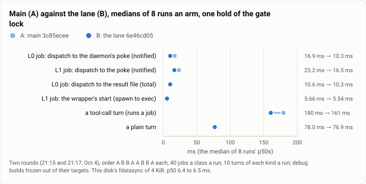

# Gate bench: a job's completion with one sync instead of two, an A/B (2026-10-04)

**The answer first.** Taking the directory sync out of a job's completion (the wrapper now does `fsync` of the
result's temporary file, then `rename`, and no `fsync` of the spool directory) made the daemon hear of a finished job
6.6 ms sooner at L0 (16.91 to 10.31 ms, the median of 8 runs an arm) and 6.7 ms sooner at L1 (23.21 to 16.52 ms), one
of this disk's fdatasyncs (6.4 to 6.5 ms), and a tool-call turn, which runs a job, 19.0 ms faster (179.55 to 160.55
ms). The two arms' runs did not overlap on any of the three (exact Mann-Whitney U = 0, two-sided p = 0.0002, 8 against
8). A plain turn, which runs no job, did not move (78.05 against 76.90 ms, p = 0.63), and neither did the lifecycle
bench's start and stop phases in a second A/B after the join (each within 1 ms, p 0.03 to 0.49 on 4 against 4).

| | |
|---|---|
| Suite | `gate-bench`: the jobs bench (`bench jobs`, L0 and L1) and the turn bench, A/B; then the lifecycle bench, A/B |
| Arms | A: `main` at `3c85ecee`; B: the linux-io lane at `6e46cd05`. Debug builds copied out of their targets ("frozen"), each measured by the lane's `theseus-sim` |
| Model | none (the turn bench's stand-in) |
| Runs | jobs and turn: 8 runs an arm in two rounds (21:15 and 21:17), order A B B A A B B A, 40 jobs a class a run, 10 turns of each kind a run; lifecycle: 4 runs an arm (21:35 to 21:38) |
| Date and commit | 2026-10-04; the lane joined `main` as `e6378de8` at 21:31 |
| Cost | nothing in dollars; about 4 minutes under the gate lock |
| Data | `2026-10-04-gate-bench-one-sync-per-job.json` (every run's numbers, both A/Bs, and the turn bench's two clocks per run) |

## The question

A job's result is a file the wrapper writes into the spool, and the daemon learns of it by a poke. On `main` the
wrapper paid two syncs for it: the file's and then the spool directory's, so a completion cost two of the disk's
flushes before the daemon heard of it (theseus-yxiv, card 1 of a Linux IO survey). The lane made it one: the start
path finishes any rename a crash cut short, so the directory's sync is not needed for durability. The question: does
the daemon hear of a job one sync sooner, does a turn that runs a job get faster, and does anything else move?

## The setup

- **Arms.** A is `main` at `3c85ecee`, B the lane at `6e46cd05`, both debug, copied out of their targets (sha256
  prefixes `9d18902d` and `f2f6c38d` in the logs) so a build elsewhere could not change them mid-run; one
  `theseus-sim` measured both.
- **The A/B.** `settle()` outside the lock, then one exclusive hold of the gate lock per round, order A B B A A B B A;
  two rounds at 21:15 and 21:17, load 2.7 to 5.7, CPU pressure 0 to 0.9%. Each run: `theseus-sim bench jobs` (40 L0
  and 40 L1 jobs) and `theseus-sim bench turn` (10 plain and 10 tool-call turns). The disk's `fdatasync` of 4 KiB
  measured p50 6.38 then 6.51 ms.
- **The lifecycle A/B,** after the join (to settle whether the join gate's slower stop phases were the lane): the
  same frozen arms, `bench lifecycle --runs 10`, 4 runs an arm, A B B A A B B A, one hold of the lock, 21:35 to 21:38
  (IO pressure 11.8 then 5.9%, load 5.6 then 1.5).
- **The machine:** one WSL2 VM, 16 vCPUs, ext4 on its virtual disk.
- **Statistics:** each run's p50; per arm, the median of the runs' p50s; the exact Mann-Whitney U of B against A, two
  sided (all 12,870 splits of 8 and 8 enumerated; 70 for 4 and 4).

## Results

<picture>
  <source media="(prefers-color-scheme: dark)" srcset="img/2026-10-04-gate-bench-one-sync-per-job/one-sync-per-job-dark.svg">
  
</picture>

*Figure 1. What did taking the directory sync out of a job's completion change? The time until the daemon hears of
a job fell by one sync, 6.6 ms, at L0 and L1; a tool-call turn fell 19 ms; nothing that does not wait on a job moved.*

| Measure | A: main | B: the lane | Change | A's range | B's range | U, exact p |
|---|---:|---:|---:|---|---|---|
| L0 job: dispatch to the daemon's poke (notified) | 16.91 | 10.31 | −6.61 | 16.63 to 17.29 | 10.05 to 10.96 | 0, 0.0002 |
| L1 job: dispatch to the poke (notified) | 23.21 | 16.52 | −6.69 | 22.94 to 23.81 | 15.62 to 17.90 | 0, 0.0002 |
| L0 job: dispatch to the result file (total) | 10.64 | 10.30 | −0.34 | 10.50 to 10.84 | 10.05 to 10.96 | 18, 0.15 |
| L1 job: the wrapper's start, spawn to exec | 5.66 | 5.54 | −0.12 | 5.41 to 5.98 | 5.11 to 5.82 | 18.5, 0.17 |
| a tool-call turn (it runs a job), wall p50 | 179.55 | 160.55 | −19.00 | 169.5 to 245.8 | 148.7 to 169.1 | 0, 0.0002 |
| a plain turn, wall p50 | 78.05 | 76.90 | −1.15 | 73.3 to 103.4 | 72.3 to 81.1 | 27, 0.63 |

ms, the median of 8 runs' p50s. On B, `notified` equals `total` to within 0.01 ms: the poke follows the rename at
once. On A it trails `total` by one sync. Frames held at 5 and 9 in every turn run.

**The lifecycle bench, A/B after the join** (median of 4 runs' p50s, ms):

| Phase | A: main | B: the lane | Change | U, exact p |
|---|---:|---:|---:|---|
| cold start to the first answer | 22.45 | 21.75 | −0.70 | 5, 0.49 |
| clean shutdown, a job running | 32.25 | 32.00 | −0.25 | 3, 0.23 |
| SIGKILL, then restart | 26.05 | 25.35 | −0.70 | 0, 0.029 |
| binary swap | 47.70 | 46.75 | −0.95 | 4.5, 0.37 |

## Analysis

**One sync, exactly.** The L0 and L1 pokes moved by 6.61 and 6.69 ms, this disk's fdatasync to within a tenth of a
millisecond, while the time to the result file did not move: the change removed the sync it meant to remove and
nothing else. The wrapper's own start did not move either.

**A tool-call turn gains more than one sync** (19 ms, nearly three). A job's directory sync forces an ext4 journal
commit in the middle of the daemon's own WAL syncs, so it can delay them too; that is the lane's inference, on
`data=ordered`, and it is not measured here.

**Why the join gate looked otherwise.** The join gate on `e6378de8` read the stop-side phases slower than the gate 27
minutes before it (a clean shutdown's p50 53.5 against 31.7 ms; a swap's 61.0 against 48.3), and the same gate's
start-side clocks showed disk stalls (the store's p95 25.6 against 14.1 ms). The A/B in one lock hold put both
builds within a millisecond of each other on every phase. A single gate's reading is the machine's minute, which is
the lesson of FAST's history report: a before/after needs both arms in one hold.

**A clue for the lone slow turn** (theseus-w7dk). These runs kept the turn bench's per-kind reports, which hold the
daemon's own clock beside the bench's wall clock. In 32 kind-runs (16 runs, plain and tool-call), the slowest turn's
wall was over twice the p50 in 7, and the two clocks disagree about why. In 3 the daemon's clock was slow too (its
slowest turn 219, 238 and 365 ms against p50s near 52 and 136), so the time was inside the turn; in 3 it was not
(walls of 363.4, 393.1 and 217.3 ms against daemon maxima of 60, 165 and 61), so the time was outside the daemon's
turn: in the socket, the bench's own process, or before the turn's clock starts; one was between (208.0 against 122). The gate's history keeps neither the per-turn
walls nor the daemon's maximum, which is why the lone slow run has no named cause yet.

**What changed since the last comparable run.** The gates around the join agree: the tool-call turn's p50 read 164.2
ms at the gate before the join and 153.5 ms at the join's (single gates, not an A/B). FAST's history report shows the
tool-call turn's daily median falling from 179.4 ms (Oct 4) to 156.2 ms (Oct 5).

## Threats to validity

- **8 and 8 runs (4 and 4 for the lifecycle).** The three headline differences have no overlap between the arms; the
  lifecycle A/B's single p = 0.029 (the kill's 0.7 ms) is small and not claimed.
- **One machine, one evening.** The pressures were low (CPU 0 to 0.9%, IO 6 to 12% at the lock); a busier disk makes
  a sync slower, so the saving would grow with it.
- **The turn bench's walls include the bench's own process** (above); the medians are robust to its lone slow runs,
  the means would not be.

## What it cost

Nothing in dollars; about 90 s of benches per round and 3 minutes for the lifecycle A/B, under the gate lock.

## Reproduction

```
# A and B: debug builds of the two commits, copied out of their targets
for arm in A B A ... ; do                       # order A B B A A B B A, inside one hold of the gate lock
  <sim> bench jobs --theseusd <arm>/theseusd --class l0,l1 --runs 40
  <sim> bench turn --theseusd <arm>/theseusd --runs 10 --burst 0 --json <n>-turn-<arm>.json
done
<sim> bench lifecycle --theseusd <arm>/theseusd --runs 10        # the lifecycle A/B, 4 runs an arm
```

The lane's harness (its A/B script and the frozen builds' logs) is kept on the build machine, not published; every
number here was recomputed from its run logs and the turn bench's per-run reports.

## Data

`2026-10-04-gate-bench-one-sync-per-job.json`: every run of both rounds (the jobs bench's L0 and L1 times, the turn
bench's walls, frames and the disk's fdatasync), the lifecycle A/B's runs, the Mann-Whitney statistics, the per-run
wall and daemon clocks of the turn bench, and the figure's spec.
