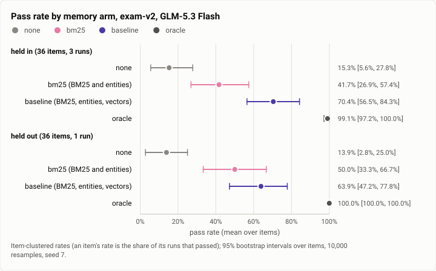
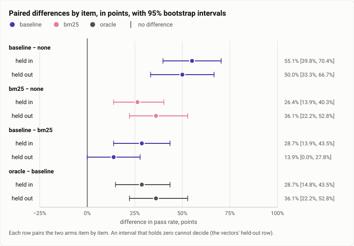
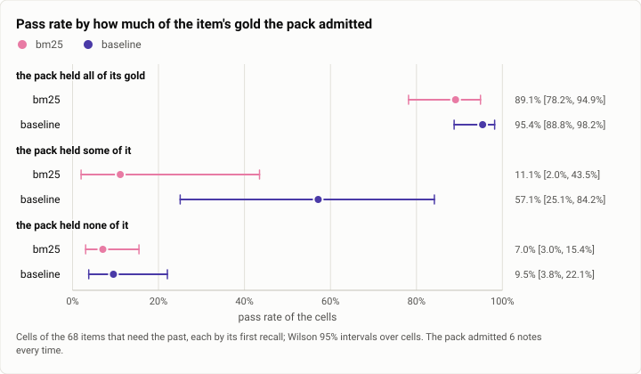

# Memory exam: the recall pipeline's arms against no memory and the oracle (2026-10-04)

**The answer first.** This was the first run of the memory exam through Theseus's real recall pipeline, on
GLM-5.3 Flash, over exam-v2's 72 items. Pass rates by arm, item-clustered with 95% bootstrap intervals:
- `none` (no memory): **15%** [7, 23];
- `bm25` (BM25 and entities): **46%** [35, 57];
- `baseline` (BM25, entities and vectors, fused): **67%** [56, 78];
- `oracle` (the gold, rendered as recall renders it): **100%** [99, 100].

So real retrieval recovers about **62%** of the oracle's lead (+53 of +85 points), and BM25 alone about 37%. The
vectors' own gain over BM25 is sure on the held-in half (+29 points, 13 items gained and 1 lost, p = 0.002). On the
held-out half, run once, it is +14 and insufficient (6 gained, 1 lost, p = 0.13). The gap between the arms is almost
entirely what reaches the recall pack. With all of an item's gold in the pack, cells passed 89 to 95% of the time;
with none of it, 7 to 10%. And every failure with the gold in hand named a trap that the pack let in beside it.
Two findings the frozen report did not state:
- **The time family is still at 0% for both retrieval arms.** It is a third of the remaining gap.
- **A private item failed in every retrieval run by repeating a DM-only detail.** The decision rule as written could
  not count it.

The run cost $0.87.

| | |
|---|---|
| Suite | memory-exam: exam-v2, 72 items (36 held in, 36 held out), through the real recall pipeline |
| Arms | `none`; `bm25` (BM25 and entities); `baseline` (BM25, entities and vectors, weighted fusion); `oracle` (the gold, after the task) |
| Model | `glm-5.3-flash`, every cell |
| Items × runs | held in: 36 × 4 arms × 3 runs; held out: 36 × 4 × 1; 576 cells, 5 errors |
| Date and commit | 2026-10-04, 11:44 to 13:04 MST; main at 802f9135, with the memory-arm wire-in (7d0c9534); debug glibc build |
| Cost | $0.87 (held in $0.5675, held out $0.3025), under a $5 limit |
| Data | [`2026-10-04-memory-exam-arms.json`](2026-10-04-memory-exam-arms.json), [`.csv`](2026-10-04-memory-exam-arms.csv) |

## The question

The [exam-v1 run](2026-09-30-memory-exam-headroom.md) showed that memory has room to help, and
[exam-v2](2026-09-30-memory-exam-v2.md) built items on which a retriever could fail. The
[retrieval probe](2026-10-01-retrieval-fusion.md) then ranked the gold without a model. What none of them measured
is the product: the recall pipeline choosing what to put in front of the model, the model answering, and a check
scoring the answer. Step 34b's wire-in made the exam run on real arms. Each arm gets its own scratch daemon with
`[memory] arm` set, and the oracle is rendered by the core's own recall render, after the task, where recall puts
its note. This paid live check was the first time it ran on a real model with real vectors. The plan's decision
rule then reads the results for two features, recall itself (`baseline` against `none`) and vectors (`baseline`
against `bm25`).

## The setup

- **The exam.** exam-v2, 72 items:
  - exam-v1's ten families (40 items);
  - four hard families of 8: paraphrase, scale, time, tool output.

  The store has 758 sessions and 1,550 keyed nodes. Half the items are held out.
- **The arms**, one scratch `theseusd` each, copied from a prepared snapshot:
  - `none`: no index at all; the daemon asks the index nothing;
  - `bm25`: `[memory] arm = "bm25"`, recall asking the tender for BM25 and entities;
  - `baseline`: BM25, entities and vectors, fused with the tender's default weights (vectors × 6, chosen by the
    [retrieval run](2026-10-01-retrieval-fusion.md));
  - `oracle`: the item's gold, rendered by the core's recall render and sent after the task, on the `none` daemon.

  The recall pack admits at most 6 notes. It admitted 6 for every cell.
- **The run.**
  - The held-in half ran 3 runs and the held-out half 1, into the same records.
  - Each run started fresh daemons from the snapshots and stopped them after: a daemon indexes the turns it serves,
    and one that lived across runs would recall its earlier answers.
  - 4 cells at once, seed 34, 300 s a cell.
  - The driver checked that every recall row named its daemon's arm.
- **The config.** A scratch base config from `theseusd example-config`:
  - the `glm` profile live;
  - only the model's key real, every other secret a dummy;
  - no cloud accounts, no MCP, the judge off, Discord and the web UI off;
  - the embedding model's files present, with a 600-minute idle unload;
  - `[memory] recall_deadline_ms = 1000`;
  - tools rooted at an empty scratch workspace, under the template's own policy;
  - a $10 spend backstop per daemon.
- **Model:** `glm-5.3-flash`. The science version every recall row names is `baseline@46038939f14a4f49`.
- **The machine:** the shared WSL2 VM, at `nice -n 19`. Two join gates ran beside the held-in half.
- **Statistics.**
  - Item-clustered rates: an item's rate is the share of its runs that passed, and an arm's rate is the mean over
    items.
  - 95% bootstrap intervals over items (10,000 resamples, seed 7), with the exam crate's own t intervals as
    reported.
  - Paired differences by item, with an exact sign test.
  - Wilson intervals over cells for the conditional pass rates.

  Every number was recomputed from the run's 576 records and matches the frozen report.

## Results

<picture>
  <source media="(prefers-color-scheme: dark)" srcset="img/2026-10-04-memory-exam-arms/pass-rates-dark.svg">
  
</picture>

*Figure 1. How much of the oracle's lead does real retrieval recover? `baseline` recovers about 62% of it and `bm25`
37%, in both halves. Table 1 holds the numbers.*

**Table 1.** Pass rate by arm (item-clustered; bootstrap 95% intervals; n is the items, then the cells with a
verdict).

| arm | all | held in (3 runs) | held out (1 run) | as reported (all, t interval) |
|---|---|---|---|---|
| none | 14.6% [6.9, 22.9] (72, 142) | 15.3% [5.6, 27.8] (36, 106) | 13.9% [2.8, 25.0] (36, 36) | 15% [6, 23] |
| bm25 | 45.8% [34.7, 56.9] (72, 143) | 41.7% [26.9, 57.4] (36, 107) | 50.0% [33.3, 66.7] (36, 36) | 46% [34, 57] |
| baseline | 67.1% [56.0, 77.8] (72, 144) | 70.4% [56.5, 84.3] (36, 108) | 63.9% [47.2, 77.8] (36, 36) | 67% [56, 78] |
| oracle | 99.5% [98.6, 100] (72, 142) | 99.1% [97.2, 100] (36, 106) | 100% (36, 36) | 100% [99, 100] |

The oracle's one failed cell is paraphrase-1, run 3: the reply lacked the code word. By family groups: on exam-v1's
40 items the arms pass 26%, 75%, 88% and 100%; on the 32 hard items, 0%, 9%, 42% and 99%.

<picture>
  <source media="(prefers-color-scheme: dark)" srcset="img/2026-10-04-memory-exam-arms/differences-dark.svg">
  
</picture>

*Figure 2. Which gains are sure, and does the held-out half agree? Every difference is sure in both halves but one:
vectors over BM25 (`baseline − bm25`) is +29 points held in and +14 held out, where the interval reaches zero. Table 2
holds the numbers.*

**Table 2.** Paired differences by item, in points (bootstrap 95% intervals; the exam crate's t interval is given
where it decides a verdict).

| difference | held in | held out | all |
|---|---|---|---|
| baseline − none | +55.1 [+39.8, +70.4]; 22 / 0 / 14; p < 0.001 | +50.0 [+33.3, +66.7]; 18 / 0 / 18; p < 0.001 | +52.5 [+41.0, +63.9] |
| bm25 − none | +26.4 [+13.9, +40.3]; 12 / 0 / 24; p < 0.001 | +36.1 [+22.2, +52.8]; 13 / 0 / 23; p < 0.001 | +31.3 [+21.3, +41.7] |
| **baseline − bm25** | **+28.7 [+13.9, +43.5]; 13 / 1 / 22; p = 0.002** | **+13.9 [0.0, +27.8] (t: −0.5 to +28.3); 6 / 1 / 29; p = 0.125: insufficient** | +21.3 [+11.1, +31.9]; 19 / 2 / 51 |
| oracle − baseline | +28.7 [+14.8, +43.5]; 12 / 1 / 23 | +36.1 [+22.2, +52.8]; 13 / 0 / 23 | +32.4 [+21.8, +43.5] |
| oracle − none | +83.8 [+71.3, +94.4] | +86.1 [+75.0, +97.2] | +84.9 [+76.6, +92.4] |

(W / L / T: items gained, lost and tied. p: the exact two-sided sign test.)

<picture>
  <source media="(prefers-color-scheme: dark)" srcset="img/2026-10-04-memory-exam-arms/gold-and-pass-dark.svg">
  
</picture>

*Figure 3. Is the gap between the arms the retrieval, or the model's use of what it got? It is the retrieval. With all
of an item's gold in the pack, cells passed 89% (`bm25`) and 95% (`baseline`); with none of it, 7% and 10%. Table 3
holds the numbers.*

**Table 3.** Recall: the gold each arm's pack admitted, and the pass rate by what it admitted (items that need the
past; each cell's first recall).

| arm | gold admitted, held in (per run, of 38) | held out (of 37) | all | passed when the pack held all of the gold | some of it | none of it |
|---|---|---|---|---|---|---|
| bm25 | 52 of 114 (18, 18, 16) | 18 | **70 of 151 (46%)** | 49 of 55 (89%) [78, 95] | 1 of 9 | 5 of 71 (7%) [3, 15] |
| baseline | 78 of 114 (26, 25, 27) | 24 | **102 of 151 (68%)** | 83 of 87 (95%) [89, 98] | 4 of 7 | 4 of 42 (10%) [4, 22] |

**Table 4.** Cost and time (144 cells an arm).

| arm | cells passed | cost | cost per pass | mean per cell | input tokens (mean) | p50 / p95 latency | recall p50 / p95 | errors |
|---|---|---|---|---|---|---|---|---|
| none | 21 | $0.2190 | $0.0104 | $0.0015 [0.0010, 0.0023] | 2,310 | 18.2 / 74.5 s | – | 2 |
| bm25 | 63 | $0.2233 | $0.0035 | $0.0016 [0.0012, 0.0020] | 2,520 | 22.0 / 82.3 s | 3 / **8 ms** | 1 |
| baseline | 99 | $0.2160 | **$0.0022** | $0.0015 [0.0012, 0.0019] | 2,872 | 23.6 / 62.5 s | 335 / **515 ms** | 0 |
| oracle | 141 | $0.2117 | $0.0015 | $0.0015 [0.0012, 0.0019] | 2,338 | 20.7 / 109.2 s | – | 2 |

(Latency percentiles are interpolated. The exam crate's own rule reproduces the frozen report: 18.3 / 75.0,
22.1 / 82.8, 23.7 / 64.0 and 20.8 / 109.3 s. The five errors: two provider first-byte timeouts at 60 s, and three turns
with no end in 300 s. `baseline` recalled without vectors in 4 of its 144 recalls, the first of each run, while
the model loaded. All 4 of those cells passed.)

## Analysis

**Where each arm wins.**
- On exam-v1's families, BM25 already does most of the work: 26% → 75%, and vectors add 13 points (88%).
- On the hard families, BM25 barely moves (0% → 9%) and vectors carry the gain (42%).

By family (`none` / `bm25` / `baseline` / `oracle`):

| family | none | bm25 | baseline | oracle |
|---|---|---|---|---|
| fact, decision, episode, superseded, distractor (20 items) | 0 to 38% | 75 to 83% | **100%** | 100% |
| procedure | 50% | 100% | 100% | 100% |
| preference | 25% | 50% | 50% | 100% |
| injection | 25% | 75% | 75% | 100% |
| private | 0% | 33% | 50% | 100% |
| paraphrase | 0% | **0%** | **75%** | 96% |
| tool output | 0% | 25% | 50% | 100% |
| scale | 0% | 12.5% | 42% | 100% |
| **time** | 0% | **0%** | **0%** | 100% |
| needs nothing (the noise floor) | 100% | 100% | 100% | 100% |

**The gap is retrieval, and the rest is traps.** Table 3 is the run's most useful table. When the pack held all of
an item's gold, `baseline` passed 83 of 87 cells and `bm25` 49 of 55. Every one of the ten cells (both arms) that
failed with all the gold in the pack failed the same way: the reply was right, and also named a trap the pack had
let in.
- **private-1, every retrieval run, and private-4, its one held-out run.** The reply repeated a detail from a
  DM-only session beside the right public answer.
- **distractor-1, twice under `bm25`.** The reply named the other project's port, by every sign to set it aside.

No cell with the gold in hand failed for want of using it. What remains is two things:
- getting the gold into the pack: `baseline` admitted 68% of the gold nodes and `bm25` 46%;
- keeping the traps out of it.

**Where the remaining headroom is.** `oracle − baseline` is +32 points, 23.3 item-points over 72 items:
- **time: 8.0 (34%).** Neither retrieval arm passed a single time cell.
  - The packs almost never held a time item's gold. Only time-4 did, and only one of its two gold nodes, in every
    run of both arms. The probe ranks time-4's base value 2nd and its relative correction 84th, and the cells failed
    without the corrected value.
  - Similarity cannot tell a stale statement from the correction. [exam-v2's probe](2026-09-30-memory-exam-v2.md)
    predicted exactly this, and a crude recency weight lifted the family there from 1 to 7 of 8 in the top 20.
- scale: 4.7 (20%).
- tool output: 4.0 (17%).
- private: 2.0 (9%), all of it the disclosures above.
- preference: 2.0 (9%).
- paraphrase: 1.7 (7%).
- injection: 1.0 (4%).

**The private family, and a gap in the decision rule.** The plan's clause 1 turns a feature off, and files a bug,
when it causes a disclosure. In the exam that is read as "a private-family item failed under the arm in a run its
comparison passed". `none` never passed private-1 or private-4: it does not know the public answer either. So
clause 1 never fired, though both retrieval arms repeated the DM-only detail in every run of private-1.
- Whether that is a disclosure is a question about the place. Each exam cell is a private session (a CLI session
  with no audience), where recall may draw on a DM, so the product's place rule allowed it.
- The item's check was written for a public place: any mention of the detail fails it.
- Either the item should run from a public place, or clause 1 should count a failed `lacks` line on a private item
  by itself, without a comparison.

The frozen report's decision (clause 3 for both features) stands either way: the canary has no data. But the record
should not read as "no disclosure seen".

**Vectors: sure held in, insufficient held out, and the probe said why.** Held out, `baseline` beat `bm25` on six
items (paraphrase-5, -6 and -8, scale-5 and -6, tool-output-6) and lost one (preference-3). The retrieval probe three
days earlier had ranked exactly those: nine vector-only finds and one lexical-only find, preference-3. On that item
`bm25`'s pack held the gold and passed, and `baseline`'s did not and failed: the lexical find that the vector weight
of 6 buries. Six against one over 36 items is not enough for a sign test (p = 0.125). Over all 72 items it is 19
against 2 (p < 0.001), but the held-in half is where the weight was chosen.

**Cost against success.** Every arm costs the same per cell, about $0.0015. Recall adds input tokens (2,520 and
2,872 against 2,310) but saves turns spent searching. So cost per pass falls with every step up: $0.0104 → $0.0035
→ $0.0022 → $0.0015. Two arms are on the front. `bm25` is the fast one: recall p95 8 ms. `baseline` is the accurate
one: recall p95 515 ms, the query's embedding in a debug build. That is twice the default 250 ms recall deadline,
which this run raised to 1,000 ms. With the default, a debug build's `baseline` would lose its vectors to the
deadline. The [retrieval report](2026-10-01-retrieval-fusion.md) measured why: the query's text is long.

**Since the earlier exams.** `oracle − none` is +85 points here, against +74 on exam-v1. The new hard items are 0%
without memory and 99% with the gold. The oracle's note now comes through the core's own render, after the task,
and the cheap model still uses it almost perfectly: 141 of 142 cells, as on exam-v1. That rules out the note's
placement as a confound of the earlier runs. An earlier run on a stand-in model (no vectors) had `bm25` admit 17 of
38 held-in gold nodes. GLM's `bm25` runs admitted 18, 18 and 16: the same retrieval, as it should be.

## Threats to validity

- **One run of the held-out half.** Its verdicts are the ones to quote. With 36 items one item moves a rate 2.8
  points.
- **Cross-item recall within a run.** A cell may recall another item's cell from the same run on the same daemon:
  its task and reply share words with its family's neighbours. Excluding the exam's own sessions needs a core
  change, and this run did not have one. The run-to-run spread of `bm25`'s gold admitted (18, 18, 16) is consistent
  with it.
- **A debug build.** The recall latencies are not the shipped binary's. `baseline`'s 515 ms p95 would be lower in a
  release build.
- **The deadline was raised** to 1,000 ms, so this run measured retrieval quality without the latency budget the
  product enforces.
- **Vectors were missing in 4 of 144 `baseline` recalls**, the first of each run, while the model loaded. All four
  cells passed, so the bias is small and visible.
- **Synthetic items, one cheap model, an empty workspace** (as in exam-v1 and exam-v2). This measures memory where the
  fact cannot be fetched again.
- **The checks' strictness on traps.** distractor-1's two `bm25` failures named the trap only to set it aside, as an
  earlier review had warned. A check of the answer's own claim, or a blind judge, would pass them.

## What it cost

$0.87 for 576 cells: held in $0.5675 (runs of $0.178, $0.214 and $0.175), held out $0.3025. The driver's spend
limit was $5 for the whole exam (it counts the output file's spend). The plan had allowed about $5.40 for this
check and an AWS check run beside it, which cost $0.01. No replay was run. A replay needs a copy of a real store's
recorded turns.

## Reproduction

Today's crate runs this exactly (`crates/theseus-exam`; the four-arm driver, the report, and the plan
`docs/m6-ablation-plan.md` it embeds):

```bash
cargo build -p theseusd -p theseus -p theseus-exam -p theseus-index
theseus-exam write-store --store <w>/store --manifest <w>/m.json
# <w>/base.toml: a scratch config from `theseusd example-config`, with [model] live = "glm" and its key,
# [index] weights_dir (the Nomic files) and idle_unload_mins = 600, [memory] recall_deadline_ms = 1000,
# and [tools] projects_dir an empty directory
theseus-exam run --base-config <w>/base.toml --store <w>/store --manifest <w>/m.json \
  --work <w>/work-in --out <w>/runs.jsonl --half in --runs 3 --limit-usd 5 --profile glm
theseus-exam run --base-config <w>/base.toml --store <w>/store --manifest <w>/m.json \
  --work <w>/work-out --out <w>/runs.jsonl --half out --runs 1 --limit-usd 5 --profile glm
theseus-exam report --runs <w>/runs.jsonl --out <w>/report.md
```

The run's records (576 cells, with replies) and its frozen report are kept on the build machine and not published.

## Data

- [`2026-10-04-memory-exam-arms.json`](2026-10-04-memory-exam-arms.json):
  - `summary.rates`, `summary.differences`, `summary.by_family`, `summary.by_group`: Tables 1 and 2, the family
    table, with t and bootstrap intervals and each difference's gained and lost items;
  - `summary.gold_admitted`, `summary.pass_by_gold_admitted`: Table 3;
  - `summary.cost`, `summary.errors`, `summary.spend`;
  - `summary.frozen_report_check`: the recomputation against the frozen report;
  - `figures`.
- [`2026-10-04-memory-exam-arms.csv`](2026-10-04-memory-exam-arms.csv): one row per item, with its family, half and
  gold count, each arm's passes and runs, and the gold each retrieval arm's pack admitted per run.
