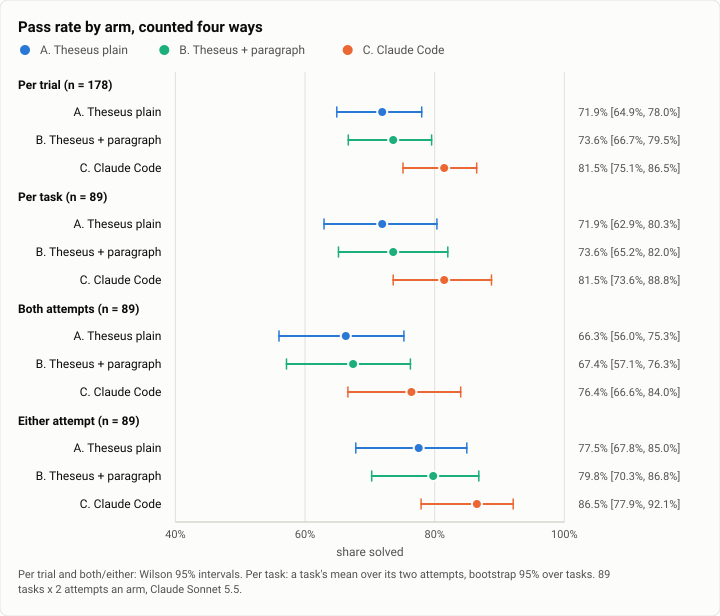
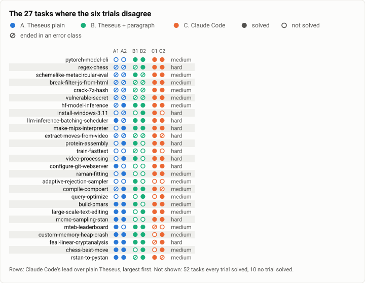
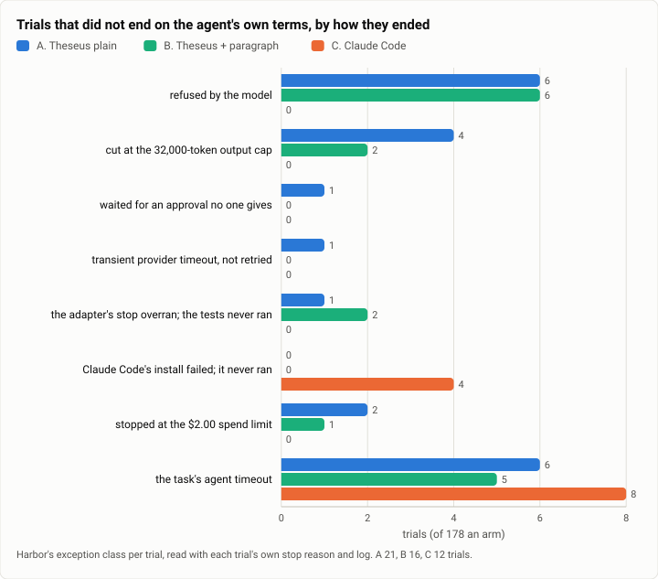
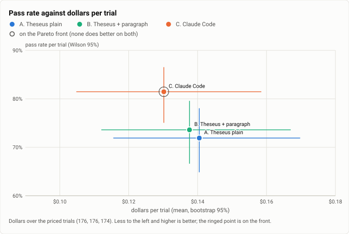
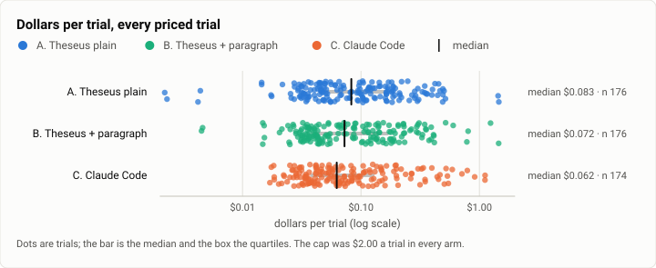
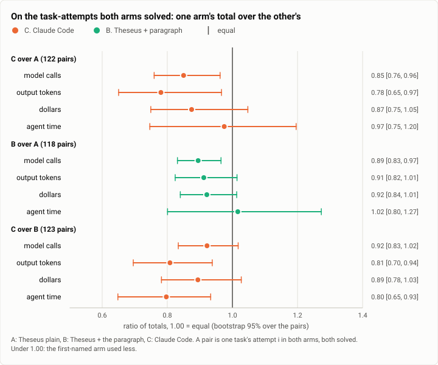
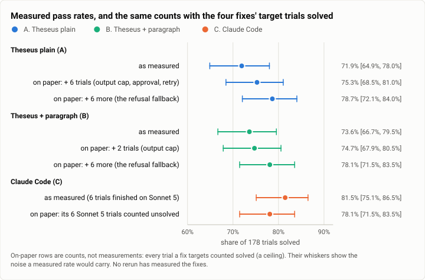

# Terminal-Bench 2.0: Theseus against Claude Code on all 89 tasks, the first full run (2026-10-04)

**The answer first.** On all 89 tasks of Terminal-Bench 2.0, two attempts each, with Claude Sonnet 5.5 in every arm
and the same limits ($2.00 and 200 model calls a trial), Claude Code 2.1.288 solved **81.5%** of its trials (145 of
178; Wilson 95% interval 75.1% to 86.5%), Theseus **71.9%** (128 of 178; 64.9% to 78.0%), and Theseus with one
extra paragraph of system text **73.6%** (131 of 178; 66.7% to 79.5%). Paired by task, Claude Code did better on 16
tasks and Theseus on 5 (exact sign test p = 0.027): a gap of 9.6 points (paired bootstrap 95%, 3.4 to 16.3). The
paragraph's 1.7 points over plain Theseus are noise (10 tasks against 7, p = 0.63). Much of the gap is the
harness's, not the model's: 13 of plain Theseus's 21 trials that did not end on their own ended on a fault of the harness (a refusal
with no fallback, a 32,000-token output cap, an approval no one could give, an unretried provider timeout, a stop
that overran), and Claude Code's own score includes 6 trials that it finished on Sonnet 5 after Sonnet 5.5 refused.
The four fixes since (theseus-7gir.18 to .21) would lift plain Theseus to at most 78.7% on paper. What remains sits
mostly in the hard tasks: there Claude Code did better on 9 tasks to Theseus's 1 (p = 0.021), and on 7 to 1 without
the faults. No rerun has measured the fixes yet.

| | |
|---|---|
| Suite | Terminal-Bench 2.0 (`terminal-bench@2.0`), 89 tasks, each in its own container |
| Arms | **A.** Theseus, the bench profile · **B.** Theseus with one batching paragraph of system text · **C.** Claude Code 2.1.288, Harbor's own adapter |
| Model | Claude Sonnet 5.5 (`anthropic/claude-sonnet-5-5`) in every arm |
| Tasks × attempts | 89 × 2 per arm: 534 trials |
| Date and commit | 2026-10-03 23:21 to 2026-10-04 18:07 (UTC−7); Theseus built at `079f1db` |
| Cost | $71.60 (A $24.72, B $24.23, C $22.65) |
| Data | [`2026-10-04-terminal-bench-first-full-run.json`](2026-10-04-terminal-bench-first-full-run.json) (summary and figures), [`.csv`](2026-10-04-terminal-bench-first-full-run.csv) (one row per trial) |

## The question

Does Theseus, a Rust agent harness, solve as many real terminal tasks as Claude Code when both drive the same model
under the same limits? And does one paragraph of system text that asks the model to batch its shell steps change
the score, the calls, or the dollars?

It mattered then because the only earlier measurement was a four-task spike the day before (the
[worth spike](2026-10-03-harbor-worth-spike.md)), on which both harnesses solved everything and Theseus made 1.5 to
2 times as many model calls. That spike could say Theseus runs Terminal-Bench through Harbor; it could not say how
often it succeeds. This run was the first baseline on a full public suite, and the paragraph's arm was the evidence
for a pending decision: whether to put "batch your steps" into Theseus's default prompt.

## The setup

- **A. Theseus** through `-a theseus_agent:Theseus` (`bench/harbor`), the static musl build of `079f1db`
  (`bench/build.sh`), with the bench profile as it stood at that commit (`bench/theseus-bench.toml`): no vault, the
  model's key from the environment, every tool open, workspace roots at `/`, L0, a command allowed to hold the turn
  for up to 900 s, and the model's output capped at 32,000 tokens a call.
- **B. Theseus with one paragraph of system text** (`THESEUS_BENCH_SYSTEM_FILE`), otherwise A:

  > You are running non-interactively in a task's container: nobody will answer questions, so work on your own
  > until the task is done and verified. Shell work is cheap here: use proc.run with ["bash", "-lc", "..."] freely,
  > and put related steps (inspect, change, check) into one script per call rather than one command per call, since
  > every call costs a round trip.

  This is a prompt trick, and the project has since ruled such tricks out: a fix must change what the agent can do
  or see (a tool, its output, the harness's limits), never instructions in the prompt (theseus-7gir.2). The tool
  answer to batching is a `steps` array on `proc.run` (theseus-7gir.3, joined 2026-10-05). B is reported here once,
  as an ablation, and was never shipped.
- **C. Claude Code 2.1.288** through Harbor's own adapter (`-a claude-code`, `--ak version=2.1.288`), with its limits
  set to Theseus's: `max_budget_usd=2.0` and `max_turns=200`.
- **Model:** Claude Sonnet 5.5 for every arm. Claude Code falls back to Sonnet 5 when Sonnet 5.5 refuses a request;
  Theseus at `079f1db` did not (below).
- **Dataset:** all 89 tasks of `terminal-bench@2.0` (by the dataset's own labels 4 easy, 55 medium, 30 hard), each
  task's image as published.
- **Limits per trial:** $2.00 (Theseus's `THESEUS_BENCH_SPEND_LIMIT`, which reserves a call's whole output cap
  before the call runs; Claude Code's `--max-budget-usd`, which counts what was spent); 200 model calls
  (`THESEUS_BENCH_MAX_LOOPS`; Claude Code's `--max-turns`); each task's own agent timeout (600 s to 12,000 s, 41.3 h
  for one pass over the 89). The agent setup timeout was tripled for all three arms, for Claude Code's install of Node
  and its CLI in every container.
- **Harness:** Harbor 0.23.0, one job per task and arm (`-k 2 -n 2`), two jobs at once, so at most 4 trials ran at a
  time; the tasks in order of their agent timeout, longest first. Trials that Harbor marks rate-limited were to be
  rerun once: there were none.
- **Machine:** one WSL2 VM, 16 vCPUs, about 23 GB of memory, Docker, shared with the project's builds and tests.
- **When:** 2026-10-03 23:21 to 2026-10-04 18:07 (UTC−7): 18 h 46 min of wall clock, with a 32-minute pause for a
  restart of the VM (13:37 to 14:09). No trial was lost to the pause.
- **Commit:** `079f1db` for both Theseus arms, its adapter and its profile.

## Results

### Pass rates

<picture>
  <source media="(prefers-color-scheme: dark)" srcset="img/2026-10-04-terminal-bench-first-full-run/pass-rates-dark.svg">
  
</picture>

*Figure 1. How often did each arm solve a task, and how sure can we be? Claude Code solved 81.5% of its trials,
Theseus 71.9% and 73.6%; the ranking holds however a task is counted, and every interval is 11 to 19 points wide.*

| Arm | Solved / trials | Per trial (Wilson 95%) | Per task (bootstrap 95% over tasks) | Attempt 1 | Attempt 2 | Both attempts | Either attempt |
|---|---|---|---|---|---|---|---|
| A. Theseus plain | 128 / 178 | 71.9% [64.9%, 78.0%] | 71.9% [62.9%, 80.3%] | 62 / 89 | 66 / 89 | 59 (66.3% [56.0%, 75.3%]) | 69 (77.5% [67.8%, 85.0%]) |
| B. Theseus + paragraph | 131 / 178 | 73.6% [66.7%, 79.5%] | 73.6% [65.2%, 82.0%] | 65 / 89 | 66 / 89 | 60 (67.4% [57.1%, 76.3%]) | 71 (79.8% [70.3%, 86.8%]) |
| C. Claude Code | 145 / 178 | 81.5% [75.1%, 86.5%] | 81.5% [73.6%, 88.8%] | 73 / 89 | 72 / 89 | 68 (76.4% [66.6%, 84.0%]) | 77 (86.5% [77.9%, 92.1%]) |

A trial is solved when its tests give reward 1; the mean reward equals the pass rate. The per-trial interval treats
the 178 trials as independent. They are not: a task's two attempts agree on 88% to 90% of tasks, so the per-task
bootstrap, which resamples whole tasks, is the honest interval, and it is wider. Either way the arms' intervals
overlap, and the comparison that answers "better on the same tasks?" is the paired one below.

### Paired by task

| Pair (first, second) | Tasks the first did better | Tasks the second did better | Ties | Exact sign test p | Second minus first, points (paired bootstrap 95%) | Solved in either attempt: only first / only second (exact McNemar p) |
|---|---|---|---|---|---|---|
| A. Theseus plain, C. Claude Code | 5 | 16 | 68 | 0.027 | +9.6 [+3.4, +16.3] | 1 / 9 (0.021) |
| B. Theseus + paragraph, C. Claude Code | 5 | 14 | 70 | 0.064 | +7.9 [+1.1, +14.6] | 2 / 8 (0.11) |
| A. Theseus plain, B. Theseus + paragraph | 7 | 10 | 72 | 0.63 | +1.7 [-3.4, +6.7] | 3 / 5 (0.73) |

- **Claude Code did better on 16 tasks:** `break-filter-js-from-html`, `configure-git-webserver`, `crack-7z-hash`, `extract-moves-from-video`, `hf-model-inference`, `install-windows-3.11`, `llm-inference-batching-scheduler`, `make-mips-interpreter`, `protein-assembly`, `pytorch-model-cli`, `raman-fitting`, `regex-chess`, `schemelike-metacircular-eval`, `train-fasttext`, `video-processing`, `vulnerable-secret`.
- **Theseus plain did better on 5:** `chess-best-move`, `custom-memory-heap-crash`, `feal-linear-cryptanalysis`, `mteb-leaderboard`, `rstan-to-pystan`.

<picture>
  <source media="(prefers-color-scheme: dark)" srcset="img/2026-10-04-terminal-bench-first-full-run/contested-tasks-dark.svg">
  
</picture>

*Figure 2. On which tasks do the arms part, and how did those trials end? In 27 of the 89 tasks; most of Claude
Code's lead over plain Theseus sits in the top rows, where Theseus's trials ended in an error class (a slashed
ring) while Claude Code's were solved. The other 62 tasks were unanimous: 52 solved by all six trials, 10 by none.
Every cell is in the per-task table at the end.*

The 10 tasks no arm solved: `caffe-cifar-10`, `dna-insert`, `filter-js-from-html`, `make-doom-for-mips`,
`mteb-retrieve`, `polyglot-c-py`, `polyglot-rust-c`, `qemu-alpine-ssh`, `qemu-startup`, `sam-cell-seg`.

### By difficulty

| Difficulty (the dataset's label) | Tasks | A. Theseus plain | B. Theseus + paragraph | C. Claude Code | Tasks C did better than A / A better than C (sign test p) | The same without the 7 tasks a harness-class ending touched |
|---|---|---|---|---|---|---|
| easy | 4 | 8/8 (100.0%) | 8/8 (100.0%) | 8/8 (100.0%) | 0 / 0 (1.00) | 0 / 0 (1.00) |
| medium | 55 | 79/110 (71.8%) | 81/110 (73.6%) | 87/110 (79.1%) | 7 / 4 (0.55) | 2 / 4 (0.69) |
| hard | 30 | 41/60 (68.3%) | 42/60 (70.0%) | 50/60 (83.3%) | 9 / 1 (0.021) | 7 / 1 (0.070) |
| all | 89 | 128/178 (71.9%) | 131/178 (73.6%) | 145/178 (81.5%) | 16 / 5 (0.027) | 9 / 5 (0.42) |

### Attempt to attempt

| Arm | Tasks whose two attempts agree | Tasks solved in one attempt only |
|---|---|---|
| A. Theseus plain | 79 of 89 (88.8%) | 10: `compile-compcert`, `configure-git-webserver`, `hf-model-inference`, `llm-inference-batching-scheduler`, `make-mips-interpreter`, `mteb-leaderboard`, `protein-assembly`, `query-optimize`, `raman-fitting`, `video-processing` |
| B. Theseus + paragraph | 78 of 89 (87.6%) | 11: `adaptive-rejection-sampler`, `build-pmars`, `chess-best-move`, `install-windows-3.11`, `large-scale-text-editing`, `protein-assembly`, `query-optimize`, `regex-chess`, `rstan-to-pystan`, `schemelike-metacircular-eval`, `video-processing` |
| C. Claude Code | 80 of 89 (89.9%) | 9: `chess-best-move`, `compile-compcert`, `custom-memory-heap-crash`, `extract-moves-from-video`, `feal-linear-cryptanalysis`, `install-windows-3.11`, `query-optimize`, `rstan-to-pystan`, `train-fasttext` |

`query-optimize` was solved in exactly one of two attempts by every arm, and 22 tasks were in at least one arm. A
single-attempt run would have scored each arm differently by up to four tasks (A's attempts: 62 and 66).

### How the trials ended

<picture>
  <source media="(prefers-color-scheme: dark)" srcset="img/2026-10-04-terminal-bench-first-full-run/failure-classes-dark.svg">
  
</picture>

*Figure 3. How did the trials that did not end on their own end, arm by arm? Plain Theseus's 21 split into 13 the
harness caused (refusals with no fallback, the output cap, an approval wait, an unretried timeout, an overrun stop)
and 8 that a limit or the task's own timeout ended; Claude Code's 12 were 8 timeouts and 4 trials its install never
started.*

| How the trial ended | Cause class | A | B | C | Which trials | What it was | Fix |
|---|---|---|---|---|---|---|---|
| refused by the model | harness | 6 | 6 | 0 | `break-filter-js-from-html` A1 A2 B1 B2; `crack-7z-hash` A1 A2 B1 B2; `vulnerable-secret` A1 A2 B1 B2 | no fallback on a refusal (Claude Code retries on Sonnet 5) | theseus-7gir.18, joined 2026-10-05 |
| cut at the 32,000-token output cap | harness (a limit) | 4 | 2 | 0 | `regex-chess` A1 A2 B1; `schemelike-metacircular-eval` A1 A2 B2 | the bench profile asked for 32,000 output tokens; the model and Claude Code allow 128,000 | theseus-7gir.19, joined 2026-10-04 |
| waited for an approval no one gives | harness (policy) | 1 | 0 | 0 | `install-windows-3.11` A2 | a fetch of a private address waited for an approval even under the open bench profile | theseus-7gir.20, joined 2026-10-04 |
| transient provider timeout, not retried | harness | 1 | 0 | 0 | `hf-model-inference` A1 | a first-byte timeout ended the one-shot turn; nothing retried it inside the turn | theseus-7gir.21, joined 2026-10-04 |
| the adapter's stop overran; the tests never ran | harness (the adapter) | 1 | 2 | 0 | `caffe-cifar-10` A2 B1 B2 | after the timeout, stopping the turn took longer than Harbor's 60 s for a command, so Harbor ended the trial before its tests | none filed |
| Claude Code's install failed; it never ran | environment (Claude Code's install) | 0 | 0 | 4 | `qemu-alpine-ssh` C1 C2; `qemu-startup` C1 C2 | Harbor's install of Node and the CLI through apt failed on the task's image | none (not Theseus's) |
| stopped at the $2.00 spend limit | model (a matched limit) | 2 | 1 | 0 | `make-doom-for-mips` A1 A2 B2 | the same $2.00 a trial as Claude Code's budget; Claude Code failed the task at under $0.80 | none needed |
| the task's agent timeout | environment or model | 6 | 5 | 8 | `caffe-cifar-10` A1 C1 C2; `compile-compcert` A1 C2; `extract-moves-from-video` A1 A2 B1 B2 C2; `feal-linear-cryptanalysis` C1; `llm-inference-batching-scheduler` A2; `make-doom-for-mips` B1; `mteb-leaderboard` C1; `qemu-alpine-ssh` A2; `rstan-to-pystan` B1 C1 C2; `train-fasttext` B1 | compute-bound tasks under the task's own limit, on a shared machine | none |
| **all of these** | | **21** | **16** | **12** | | | |

The rewards of every trial count: Harbor runs the tests after a trial that ended in an error class, except where
the trial itself ended first (the overrun stop and the failed install: those tests never ran). One trial was solved
after its error class: Claude Code's first attempt at `rstan-to-pystan` timed out at 1,800 s and its tests passed.

### Cost, tokens and time

<picture>
  <source media="(prefers-color-scheme: dark)" srcset="img/2026-10-04-terminal-bench-first-full-run/cost-vs-pass-dark.svg">
  
</picture>

*Figure 4. Which arm solved more for its dollars? Claude Code: it spent less per trial and solved more, so it is
alone on the front; but its dollar interval covers both Theseus arms', so "cheaper" is not established, only "not
dearer".*

<picture>
  <source media="(prefers-color-scheme: dark)" srcset="img/2026-10-04-terminal-bench-first-full-run/cost-per-trial-dark.svg">
  
</picture>

*Figure 5. How are each arm's dollars spread over its trials? Over two orders of magnitude, with a long tail: half
of each arm's trials cost under $0.09, and a few hard tasks (`make-doom-for-mips`, `install-windows-3.11`,
`extract-moves-from-video`) cost $0.50 to $1.46 a trial.*

| | A. Theseus plain | B. Theseus + paragraph | C. Claude Code |
|---|---|---|---|
| Dollars, total (trials without a price) | $24.72 (2) | $24.23 (2) | $22.65 (4) |
| Dollars per trial, mean (bootstrap 95%) | $0.140 [$0.116, $0.170] | $0.138 [$0.112, $0.167] | $0.130 [$0.105, $0.158] |
| Dollars per trial, median (quartiles) | $0.083 ($0.044 to $0.169) | $0.072 ($0.038 to $0.173) | $0.062 ($0.037 to $0.130) |
| Dollars per trial, most | $1.46 | $1.45 | $1.12 |
| Dollars per solved trial | $0.193 | $0.185 | $0.156 |
| Solved trials per dollar | 5.18 | 5.41 | 6.40 |
| Tokens per solved trial (all four classes) | 222,893 | 219,085 | 266,388 |
| Input tokens read from the cache | 87.5% | 88.2% | 92.9% |
| Output tokens, total | 1,137,664 | 1,123,878 | 879,056 |
| Model calls per trial, mean (bootstrap 95%) | 8.35 [7.51, 9.27] | 8.31 [7.23, 9.53] | 7.98 [6.83, 9.29] |
| Model calls per trial, counted as provider answers | 8.34 | 8.30 | 7.98 |
| Agent time per trial, mean (bootstrap 95%) | 4.1 min [3.0, 5.4] | 4.4 min [3.2, 5.7] | 4.1 min [2.8, 5.5] |
| Agent time per trial, median | 1.0 min | 1.1 min | 0.7 min |
| Agent time, total | 12.1 h | 13.0 h | 11.8 h |
| Agent setup per trial, mean | 1.0 s | 0.9 s | 298 s |
| Whole trial (setup, agent, tests), mean | 5.4 min | 5.7 min | 10.3 min |

| Arm | Priced trials | Least | Quartile 1 | Median | Quartile 3 | Most | The five dearest trials |
|---|---|---|---|---|---|---|---|
| A. Theseus plain | 176 | $0.002 | $0.044 | $0.083 | $0.169 | $1.46 | `make-doom-for-mips` $1.46, `make-doom-for-mips` $1.44, `install-windows-3.11` $0.52, `path-tracing` $0.50, `schemelike-metacircular-eval` $0.49 |
| B. Theseus + paragraph | 176 | $0.004 | $0.038 | $0.072 | $0.173 | $1.45 | `make-doom-for-mips` $1.45, `make-doom-for-mips` $1.24, `install-windows-3.11` $0.80, `install-windows-3.11` $0.78, `regex-chess` $0.60 |
| C. Claude Code | 174 | $0.017 | $0.037 | $0.062 | $0.130 | $1.12 | `install-windows-3.11` $1.12, `extract-moves-from-video` $1.12, `winning-avg-corewars` $0.91, `make-doom-for-mips` $0.79, `make-doom-for-mips` $0.71 |

Model calls are counted as the published table counted them: Theseus's turn loops, Claude Code's distinct messages.
Counted as provider answers, plain Theseus is 8.34, not 8.35: in two trials stopped by the spend limit, the last
loop made no call. Tokens and calls count the trials that have them (the eight trials without a price have none).

<picture>
  <source media="(prefers-color-scheme: dark)" srcset="img/2026-10-04-terminal-bench-first-full-run/solved-pairs-dark.svg">
  
</picture>

*Figure 6. Where both arms solved the same task-attempt, did one spend less to do it? Claude Code made 15% fewer
model calls than plain Theseus and wrote 22% fewer output tokens; its dollars and agent time are not
distinguishable from Theseus's. The paragraph cut Theseus's calls by 11%, and left dollars and time where they were.*

| Pair | n | Model calls | Output tokens | Dollars | Agent time |
|---|---|---|---|---|---|
| C over A | 122 | 0.85 [0.76, 0.96] | 0.78 [0.65, 0.97] | 0.87 [0.75, 1.05] | 0.97 [0.75, 1.20] |
| B over A | 118 | 0.89 [0.83, 0.97] | 0.91 [0.82, 1.01] | 0.92 [0.84, 1.01] | 1.02 [0.80, 1.27] |
| C over B | 123 | 0.92 [0.83, 1.02] | 0.81 [0.70, 0.94] | 0.89 [0.78, 1.03] | 0.80 [0.65, 0.93] |

### The fixes, on paper

<picture>
  <source media="(prefers-color-scheme: dark)" srcset="img/2026-10-04-terminal-bench-first-full-run/fixes-on-paper-dark.svg">
  
</picture>

*Figure 7. Would the four fixes that landed after the run close the gap, on paper? No: counting every trial they
target as solved lifts plain Theseus to at most 78.7%, under Claude Code's 81.5% as measured and level with Claude
Code without its six Sonnet 5 trials (78.1%). These are counts, not measurements.*

| Fix (issue) | Trials it targets in A | in B | Tasks | Claude Code on those tasks |
|---|---|---|---|---|
| refusal (theseus-7gir.18) | 6 | 6 | `break-filter-js-from-html`, `crack-7z-hash`, `vulnerable-secret` | 2/2, 2/2, 2/2 |
| output cap (theseus-7gir.19) | 4 | 2 | `regex-chess`, `schemelike-metacircular-eval` | 2/2, 2/2 |
| approval wait (theseus-7gir.20) | 1 | 0 | `install-windows-3.11` | 1/2 |
| transient provider error (theseus-7gir.21) | 1 | 0 | `hf-model-inference` | 2/2 |

| Row | Trials solved of 178 | Rate (Wilson 95%, as if measured) |
|---|---|---|
| A, as measured | 128 | 71.9% [64.9%, 78.0%] |
| A, on paper: + the output cap, approval and retry trials | 134 | 75.3% [68.5%, 81.0%] |
| A, on paper: + the refusal trials too | 140 | 78.7% [72.1%, 84.0%] |
| B, as measured | 131 | 73.6% [66.7%, 79.5%] |
| B, on paper: + the output-cap trials | 133 | 74.7% [67.9%, 80.5%] |
| B, on paper: + the refusal trials too | 139 | 78.1% [71.5%, 83.5%] |
| C, as measured (6 trials finished on Sonnet 5) | 145 | 81.5% [75.1%, 86.5%] |
| C, on paper: its 6 Sonnet 5 trials counted unsolved | 139 | 78.1% [71.5%, 83.5%] |

## Analysis

**Where each arm wins.** Claude Code's lead is real but narrow in tasks: it comes from 21 of the 89 tasks (16 for
Claude Code, 5 for Theseus), and from the six strong cases where it solved both attempts and plain Theseus neither
(`break-filter-js-from-html`, `crack-7z-hash`, `vulnerable-secret`, `regex-chess`, `schemelike-metacircular-eval`,
`pytorch-model-cli`). Five of those six ended in a fault of the harness, not of the model's work:

- **Refusals (6 trials in A, 6 in B, the same three tasks).** Sonnet 5.5 refused `break-filter-js-from-html`,
  `crack-7z-hash` and `vulnerable-secret` in every Theseus trial, each refusal of the provider's `cyber` category.
  It refused them for Claude Code too: Claude Code then fell back to Sonnet 5 and finished all six trials, at $0.95 of
  Sonnet 5 dollars. Theseus at `079f1db` had no fallback, so a refusal ended the trial (exit 7). Arm B refused on
  exactly the same tasks, so the system text played no part.
- **The output cap (4 trials in A, 2 in B).** On `regex-chess` and `schemelike-metacircular-eval` the model wrote a
  single answer longer than the bench profile's 32,000-token cap, and the turn was cut there (exit 8), each cut call
  32,000 tokens of output for nothing. Claude Code and the model's own limit allow 128,000.
- The sixth, `pytorch-model-cli`, is the model writing different code in a different session: no mechanical cause.

Two weaker losses also had a harness fault in one attempt: `install-windows-3.11`, where a fetch of a page the agent
itself served inside the container (on localhost) waited for an approval the open profile should never have asked
for (exit 6), and
`hf-model-inference`, where a 60-second first-byte timeout from the provider ended a trial that nothing retried
(exit 1; the other attempt solved it).

**What the harness faults hide.** Take out the 7 tasks where such a fault touched plain Theseus, and Claude Code's
lead falls to 9 tasks against 5 (p = 0.42). By difficulty the remainder is lopsided: on medium tasks Theseus did
better 4 times against Claude Code's 2, while on hard tasks Claude Code did better on 7 and Theseus on 1 (p = 0.070;
with the faults counted, 9 to 1, p = 0.021). Those seven (`configure-git-webserver`, `extract-moves-from-video`,
`llm-inference-batching-scheduler`, `make-mips-interpreter`, `protein-assembly`, `train-fasttext`,
`video-processing`) are long tasks with 900 s to 3,600 s limits, where three of Theseus's misses were timeouts. The
fixes address the medium-task gap. The hard-task gap is the next question, and nothing has been filed for it yet.

**The same model?** Not on every trial. Claude Code's 81.5% includes the 6 trials Sonnet 5 finished; counted
unsolved, it is 78.1%, and plain Theseus with the three non-fallback fixes would be 75.3% on paper. Theseus now
falls back too (theseus-7gir.18: a refused request is made once more on Sonnet 5, and the reply says so), so a rerun
compares like with like. Claude Code's six fallback trials:

| Task | Attempt | Solved | Dollars on Sonnet 5 | Dollars, whole trial |
|---|---|---|---|---|
| `break-filter-js-from-html` | 1 | yes | $0.319 | $0.348 |
| `break-filter-js-from-html` | 2 | yes | $0.239 | $0.268 |
| `crack-7z-hash` | 1 | yes | $0.093 | $0.104 |
| `crack-7z-hash` | 2 | yes | $0.106 | $0.126 |
| `vulnerable-secret` | 1 | yes | $0.118 | $0.136 |
| `vulnerable-secret` | 2 | yes | $0.080 | $0.106 |

**Cost, tokens and time.** The arms are close. Claude Code spent $0.130 a trial against $0.140 and $0.138, but
the intervals overlap; per solved trial it was cheaper ($0.156 against $0.193), because it solved more. Theseus's
output-token total is 29% higher than Claude Code's (1.14 million against 0.88 million), and 128,000 of it is the
four cut calls. Claude Code read 92.9% of its input from the cache, against 87.5%: its system prompt is larger and
cached, while Theseus's leaner prefix is written fresh on each trial's first call, so its cached share is lower
without costing more. Agent time is the same (4.1 minutes a trial in A and C); Claude Code's trials took twice as
long end to end (10.3 minutes against 5.4) because each one installs Node and its CLI first, about 5 minutes outside
the agent's clock.

**The paragraph.** On the 118 task-attempts both A and B solved, B made 11% fewer model calls (0.89, 0.83 to 0.97),
which is what the spike predicted, and it did not change dollars, time, or the score. Claude Code's call advantage
over B is no longer distinguishable (0.92, 0.83 to 1.02). A prompt can buy fewer round trips; it bought nothing
measurable in outcome, and the project has chosen tools over prompts for it.

**What changed since the last comparable run.** The worth spike the day before ran three of these tasks (and one
SWE-bench task): both harnesses solved all four, and Theseus made 17 model calls to Claude Code's 11 on the three
Terminal-Bench tasks. At full scale the call gap almost vanished (8.35 against 7.98 a trial overall; 15% on tasks
both solved), and a 9.6-point gap in success appeared that the spike's easy tasks could not show, mostly from the
faults above. After the run:

- the four fixes joined: the model's whole output, 128,000 tokens (theseus-7gir.19), private addresses open in the
  bench profile (theseus-7gir.20) and a transient provider failure retried inside its turn (theseus-7gir.21), all on
  the evening of 2026-10-04, hours after the run ended; then the refusal fallback (theseus-7gir.18, 2026-10-05);
- `proc.run` gained a `steps` array (theseus-7gir.3), the tool answer to the paragraph;
- each trial now leaves an efficiency record (the harness's CPU and peak memory apart from its work,
  `bench/harbor/efficiency.py`). This run predates it: `bench/report/efficiency.py` over its 534 trials reproduces
  the solved counts and dollars here exactly, and reads CPU and RAM as "not sampled". The record's first live
  measurements are in [the efficiency checks](2026-10-06-harbor-efficiency-checks.md);
- the held-out rerun the fixes owe (theseus-7gir.22: the fixed tasks plus ten held-out ones, at spend parity) has
  **not run**. A second directory of this run's outputs, kept on the build machine as a "retest", is a re-test of
  the run's own watcher script (the one that collected the results when the run ended), not a rerun of any task.

## Threats to validity

- **Sample size.** 89 tasks and 2 attempts give each arm an interval 11 to 13 points wide per trial and 15 to 17
  per task. Only the A-against-C comparisons clear p < 0.05 (by task, 0.027; solved in either attempt, 0.021), and
  only just; the same test on the hard tasks alone gives 0.021.
- **Flaky tasks.** 22 tasks were solved in one attempt only by at least one arm. A different pair of attempts could
  move any arm by several tasks.
- **Spend parity.** The $2.00 caps are not the same kind. Theseus reserves each call's price before the call runs,
  its whole output cap at the output price plus an estimate of its input, and refuses the call if the reservation
  would pass the limit; Claude Code stops after the call that passes it.
  At this run's 32,000-token cap the reservation was $0.32 a call, and it stopped only `make-doom-for-mips` (A twice,
  B once), a task every arm failed. Since theseus-7gir.19 a call reserves 128,000 tokens, $1.28, so a trial is
  refused past about $0.60 to $0.72 of real spend. Replayed on this run's per-call spend, that would have refused a
  call in 1 solved trial (B's second attempt at `install-windows-3.11`, which had spent $0.76 before its last call)
  and in none of A's solved trials. The rerun must raise the limit to keep parity (theseus-7gir.22's rule).
- **Model parity.** Claude Code's 6 fallback trials ran partly on Sonnet 5. And the arms may not have thought at the
  same effort: Theseus sent no effort setting (the API's default for Sonnet 5.5 is high), while Claude Code 2.1.290,
  checked later, sends medium; 2.1.288's init events say per-turn effort was active in all 174 of its trials that
  started, but not at which level (theseus-n6p5). The direction of that effect on this run is unknown.
- **Timeouts are not symmetric.** At a task's timeout the Theseus adapter stops the turn, so nothing changes the
  task's files while its tests run. Claude Code's agent keeps running in its container while Harbor runs the tests
  (theseus-sgpx). Its one rewarded timeout, `rstan-to-pystan`, may owe its reward to that.
- **The harnesses' own bugs at the time.** On `caffe-cifar-10`, stopping a timed-out Theseus turn took longer than
  Harbor's 60 s for a command, and Harbor ended 3 trials (A once, B twice) before their tests ran. Claude Code's
  install failed on the two `qemu-*` images (Debian bullseye), so 4 of its trials never started. All of these are on
  tasks no arm solved, so they move no comparison here; the Theseus stop overrun is not filed.
- **Contamination.** Terminal-Bench 2.0 and its solutions are public. Any memorisation by the model lifts every arm.
- **A shared machine.** The run shared its VM with the project's builds, and up to 4 trials ran at once, so the
  compute-bound tasks' timeouts (6, 5 and 8 trials) may have come sooner than on a quiet machine. Claude Code had the
  most of them.
- **Order.** Each task's three jobs ran close together (Claude Code's first, for its long install); a provider-side
  change during the 18 hours would touch all arms alike, task by task.

## What it cost

$71.60 for the 534 trials: A $24.72, B $24.23, C $22.65. Eight trials have no price, because they never reached a
model or ended without a record of their spend: A 2, B 2, C 4. The estimate before the run was $180 to $540, and a
pause line sat at $600; a smoke test of one task in each arm before it cost $0.14. Machine time: 18.8 hours of one
VM.

## Reproduction

The raw outputs (the run's Harbor job directories, 378 MB with every trial's trajectory) are kept on the build
machine, not published; the CSV beside this report has every trial's numbers. To run the same configuration:

```bash
git checkout 079f1db          # the profile and adapter as they were; today's profile differs (the fixes above)
bench/build.sh                # the static musl theseus and theseusd, into bench/bin
export THESEUS_BENCH_BIN_DIR=$PWD/bench/bin THESEUS_BENCH_SPEND_LIMIT=2.0
export PYTHONPATH=$PWD/bench/harbor HARBOR_TELEMETRY=0      # and ANTHROPIC_API_KEY

# A. Theseus
.venv/bin/harbor run -d terminal-bench@2.0 -a theseus_agent:Theseus -m anthropic/claude-sonnet-5-5 \
  -k 2 -n 4 --agent-setup-timeout-multiplier 3.0 -o jobs --job-name tb2-theseus
# B. The same, with the paragraph above in a file
THESEUS_BENCH_SYSTEM_FILE=paragraph.txt .venv/bin/harbor run -d terminal-bench@2.0 -a theseus_agent:Theseus \
  -m anthropic/claude-sonnet-5-5 -k 2 -n 4 --agent-setup-timeout-multiplier 3.0 -o jobs --job-name tb2-paragraph
# C. Claude Code
.venv/bin/harbor run -d terminal-bench@2.0 -a claude-code --ak version=2.1.288 --ak max_budget_usd=2.0 \
  --ak max_turns=200 -m anthropic/claude-sonnet-5-5 -k 2 -n 4 --agent-setup-timeout-multiplier 3.0 \
  -o jobs --job-name tb2-claude-code
```

The run itself went one task at a time (`-i <task> -k 2 -n 2` per arm, two jobs at once, each task's image removed
after its three jobs) through a driver kept outside the repository; the commands above run the same trials with
Harbor's own scheduling. On today's `main`, `-a claude_code_agent:MeasuredClaudeCode` in place of `-a claude-code`
adds the efficiency record to Claude Code's trials, and `bench/report/efficiency.py` reads both arms' jobs.

## Data

- [`2026-10-04-terminal-bench-first-full-run.json`](2026-10-04-terminal-bench-first-full-run.json): per arm, the
  pass rates with their intervals, the paired tests, the endings with their trials, dollars, tokens, calls and
  times with their intervals, the solved-pair ratios, the fixes on paper, the difficulty split, every task's six
  outcome codes, and the seven figures' specs (`python3 bench/report/draft.py plot` renders them).
- [`2026-10-04-terminal-bench-first-full-run.csv`](2026-10-04-terminal-bench-first-full-run.csv): one row per trial
  (534): task, its difficulty, category and agent timeout, arm, attempt, reward, how it ended, Harbor's exception,
  dollars, model and tool calls, agent and trial seconds, tokens by class, and for Claude Code the dollars billed to
  a model other than Sonnet 5.5.

Numbers that differ from what was published at the time: the run's wall clock was 18.8 hours, not the "4.0 h" its
first report gave (it counted from the restart after the pause); plain Theseus's model calls per trial are 8.35
counted as loops (published, rounded, 8.4) and 8.34 counted as provider answers; nothing else moved.

<details>
<summary>Every task: reward · dollars · model calls for each attempt (<code>!</code> marks a trial that ended in an
error class, <code>?</code> a number the trial did not record)</summary>

| Task | Difficulty | A1 | A2 | B1 | B2 | C1 | C2 |
|---|---|---|---|---|---|---|---|
| adaptive-rejection-sampler | medium | 0 · 0.27 · 7 | 0 · 0.31 · 7 | 1 · 0.23 · 7 | 0 · 0.27 · 6 | 0 · 0.15 · 5 | 0 · 0.16 · 5 |
| bn-fit-modify | hard | 1 · 0.03 · 5 | 1 · 0.03 · 5 | 1 · 0.05 · 7 | 1 · 0.04 · 5 | 1 · 0.04 · 5 | 1 · 0.05 · 6 |
| break-filter-js-from-html | medium | 0! · 0.01 · 1 | 0! · 0.01 · 1 | 0! · 0.01 · 1 | 0! · 0.01 · 1 | 1 · 0.35 · 14 | 1 · 0.27 · 17 |
| build-cython-ext | medium | 1 · 0.17 · 15 | 1 · 0.16 · 15 | 1 · 0.18 · 17 | 1 · 0.18 · 17 | 1 · 0.13 · 12 | 1 · 0.13 · 11 |
| build-pmars | medium | 1 · 0.05 · 10 | 1 · 0.04 · 8 | 1 · 0.04 · 8 | 0 · 0.04 · 8 | 1 · 0.05 · 7 | 1 · 0.03 · 6 |
| build-pov-ray | medium | 1 · 0.13 · 15 | 1 · 0.19 · 21 | 1 · 0.17 · 15 | 1 · 0.12 · 13 | 1 · 0.07 · 9 | 1 · 0.11 · 14 |
| caffe-cifar-10 | medium | 0! · 0.10 · 10 | –! · ? · ? | –! · ? · ? | –! · ? · ? | 0! · 0.11 · 11 | –! · 0.05 · 6 |
| cancel-async-tasks | hard | 1 · 0.04 · 4 | 1 · 0.03 · 3 | 1 · 0.03 · 4 | 1 · 0.03 · 3 | 1 · 0.05 · 4 | 1 · 0.03 · 3 |
| chess-best-move | medium | 1 · 0.03 · 3 | 1 · 0.03 · 3 | 0 · 0.02 · 3 | 1 · 0.04 · 8 | 0 · 0.03 · 3 | 1 · 0.03 · 3 |
| circuit-fibsqrt | hard | 1 · 0.18 · 6 | 1 · 0.22 · 9 | 1 · 0.18 · 5 | 1 · 0.14 · 6 | 1 · 0.15 · 9 | 1 · 0.10 · 3 |
| cobol-modernization | easy | 1 · 0.18 · 14 | 1 · 0.12 · 11 | 1 · 0.12 · 7 | 1 · 0.14 · 10 | 1 · 0.04 · 3 | 1 · 0.07 · 5 |
| code-from-image | medium | 1 · 0.03 · 4 | 1 · 0.03 · 4 | 1 · 0.03 · 4 | 1 · 0.03 · 4 | 1 · 0.04 · 4 | 1 · 0.04 · 4 |
| compile-compcert | medium | 0! · 0.10 · 11 | 1 · 0.11 · 15 | 1 · 0.12 · 13 | 1 · 0.12 · 12 | 1 · 0.13 · 14 | 0! · 0.20 · 19 |
| configure-git-webserver | hard | 1 · 0.03 · 5 | 0 · 0.04 · 7 | 0 · 0.04 · 5 | 0 · 0.04 · 5 | 1 · 0.04 · 4 | 1 · 0.03 · 4 |
| constraints-scheduling | medium | 1 · 0.04 · 3 | 1 · 0.05 · 3 | 1 · 0.03 · 3 | 1 · 0.03 · 3 | 1 · 0.04 · 3 | 1 · 0.03 · 3 |
| count-dataset-tokens | medium | 1 · 0.05 · 6 | 1 · 0.05 · 5 | 1 · 0.04 · 6 | 1 · 0.04 · 5 | 1 · 0.04 · 6 | 1 · 0.05 · 6 |
| crack-7z-hash | medium | 0! · 0.00 · 1 | 0! · 0.00 · 1 | 0! · 0.02 · 1 | 0! · 0.02 · 1 | 1 · 0.10 · 13 | 1 · 0.13 · 15 |
| custom-memory-heap-crash | medium | 1 · 0.15 · 14 | 1 · 0.13 · 12 | 1 · 0.14 · 12 | 1 · 0.09 · 7 | 0 · 0.09 · 9 | 1 · 0.07 · 8 |
| db-wal-recovery | medium | 1 · 0.04 · 4 | 1 · 0.03 · 4 | 1 · 0.03 · 4 | 1 · 0.03 · 4 | 1 · 0.03 · 4 | 1 · 0.02 · 4 |
| distribution-search | medium | 1 · 0.02 · 2 | 1 · 0.03 · 2 | 1 · 0.04 · 3 | 1 · 0.05 · 3 | 1 · 0.04 · 3 | 1 · 0.02 · 2 |
| dna-assembly | hard | 1 · 0.21 · 12 | 1 · 0.19 · 10 | 1 · 0.18 · 8 | 1 · 0.18 · 11 | 1 · 0.15 · 8 | 1 · 0.12 · 8 |
| dna-insert | medium | 0 · 0.08 · 8 | 0 · 0.13 · 10 | 0 · 0.10 · 7 | 0 · 0.13 · 7 | 0 · 0.08 · 7 | 0 · 0.08 · 7 |
| extract-elf | medium | 1 · 0.04 · 4 | 1 · 0.03 · 4 | 1 · 0.04 · 4 | 1 · 0.04 · 4 | 1 · 0.04 · 3 | 1 · 0.03 · 3 |
| extract-moves-from-video | hard | 0! · 0.18 · 14 | 0! · 0.18 · 16 | 0! · 0.09 · 13 | 0! · 0.39 · 28 | 1 · 1.12 · 35 | 0! · 0.44 · 36 |
| feal-differential-cryptanalysis | hard | 1 · 0.07 · 3 | 1 · 0.07 · 3 | 1 · 0.06 · 3 | 1 · 0.07 · 3 | 1 · 0.08 · 5 | 1 · 0.08 · 4 |
| feal-linear-cryptanalysis | hard | 1 · 0.33 · 10 | 1 · 0.10 · 6 | 1 · 0.11 · 4 | 1 · 0.17 · 6 | 0! · 0.20 · 7 | 1 · 0.12 · 3 |
| filter-js-from-html | medium | 0 · 0.10 · 6 | 0 · 0.10 · 5 | 0 · 0.16 · 5 | 0 · 0.10 · 4 | 0 · 0.04 · 2 | 0 · 0.05 · 2 |
| financial-document-processor | medium | 1 · 0.28 · 15 | 1 · 0.30 · 15 | 1 · 0.34 · 10 | 1 · 0.41 · 11 | 1 · 0.20 · 6 | 1 · 0.24 · 9 |
| fix-code-vulnerability | hard | 1 · 0.03 · 4 | 1 · 0.04 · 4 | 1 · 0.04 · 5 | 1 · 0.04 · 5 | 1 · 0.03 · 3 | 1 · 0.02 · 3 |
| fix-git | easy | 1 · 0.04 · 7 | 1 · 0.05 · 8 | 1 · 0.04 · 6 | 1 · 0.04 · 6 | 1 · 0.03 · 6 | 1 · 0.04 · 5 |
| fix-ocaml-gc | hard | 1 · 0.36 · 13 | 1 · 0.26 · 11 | 1 · 0.23 · 10 | 1 · 0.21 · 12 | 1 · 0.16 · 9 | 1 · 0.30 · 21 |
| gcode-to-text | medium | 1 · 0.16 · 14 | 1 · 0.10 · 10 | 1 · 0.09 · 9 | 1 · 0.13 · 13 | 1 · 0.06 · 7 | 1 · 0.16 · 13 |
| git-leak-recovery | medium | 1 · 0.02 · 4 | 1 · 0.02 · 4 | 1 · 0.03 · 4 | 1 · 0.03 · 4 | 1 · 0.02 · 4 | 1 · 0.03 · 4 |
| git-multibranch | medium | 1 · 0.07 · 6 | 1 · 0.08 · 7 | 1 · 0.04 · 5 | 1 · 0.04 · 5 | 1 · 0.04 · 4 | 1 · 0.04 · 4 |
| gpt2-codegolf | hard | 1 · 0.46 · 15 | 1 · 0.30 · 5 | 1 · 0.30 · 11 | 1 · 0.30 · 7 | 1 · 0.35 · 12 | 1 · 0.34 · 14 |
| headless-terminal | medium | 1 · 0.06 · 4 | 1 · 0.07 · 5 | 1 · 0.05 · 6 | 1 · 0.06 · 7 | 1 · 0.05 · 4 | 1 · 0.04 · 4 |
| hf-model-inference | medium | 0! · ? · 0 | 1 · 0.05 · 5 | 1 · 0.04 · 4 | 1 · 0.04 · 4 | 1 · 0.04 · 4 | 1 · 0.03 · 4 |
| install-windows-3.11 | hard | 0 · 0.52 · 45 | 0! · 0.05 · 7 | 0 · 0.80 · 61 | 1 · 0.78 · 54 | 1 · 0.51 · 37 | 0 · 1.12 · 68 |
| kv-store-grpc | medium | 1 · 0.04 · 3 | 1 · 0.04 · 3 | 1 · 0.04 · 3 | 1 · 0.04 · 3 | 1 · 0.03 · 3 | 1 · 0.03 · 3 |
| large-scale-text-editing | medium | 1 · 0.04 · 5 | 1 · 0.04 · 5 | 0 · 0.03 · 6 | 1 · 0.03 · 4 | 1 · 0.02 · 3 | 1 · 0.03 · 3 |
| largest-eigenval | medium | 1 · 0.12 · 11 | 1 · 0.10 · 13 | 1 · 0.19 · 7 | 1 · 0.21 · 12 | 1 · 0.21 · 12 | 1 · 0.14 · 8 |
| llm-inference-batching-scheduler | hard | 1 · 0.12 · 6 | 0! · 0.22 · 7 | 1 · 0.13 · 9 | 1 · 0.23 · 12 | 1 · 0.09 · 8 | 1 · 0.14 · 10 |
| log-summary-date-ranges | medium | 1 · 0.05 · 5 | 1 · 0.03 · 4 | 1 · 0.03 · 4 | 1 · 0.03 · 4 | 1 · 0.04 · 3 | 1 · 0.03 · 4 |
| mailman | medium | 1 · 0.19 · 16 | 1 · 0.16 · 14 | 1 · 0.23 · 16 | 1 · 0.30 · 20 | 1 · 0.26 · 19 | 1 · 0.12 · 10 |
| make-doom-for-mips | hard | 0! · 1.44 · 36 | 0! · 1.46 · 32 | 0! · 1.24 · 37 | 0! · 1.45 · 35 | 0 · 0.71 · 30 | 0 · 0.79 · 32 |
| make-mips-interpreter | hard | 0 · 0.49 · 13 | 1 · 0.49 · 13 | 1 · 0.41 · 14 | 1 · 0.39 · 11 | 1 · 0.22 · 10 | 1 · 0.27 · 12 |
| mcmc-sampling-stan | hard | 1 · 0.10 · 9 | 1 · 0.06 · 10 | 0 · 0.07 · 8 | 0 · 0.10 · 11 | 1 · 0.12 · 9 | 1 · 0.07 · 8 |
| merge-diff-arc-agi-task | medium | 1 · 0.07 · 9 | 1 · 0.06 · 9 | 1 · 0.05 · 7 | 1 · 0.05 · 7 | 1 · 0.04 · 5 | 1 · 0.06 · 6 |
| model-extraction-relu-logits | hard | 1 · 0.12 · 9 | 1 · 0.05 · 3 | 1 · 0.09 · 6 | 1 · 0.05 · 3 | 1 · 0.06 · 5 | 1 · 0.07 · 4 |
| modernize-scientific-stack | medium | 1 · 0.03 · 4 | 1 · 0.03 · 3 | 1 · 0.04 · 3 | 1 · 0.04 · 3 | 1 · 0.03 · 3 | 1 · 0.04 · 3 |
| mteb-leaderboard | medium | 1 · 0.28 · 20 | 0 · 0.36 · 20 | 1 · 0.14 · 15 | 1 · 0.33 · 27 | 0! · 0.19 · 18 | 0 · 0.04 · 4 |
| mteb-retrieve | medium | 0 · 0.03 · 4 | 0 · 0.03 · 4 | 0 · 0.02 · 4 | 0 · 0.03 · 4 | 0 · 0.02 · 3 | 0 · 0.03 · 4 |
| multi-source-data-merger | medium | 1 · 0.05 · 4 | 1 · 0.05 · 4 | 1 · 0.03 · 3 | 1 · 0.03 · 3 | 1 · 0.03 · 3 | 1 · 0.04 · 3 |
| nginx-request-logging | medium | 1 · 0.03 · 4 | 1 · 0.03 · 4 | 1 · 0.04 · 4 | 1 · 0.04 · 4 | 1 · 0.02 · 2 | 1 · 0.03 · 2 |
| openssl-selfsigned-cert | medium | 1 · 0.03 · 4 | 1 · 0.04 · 5 | 1 · 0.02 · 3 | 1 · 0.02 · 2 | 1 · 0.03 · 3 | 1 · 0.03 · 2 |
| overfull-hbox | easy | 1 · 0.17 · 12 | 1 · 0.08 · 8 | 1 · 0.12 · 9 | 1 · 0.23 · 18 | 1 · 0.10 · 10 | 1 · 0.15 · 13 |
| password-recovery | hard | 1 · 0.07 · 11 | 1 · 0.05 · 9 | 1 · 0.05 · 6 | 1 · 0.07 · 9 | 1 · 0.06 · 9 | 1 · 0.07 · 8 |
| path-tracing | hard | 1 · 0.29 · 15 | 1 · 0.50 · 24 | 1 · 0.23 · 15 | 1 · 0.26 · 11 | 1 · 0.59 · 33 | 1 · 0.54 · 24 |
| path-tracing-reverse | hard | 1 · 0.40 · 10 | 1 · 0.42 · 8 | 1 · 0.42 · 10 | 1 · 0.38 · 9 | 1 · 0.31 · 6 | 1 · 0.45 · 11 |
| polyglot-c-py | medium | 0 · 0.06 · 4 | 0 · 0.10 · 7 | 0 · 0.04 · 3 | 0 · 0.04 · 3 | 0 · 0.05 · 4 | 0 · 0.03 · 2 |
| polyglot-rust-c | hard | 0 · 0.04 · 2 | 0 · 0.04 · 2 | 0 · 0.04 · 2 | 0 · 0.04 · 2 | 0 · 0.08 · 5 | 0 · 0.06 · 3 |
| portfolio-optimization | medium | 1 · 0.14 · 8 | 1 · 0.15 · 8 | 1 · 0.09 · 3 | 1 · 0.08 · 4 | 1 · 0.07 · 3 | 1 · 0.07 · 4 |
| protein-assembly | hard | 0 · 0.21 · 16 | 1 · 0.25 · 15 | 1 · 0.22 · 14 | 0 · 0.31 · 19 | 1 · 0.15 · 9 | 1 · 0.19 · 12 |
| prove-plus-comm | easy | 1 · 0.03 · 5 | 1 · 0.04 · 6 | 1 · 0.03 · 4 | 1 · 0.03 · 3 | 1 · 0.02 · 3 | 1 · 0.03 · 3 |
| pypi-server | medium | 1 · 0.05 · 5 | 1 · 0.05 · 5 | 1 · 0.04 · 4 | 1 · 0.03 · 3 | 1 · 0.02 · 3 | 1 · 0.03 · 3 |
| pytorch-model-cli | medium | 0 · 0.08 · 10 | 0 · 0.11 · 12 | 1 · 0.05 · 8 | 1 · 0.06 · 9 | 1 · 0.06 · 5 | 1 · 0.05 · 5 |
| pytorch-model-recovery | medium | 1 · 0.04 · 4 | 1 · 0.05 · 4 | 1 · 0.05 · 4 | 1 · 0.05 · 3 | 1 · 0.04 · 4 | 1 · 0.05 · 4 |
| qemu-alpine-ssh | medium | 0 · 0.12 · 14 | 0! · 0.06 · 7 | 0 · 0.08 · 12 | 0 · 0.04 · 7 | –! · ? · ? | –! · ? · ? |
| qemu-startup | medium | 0 · 0.21 · 16 | 0 · 0.09 · 13 | 0 · 0.14 · 21 | 0 · 0.11 · 14 | –! · ? · ? | –! · ? · ? |
| query-optimize | medium | 0 · 0.06 · 4 | 1 · 0.07 · 5 | 0 · 0.05 · 6 | 1 · 0.04 · 4 | 0 · 0.07 · 7 | 1 · 0.06 · 7 |
| raman-fitting | medium | 0 · 0.17 · 16 | 1 · 0.11 · 11 | 0 · 0.11 · 10 | 0 · 0.19 · 16 | 1 · 0.10 · 9 | 1 · 0.07 · 8 |
| regex-chess | hard | 0! · 0.35 · 3 | 0! · 0.35 · 3 | 0! · 0.33 · 2 | 1 · 0.60 · 8 | 1 · 0.55 · 10 | 1 · 0.52 · 7 |
| regex-log | medium | 1 · 0.06 · 8 | 1 · 0.05 · 6 | 1 · 0.05 · 3 | 1 · 0.05 · 3 | 1 · 0.03 · 2 | 1 · 0.03 · 2 |
| reshard-c4-data | medium | 1 · 0.20 · 7 | 1 · 0.19 · 6 | 1 · 0.09 · 3 | 1 · 0.11 · 5 | 1 · 0.06 · 3 | 1 · 0.07 · 3 |
| rstan-to-pystan | medium | 1 · 0.14 · 10 | 1 · 0.12 · 9 | 0! · 0.13 · 10 | 1 · 0.15 · 10 | 1! · 0.20 · 9 | 0! · 0.08 · 6 |
| sam-cell-seg | hard | 0 · 0.19 · 13 | 0 · 0.16 · 9 | 0 · 0.15 · 11 | 0 · 0.12 · 8 | 0 · 0.06 · 3 | 0 · 0.05 · 3 |
| sanitize-git-repo | medium | 1 · 0.16 · 9 | 1 · 0.16 · 10 | 1 · 0.21 · 13 | 1 · 0.15 · 11 | 1 · 0.05 · 5 | 1 · 0.05 · 5 |
| schemelike-metacircular-eval | medium | 0! · 0.49 · 4 | 0! · 0.40 · 3 | 1 · 0.52 · 7 | 0! · 0.36 · 3 | 1 · 0.40 · 5 | 1 · 0.46 · 20 |
| sparql-university | hard | 1 · 0.09 · 8 | 1 · 0.10 · 10 | 1 · 0.09 · 6 | 1 · 0.09 · 6 | 1 · 0.06 · 5 | 1 · 0.08 · 5 |
| sqlite-db-truncate | medium | 1 · 0.03 · 4 | 1 · 0.05 · 5 | 1 · 0.07 · 4 | 1 · 0.06 · 4 | 1 · 0.04 · 4 | 1 · 0.04 · 5 |
| sqlite-with-gcov | medium | 1 · 0.05 · 8 | 1 · 0.05 · 8 | 1 · 0.03 · 8 | 1 · 0.03 · 7 | 1 · 0.02 · 3 | 1 · 0.03 · 3 |
| torch-pipeline-parallelism | hard | 1 · 0.06 · 4 | 1 · 0.06 · 5 | 1 · 0.07 · 4 | 1 · 0.07 · 4 | 1 · 0.05 · 4 | 1 · 0.06 · 4 |
| torch-tensor-parallelism | hard | 1 · 0.08 · 7 | 1 · 0.08 · 7 | 1 · 0.05 · 4 | 1 · 0.04 · 4 | 1 · 0.04 · 2 | 1 · 0.05 · 2 |
| train-fasttext | hard | 0 · 0.11 · 11 | 0 · 0.44 · 16 | 0! · 0.19 · 13 | 0 · 0.11 · 11 | 1 · 0.10 · 9 | 0 · 0.07 · 9 |
| tune-mjcf | medium | 1 · 0.09 · 9 | 1 · 0.10 · 9 | 1 · 0.08 · 9 | 1 · 0.14 · 15 | 1 · 0.09 · 9 | 1 · 0.06 · 7 |
| video-processing | hard | 0 · 0.17 · 11 | 1 · 0.11 · 7 | 1 · 0.14 · 10 | 0 · 0.19 · 12 | 1 · 0.09 · 7 | 1 · 0.09 · 8 |
| vulnerable-secret | medium | 0! · 0.00 · 2 | 0! · 0.00 · 2 | 0! · 0.00 · 2 | 0! · 0.00 · 2 | 1 · 0.14 · 9 | 1 · 0.11 · 7 |
| winning-avg-corewars | medium | 1 · 0.09 · 6 | 1 · 0.45 · 20 | 1 · 0.35 · 19 | 1 · 0.29 · 19 | 1 · 0.91 · 36 | 1 · 0.32 · 23 |
| write-compressor | hard | 1 · 0.17 · 8 | 1 · 0.13 · 5 | 1 · 0.13 · 6 | 1 · 0.13 · 5 | 1 · 0.07 · 4 | 1 · 0.08 · 6 |

</details>

