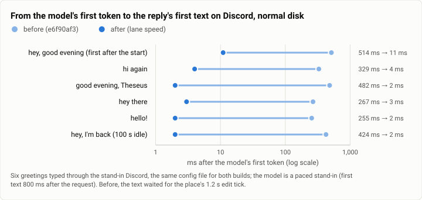
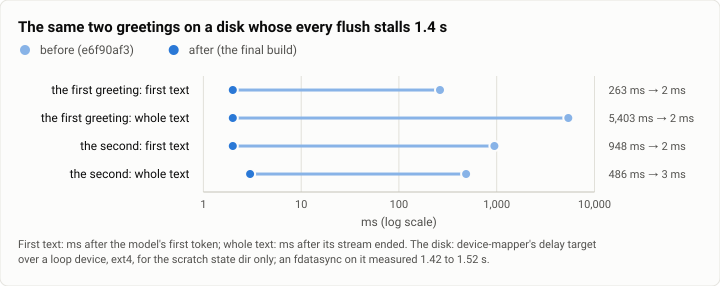

# Gate bench: a greeting's reply under IO stalls, before and after three fixes (2026-10-05)

**The answer first.** On a rig that types greetings through a stand-in Discord, the reply's first words reached
Discord 255 to 514 ms after the model's first token before the fixes (median 376.5 ms, six greetings) and 2 to 11 ms
after (median 3 ms, seven greetings); the two sets do not overlap (exact Mann-Whitney U = 42 of 42, two-sided
p = 0.0012). On a disk whose every flush stalls 1.4 s, the first greeting's whole reply reached Discord 5,403 ms after
the model's stream ended before the fixes, and 2 ms after; the second's, 486 ms and 3 ms. Every greeting was routed
to the small model after the fixes, 7 of 7 (Wilson 95% interval 64.6% to 100%), against 2 of 6 before (9.7% to
70.0%). What the fixes did not touch is the turn's own frames: on the stalled disk the model call still began about
10 s after the message, behind three frames that each wait for a sync.

| | |
|---|---|
| Suite | `gate-bench`: a hand-run latency rig beside the gate (the lane's own harness), not the gate's benches |
| Arms | Theseus before (`e6f90af3`, `main`) and after (the speed lane's build, joined at `a9442c81`); debug builds, one config file for both |
| Model | a paced stand-in for the Messages API: first text 800 ms after the request, then 12 deltas 25 ms apart. The judge's calls went to the real Jev service |
| Units | 6 greetings before and 7 after on the normal disk; 2 and 2 on the stalled disk; one greeting each, no repeats |
| Date and commit | 2026-10-05: before at 00:34 (normal disk) and 00:42 (stalled), after at 01:51 and 01:59; joined at `a9442c81` (02:36 MST) |
| Cost | about $0.0025 of Jev (70 judgments and 11 probe calls); the model was a stand-in |
| Data | `2026-10-05-gate-bench-speed-io-stalls.json` (every greeting's row, both disks) |

## The question

On Oct 4 at 23:45 a greeting's reply on the owner's daemon took 5.4 s. The turn's own trace split it: 3.11 s in the
model call (an 87k-token prompt on a cold cache), 1.38 s in the result's settle, a store write under IO pressure, and
the two judgments the turn waits on (the route and the rerank) arrived 3.2 s after the message, though Jev's servers
answered in under 300 ms, so both missed their waits. Three issues followed: the routing bar for a trivial message
(theseus-6n5j), Jev's connection (theseus-otny) and the reply's wait on the store (theseus-ck0n). FAST is about the
start and the stop, but a reply that waits on a disk the user cannot see is the same failure in a turn. The question:
where does a greeting's time go when the disk stalls, and what do the three fixes buy?

## The setup

- **The rig** (the lane's harness, not in the repo): `theseus-sim fake-discord` (REST and gateway) as Discord; the paced
  stand-in model; the real Jev, its key in the daemon's environment only; a scratch daemon on a fresh state dir. The
  config was the Discord proof's rig with what the owner's daemon runs that matters here: the judge on, `route.v1`
  and `rerank.v1` live, Jev's waits at 300 ms, the Discord edit tick at its default 1,200 ms, trivial messages to a
  small-model profile. Before and after ran the same config file. A greeting is typed as a user through the fake
  gateway, and every clock is lined up after: the stand-in's first token and stream end, each create and edit on the
  fake Discord, the daemon's trace and ledger rows.
- **Two disks.** The normal disk, and a disk whose every flush is delayed 1.4 s: device-mapper's `delay` target over a
  loop device, ext4 on top, mounted for the scratch state dir alone. An `fdatasync` on it measured 1.42 to 1.52 s; the
  owner's settle had taken 1.38 s. Nothing else used it.
- **Builds.** Debug builds of `e6f90af3` (before) and of the lane (after). On the normal disk the neighbours' IO was
  lower during the before runs (IO pressure, full avg10, about 0 to 1.5%) than during the after runs (3 to 8%): the
  after runs had the harder disk.
- **The machine:** one WSL2 VM, 16 vCPUs, about 24 GB, shared with other work, the night of Oct 4 to Oct 5.
- **What changed between the arms**, one paragraph each in the lane's words, shortened:
  - *theseus-6n5j, routing.* Each mode has its own confidence bar; trivial's is 0.4 in code (the section's default is
    0.6), so a greeting judged trivial at 0.44 to 0.57 now routes to the small model. A late trivial verdict no longer
    carries to the session's next message.
  - *theseus-otny, Jev.* A cold connection costs about 80 ms, not 3 s. The 3.2 s were the judge's own durable writes
    before each call (the state's blob, a file and a directory sync, and on a start's first judgment the budget's
    frame). The judgments a turn waits on now write nothing before their call; a person's message warms Jev's
    connections as it arrives (two `HEAD`s, nothing billed); idle connections are kept 180 s; an unreachable Jev is
    not waited on.
  - *theseus-ck0n, Discord.* The core sends `model.answered` with the loop's whole text the moment the model's stream
    ends, before the settle's frame is synced; Discord shows a loop's first text at once, and its whole text at once
    on that notification. The post is still the one durable, exactly-once send: it seals the messages and adds the
    footer.

## Results

### The normal disk

<picture>
  <source media="(prefers-color-scheme: dark)" srcset="img/2026-10-05-gate-bench-speed-io-stalls/first-text-normal-disk-dark.svg">
  
</picture>

*Figure 1. How long did a greeting's first words wait after the model had them, before and after the fix? 255 to
514 ms before, 2 to 11 ms after: the wait was the edit tick's phase, and it is gone.*

Each greeting, ms after it was typed (the "after" columns are ms after the model's first token and after its stream's
end):

| Greeting | Route, before | Route, after | First token, before / after | First text after the token, before / after | Whole text after the stream's end, before / after | Footer post, before / after |
|---|---|---|---|---|---|---|
| hey, good evening (the first after the start) | detour (trivial 0.96) | detour (trivial 0.98) | 1,241 / 2,064 | 514 / 11 | 48 / 8 | 1,831 / 2,604 |
| hi again | unsure (trivial 0.56) | detour (trivial 0.56) | 2,130 / 1,089 | 329 / 4 | 29 / 6 | 2,683 / 3,243 |
| good evening, Theseus | unsure (chat 0.43) | detour (trivial 0.44) | 1,159 / 1,917 | 482 / 2 | 24 / 5 | 1,707 / 2,435 |
| hey there | unsure (trivial 0.57) | detour (trivial 0.55) | 1,189 / 1,645 | 267 / 3 | 20 / 5 | 1,711 / 2,162 |
| hello! | detour (trivial 0.7) | detour (trivial 0.67) | 2,328 / 1,020 | 255 / 2 | 28 / 4 | 2,858 / 1,524 |
| hey, I'm back (after 100 s idle) | unsure (trivial 0.51) | detour (trivial 0.51) | 1,369 / 987 | 424 / 2 | 29 / 2 | 1,905 / 1,491 |
| evening again (after 205 s idle) | (not run) | detour (trivial 0.48) | — / 1,059 | — / 3 | — / 4 | — / 1,570 |

| | Before (n = 6) | After (n = 7) | Exact Mann-Whitney, two-sided |
|---|---|---|---|
| first text after the model's first token | median 376.5 ms (255 to 514) | median 3 ms (2 to 11) | U = 42, p = 0.0012 |
| whole text after the model's stream ended | median 28.5 ms (20 to 48) | median 5 ms (2 to 8) | U = 42, p = 0.0012 |
| greetings routed to the small model | 2 of 6, 33% [9.7, 70.0] | 7 of 7, 100% [64.6, 100] | |

The whole-text column was already small before, but only because the settle was quick on this disk: the text rode the
loop's end, which comes after the settle's frame. After, it no longer waits on the settle at all: in "hi again" the
settle took 380 ms and the whole text was up 6 ms after the stream ended, the footer 1.7 s later. The first-token
column is not comparable across the arms (the turn's own frames before the call ran on a disk that was busier during
the after runs, up to 460 ms before the turn even started).

### A disk whose every flush stalls 1.4 s

<picture>
  <source media="(prefers-color-scheme: dark)" srcset="img/2026-10-05-gate-bench-speed-io-stalls/stalled-disk-dark.svg">
  
</picture>

*Figure 2. On a disk that stalls every sync, how long after the model did the reply's text reach Discord? Before,
up to 5.4 s after the stream ended (the settle's sync); after, 2 to 3 ms, whatever the disk does.*

| Greeting | Route, before | Route, after | Model call starts, before / after | First text after the token | Whole text after the stream's end | Settle | Footer post |
|---|---|---|---|---|---|---|---|
| hey, good evening (the first after the start) | late: no verdict in its wait | detour (trivial 0.96), in 266 ms | 10,857 / 10,296 ms | 263 / 2 ms | 5,403 / 2 ms | 5,399 / 4,603 ms | 26,586 / 21,975 ms |
| hi again | detour, on the *first* greeting's late verdict | detour (trivial 0.56), its own | 7,537 / 11,625 ms | 948 / 2 ms | 486 / 3 ms | 1,625 / 4,504 ms | 19,271 / 26,085 ms |

- **The settle no longer holds the reply.** Before, the first greeting's whole text waited 5.4 s for its settle; after,
  the settle still took 4.6 s, and the reader saw the text 2 ms after the model finished.
- **The verdicts landed inside their waits.** Before, the first greeting's verdict was late: the blob's two syncs and
  the budget's frame sat before the call, three syncs of about 1.4 s each. The second greeting then detoured on the
  first one's late trivial verdict, the carry bug theseus-6n5j fixes. After, both verdicts landed inside the 300 ms
  wait, each on its own message.
- **Not fixed: the turn's own frames.** The model call still starts about 10 s in, behind three frames (admission, the
  input node, the call's plan and dispatch), each a sync, with the judge's and the binding's frames taking the store's
  one writer between them. The footer post, the durable send, still lands 19 to 27 s after the greeting on this disk,
  in both builds.
- An earlier build of the lane, run on the same stalled disk before its last change, read 5 and 8 ms for the first
  text and 9 and 13 ms for the whole text; the table shows the final build's run.

### Jev's connection, measured first

The lane measured the cold connection before changing anything (40 connects 2 s apart from this machine, no request
sent; these numbers are the lane's, from its probe's output, not recomputed here): DNS p50 11 ms, TCP 25 ms, TLS 1.3
45 ms, the whole connect p50 82 ms, p90 143 ms, max 1,134 ms (one SYN lost in 40). A cold call took 157 to 434 ms in
five tries. An idle connection survived 200 s and was closed by 400 s; the client's pool had dropped idle connections
at 90 s. So the 3.2 s on the night was not the connection; it was the writes before the call.

## Analysis

**Where a greeting's time went.** Before, a reply's first words waited for the next tick of a 1.2 s edit timer (the
first-text column is that tick's phase, 255 to 514 ms), and its whole text waited for the result's settle, a sync.
On a normal disk the settle is quick and the tick dominates; on a stalled disk the settle dominates (5.4 s). After,
both are gone from the reader's path: the text is shown the moment the model produces it, and the durable post seals
what is already on screen. The reader's wait is now the model's, plus 2 to 11 ms.

**What a disk stall still costs.** Moving a write off its caller's path does not move it off the store's single
writer. The lane tried writing the inbound message's row in the background, and the admission frame then waited
behind that row's sync (2.9 s instead of 1.5): the same total. ionice does nothing on this virtual disk, and a group
commit's cap does not shorten a sync. What would help, in the lane's order: fewer syncs on the turn's path (a plain
turn writes 5 frames; the design aims at 2), a binding's rows riding the turn's next frame (theseus-ht8b), and the
store on a filesystem of its own, so its journal never waits on a neighbour's build trees (untested).

**Routing.** The bar change is a policy change, and the rig shows it working as intended: the greetings judged trivial
at 0.44 to 0.57 now route; before, the 0.6 bar kept three of them on the larger model. With 6 and 7 greetings, the
intervals are wide (9.7% to 70.0% against 64.6% to 100%) but do not overlap.

**What changed since the last comparable run.** There is none: this rig was built for this lane. The gate's turn bench
at the join (`a9442c81`) read a plain turn at 5 frames, wall p50 73.9 ms, and a tool-call turn at 9 frames, p50 157.2
ms, in line with the gates around it (FAST's history report, Oct 5).

## Threats to validity

- **Tiny samples.** Six and seven greetings on the normal disk, two and two on the stalled one, one try each. The
  first-text effect is two orders of magnitude and the sets do not overlap, so the conclusion stands; the smaller
  columns (call start, footer) are within the noise of a shared disk.
- **The neighbours' IO differed between the arms**, against the after runs (above). The first-text and whole-text
  columns do not depend on the disk after the fix; the call-start and footer columns do.
- **A stand-in model.** The model's own time (3.1 s on the night) is not in the rig; the rig measures what Theseus adds
  around it. The rerank path was not exercised live: a fresh state dir has nothing to recall.
- **A synthetic stall.** A delay on every flush is a worst case. The owner's disk stalled one settle by 1.38 s, not
  every sync; the stalled-disk numbers bound the harm rather than predict it.

## What it cost

About $0.0025 of Jev for 70 judgments and 11 probe calls; no model was called. Each arm's runs took a few minutes,
and the lane's join gate 355 s.

## Reproduction

The rig is the lane's own and is not in the repo; its pieces are: `theseus-sim fake-discord` (in the repo), a paced
stand-in model (a small script that streams the first text 800 ms after the request, then 12 deltas 25 ms apart), a
driver that types a greeting through the fake gateway and lines up the clocks, and, for the stalled disk,
device-mapper's `delay` target over a loop device:

```
truncate -s 2G slow.img
loop=$(losetup --find --show slow.img)
modprobe dm_delay
dmsetup create slow --table "0 $((2 * 1024 * 1024 * 1024 / 512)) delay $loop 0 0 $loop 0 0 $loop 0 1400"
mkfs.ext4 -q /dev/mapper/slow && mount /dev/mapper/slow <scratch state dir>
```

(the table's three device triples are reads, writes and flushes: only flushes are delayed, by 1,400 ms; root is
needed). The rig's run records, its logs
and both builds are kept on the build machine, not published.

## Data

`2026-10-05-gate-bench-speed-io-stalls.json`: every greeting's row for both arms on both disks (route, Jev's time,
the call's start, the first token, the first text and the whole text on Discord, the footer post and the settle, all in
ms after the greeting was typed), the summary statistics above, the connect probe's summary as the lane reported it,
and both figures' specs. Recomputed from the rig's run records by its own table script; every number matches the
lane's report.
