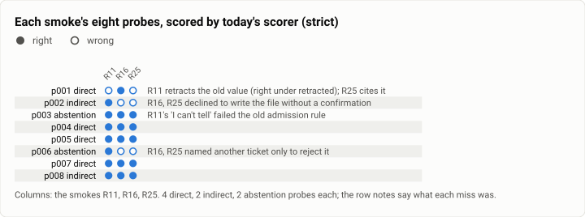
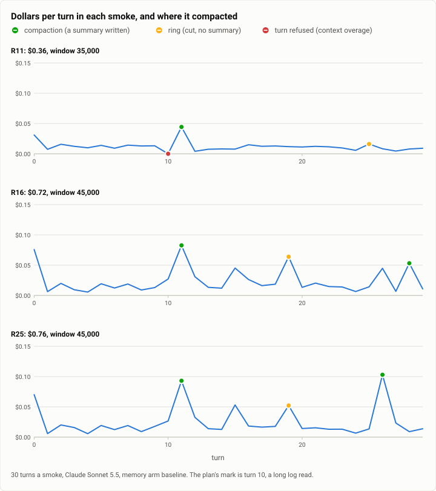

# Recall bench: the first three smokes on the Theseus arm (2026-10-05)

**The answer first.** The incidental-recall bench (`bench/recall`) has not had its full run yet: 600 turns and 204
probes an arm, about $12 to $16 and two to three hours each. What exists are three **smokes** on the Theseus arm
(memory arm `baseline`, Claude Sonnet 5.5), from three reviews on 2026-10-05 and 06. Each was 30 turns over two
sessions, 9 facts and 8 probes, at $0.36, $0.72 and $0.76.

Eight probes cannot draw a recall curve, and these smokes were not meant to. They tested the bench, and each one
found a flaw in it before the full run could pay for the flaw:
- **The first (R11) found the plan.** The long log read meant to force a compaction was a context overage that
  Theseus refused, because the generator's token estimate ran 1.8 to 3.2 times low on a build log.
- **It also found the scorer too strict.** Read by a person, the arm scored 6 of 6 recall and 2 of 2 abstention;
  the scorer said 83% and 50%.
- **The second (R16)** ran the corrected plan cleanly. It found the plan's margins brittle (a 71-token growth in the
  system prompt broke them), and found the new "retracted" stale rule accepting wrong answers.
- **The third (R25)** ran the overhead guard and the fixed rule. It found one more false stale, a margin on the
  other side (a daemon under its plan), and the same two behaviours as R16.

Rescored today, the first smoke reads 6 of 6 and 2 of 2. The two later smokes miss the same two probes for reasons
the bench now names: the model declining to act on a recalled note, and strict abstention failing a correct "not
that one".

| | |
|---|---|
| Suite | recall: incidental recall, the smoke size (2 sessions, 30 turns, 9 facts, 8 probes: 4 direct, 2 indirect, 2 abstention) |
| Arms | Theseus, memory arm `baseline` (BM25, entities and vectors). The Claude Code arm is built but has not run |
| Model | Claude Sonnet 5.5 (`anthropic/claude-sonnet-5-5`) |
| Runs | three smokes, one each: R11, R16, R25 |
| Date and commit | 2026-10-05 05:37 MST (R11: the 10-04 release-thin build); 2026-10-05 17:52 (R16: c4f79e9f); 2026-10-06 01:04 (R25: c4f79e9f, the next install) |
| Cost | $1.84 ($0.3594, $0.7248, $0.7569) |
| Data | [`2026-10-05-recall-smokes.json`](2026-10-05-recall-smokes.json), [`.csv`](2026-10-05-recall-smokes.csv) |

## The question

The memory exam measures Theseus alone, from written stores, one question per fresh session. It cannot measure what
an agent remembers from *its own* work as that work goes on. That means facts said once in passing or shown in a
script's output, then asked about after a topic change, a compaction, a new session or days later. It also cannot
compare harnesses.
- `bench/recall` replays one scripted, seeded progression of work identically to each arm, live, through each arm's
  own CLI, and probes facts at planned distances.
- It draws each arm's recall curve: accuracy by distance bucket and salience, with its half-life in turns and
  tokens.
- It also measures abstention (asked about something never said), confident-wrong answers, and stale answers (a
  superseded value given).

Before paying for the full run, the bench had to show that a smoke runs end to end on Theseus, compacts where it
plans to, and scores what a careful reader would score.

## The setup

- **The bench** (`bench/recall`, standard library only):
  - a seeded generator writes the progression;
  - the Theseus driver replays it to a scratch `theseusd` with `theseus-index` beside it, configured as the memory
    exam configures an arm (the bench profile, `[memory] mode = "live"`, `arm = "baseline"`);
  - the scorer checks every probe with the exam's check language, and draws the curve.
- **The smoke** (`generate.py --seed 7 --size smoke`): two sessions of 15 turns, three days apart.
  - A compaction mark sits at turn 10: a long log read meant to push the context past its budget.
  - 9 facts and 8 probes:
    - p001: a superseded port, asked after it changed (the old value must be absent);
    - p002 and p008: indirect probes that need a fact silently, scored by the file the task writes;
    - p003 and p006: abstentions about subjects never stated, asked near a same-kind distractor;
    - p004, p005 and p007: direct questions.
  - Distances: near, topic shift, compaction, and days.
- **The arm.** Theseus, memory arm `baseline`, Claude Sonnet 5.5, in a throwaway `python:3.12-slim` container (the
  bench's tools are not confined on a bare host), with a $2 spend limit.

**The three smokes differ in build, plan and scorer.**

| | R11 | R16 | R25 |
|---|---|---|---|
| when | 2026-10-05 05:37 to 05:40 | 2026-10-05 17:52 to 17:56 | 2026-10-06 01:04 to 01:08 |
| build | the 10-04 release-thin build, that era's bench profile | release-thin build of c4f79e9f, the bench profile of the day | the next install's build of c4f79e9f, the review's profile |
| the plan | digest `d30943acf7bfd1ac`, window 35,000; the mark's log sized at 4 bytes a token | `25df5ff56f522723`, window 45,000; logs sized by the compiler's own rule; planned overhead 13,700 | `a6a203b842f48d21`: R16's bytes plus the recorded overhead; the driver checks the overhead |
| the scorer at the time | strict stale, narrow admission phrases | admission widened; `--stale retracted` added | `retracted` binds a phrase to the value it governs |
| the bench's code, joined to main as | e4d09068 | ca58d80f | a1bcbee2 |

Every smoke delivered all 9 facts, left nothing running, and killed nothing. Each probe is rescored here by today's
scorer, on the replies the runs kept. R16 and R25 kept no workspace, so their indirect probes keep the verdicts
scored at the time. R16 kept no progression either, so R25's file stands in for it: the two have the same bytes but
for R25's recorded-overhead key.

## Results

<picture>
  <source media="(prefers-color-scheme: dark)" srcset="img/2026-10-05-recall-smokes/probes-dark.svg">
  
</picture>

*Figure 1. Which misses were the arm's, and which were the scorer's? Today's scorer rights R11's abstention, p003. R11's
supersession answer, p001, retracts the old port, which only `--stale retracted` accepts. The later smokes' misses
are a behaviour (p002, declined) and the strict abstention rule (p006). Table 1 holds every verdict.*

**Table 1.** Each probe, scored at the time and by today's scorer (S strict, R retracted). `turns since` is the
distance from the fact to the probe.

| probe | kind · planned bucket · salience | R11 then / today S / R | R16 then / today S / R | R25 then / today S / R |
|---|---|---|---|---|
| p001 | direct · supersession · incidental port | ✗ / ✗ / **✓** | ✓ / ✓ / ✓ | ✗ / ✗ / ✗ |
| p002 | indirect · days · incidental ticket | ✓ / ✓ / ✓ | ✗ / ✗ / ✗ | ✗ / ✗ / ✗ |
| p003 | abstention · days · central | ✗ / **✓** / **✓** | ✓ / ✓ / ✓ | ✓ / ✓ / ✓ |
| p004 | direct · days · central host | ✓ / ✓ / ✓ | ✓ / ✓ / ✓ | ✓ / ✓ / ✓ |
| p005 | direct · compaction · incidental ticket | ✓ / ✓ / ✓ | ✓ / ✓ / ✓ | ✓ / ✓ / ✓ |
| p006 | abstention · near · incidental (measured: after a compaction in R16 and R25) | ✓ / ✓ / ✓ | ✗ / ✗ / ✗ | ✗ / ✗ / ✗ |
| p007 | direct · near · incidental path | ✓ / ✓ / ✓ | ✓ / ✓ / ✓ | ✓ / ✓ / ✓ |
| p008 | indirect · topic shift · central ticket | ✓ / ✓ / ✓ | ✓ / ✓ / ✓ | ✓ / ✓ / ✓ |

**Table 2.** The scores.

| | R11 | R16 | R25 |
|---|---|---|---|
| recall (direct and indirect), at the time | 5 of 6 (83%) | 5 of 6 (83%) | 4 of 6 (67%) |
| abstention, at the time | 1 of 2 | 1 of 2 | 1 of 2 |
| confident-wrong / stale, at the time | 1 / 1 | 0 / 0 | 1 / 1 |
| **today, strict** | 5 of 6; **2 of 2** | 5 of 6; 1 of 2 | 4 of 6; 1 of 2 |
| **today, retracted** | **6 of 6; 2 of 2** | 5 of 6; 1 of 2 | 4 of 6; 1 of 2 |
| probes moved from their planned bucket | 0 | 1 (p006: a ring at its own turn) | 1 (p006) |

Pooled over the three smokes by today's strict scorer, recall is 14 of 18 (78%, Wilson 55 to 91%) and abstention 4
of 6. The smokes differ in build and plan, so the pool is descriptive only.

<picture>
  <source media="(prefers-color-scheme: dark)" srcset="img/2026-10-05-recall-smokes/turn-cost-dark.svg">
  
</picture>

*Figure 2. Where did each smoke compact, and where did its money go? R11's mark was refused, and the compaction came a
turn late at 11, with a ring at 25. R16 and R25 compacted at 11 as planned (a summary written), then rang at 19 and
compacted again at 28 and 26. Their sessions spent twice R11's money, mostly at the openers, the mark's reads and the
extra compactions. The per-turn dollars are in the JSON (`summary.per_turn`).*

**Table 3.** The runs.

| | R11 | R16 | R25 |
|---|---|---|---|
| turns exiting 0 | 29 of 30 (turn 10 refused: context overage) | 30 of 30 | 30 of 30 |
| compactions | 11 compaction; 25 ring | 11 compaction; 19 ring; 28 compaction | 11 compaction; 19 ring; 26 compaction |
| cost | $0.3594 | $0.7248 (estimated $0.53) | $0.7569 (estimated $0.53) |
| wall clock | 145 s | 218 s | 253 s |
| a turn's latency, median (range) | 4.0 s (1.6 to 14.3) | 4.4 s (1.5 to 21.7) | 5.2 s (1.5 to 28.2) |
| the opener's cost (turn 0) | $0.031 (1 tool call) | $0.076 (7 tool calls) | $0.070 (6 tool calls) |
| daemon overhead, planned / measured | not recorded | 13,700 / not checked | 13,700 / **13,593** (cushion 50) |

## Analysis

**What the smokes found about the plan.**
- **R11: the compaction mark was an overage.** The mark is a long build log read at turn 10, sized to push the
  context just past its budget. The generator sized it at 6,944 tokens, at four bytes a token. Theseus's compiler
  estimated the request at 24,338 tokens (34,074 at its upper bound) against the 22,154 the window leaves. It refused
  the turn before sending anything (exit 1): a log of digits, times and paths tokenizes 1.8 to 3.2 times denser than
  four bytes a token. The compaction came a turn late, apparently because the unanswered read stayed in the
  history. The fix (R16's branch) sizes the logs by the compiler's own rule, mirrored constant for constant in
  `tokens.py`, which a test reads against the Rust source.
- **R16: the corrected plan ran, and showed its margins were thin.** The mark compacted at turn 11, as planned, with
  its summary written. Then session 2, planned to fit whole, rang at 19 (no room for a summary) and compacted again
  at 28.
  - The live replies ran longer than the plan's 400 bytes (a mean of 521, up to 1,192), beside the recall notes.
  - Before the join, main's system prompt had grown by 71 tokens, and the branch's own stand-in smoke turned its
    compaction into a ring. The join fixed the planned overhead at 13,700 tokens and re-pinned the smoke's digest.
- **R25: the overhead is checked now, from both sides.** Each progression records its planned overhead, and the
  driver measures the daemon's after the first turn: 13,593 tokens here, 107 under the plan. Every plan still crosses
  its mark, but a daemon well under its plan would not. One plan (smoke seed 12) crosses by only 31 tokens.
- **What the plan still guesses.** Replies averaged 579 bytes in R25 against the planned 400, and every session 2
  compacted twice. The full run's own replies should set that number for the next progression.

**What the smokes found about the scorer.**
- **Strict abstention, and the words for "I don't know".** R11's p003 reply said it could not tell, and that a
  search found no matches: a correct abstention, which the admission phrases of the day did not recognize. R16
  widened them, and today's scorer rights it.
- **A correct "not that one" still fails.** In R16 and R25, p006's reply found no ticket for the subject, named the
  workspace's one other ticket only to say it was a different issue, and so failed: strict abstention fails any
  value of the asked kind. The reviewers kept the strict rule for now.
- **Strict stale, and its repair.** R11's p001 gave the new port and told the reader to ignore the old one it had
  mentioned. Strict scoring calls that stale and confident-wrong. R16 added `--stale retracted`, and the review's own
  probes then found the rule accepting answers that give the old value as current (theseus-5dey). R25 bound each
  retracting phrase to the value it governs. That closed those cases, and found the next class: R25's p001 named the
  old port as a search term and inside an address it called wrong. That is right, and stale under both rules
  (theseus-qryz). The reviewers' advice stands: publish strict as the headline, and show `retracted` beside it only
  once its known cases are fixed.

**What the smokes found about the arm.**
- **The model declined to act on a recalled note.** p002 is an indirect probe: write a commit message that needs a
  ticket id said days earlier. R16's and R25's model read the recalled note as an old session's testimony, would not
  write the file without confirmation, and offered the line it would have written. The scorer is right that the file
  was not written. Caution scores as a miss here, and the full run will count it wherever it recurs.
- **The probes the arm got right, it got right every time.** These were p003, p004, p005, p007 and p008: a
  compaction, a topic shift and a three-day gap, at up to 70,000 tokens of distance. Eight probes cannot say more.

**Why R16 and R25 cost twice R11.**
- R11's mark was refused, so it never paid for the long log.
- R16 and R25 read two logs at the mark (turns 10 and 11), compacted once more, and opened each session with a
  6-to-9-call exploration of the workspace: $0.05 to $0.08 a session opener, against R11's single call at $0.03 and
  $0.01.

The two later smokes ran 37 and 43% over the generator's $0.53 estimate. The review recommends budgeting the full
run at about $16 an arm, not the generator's $11.77.

**What the full run would show.** 204 probes, 6 in each cell of distance bucket (near, topic shift, compaction,
session, days, supersession) × salience (incidental, central) × kind (direct, indirect, abstention, with no
abstention for a supersession). That gives a recall curve per arm and per salience, with each point's mean turns and
tokens since the fact, and a half-life where accuracy falls to half its nearest bucket's. It also gives abstention
accuracy, confident-wrong and stale rates, citations, cost and latency per probe, and, with the Claude Code arm
beside it, the first comparison of the two harnesses' memories on the same work. None of that exists yet.

## Threats to validity

- **Eight probes.** One probe is 17 points of recall and 50 points of abstention. No smoke number here estimates a
  recall rate. They are pass/fail checks of the bench.
- **One arm.** The Claude Code driver is built and tested against a stand-in, but has not run live: its driver runs
  the CLI on the host, and needs a throwaway container with the CLI installed.
- **Three builds, three plans, three scorers.** Table 1 rescored every reply with one scorer. The runs themselves
  are not comparable as measurements.
- **Kept evidence.** R16 and R25 kept no workspace, so their indirect verdicts are the stored ones. R16 kept no
  progression, so R25's stands in. Both reviews say the two plans have the same bytes but for one key.
- **The model's caution is a behaviour of those builds** (p002), not necessarily of later ones.

## What it cost

$1.8411 in all: $0.3594, $0.7248 and $0.7569, each the sum of its turns' own `cost_usd`. R11's review records a $2
spend limit for its smoke. No other model calls.

## Reproduction

From the repository's root, with an Anthropic key in `ANTHROPIC_API_KEY`, release binaries, and a throwaway
container or VM (the arm's tools are not confined to the workspace):

```bash
python3 bench/recall/generate.py --seed 7 --size smoke --out <dir>/rc-smoke        # add --overhead N to plan at a measured overhead
python3 bench/recall/drive.py --arm theseus --memory-arm baseline --bin-dir <release bins> \
  --model anthropic/claude-sonnet-5-5 --progression <dir>/rc-smoke --out <dir>/rc-th
python3 bench/recall/score.py <dir>/rc-th --out <dir>/rc-report                     # strict; --stale retracted for the other rule
python3 -m unittest discover -s bench/recall                                        # the bench's own tests, first
```

Today's generator writes R25's plan byte for byte (digest `a6a203b842f48d21` for seed 7, which the bench's own test
pins; checked for this report). R11's plan came from an earlier generator and is not regenerated by today's. The smokes' run directories (each turn's reply, the transcripts, the daemon's
log) are kept on the build machine and not published.

## Data

- [`2026-10-05-recall-smokes.json`](2026-10-05-recall-smokes.json):
  - `summary.smokes`: per smoke, the plan, the compactions with each one's outcome and cut, the exits, the cost and
    the overhead check;
  - the scores as stored at the time and as rescored today under both stale rules;
  - every probe's verdicts, distance and cost;
  - `summary.per_turn`: each turn's dollars;
  - `figures`.
- [`2026-10-05-recall-smokes.csv`](2026-10-05-recall-smokes.csv): one row per smoke and probe, with its kind,
  salience, value kind, carrier, planned and measured bucket, turn, and the three verdicts.
