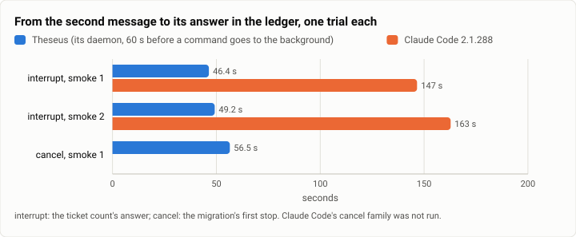
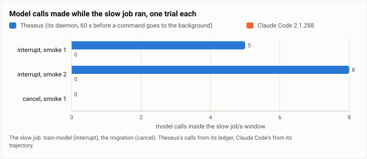

# Async: the async bench's smokes, before its first full run (2026-10-05 to 2026-10-06)

**The answer first.** These were smokes, not a run: six model trials in all (four Theseus, two Claude Code), one per
family and arm at a time, on three of the bench's six task families, plus each family's oracle twice. Every trial
earned its reward, and where the ledger was kept, none left a step unfinished or did an effect twice. What they show is the shape of the two
harnesses' answers to a message that arrives mid-task. Theseus acted on it 46 to 56 seconds after it arrived; Claude
Code 147 and 163 seconds after, about 3.2 to 3.3 times later, because it ran the long command in the foreground and answered
only when the command returned. Theseus paid for its promptness in model calls while the job ran (5 and 8 calls,
31,000 and 53,000 tokens, where Claude Code made none), and in dollars ($0.032 and $0.044 an interrupt trial against
$0.028). Theseus's number is set by a setting more than by its design: a command holds its turn for 60 s before it
moves to the background, and the message waits for that. The full run, all six families on both arms with two
attempts (about 24 trials and $1), has not happened.

| | |
|---|---|
| Suite | The async bench (`bench/async`): six local Harbor task families where concurrency is the point |
| Arms | Theseus (`async_agents:TheseusAsync`: its own daemon, jobs and continuations) · Claude Code 2.1.288 (`async_agents:ClaudeCodeAsync`: stream-json input, background commands) · each family's oracle (`-a oracle`) |
| Model | Claude Sonnet 5.5 |
| Trials | 6 model trials (interrupt 4, cancel 1, fan-out 1) and 12 oracle trials (all six families, twice) |
| Dates and commits | 2026-10-05 05:23 to 2026-10-06 00:53 (UTC−7), in three smokes during the bench's reviews; Theseus's binaries `079f1db` throughout |
| Cost | $0.23 (the oracle is free) |
| Data | [`2026-10-06-async-smokes.json`](2026-10-06-async-smokes.json), [`.csv`](2026-10-06-async-smokes.csv) (one row per model trial) |

## The question

Theseus is built to work while it waits: its commands go to the background, a daemon owns the waits, and a job's
late result comes back as a continuation. The async bench asks whether that shows on tasks where concurrency is the
point: parallel slow steps, a long wait, a message mid-task, a fan-out with failures, a cancel, a contended
service. Before spending on a full run, each smoke asked a narrower question: do the tasks, their tamper-evident
ledger and the scorer work end to end, and does each arm's way of taking a second message work at all?

## The setup

- **The bench** (`bench/async/README.md`): six families, each a Harbor task in a `python:3.12-slim` image with its
  tools. Every tool appends to a ledger outside the working directory, with a hash chain the verifier checks;
  each step's start, end and drawn duration are there, so the scorer can compute an ideal wall time per trial.
  - `parallel`: six slow digests, then an aggregate. `wait-tax`: one build of random length (60 to 180 s).
  - `interrupt`: a training run of 150 to 210 s; 20 s after it starts, the driver asks for the open ticket count.
  - `fanout`: six parts, two failing once. `cancel`: a 15-minute migration; 15 s in, the driver asks to cancel it
    and leave nothing running. `contention`: deposits through a service that takes two at once.
- **The scores:** success (the verifier's reward); wall over the ideal; the wait tax (model calls and tokens inside
  the slow job's window); responsiveness (the second message to the right answer's ledger line); orphans and
  duplicated effects; the harness's CPU and peak RSS (from the efficiency record); dollars.
- **Theseus** keeps one daemon for the trial: the instruction is the first `ask -s`, the injection a second, which
  queues until the running turn ends; a command that runs past `[tools] proc_sync_secs`, 60 s (the product's
  default), goes to the background and ends the turn. The trial ends when nothing runs, waits or is due.
  Its binaries were the first full run's static build (`079f1db`) with that commit's profile in every smoke, since
  no static build of a later `main` existed; each smoke tested the bench's own code around it.
- **Claude Code 2.1.288** reads its input as stream-json from a pipe: the instruction is the first message, the
  injection a second, and the input closes once an answer follows the last message.
- **Limits:** $1.00 and 200 calls or turns a trial (Theseus's spend limit and loop cap; Claude Code's budget and
  turns), and each family's agent timeout (10 to 15 minutes).
- **Machine:** one WSL2 VM, 16 vCPUs, Docker, shared with the project's builds.
- **The smokes**, each run by the review of a step of the bench's construction:
  1. **2026-10-05, 05:23 to 06:01:** the oracle on all six families; Theseus on interrupt and cancel; Claude Code on
     interrupt.
  2. **2026-10-05, 17:35 to 17:52**, after both arms were measured by the efficiency record: the oracle again;
     interrupt on each arm, sampled. A separate check (not a trial, $0.017) confirmed that each of Claude Code's
     answers reports the session's usage so far, as the record reads it.
  3. **2026-10-06, 00:50:** Theseus on fan-out, sampled, after the record learned to count a cut call's estimate and
     a task's tool calls. A free probe on a stand-in model checked the cut call: a stop mid-stream recorded one
     estimated call ($0.0028), counted apart.
  4. **2026-10-06, afternoon:** no async trial; a fourth arm's async adapter (Pi, in its RPC mode with a steering
     prompt) was built and tested without a model.

## Results

| Smoke | When (UTC−7) | Arm | Family | Reward | Ended | Wall | Ideal | Wall / ideal | Wait tax: calls, tokens | Responsiveness | Orphans, duplicated effects | Model calls | Tool calls | Dollars | Harness CPU, peak RSS |
|---|---|---|---|---|---|---|---|---|---|---|---|---|---|---|---|
| 1 | 2026-10-05 05:29 | Theseus | cancel | 1 | settled | 90 s | 18 s | 4.91 | 0, 0 | 56.5 s | 0, 0 | 8 | 5 | $0.0423 | – |
| 1 | 2026-10-05 05:29 | Theseus | interrupt | 1 | settled | 187 s | 175 s | 1.07 | 5, 30,771 | 46.4 s | 0, 0 | 9 | 5 | $0.0320 | – |
| 1 | 2026-10-05 05:35 | Claude Code | interrupt | 1 | Harbor's timeout | 900 s | 162 s | 5.56 | 0, 0 | 146.6 s | 0, 0 | 4 | 3 | $0.0277 | – |
| 2 | 2026-10-05 17:35 | Theseus | interrupt | 1 | settled | 320 s | 198 s | 1.62 | 8, 52,687 | 49.2 s | 0, 0 | 13 | 8 | $0.0441 | 0.56 s, 27.5 MiB |
| 2 | 2026-10-05 17:43 | Claude Code | interrupt | 1 | settled | 192 s | 179 s | 1.07 | 0, 0 | 162.8 s | 0, 0 | 4 | 3 | $0.0276 | 2.15 s, 208.9 MiB |
| 3 | 2026-10-06 00:50 | Theseus | fanout | 1 | settled | 171 s | – | – | – | – | – | 7 | 11 | $0.0359 | 0.33 s, 24.4 MiB |

Smoke 1's scores are recomputed from its job directories with today's scorer, and match what was reported then.
Smoke 2's and 3's job directories were not kept; smoke 2's scores are the scorer's own output kept beside its
records, and smoke 3 kept only its record (no ledger), so its ideal and responsiveness are unknown.

<picture>
  <source media="(prefers-color-scheme: dark)" srcset="img/2026-10-06-async-smokes/responsiveness-dark.svg">
  
</picture>

*Figure 1. How soon did each arm act on a message that arrived while it worked? Theseus in 46 to 56 s, Claude Code in
147 and 163 s. The table above holds the numbers.*

<picture>
  <source media="(prefers-color-scheme: dark)" srcset="img/2026-10-06-async-smokes/wait-tax-dark.svg">
  
</picture>

*Figure 2. Did an arm keep calling the model while its slow job ran? Theseus did on interrupt (5 and 8 calls; 30,771
and 52,687 tokens) and not on cancel; Claude Code made none, blocked on its foreground command.*

The oracle, each family's own solution, through the same Harbor and verifier:

| Family | Smoke 1: reward, wall / ideal | Smoke 2: reward, wall |
|---|---|---|
| parallel | 1, 42.9 s / 42.0 s = 1.02 | 1, 43.2 s |
| wait-tax | 1, 112.6 s / 112.1 s = 1.00 | 1, 134.1 s |
| interrupt | 1, 209.2 s / 208.6 s = 1.00 | 1, 188.2 s |
| fanout | 1, 32.6 s / 31.5 s = 1.03 | 1, 32.8 s |
| cancel | 1, 0.9 s (no ideal: the oracle gets no injection) | 1, 1.2 s |
| contention | 1, 37.7 s / 34.3 s = 1.10 | 1, 34.2 s |

## Analysis

**Two ways to hear an interruption.** Claude Code took the second message as soon as it arrived (in its first smoke
it joined the running turn, with no turn queued) but acted on it only when its foreground `train-model` returned, so
its responsiveness was the training run's remaining time: 147 and 163 s. Theseus's first turn held the command for
its 60 s, then moved it to the background and ended; the queued message was then answered while the job ran, 46 and
49 s after it arrived (the message came about 20 s into the job, so it waited about 40 s for the turn to end, and
the answer took a few seconds more). Its
responsiveness is therefore mostly `proc_sync_secs`: with a 30-second hold the message would have waited about 10 s,
not 40, and the bench profile
used for Terminal-Bench (900 s, so that a headless turn reads its commands' results) would make Theseus as deaf as
Claude Code here. What a full run should report is the curve, not one setting.

**What promptness cost.** While the job ran, Theseus's model answered the question and checked on the job: 5 and 8
calls, 31,000 and 53,000 tokens, which is what the wait-tax column counts. Claude Code, blocked, spent nothing then.
The interrupt trials' dollars follow: Theseus $0.032 and $0.044, Claude Code $0.028 twice. The wait tax is the price
of the responsiveness; reading either column alone misleads.

**Cancel.** Theseus cancelled the migration and left nothing running, but 56.5 s after the request: the cancel waited
behind the same 60-second hold. Its wall was 4.9 times the ideal (90 s against 18 s, the ideal being the request's
time). Claude Code's cancel family has not been run.

**Wall against the ideal.** The oracle's are 1.00 to 1.10, so the ideal is reachable. The models' interrupt trials
were 1.07 (Theseus, Claude Code) and 1.62 (Theseus's second smoke, which settled about 2 minutes after the job's
ideal end; its ledger was not kept, so why is not known). Claude Code's first trial read 5.56 because of a driver
bug, not the agent: the closer looked for the CLI's answer with a pattern anchored at the line's start, Claude Code
writes that key later in the line, so the input never closed and the trial ran to Harbor's 900 s timeout although
the model had finished in about 4 minutes (theseus-70vi). With the fix, smoke 2's Claude Code trial settled in
192 s.

**The harnesses' own cost,** sampled in smokes 2 and 3: Theseus 0.33 to 0.56 s of CPU and 24 to 28 MiB at its peak
across a three- to five-minute trial with its daemon up throughout; Claude Code 2.15 s and 209 MiB (more in
[the efficiency checks](2026-10-06-harbor-efficiency-checks.md)).

**What changed between the smokes.** Each smoke followed a fix to the bench's own code: after smoke 1, both arms
were measured by the efficiency record (the Theseus record from its ledger, so it counts every call, the injection's
turn and the job's continuation included), Claude Code's driver closes its input on the real answer, and the tests
cover the paths smoke 1 found untested; after smoke 2, the Theseus record counts a call a stop cut (at the kernel's
estimate, apart, as `cut_calls`), a task session's tool calls, and marks a trial whose ledger read hit its 1,000-row
cap. None of these changes Theseus itself.

**What the full run owes.** All six families on both arms, two attempts each: about 24 trials, $1 and 30 to 60
minutes, on a static build of today's `main` (`bench/build.sh`). Its report should publish the cancel family's
billed dollars and cut estimates side by side (Claude Code's record has no estimate for a request its interrupt cut),
the wait tax beside responsiveness, and `proc_sync_secs` beside Theseus's numbers. The effort setting (Theseus sends
none, the API's default being high, while Claude Code runs at medium; theseus-n6p5) and the timeout asymmetry (a
timed-out Claude Code keeps working while the tests run; theseus-sgpx) apply here as in Terminal-Bench.

## Threats to validity

- **These are smokes.** One trial per family and arm per smoke; three of six families never ran a model; Claude
  Code's cancel, fan-out, parallel, wait-tax and contention are unmeasured. Nothing here is a comparison with an
  interval.
- **Random draws.** Each trial draws its own durations (the interrupt's ideal, mostly its training run, was 162 to 209 s across these trials), so walls
  differ by design; wall over ideal is the comparable number.
- **An older Theseus.** `079f1db`, the first full run's build, with that commit's profile; today's daemon differs.
- **One setting decides a column.** Theseus's responsiveness follows `proc_sync_secs` (60 s here).
- **A shared machine.** Builds ran beside the smokes; walls carry their load.
- **Kept files.** Smokes 2 and 3 kept their records and scores, not their job directories; their numbers cannot be
  recomputed beyond what was kept.

## What it cost

$0.23: smoke 1 $0.1019 (Theseus interrupt $0.0320 and cancel $0.0423, Claude Code interrupt $0.0277); smoke 2
$0.0889 (Theseus $0.0441, Claude Code $0.0276, the result-reading check $0.0172); smoke 3 $0.0359. The oracle runs
cost nothing.

## Reproduction

From the repository's root, with `bench/README.md`'s environment (Docker, Harbor 0.23, `bench/build.sh`'s binaries,
an Anthropic key):

```bash
export THESEUS_BENCH_BIN_DIR=$PWD/bench/bin PYTHONPATH=$PWD/bench/harbor:$PWD/bench/async HARBOR_TELEMETRY=0
.venv/bin/harbor run -p bench/async/tasks -a oracle -o jobs --job-name async-oracle
THESEUS_BENCH_SPEND_LIMIT=1.0 .venv/bin/harbor run -p bench/async/tasks -i interrupt -a async_agents:TheseusAsync \
  -m anthropic/claude-sonnet-5-5 -o jobs --job-name async-theseus -k 1
.venv/bin/harbor run -p bench/async/tasks -i interrupt -a async_agents:ClaudeCodeAsync -m anthropic/claude-sonnet-5-5 \
  --ak version=2.1.288 --ak max_budget_usd=1.0 --ak max_turns=200 --agent-setup-timeout-multiplier 3.0 \
  -o jobs --job-name async-claude -k 1
python3 bench/async/score.py jobs/async-theseus jobs/async-claude --out /tmp/async
```

Drop `-i interrupt` for all six families, and use `-k 2` for the full run. The smokes' job directories are kept on
the build machine (smoke 1's) or were not kept (smokes 2 and 3).

## Data

- [`2026-10-06-async-smokes.json`](2026-10-06-async-smokes.json): every model trial's scores and record fields, the
  oracle's twelve trials, the smokes' dates and spend, what the full run owes, and the two figures' specs.
- [`2026-10-06-async-smokes.csv`](2026-10-06-async-smokes.csv): one row per model trial.
