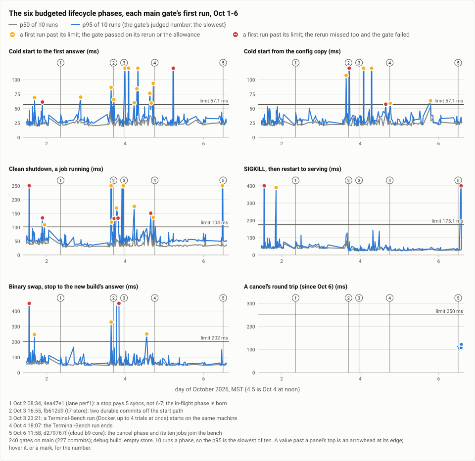
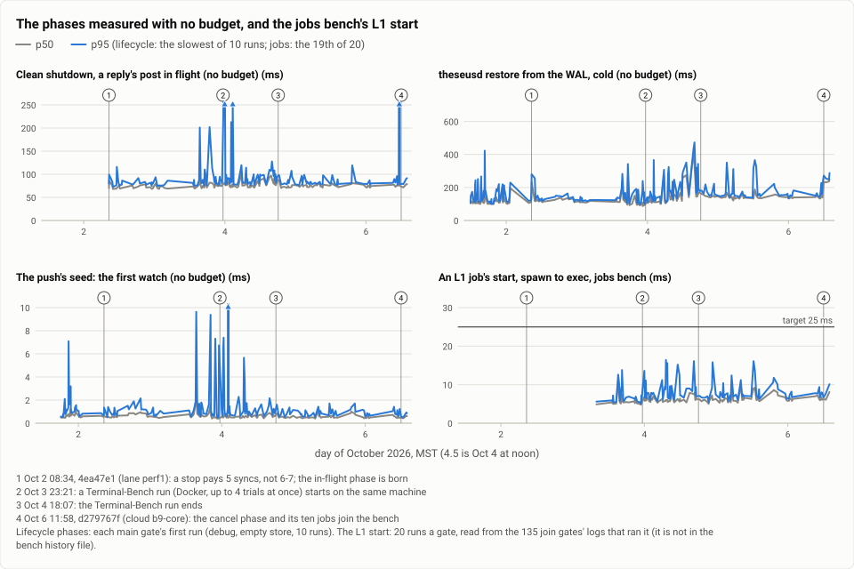
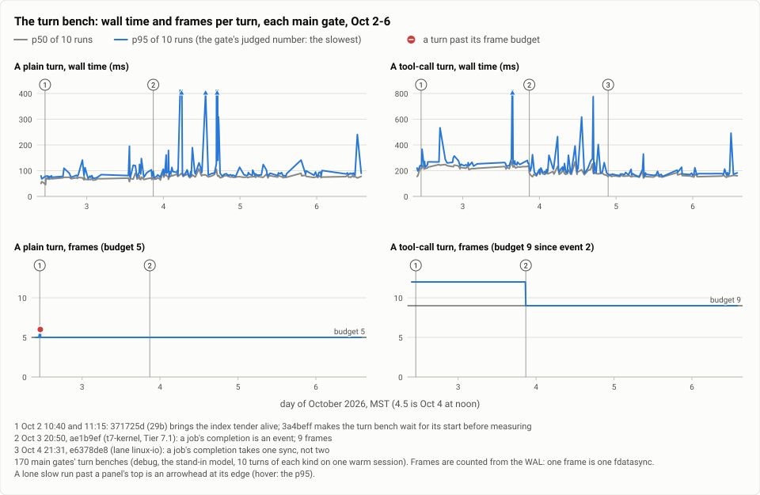
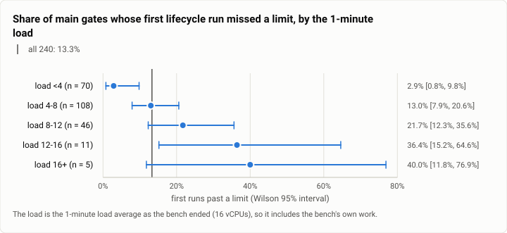
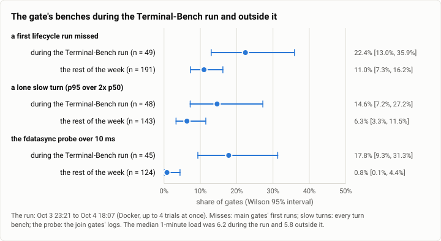
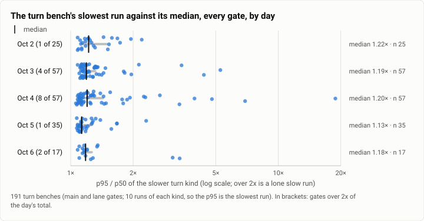
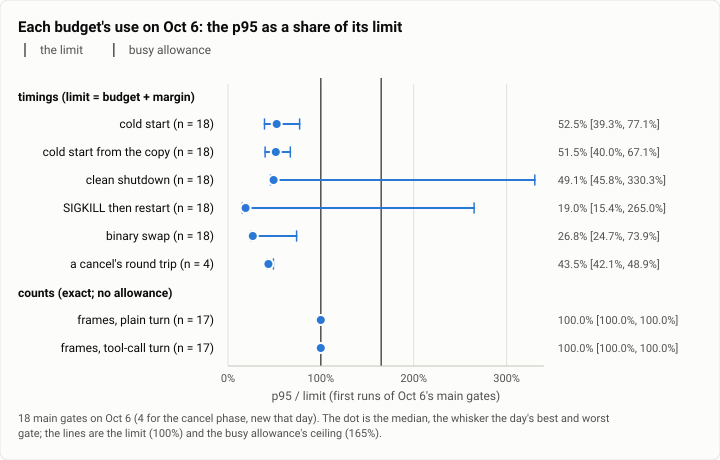
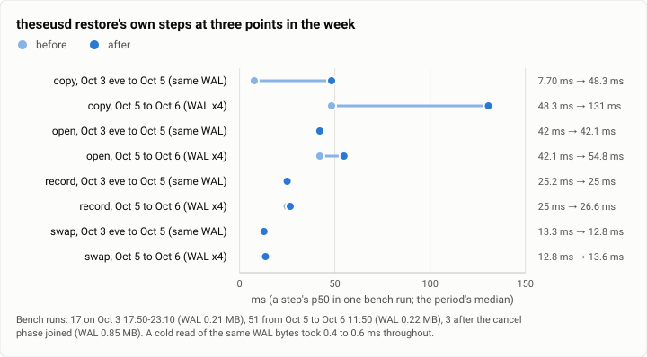
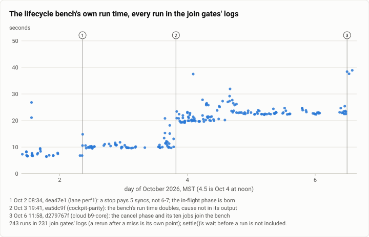

# Gate bench: FAST's history, the gate's speed benches from Oct 1 to Oct 6 (2026-10-06)

**The answer first.** In 240 gates on `main` (227 commits) between Oct 1 and Oct 6, every lifecycle phase's median
stayed far inside its budget: a cold start's p50 was 22.6 ms against 50 ms all week, a clean shutdown's 35.1 ms
against 100, a SIGKILL's restart 35.6 ms against 150, and a binary swap 51.7 ms against 200. The budgets were never
the problem; the tail was. The gate judges the p95 of ten runs, which is the slowest run, and in 32 of the 240 gates
(13.3%, Wilson 95% interval 9.6% to 18.2%) that one run crossed a limit. 19 of those passed on the rerun, 5 on the
busy allowance, and 8 failed. The chance of such a miss rose with the machine's load, from 2.9% [0.8, 9.8] under a
1-minute load of 4 to 36% and more above 12, and it doubled, at the same load, on the day a Terminal-Bench run's
containers shared the machine (22.4% [13.0, 35.9] against 11.0% [7.3, 16.2]), when the disk's fsync latency doubled.
Four joins moved the numbers for good: a stop that pays 5 syncs instead of 6 or 7 (shutdown p50 −11 ms), two
durable commits taken off the start path (kill p50 −17 ms), a job's completion as an event (a tool-call turn from 12
frames to 9, and its p50 −63 ms), and a job's completion with one sync instead of two (the tool-call turn −19 ms more).
One move had no join: over Oct 4's 58 gates a plain turn's p50 crept up 8 ms (67.5 to 75.8 ms) while the daemon's
resident memory grew by half (45 to 68 MB), and neither has a budget. A plain turn wrote exactly 5 frames in every
gate but one, and that one was the bench's own bug; a tool-call turn wrote exactly 9 in every gate since 9 became its
budget on Oct 3. Today the budgets with the least
headroom are the two cold starts and the clean shutdown, each using about half its limit at the median. The turn
bench's one loose end, a lone slow run, appeared in 16 of 191 turn benches (8.4% [5.2, 13.2]), 2× to 19× the median,
with no budget to catch it. Six lanes' A/Bs beside the gate, each in its own report, mark what the gate cannot see:
the start path at 10,000 sessions, a reply on a stalled disk, and CPU-bound work.

| | |
|---|---|
| Suite | `gate-bench`: the gate's lifecycle bench, jobs bench and turn bench (`theseus-sim bench`) |
| Arms | one: Theseus on `main`, gate by gate (lanes' gates and hand-run benches counted apart) |
| Model | none: the turn bench drives a stand-in for the Messages API |
| Units × runs | 240 main gates × 10 runs a phase (lifecycle); 172 main gates × 10 turns of each kind (turn); 135 join gates × 20 L1 starts (jobs) |
| Dates and commits | 2026-10-01 11:50 (`adbeda4`) to 2026-10-06 13:55 (`ceba1520`), MST |
| Cost | nothing in dollars; the gate's time (see "What it cost") |
| Data | `2026-10-06-gate-bench-fast-history.json` (summary and figures), `2026-10-06-gate-bench-fast-history.csv` (one row per main gate) |

## The question

FAST is the owner's first goal for Theseus (`AGENTS.md`): start to answering in under 50 ms, a clean shutdown in
100, a crash and restart in 150, a binary swap in 200, and these budgets fail the gate as a test does. Since Oct 1
every gate has appended its bench results to a history file (theseus-1hk), so a phase drifting toward its limit shows
before the gate fails on it. This report reads that history whole for the first time and asks four things: did each
phase hold its budget through a week of about 40 main gates a day; which joins moved a number; why the gate missed when it
missed; and how much headroom is left today.

It mattered then because the week changed the gate's own rules twice. Until Oct 3 13:22 the lanes' compilers were
paused (SIGSTOP) while the spine's bench ran; from then on they ran beside it, and a busy machine got a calibrated
allowance (theseus-lew7) instead. Whether the gate still measured Theseus, and not its neighbours, is the question
under all the others.

## The setup

- **The harness under test:** `theseusd`, the debug build the gate compiles (`target/debug`, dependencies at
  opt-level 2 since `adbeda4`, the history's first main row). The gate's comment holds that debug binaries are never
  faster than release, so a pass here holds for release.
- **The lifecycle bench** (`crates/theseus-sim/src/lifecycle.rs`), `theseus-sim bench lifecycle --runs 10 --check`:
  a real daemon over its real socket, on an empty store (the bench writes its own 4 to 15 sessions), its secrets from
  a stand-in `op` that answers after 1,000 ms (so a start that waited for them would show), two unmeasured starts
  first. Each phase is run ten times; the bench reports the p50 and the p95 by nearest rank, so **the p95 is the
  slowest of the ten**. The phases:

  | Phase | What is timed | Budget (§9) + margin = limit |
  |---|---|---|
  | `cold` | process start to the first `health` answer | 50 ms + 7 = 57.1 ms |
  | `vault` | the same, the config served from its last-known-good copy before the vault answers | 50 + 7 = 57.1 |
  | `shutdown` | the `shutdown` request to the process's exit, executions waiting and a job running | 100 + 4 = 104 |
  | `inflight` | the same, with a reply's post in flight to a stand-in Discord | none yet |
  | `kill` | SIGKILL, then a new process to its first answer | 150 + 25 = 175.1 |
  | `swap` | the stop's request to the other build's first answer, the job's wrapper adopted | 200 + 2 = 202 |
  | `restore` | `theseusd restore` from a copy of the WAL, its pages dropped first | none |
  | `seed` | the push's seed: the first `executions.watch` | none |
  | `cancel` | `execution.cancel` of a running job, request to verified answer (since Oct 6) | 250 + 0 = 250 |

  The margins are the spread of each phase's p95 over five runs on this machine in September (cold 6.8 ms, shutdown
  4.0, kill 24.5, swap 1.9, rounded up). The cold budget grows by 0.08 ms for the bench's four sessions, hence 57.1.
- **The jobs bench**, `theseus-sim bench jobs --class l1 --runs 20 --check`: an L1 job's start, from the wrapper's
  spawn to the command's exec, against §2.2's 25 ms. It is not written to the history; its numbers here come from the
  join gates' logs.
- **The turn bench** (`crates/theseus-sim/src/perf.rs`), at a join: ten plain turns and ten tool-call turns on one
  warm session against the stand-in model, Discord and the web UI off, then a burst of 30 turns. It times each turn's
  wall clock and counts its **frames** from the WAL (one frame is one `fdatasync`). The frames are budgets (5 for a
  plain turn; 9 for a tool-call turn since Oct 3 20:50); the wall times are not.
- **The gate's rules** (`scripts/gate.sh`): `sync`, then `settle()`, which waits up to two minutes (five before Oct
  3 16:31) for IO pressure under 10%, CPU pressure under 20% and a 1-minute load under 12 (16 before); if no quiet
  window comes, the timing budgets get the busy allowance, +65% of each limit (since Oct 3 13:22; counts never get
  it). A miss reruns the bench once; a second miss fails the gate. Both runs are recorded, and `passed` stays the
  strict verdict, with the allowance in its own column. The +65% came from this history's first 170 budgeted runs
  (to Oct 3 07:58): among 22 runs on a busy machine with no stall, the 95th percentile of each run's worst overage
  was +63% (+65% covers 21 of the 22).
- **The data:** the gate's bench history file (`$THESEUS_BENCH_HISTORY`), 560 rows from Oct 1 10:30 to Oct 6 13:55
  under 14 header lines: the file's columns changed shape whenever a phase or a bench was added, so it was read as
  blocks, each header governing the rows below it. 366 rows are lifecycle runs, 192 turn benches, one an idle bench
  and one a size bench. Rows were grouped into gates (the same label, each row within 8 minutes of the last). Of the
  307 gate groups with a lifecycle run, 240 are `main`'s, 58 are lanes' gates (from before lanes skipped the bench),
  and 9 are benches run by hand, whose labels carry a note; the last two are counted apart. The join gates' logs
  (231 of them, kept on the build machine) add what the history does not hold: the jobs bench, the disk's fsync
  probe, settle's waits and restore's own steps.
- **The machine:** one WSL2 VM (Linux 6.18), 16 vCPUs, about 24 GB of memory, shared all week with the lanes' builds
  and, from Oct 3 23:21 to Oct 4 18:07, a Terminal-Bench run in Docker (up to four trials at once).

## Results

### Each budgeted phase, gate by gate

<picture>
  <source media="(prefers-color-scheme: dark)" srcset="img/2026-10-06-gate-bench-fast-history/lifecycle-budgeted-dark.svg">
  
</picture>

*Figure 1. Did each budgeted phase stay inside its limit, gate by gate, through the week? At the median, by a wide
margin in every phase; the misses are single slow runs, clustered on Oct 3 and Oct 4, and 8 of them failed a gate.*

Each main gate's first run (the strict one), p50 and p95, ms:

| Phase | Gates | p50, median | p95, median | p95, 90th percentile | p95, max | Limit | First runs past the limit | Of which the gate failed |
|---|---:|---:|---:|---:|---:|---:|---:|---:|
| cold | 240 | 22.6 | 29.2 | 45.6 | 630.7 | 57.1 | 14 | 2 |
| vault | 240 | 22.6 | 29.6 | 40.2 | 984.0 | 57.1 | 7 | 2 |
| shutdown | 240 | 35.1 | 52.4 | 80.6 | 654.7 | 104 | 14 | 5 |
| kill | 240 | 35.6 | 40.8 | 62.9 | 2,257.1 | 175.1 | 3 | 2 |
| swap | 240 | 51.7 | 64.7 | 112.6 | 2,577.8 | 202 | 6 | 3 |
| cancel | 4 | 101.4 | 108.8 | | 122.3 | 250 | 0 | 0 |

A first run that missed often missed in more than one phase (9 of the 32), so the column of misses sums to 44.
Every gate's numbers are in the CSV.

### The phases with no budget, and the jobs bench

<picture>
  <source media="(prefers-color-scheme: dark)" srcset="img/2026-10-06-gate-bench-fast-history/lifecycle-measured-dark.svg">
  
</picture>

*Figure 2. How did the phases the gate measures but does not judge move through the week? The in-flight stop and
the seed held flat; the L1 start stayed at a quarter of its target; restore's p50 rose by a quarter on Oct 4 and
by two thirds more on Oct 6, the second rise the bench's own bigger input.*

| Phase | Gates | p50, median | p95, median | p95, max | Note |
|---|---:|---:|---:|---:|---|
| inflight | 179 | 75.0 | 81.5 | 764.5 | measured since Oct 2 08:34 (theseus-ndw); a 150 ms budget was proposed then (theseus-fsug), not adopted |
| restore | 240 | 124.6 | 148.1 | 472.6 | daily p50 medians 108.8, 116.6, 111.5, 143.0, 139.9, 142.4 ms (Oct 1 to 6); 231.2 to 248.1 since the cancel phase |
| seed | 210 | 0.6 | 0.9 | 89.6 | measured since Oct 1 18:08 |
| L1 start (jobs) | 135 | 6.0 | 7.2 | 16.4 | target 25 ms; no miss in 135 join gates (Oct 3 07:58 to Oct 6) |

### The turn bench

<picture>
  <source media="(prefers-color-scheme: dark)" srcset="img/2026-10-06-gate-bench-fast-history/turn-bench-dark.svg">
  
</picture>

*Figure 3. What did a turn cost, in wall time and in frames, gate by gate? The frame budgets held exactly (5 and 9)
in every main gate but one; the walls stepped four times, each at a join with a known cause, and the plain turn
drifted 8 ms up over Oct 4 with no join to name.*

| Day | Gates | Plain turn p50, median (ms) | Tool-call turn p50, median (ms) | Frames, plain | Frames, tool-call |
|---|---:|---:|---:|---|---|
| Oct 2 | 23 | 68.6 | 224.5 | 5 (one gate: 6) | 11 or 12 |
| Oct 3 | 39 | 68.0 | 221.5 | 5 | 12, then 9 from 20:50 |
| Oct 4 | 56 | 79.8 | 179.4 | 5 | 9 |
| Oct 5 | 35 | 75.8 | 156.2 | 5 | 9 |
| Oct 6 | 17 | 76.0 | 157.9 | 5 | 9 |

The one gate with 6 plain-turn frames is `51a456f` (Oct 2 11:08): the index tender's start row, written 2 s after
serving, landed inside a measured turn. The gate failed on it twice, and the bench, not Theseus, was fixed
(`3a4beff`: the bench waits for that row before measuring). The tool-call turn had no frame budget until Tier 7.1
made 9 the count (theseus-kpfv).

### The joins that moved a number

Each row compares the ten main gates before a join with the ten from it (each gate's last run, the one its verdict
rests on; the p50, ms), with a bootstrap 95% interval of the difference of the medians (10,000 resamples, seeded).

| Join | When | What changed | Number | Before | After | Difference [95% interval] |
|---|---|---|---|---:|---:|---:|
| `4ea47e1`, lane perf1 | Oct 2 08:34 | a stop's checkpoints made durable by redb's close: 5 syncs a stop instead of 6 or 7 (theseus-02k) | shutdown | 42.9 | 31.6 | −11.4 [−13.7, −0.3] |
| | | (the same stop inside a swap) | swap | 57.3 | 48.3 | −9.1 [−20.2, −6.5] |
| `371725d`, 29b | Oct 2 10:40 | the index tender comes alive, 2 s after serving | tool-call turn | 155.0, 161.3 (two gates) | 218.2, then 212 to 248 | too few before for an interval |
| `3a4beff` | Oct 2 11:15 | the turn bench waits for the tender's start before measuring: turns are timed with the tender up | plain turn | 51.0 (n = 4) | 68.6 | +17.6 [+11.3, +23.2] |
| `fb612d9`, t7-store | Oct 3 16:55 | two durable commits off the start path (Tier 7.7) | kill | 41.6 | 25.0 | −16.6 [−28.1, −11.3] |
| | | | cold | 24.5 | 20.3 | −4.2 [−12.6, +3.7] (not distinguishable) |
| `ae1b9ef`, t7-kernel | Oct 3 20:50 | a job's completion is an event, and each record is written once a frame (Tier 7.1, 7.3) | tool-call turn | 229.1 | 166.0 | −63.2 [−71.1, −53.6] |
| | | | tool-call frames | 12 | 9 | −3 (every gate) |
| `e6378de8`, lane linux-io | Oct 4 21:31 | a job's completion takes one sync, not two: the wrapper no longer syncs the spool's directory | tool-call turn | 176.9 | 157.6 | −19.4 [−25.6, −14.2] |
| `d279767f`, cloud b9-core | Oct 6 11:58 | the cancel phase joins the bench, and its ten jobs write into the store restore then copies | restore | 140.5 | 233.6 (n = 4) | +93.2 [+87.5, +107.6] |

Two of these are the bench changing, not Theseus: the plain turn's +18 ms at `3a4beff` is the same turn measured
honestly (with the tender running, as it always is after the first 2 s), and restore's +93 ms at `d279767f` is a
four times bigger WAL to restore (below). Linux-io's join had two neighbours within 40 minutes (the route fix at
21:04, the bench fixes at 21:43), so their ten-gate windows overlap and show the same step (−20.7 and −18.5 ms). The
step is linux-io's by its own A/B: in one hold of the gate lock, a tool-call turn was 19.0 ms faster with the lane's
build, with no overlap in 8 runs an arm, and a plain turn did not move. The windows also read the plain turn 4 ms
lower at linux-io's join, which its A/B does not (−1.15 ms, p = 0.63). The gates before it include Oct 4's slower
afternoon.

**A move with no join.** Over Oct 4 a plain turn's p50 rose 8 ms and stayed. It was 67.5 ms in Oct 3's evening gates
(after `ae1b9ef`, before the Terminal-Bench run; 9 gates), 78.3 in Oct 4's evening (after the run, before linux-io; 5
gates) and 75.8 on Oct 5 (35 gates): +8.3 ms [+3.7, +10.4] against Oct 3's evening. The tool-call turn rose 13 ms over
the same day (162.9 to 175.9) before linux-io took 19 off. The daemon's resident memory after a start grew from 45.0
to 68.1 MB in the same hours (after a burst of 30 turns, 57.1 to 94.5), gate by gate through the day's joins. The
rise began inside the Terminal-Bench window, which hides its onset, and it did not leave when the run ended. The
frames held at 5 and 9, so the extra time is not syncs, and every lifecycle phase held (each within about 2 ms of Oct
3's evening on Oct 5, every interval across zero). A turn's wall time and the resident memory have no budget, so
nothing flagged it.

| Gates' medians (p50) | Oct 3, 20:50 to 23:21 (9) | Oct 4, 18:08 to 21:31 (5) | Oct 5 (35) | Oct 6 (17) |
|---|---:|---:|---:|---:|
| plain turn, ms | 67.5 | 78.3 | 75.8 | 76.0 |
| tool-call turn, ms | 162.9 | 175.9 | 156.2 | 157.9 |
| resident memory after a start, MB | 45.0 | 63.7 | 68.1 | 68.8 |
| resident memory after a burst of 30 turns, MB | 57.1 | 89.7 | 94.5 | 93.8 |
| clean shutdown, ms | 33.0 | 33.1 | 33.2 | 33.9 |
| cold start, ms | 19.9 | 22.3 | 21.9 | 22.9 |

### The comparisons beside the gate

Seven lanes measured Theseus against something beside the gate that week, each with its own A/B or before and after.
Six have their own reports; the route-bench-fixes lane is an annotation here, because it measured no A/B. What each
adds to this history, and what the gate's series shows at its join (ten main gates before and ten from it, as above):

| Lane and its report | What it measured | At its join, in the gate's series |
|---|---|---|
| fastgate: [dependencies at opt-level 2](2026-10-01-gate-bench-opt-level-2.md) | debug builds with the dependencies optimized, A/B: a cold start's p50 25.6 to 21.7 ms | `adbeda4`, Oct 1 11:50: the history's first main row, so the series has no before |
| perf1: [the start path at 10,000 sessions](2026-10-02-gate-bench-start-path-10k.md) | release, 10,000 parked sessions: a cold start 119.1 to 21.5 ms; an idle daemon 5.05% of a core to 0.10% | `4ea47e1`, Oct 2 08:34: the stop's syncs (shutdown −11.4 ms, swap −9.1); the start path's gain cannot show on the gate's empty store |
| bench2: [the install's build profile and libc](2026-10-02-gate-bench-install-builds.md) | `release-thin` against `release`, glibc against static musl; the turn, idle and size benches' first numbers | `34be7e2`, Oct 2 09:42: the turn bench's first gate on `main`; no lifecycle phase moved beyond perf1's step an hour before |
| ledger-perf: [the ledger-reads branch](2026-10-03-gate-bench-ledger-reads.md) | its parked join's clean-stop misses were the disk, not the branch; reads at 10,000 sessions 5.5 to 228 times faster | `fe371af`, Oct 3 21:49: no lifecycle phase moved (each within 2 ms, every interval across zero) |
| linux-io: [one sync per job](2026-10-04-gate-bench-one-sync-per-job.md) | in one hold of the gate lock: a job's completion heard 6.6 ms sooner, a tool-call turn −19.0 ms | `e6378de8`, Oct 4 21:31: tool-call turn −19.4 ms [−25.6, −14.2], the A/B's number to 0.4 ms |
| route-bench-fixes (an annotation here) | its two join gates against the gate before: plain turn 78.3 to 75.0 and 74.6 ms, tool-call 169.5 to 164.2 and 166.6 | `645769d2` (21:04) and `42a8222f` (21:43) bracket linux-io's join; the step in their windows is linux-io's |
| speed: [a greeting's reply under IO stalls](2026-10-05-gate-bench-speed-io-stalls.md) | a rig with a stalled disk and a paced stand-in model: a reply's first words 376.5 to 3 ms after the model's first token | `a9442c81`, Oct 5 02:36: nothing moved (plain +0.9 ms [−1.0, +2.3], tool-call −1.9 [−8.8, +2.5], each lifecycle phase within 1.5 ms) |

The route-bench-fixes lane compared single gates to show its route fix cost a turn nothing ("same frames, and no
slower"), and its three bench fixes changed the Terminal-Bench harness, not the daemon. Single gates differ by more
than its 3 to 5 ms, so its numbers say "no slower" and nothing finer, and the series agrees: the evening's tool-call
step belongs to linux-io. That is why it is an annotation and not a report.

### Misses, reruns and the busy allowance

| Gates on `main` | 240 | Lanes' gates | 58 |
|---|---:|---|---:|
| passed on the first run | 208 (86.7%) | passed on the first run | 41 |
| missed, then passed on the rerun | 19 | missed, then passed on the rerun | 11 |
| missed, then passed on the busy allowance | 5 | missed, then failed | 6 |
| missed twice: the gate failed | 8 | | |

All lifecycle runs: 78 strict misses in 366 runs (45 of 275 on `main`, 26 of 78 in lanes' gates, 7 of 13 by hand).
A missed phase's p95 was, at the median, 1.44× its limit for a cold start, 1.45× for a clean shutdown, 1.88× for the
vault start, 2.32× for a swap and 2.65× for a kill's restart; the worst was 17×. These are stalls, not drift.

The eight failed gates, and what came after:

| Gate | First run missed | Rerun missed | Load (1 min) | Then |
|---|---|---|---|---|
| `d047483`, Oct 1 13:23 | shutdown, kill, swap | cold, shutdown, kill | 14.2, 22.7 | the next commit's gate passed |
| `715bf80`, Oct 1 21:27 | cold, shutdown | cold, vault | 11.7, 11.7 | two runs by hand passed a minute later |
| `d3b5793`, Oct 3 17:21 | vault, shutdown | shutdown | 10.9, 8.2 | merge parked; a later gate passed |
| `ea5dc9f`, Oct 3 19:41 | shutdown, swap (2,578 ms) | swap (842 ms) | 4.5, 4.7 | rerun at 20:14 failed (load 10.7), passed at 20:23 (load 2.6) |
| `d5ff8489`, Oct 4 15:41 | vault, shutdown | shutdown | 10.0, 9.0 | passed on the allowance at 16:00 |
| `1a08a40e`, Oct 5 05:29 | cold (311 ms) | shutdown, swap (823 ms) | 3.2, 2.9 | passed at 05:47 |
| `ceba1520`, Oct 6 13:44 | kill (464 ms) | vault, swap (500 ms) | 4.5, 3.8 | passed at 13:55 |

(`ea5dc9f` failed twice, so the table has seven commits for eight failed gates.) Every one of these commits, or the
next one, passed a later gate with nothing changed in the code the bench runs (`ea5dc9f` on its third try): each
failure was the machine, not the commit, which is what the rerun rule assumes.

The five allowance passes, all on Oct 4 and all during the Terminal-Bench run: `2cba6c51` (cold, 1.48× the limit,
load 13.0), `3193f660` (swap, 1.24×, load 6.6), `9bf8ac35` (cold, 1.34×, load 8.5), `d5ff8489` (cold, 1.04×, load
9.0) and `250ccd23` (cold and shutdown, 1.64×, load 4.2, just inside the allowance's 1.65).

<picture>
  <source media="(prefers-color-scheme: dark)" srcset="img/2026-10-06-gate-bench-fast-history/miss-rate-by-load-dark.svg">
  
</picture>

*Figure 4. How does a gate's chance of a strict miss depend on the machine's load? Steeply: from 2.9% under a load
of 4 to 13% at 4 to 8, 22% at 8 to 12 and 36% to 40% above 12.*

| Load (1 min, as the bench ended) | First runs on `main` | Missed | Rate [Wilson 95%] | All runs, lanes' and reruns included |
|---|---:|---:|---|---|
| under 4 | 70 | 2 | 2.9% [0.8, 9.8] | 5 of 85, 5.9% |
| 4 to 8 | 108 | 14 | 13.0% [7.9, 20.6] | 18 of 142, 12.7% |
| 8 to 12 | 46 | 10 | 21.7% [12.3, 35.6] | 22 of 80, 27.5% |
| 12 to 16 | 11 | 4 | 36.4% [15.2, 64.6] | 13 of 26, 50.0% |
| 16 and over | 5 | 2 | 40.0% [11.8, 76.9] | 13 of 20, 65.0% |

The gate's own comment (written Oct 3, from the history then) quotes 41% at a load of 12 or more, 10% at 8 to 12
and 6% under 8. Over the whole week and every run that was not by hand, the rates are 56.5% (26 of 46), 27.5% and
10.1% (23 of 227): the same shape, higher in every band.

The rules changed under these numbers. With the lanes paused for the bench (to Oct 3 13:22), 7 of 98 main gates
missed on the first run, 7.1% [3.5, 14.0], at a median load of 7.2. With the lanes running beside it, settle's bar
at 12 and the allowance (from Oct 3 16:31), 23 of 131 did, 17.6% [12.0, 25.0], at a median load of 4.1; leaving out
the Terminal-Bench run's window, 12 of 82, 14.6% [8.6, 23.9]. The gate traded a paused machine for throughput, and
paid about twice the strict misses for it, while its failed gates stayed rare (2 of 98 before, 6 of 131 after).

### The day a Terminal-Bench run shared the machine

<picture>
  <source media="(prefers-color-scheme: dark)" srcset="img/2026-10-06-gate-bench-fast-history/terminal-bench-window-dark.svg">
  
</picture>

*Figure 5. Did the benches read worse while the Terminal-Bench run's containers shared the machine? Yes: twice the
first-run misses, twice the lone slow turns, and the disk's fsync probe over 10 ms in 8 gates against 1, at the same
1-minute load.*

| From Oct 3 23:21 to Oct 4 18:07 | During the run | The rest of the week | Fisher exact, two-sided |
|---|---|---|---|
| main gates whose first run missed | 11 of 49, 22.4% [13.0, 35.9] | 21 of 191, 11.0% [7.3, 16.2] | p = 0.056 |
| turn benches with a lone slow run | 7 of 48, 14.6% [7.2, 27.2] | 9 of 143, 6.3% [3.3, 11.5] | p = 0.13 |
| the turn bench's fdatasync probe over 10 ms | 8 of 45 | 1 of 124 | p = 0.0001 |
| gates that passed on the busy allowance | 5 | 0 | |
| median 1-minute load (main gates) | 6.2 | 5.8 | |

The load did not see this neighbour, and the disk did. Settle did too: of the 24 times in the join gates' logs
that settle found no quiet window in two minutes, 22 fell in this window, at loads from 2.8 to 16.6. Until 11:44
the pressure that kept it busy was CPU pressure (35% to 99%, at loads as low as 2.8); from 11:57 it was IO pressure
(16% to 31%, with CPU at 0% or 1%). In those afternoon hours the turn bench's own `fdatasync` probe read 11.8 to
14.0 ms (five gates from 11:57 to 16:01) where it reads 6.5 ms on any other day, and the phases that wait on the
disk ran about twice as slow. In the 12 main gates from 11:44 to 17:13, the median shutdown p50 was 68.3 ms,
against 34.6 earlier that day and 33.4 after; the swap's 89.3 against 50.2 and 49.5; restore's 227.2 against 118.5
and 141.6; the in-flight stop's 88.3 against 76.1 and 75.9. Eight of the twelve ran slow and four did not, one of
them the 14:03 gate, which ran while the Terminal-Bench run was paused (13:32 to 14:09). Then the numbers came back,
with no join between. CPU pressure at a load of 3 is what containers held to a CPU quota would produce; that is a
guess this data cannot prove.

### The lone slow turn

<picture>
  <source media="(prefers-color-scheme: dark)" srcset="img/2026-10-06-gate-bench-fast-history/lone-slow-turn-by-day-dark.svg">
  
</picture>

*Figure 6. How often, and how far, does one turn run far slower than the rest, and does it cluster by day? In 16 of
191 benches, 2.1× to 18.8× the median; half of them on Oct 4.*

A lone slow run is a turn bench whose p95 (its slowest of ten turns) is more than twice its p50, for the plain or the
tool-call turn.

| | |
|---|---|
| How often | 16 of 191 turn benches, 8.4% [5.2, 13.2] (plain 10, tool-call 8, both 2); 15 of 172 on `main` |
| How far | 2.13× to 18.83× the p50, median 3.35×; 105 to 1,529 ms over it, median 229 ms |
| At what load | median 5.7 (2.99 to 16.5); the other benches' median 5.1 (interquartile 3.3 to 6.8) |
| By day | Oct 2: 1 of 25; Oct 3: 4 of 57; **Oct 4: 8 of 57** (14.0% [7.3, 25.3]); Oct 5: 1 of 35; Oct 6: 2 of 17 |
| By time of day | 8 of the 16 between 12:00 and 18:00, a quarter of the day that held 50 of the 191 benches |
| By branch | 15 on `main`, 1 in a lane's gate (`lane/wal-synced`), in proportion to the benches (172 and 19) |
| With a lifecycle miss in the same gate | 5 of the 16, against 21 of the other 175 |
| The fdatasync probe in those gates | median 6.7 ms (one of 11 over 10 ms), against 6.5 in the rest |

Oct 4 holds 8 of 57 against 8 of 134 on the other days; at the other days' rate, 8 or more of 57 would happen by
chance 1.9% of the time (an exact binomial tail). It is not the load. The probe does not see a stall either, but it
takes the quieter of two short probes, so a single stall in the middle of a turn would pass it by. The issue's
count (theseus-w7dk, "17 of 191") differs from this report's 16 by its threshold: three more benches sit at 1.93×
to 1.96×. Every lone slow run kept its frames at 5 and 9, so the frame budget never sees one; with ten runs, the
p95 is the maximum, so one slow turn sets it.

The worst cases: `21683c9c` (Oct 4 16:50) plain p50 85.7, p95 1,614.7 ms, tool-call 185.5 and 774.9;
`a4da5e1c` (Oct 4 05:41) plain 89.8 and 620.7; `1abf099c`, `lane/wal-synced` (Oct 3 18:52) plain 68.3 and 359.1;
`3193f660` (Oct 4 13:13) plain 83.7 and 400.9, tool-call 207.3 and 616.5; `dc3387f` (Oct 3 15:33, load 16.5)
tool-call 241.6 and 1,058.1. Every row is in the data file's `lone_slow_rows`.

### Headroom today

<picture>
  <source media="(prefers-color-scheme: dark)" srcset="img/2026-10-06-gate-bench-fast-history/headroom-today-dark.svg">
  
</picture>

*Figure 7. How much headroom does each budgeted number have today? About half the limit for the two cold starts and
the clean shutdown, three quarters for the kill's restart and the swap, none for the frame counts by design, and one
stall each, on Oct 6, past the limit for the shutdown and the kill.*

The first runs of Oct 6's 18 main gates:

| Number | Limit | p50, median | p95, median | Headroom at the median | Best and worst p95 |
|---|---:|---:|---:|---:|---|
| cold start | 57.1 ms | 22.9 | 30.0 | 27.1 ms (52.5% used) | 22.4 to 44.0 |
| cold start from the copy | 57.1 ms | 23.9 | 29.4 | 27.7 ms (51.5%) | 22.8 to 38.3 |
| clean shutdown | 104 ms | 34.0 | 51.1 | 52.9 ms (49.1%) | 47.7 to 343.5 (`2bf9e7d3`, passed on the rerun) |
| SIGKILL, then restart | 175.1 ms | 27.4 | 33.2 | 141.9 ms (19.0%) | 27.1 to 464.1 (`ceba1520`, the failed gate) |
| binary swap | 202 ms | 48.7 | 54.2 | 147.8 ms (26.8%) | 49.8 to 149.3 |
| a cancel's round trip (n = 4) | 250 ms | 101.4 | 108.8 | 141.2 ms (43.5%) | 105.2 to 122.3 |
| frames, plain turn (n = 17) | 5 | 5 | 5 | 0 (by design) | 5 to 5 |
| frames, tool-call turn (n = 17) | 9 | 9 | 9 | 0 (by design) | 9 to 9 |

A frame budget equals the count, and "a step that writes fewer lowers this number in the same commit, so it only goes
down" (`perf.rs`): zero headroom there is the rule working, not a warning.

### restore's own steps

<picture>
  <source media="(prefers-color-scheme: dark)" srcset="img/2026-10-06-gate-bench-fast-history/restore-steps-dark.svg">
  
</picture>

*Figure 8. Which step of a restore grew, and when? The copy, twice: six times over on Oct 4 with the same bytes to
copy, and nearly three times again on Oct 6 when the WAL grew four times; the open grew a little with the WAL, and
nothing else moved.*

`theseusd restore` reports its own steps (copy, open, counts, record, swap). Medians of each step's p50 over the
bench runs in the join gates' logs, ms:

| Step | Oct 3, 17:50 to 23:10 | Oct 5 to Oct 6 11:50 | Oct 6, after the cancel phase |
|---|---:|---:|---:|
| copy | 7.7 | 48.3 | 130.6 |
| open | 42.0 | 42.1 | 54.8 |
| record | 25.2 | 25.0 | 26.6 |
| swap | 13.3 | 12.8 | 13.6 |
| the WAL restored (MB) | 0.21 | 0.22 | 0.85 |
| bench runs | 17 | 51 | 3 |

The Oct 6 rise is the bench's input: the new cancel phase runs before restore on the same store, and its ten jobs
add ten sessions (5 became 15) and four times the WAL. The Oct 4 rise is not explained by the bench's data: the copy
of the same 0.21 MB went from 7.7 ms to about 48 over the night and morning of Oct 4, with no single join to blame.
Between the 10th and the 90th percentile, it took 14 to 27 ms from 00:00 to 07:00, 34 to 84 from 07:00 to noon, and
47 to 57 from that evening on. It
began as the Terminal-Bench run started and did not come back when the run ended, while a cold sequential read of the
same bytes took 0.4 to 0.6 ms all week. Restore has no budget, so nothing failed; the copy step is where to look.

## Analysis

**What the week teaches.** The budgets are not close. At the median, each phase used between 19% and 53% of its
limit all week, and the code made the slow phases faster, not slower: shutdown −11 ms, kill −17 ms, a tool-call turn
−63 ms and then −19 ms more. Nothing that joined pushed a phase toward its limit. What grew is what has no budget: a
plain turn's wall (+8 ms over Oct 4) and the daemon's resident memory (+23 MB after a start). What fails a FAST gate is the single slowest of ten
runs, and that run is the machine's: a miss's p95 sits at 1.4× to 2.7× the limit at the median (17× at worst), while
the same phase's p50 in the same run barely moves, and no failed gate failed again on its next try. The gate is
measuring two things at once, Theseus's speed and the machine's worst moment in ten tries, and only the second ever
failed it.

**Load is a weak proxy for the neighbour that matters.** The miss rate climbs with the 1-minute load (Figure 4), but
the worst day for misses, slow turns and allowance passes had an ordinary load. On Oct 4 the neighbour was a
Terminal-Bench run's containers, and what it raised was IO pressure and fsync latency (the turn bench's probe
doubled), which the load never shows. `settle()` did see it, through PSI, and its design held: it waited, then
measured with the allowance, and 5 gates passed that would have failed strictly. That is the allowance doing the job
it was approved for. The load bar is the part that saw nothing that day.

**The p95 of ten is the maximum.** With `--runs 10`, nearest rank makes the p95 the slowest sample, so one fsync stall
decides a phase (theseus-zay1). On quiet first runs (load under 8, 178 gates), 95% of the p95s sat under 41 ms for a
cold start (limit 57.1), 42 for the vault start (57.1), 91 for the clean shutdown (104), 61 for the kill's restart
(175.1) and 115 for the swap (202). The clean shutdown is the binding phase: its tail (p95 minus p50, median 14.9 ms)
is the widest, and its 95th percentile on a quiet machine already uses 88% of its limit. A margin re-derived from
these rows would tighten the kill's and the swap's margins and leave the shutdown's alone; a `--runs 20` statistic
would stop one stall from deciding a phase. This report gives the numbers, not the decision.

**The turn bench's walls tell four true stories, a drift, and one open question.** The tender's arrival (+60 ms on a
tool-call turn), the bench's own fix to measure with the tender running (+18 ms on a plain turn, a correction, not a
regression), Tier 7.1 (−63 ms and three frames fewer) and linux-io's one sync per job (−19 ms) are each one join and
one step in the series. The drift is Oct 4's: 8 ms on a plain turn, spread over a day of joins, beside half again the
resident memory. A wall-time budget for a turn, or a memory budget, would have named the day it happened; the frames
budget cannot, since the frames did not change. The lone slow run is the open question: in 16 of 191 benches one turn ran 2× to 19× the rest, most often on Oct 4 and in working hours,
and never with an extra frame. The bench cannot say which run was slow or why, because the history keeps only the p50
and the p95. theseus-w7dk's next step, printing each run's wall and its slowest frame, is what would name it.

**What the comparisons beside the gate add.** Three of them found costs the gate's benches cannot see by design. The
start path at 10,000 sessions read history that grows (perf1: 119 ms for a release cold start there, against a 250 ms
budget at that size; the gate's store holds 4 to 15 sessions). A greeting's reply waited 5.4 s on a stalled disk
(speed: the gate's turn bench runs with Discord off, the judge off and an instant stand-in model). And a CPU-bound
cost hides behind the fsyncs (bench2: thin LTO's 7% on `kernel-sim` cannot show in a turn of five fsyncs). They also
taught a method. Twice that week a join gate read a phase slower and an A/B of the frozen builds, both arms in one
hold of the gate lock, found no difference: the ledger-reads branch's parked join (its clean stop) and linux-io's join
gate (its stop-side phases). A single gate's reading is the machine's minute; only both arms in one hold make a
before and after.

**Side observations the history holds.** The daemon's resident memory after a start, measured by the turn bench,
rose from 38.9 MB (Oct 2's median) to 68.8 MB (Oct 6's), and after a burst of 30 turns from 49.3 to 93.8 MB, most of
it on Oct 4 (above); neither has a budget. The lifecycle bench itself got five times longer (Figure 9).

**What changed since the last comparable run.** There is no earlier history: the margins come from five runs in
September (cold p95 23.3 to 30.1 ms, shutdown 47.3 to 51.3, kill 43.2 to 67.7, swap 68.6 to 70.6). Against those, a
week later the medians of the p95 are 29.2, 52.4, 40.8 and 64.7 ms: cold and shutdown where they were, kill and swap
better.

## Threats to validity

- **Ten runs; the p95 is the max.** Every p95 here is one sample, the slowest of ten (twenty for the L1 start). It is
  the gate's statistic, so it is the right thing to report, but it is not a 95th percentile of anything stable.
- **Debug build, empty store.** The gate benches the debug binaries on a store of 4 to 15 sessions. Release is faster
  (a release cold start was 17.5 to 18.4 ms in September), and a real store is bigger: a store's size moves the cold
  budget (50 ms at today's sizes, 250 at 10,000 sessions), and only a lane's bench has measured 10,000.
- **A stand-in model.** The turn bench's wall time is the harness's own cost around a model that answers at once; a
  real turn is dominated by the model.
- **The load is read as the bench ends**, and includes the bench's own processes. It is not the load the bench
  started under, and it misses IO pressure entirely.
- **First runs only, and gates grouped by a rule.** Figure 1 and the miss rates use each gate's first run, the strict
  one; reruns are counted in the outcomes. A gate was the rows with one label each within 8 minutes of the last (the
  longest rerun gap was 459 s). One gate log kept under two names was read once.
- **Sources outside the history.** The jobs bench, the fsync probe, settle's lines and restore's steps come from the
  join gates' logs (231 files): joins only, so the spine's own step gates on Oct 1 have none. A log's time is its
  file's time, when the gate ended.
- **The window of a neighbour is not an experiment.** The Terminal-Bench comparison is observational: Oct 4 was
  also the week's busiest gate day (58 main gates) and a day of many cloud joins. The fsync probe's difference is
  strong (p = 0.0001); the misses' is borderline (p = 0.056); the slow turns' is weak (p = 0.13).
- **Overlapping joins.** Joins landed minutes apart (three within 40 minutes on Oct 4's evening), so ten-gate windows
  overlap and cannot separate them. Where a step is attributed to one of several neighbours, the attribution rests on
  that lane's own A/B, named in the table.
- **The bench changed under the series.** Phases were added (in-flight on Oct 2, seed on Oct 1, cancel on Oct 6), the
  turn bench's measuring point moved (`3a4beff`), and the bench's run time doubled at `ea5dc9f` (Oct 3 19:41) for a
  reason its output does not show. Each is marked where it matters.

## What it cost

Nothing in dollars: the benches call no model. The cost is the gate's time, under the shared gate lock.

<picture>
  <source media="(prefers-color-scheme: dark)" srcset="img/2026-10-06-gate-bench-fast-history/bench-run-time-dark.svg">
  
</picture>

*Figure 9. How long does the FAST check itself take inside a gate? 7 s on Oct 1, 10 s from Oct 2, 23 s from Oct 3
19:41, and 38 s since the cancel phase joined on Oct 6.*

| | Median |
|---|---:|
| one lifecycle bench run, Oct 1 | 7.3 s |
| Oct 2 to Oct 3 19:30 (the in-flight phase added) | 10.2 s |
| Oct 3 19:41 to Oct 6 11:50 (doubled at `ea5dc9f`, cause not in the bench's output) | 22.6 s |
| since the cancel phase (Oct 6 11:58) | 38.4 s |
| the gate's lifecycle step on `main`, settle's wait and reruns included (176 gates) | 23 s (90th percentile 141 s, max 641 s) |
| the gate's turn step | 11 s |
| the whole gate | 327 s (the lifecycle step, 7.1% of it at the median) |

## Reproduction

The benches, from the repo, on a built tree:

```
scripts/gate.sh                                          # the gate: settle, the benches, the history rows
target/debug/theseus-sim bench lifecycle --runs 10 --check --record "$THESEUS_BENCH_HISTORY" --label "$(git rev-parse --abbrev-ref HEAD) $(git describe --always --dirty)"
target/debug/theseus-sim bench jobs --class l1 --runs 20 --check
target/debug/theseus-sim bench turn --check --record "$THESEUS_BENCH_HISTORY" --label "..."
target/debug/theseus-sim bench history --last 20         # each phase's p50, p95 and headroom
```

The history file itself (`$THESEUS_BENCH_HISTORY`, by default under the user's cache directory) and the join gates'
logs are kept on the build machine, not published. This report's numbers were computed from them by its extraction
scripts: the history read as blocks, one per header line; rows grouped into gates; the first run of each `main` gate
taken; Wilson intervals and the bootstrap from `bench/report/stats.py`. The per-gate CSV beside this report is the
complete input to Figures 1, 3, 4 and 7. Figures render with
`python3 bench/report/draft.py plot docs/benchmarks/2026-10-06-gate-bench-fast-history.json`.

## Data

- `2026-10-06-gate-bench-fast-history.json`: the summary (counts, outcomes, misses by phase and by load, the
  regimes, the failed gates and the allowance passes, the joins' shifts with their intervals, today's headroom, the
  lone-slow-run statistics and rows, the Terminal-Bench window, the jobs bench, the bench's run time, restore's steps,
  the comparisons beside the gate with the series' shifts at each one's join, and Oct 4's drift) and the nine
  figures' specs. The time figures' x axis is the day of October in MST, as a decimal (4.5 is Oct 4 at
  noon), which keeps the file small.
- `2026-10-06-gate-bench-fast-history.csv`: one row per `main` gate (240): the time, the commit, the outcome, the
  number of runs, the first run's load, each lifecycle phase's first-run p50 and p95, the phases past their limit in
  the first and the last run, and the gate's turn bench (walls and frames).
- Kept out: lanes' gates and benches run by hand (counted in the text, not in the CSV), the idle and size benches'
  single rows (the bench2 lane's first numbers, in its own report), and every gate log line.
