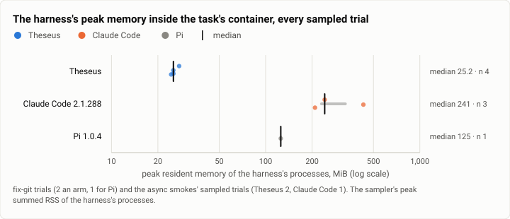
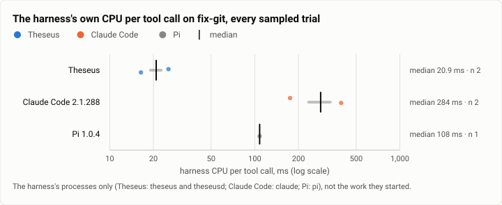
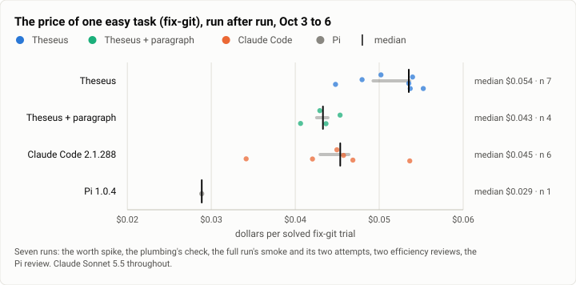

# Harbor: what each harness costs to run, apart from the model, the live efficiency checks (2026-10-03 to 2026-10-06)

**The answer first.** Measured inside the task's container by the bench's sampler, Theseus's harness held 24 to 28 MiB
at its peak in four sampled trials, Claude Code's 209 to 430 MiB in three, and Pi's 125 MiB in one. On the same easy
task (`fix-git`), Theseus's harness used 16 to 25 ms of CPU per tool call, Claude Code's 175 to 394 ms and Pi's
108 ms. These are a handful of trials (two `fix-git` trials an arm, one for Pi, and three async trials), so read
them as sizes, not distributions; but the gaps are an order of magnitude, far past the spread between repeats. The
model's bill is a different story: over the seven runs in four days, one `fix-git` trial cost $0.045 to $0.055 in
Theseus (seven trials, median $0.054), $0.034 to $0.054 in Claude Code (six, median $0.045) and $0.029 in Pi (one). The harness is light; the model
calls it makes are not cheaper for it.

| | |
|---|---|
| Suite | Harbor live checks: Terminal-Bench 2.0's `fix-git` (and one `prove-plus-comm`), plus the async bench's sampled trials |
| Arms | Theseus (`theseus_agent:Theseus`) · Theseus + the batching paragraph · Claude Code 2.1.288 (`claude-code`, then `claude_code_agent:MeasuredClaudeCode`) · Pi 1.0.4 (Harbor's `pi`, measured) |
| Model | Claude Sonnet 5.5 throughout |
| Trials | 21 Harbor trials in seven runs: 18 solved `fix-git` trials, 2 forced timeouts, 1 `prove-plus-comm`; 5 of them sampled, plus 3 sampled async trials |
| Dates and commits | 2026-10-03 15:46 to 2026-10-06 13:48 (UTC−7). Theseus's binaries: the spike's build, then the plumbing lane's, then `079f1db` in every sampled check |
| Cost | $0.38 for the checks of their own (the plumbing's $0.14, the two efficiency reviews' $0.21, the Pi arm's $0.03); the other trials are in their runs' reports |
| Data | [`2026-10-06-harbor-efficiency-checks.json`](2026-10-06-harbor-efficiency-checks.json), [`.csv`](2026-10-06-harbor-efficiency-checks.csv) (one row per trial) |

This is a report of its own, rather than a paragraph in the first full run's, because it holds the only
measurements so far of what each harness itself spends: that run predates the sampler, and reads "not sampled" for
CPU and memory.

## The question

A harness is a program running beside the model's work: it holds memory, burns CPU on every turn, and takes time to
install in each task's container. Theseus is built to be small and fast, so the question is whether that shows when
it runs the same task as Claude Code, measured the same way, and whether one easy task's price is steady enough from
run to run to serve as a check that a harness change did not move the bill.

## The setup

- **The record.** Since 2026-10-05 each trial of each arm leaves `agent/efficiency.json` (`bench/harbor/efficiency.py`):
  tokens by class, dollars, model and tool calls, and the harness's CPU and peak memory apart from its work. A
  sampler (`bench/harbor/sampler.py`, standard library) runs in the task's container at nice 19 and reads `/proc`
  every 250 ms: a process named as the arm's harness is **harness** (Theseus: `theseus`, `theseusd`; Claude Code:
  `claude`; Pi: `pi`), what it starts is **work**, and Theseus's job wrappers are counted apart. The container's
  cgroup gives the total.
- **The checks**, in order:
  1. The worth spike (2026-10-03 15:46): `fix-git` in three arms, before any sampler.
  2. The bench plumbing's checks (2026-10-03 18:39 to 18:44): Theseus through the adapter now in the repository:
     `fix-git`, `prove-plus-comm`, and `fix-git` twice with its agent timeout cut to 10.8 s, to see a timed-out
     turn stop and keep its spend.
  3. The first full run's smoke (2026-10-03 23:15) and its two `fix-git` attempts per arm (2026-10-04).
  4. Two reviews of the efficiency record (2026-10-05 05:19 and 17:22): one `fix-git` trial per arm with the
     sampler, the second after a fix to how the work's CPU is counted (the harness's numbers are unaffected).
  5. The review of a fourth arm, Pi 1.0.4, measured the same way (2026-10-06 13:48): one `fix-git` trial.
  The async bench's smokes also ran the sampler on three trials (2026-10-05 and 06); their harness numbers are
  below, and their scores in [the async smokes' report](2026-10-06-async-smokes.md).
- **Model:** Claude Sonnet 5.5. **Limits:** a trial's spend cap was $2.00 in the spike and the first full run, $0.40
  in the plumbing's checks and $1.00 in the reviews, with 200 calls or turns; Claude Code ran at Harbor's defaults in
  the spike; Pi's caps were recorded, not enforced. No `fix-git` trial came near a cap.
- **Theseus's build:** every sampled check ran the first full run's static build (`079f1db`) with its own bench
  profile, because no static build of a later `main` existed yet; what the checks tested was the new harness code
  around it. **Machine:** one WSL2 VM, 16 vCPUs, Docker, shared with the project's builds.

## Results

<picture>
  <source media="(prefers-color-scheme: dark)" srcset="img/2026-10-06-harbor-efficiency-checks/harness-rss-dark.svg">
  
</picture>

*Figure 1. How much memory does each harness itself hold at its peak? Theseus 24 to 28 MiB, Claude Code 209 to 430
MiB, Pi 125 MiB: Claude Code's harness held 8 to 17 times Theseus's.*

<picture>
  <source media="(prefers-color-scheme: dark)" srcset="img/2026-10-06-harbor-efficiency-checks/harness-cpu-per-tool-call-dark.svg">
  
</picture>

*Figure 2. How much CPU does each harness spend per tool call, apart from the commands it runs? On `fix-git`,
Theseus 16 to 25 ms, Pi 108 ms, Claude Code 175 to 394 ms: 7 to 24 times Theseus's.*

| When (UTC−7) | Check | Arm | Harness peak RSS | Harness processes | Harness CPU | Tool calls | Harness CPU per tool call | Container memory peak | Agent setup | Sampler's share of a core | Dollars |
|---|---|---|---|---|---|---|---|---|---|---|---|
| 2026-10-05 05:19 | efficiency review 1 | Theseus | 25.2 MiB | 2 | 0.33 s | 13 | 25.4 ms | 81 MiB | 2.6 s | 0.40% | $0.0553 |
| 2026-10-05 05:22 | efficiency review 1 | Claude Code | 241.5 MiB | 1 | 1.05 s | 6 | 175.0 ms | 1,824 MiB | 414.1 s | 0.17% | $0.0536 |
| 2026-10-05 17:22 | efficiency review 2 | Theseus | 25.2 MiB | 2 | 0.18 s | 11 | 16.4 ms | 22 MiB | 2.1 s | 0.20% | $0.0540 |
| 2026-10-05 17:22 | efficiency review 2 | Claude Code | 430.2 MiB | 2 | 1.97 s | 5 | 394.0 ms | 1,090 MiB | 219.4 s | 0.23% | $0.0469 |
| 2026-10-06 13:48 | the Pi arm's review | Pi | 125.4 MiB | 1 | 0.54 s | 5 | 108.0 ms | 640 MiB | 52.2 s | 0.24% | $0.0289 |

The async smokes' sampled trials, the same harnesses on longer, different tasks:

| When (UTC−7) | Arm | Async family | Harness peak RSS | Harness processes | Harness CPU | Tool calls | Agent time |
|---|---|---|---|---|---|---|---|
| 2026-10-05 17:35 | Theseus | interrupt | 27.5 MiB | 3 | 0.56 s | 8 | 320 s |
| 2026-10-05 17:43 | Claude Code | interrupt | 208.9 MiB | 1 | 2.15 s | 3 | 192 s |
| 2026-10-06 00:50 | Theseus | fanout | 24.4 MiB | 2 | 0.33 s | 11 | 171 s |

<picture>
  <source media="(prefers-color-scheme: dark)" srcset="img/2026-10-06-harbor-efficiency-checks/fixgit-dollars-dark.svg">
  
</picture>

*Figure 3. Is one easy task's price stable from run to run, and how do the arms compare on it? Steady enough: Theseus's
seven trials stayed within $0.045 to $0.055 and Claude Code's six within $0.034 to $0.054. On this task Theseus's
median ($0.054) sits 18% above Claude Code's ($0.045), the paragraph's ($0.043) near Claude Code's, and Pi's one trial
lower still ($0.029).*

| Arm | Solved fix-git trials | Least | Median | Most | Model calls |
|---|---|---|---|---|---|
| Theseus | 7 | $0.0448 | $0.0535 | $0.0553 | 7 to 9 |
| Theseus + paragraph | 4 | $0.0406 | $0.0433 | $0.0453 | 5 to 6 |
| Claude Code | 6 | $0.0341 | $0.0454 | $0.0536 | 5 to 7 |
| Pi | 1 | $0.0289 | $0.0289 | $0.0289 | 6 |

Every trial of the seven runs:

| When (UTC−7) | Run | Arm | Task | Reward | Dollars | Model calls | Tool calls | Agent time | Agent setup |
|---|---|---|---|---|---|---|---|---|---|
| 2026-10-03 15:46 | the worth spike | Theseus | `fix-git` | 1 | $0.0480 | 8 | 11 | 21.7 s | 0.5 s |
| 2026-10-03 15:48 | the worth spike | Claude Code | `fix-git` | 1 | $0.0450 | 6 | 5 | 12.8 s | 272.5 s |
| 2026-10-03 16:17 | the worth spike | Theseus + paragraph | `fix-git` | 1 | $0.0453 | 6 | 6 | 16.4 s | 0.6 s |
| 2026-10-03 18:39 | the bench plumbing's checks | Theseus | `fix-git` | 1 | $0.0535 | 8 | 12 | 21.5 s | 0.6 s |
| 2026-10-03 18:40 | the bench plumbing's checks | Theseus | `fix-git` | 0 (timed out) | $0.0302 | 5 | 9 | 11.9 s | 0.5 s |
| 2026-10-03 18:42 | the bench plumbing's checks | Theseus | `prove-plus-comm` | 1 | $0.0324 | 5 | 5 | 12.5 s | 0.5 s |
| 2026-10-03 18:44 | the bench plumbing's checks | Theseus | `fix-git` | 0 (timed out) | $0.0256 | 4 | 8 | 11.9 s | 0.5 s |
| 2026-10-03 23:15 | the first full run's smoke | Claude Code | `fix-git` | 1 | $0.0457 | 6 | 5 | 13.4 s | 132.5 s |
| 2026-10-03 23:15 | the first full run's smoke | Theseus | `fix-git` | 1 | $0.0502 | 9 | 12 | 22.4 s | 0.6 s |
| 2026-10-03 23:15 | the first full run's smoke | Theseus + paragraph | `fix-git` | 1 | $0.0429 | 5 | 4 | 14.7 s | 0.6 s |
| 2026-10-04 12:59 | the first full run | Claude Code | `fix-git` | 1 | $0.0341 | 6 | 5 | 15.8 s | 272.6 s |
| 2026-10-04 12:59 | the first full run | Claude Code | `fix-git` | 1 | $0.0420 | 5 | 4 | 13.5 s | 269.3 s |
| 2026-10-04 13:03 | the first full run | Theseus | `fix-git` | 1 | $0.0448 | 7 | 6 | 18.8 s | 0.6 s |
| 2026-10-04 13:03 | the first full run | Theseus | `fix-git` | 1 | $0.0537 | 8 | 12 | 19.9 s | 0.7 s |
| 2026-10-04 13:03 | the first full run | Theseus + paragraph | `fix-git` | 1 | $0.0437 | 6 | 6 | 16.6 s | 0.6 s |
| 2026-10-04 13:03 | the first full run | Theseus + paragraph | `fix-git` | 1 | $0.0406 | 6 | 5 | 15.7 s | 0.6 s |
| 2026-10-05 05:19 | efficiency review 1 | Theseus | `fix-git` | 1 | $0.0553 | 7 | 13 | 26.1 s | 2.6 s |
| 2026-10-05 05:22 | efficiency review 1 | Claude Code | `fix-git` | 1 | $0.0536 | 7 | 6 | 16.5 s | 414.1 s |
| 2026-10-05 17:22 | efficiency review 2 | Claude Code | `fix-git` | 1 | $0.0469 | 6 | 5 | 16.5 s | 219.4 s |
| 2026-10-05 17:22 | efficiency review 2 | Theseus | `fix-git` | 1 | $0.0540 | 8 | 11 | 23.9 s | 2.1 s |
| 2026-10-06 13:48 | the Pi arm's review | Pi | `fix-git` | 1 | $0.0289 | 6 | 5 | 15.6 s | 52.2 s |

## Analysis

**The harness is an order of magnitude lighter.** Theseus's processes (the CLI and its daemon) held 24 to 28 MiB
whether the trial was a 25-second `fix-git` or a five-minute async trial with a daemon kept alive throughout. Claude
Code's single Node process held 241 MiB in one trial and two processes 430 MiB in another; Pi's one Node process 125
MiB. The CPU tells the same story per tool call. Neither number moves the model's bill: a harness's own CPU is
seconds per trial against minutes of model time. They matter where many sessions share one machine, which is what
Theseus is for.

**Installing is the biggest difference in wall time.** Theseus's install uploads two static binaries: 0.5 to 0.9 s,
and 2 to 3 s once the sampler is uploaded too. Claude Code's install takes 2 to 7 minutes per trial (Node and the
CLI through apt and npm; 132 to 414 s here), Pi's 52 s. In the first full run that came to 14.8 hours of setup over
Claude Code's 178 trials (298 s each on average), outside any agent's clock; Theseus's 356 trials spent 6 minutes.

**The price of an easy task is steady.** Six runs over three days, three Theseus builds and five revisions of its
harness code kept Theseus's `fix-git` within $0.045 to $0.055 and 7 to 9 model calls. That makes it a usable smoke check: a harness
change that moves `fix-git` past about $0.06 or 10 calls is worth a look. On this one task Theseus is dearer than
Claude Code by about 18% at the median; over the first full run's 89 tasks the gap was 8% per trial and not
established.

**The timeout path, checked live.** In the plumbing's two forced timeouts, Harbor cut the agent at 10.8 s; the
adapter's signal stopped the turn as `/stop` does (exit 9), kept its spend ($0.0302 and $0.0256), and the agent
phase ended 1.1 s after the cut. The first of them found that a call the stop cut was missing from the trajectory
($0.0140 against the turn's $0.0302); a step for the cut call fixed it, and the second agreed to the cent. The
first full run's `caffe-cifar-10` later showed this path's limit: under a CPU-bound task the stop took longer than
Harbor's 60 s, and the trial ended before its tests (see [its report](2026-10-04-terminal-bench-first-full-run.md)).

**What changed since the last comparable measurement.** None existed: before 2026-10-05 a trial's harness CPU and
memory were not recorded, and the spike's "the harness is about 2% of a turn" came from turn traces, not from the
process table. The first sampled pair was in the first review; the second review fixed a double count in the work's
CPU (the sampler's own CPU was subtracted twice), which moved the work column, not the harness's.

## Threats to validity

- **Very small n.** Two sampled `fix-git` trials for Theseus and Claude Code, one for Pi. The figures show every
  trial; the ranges in the text are the ranges of those trials.
- **One easy task.** `fix-git` makes 5 to 13 tool calls; per-call CPU on long tasks may differ, and the async
  trials (one family each) are only a hint that the memory holds.
- **Claude Code's process count varies.** One trial ran one `claude` process, the next two: its peak doubled with it.
- **Theseus is an older build.** Every sampled Theseus trial ran `079f1db` with that commit's profile; today's binary
  has more in its daemon.
- **The sampler's own cost.** 0.17% to 0.40% of a core at 250 ms here. The sampler counts itself apart, not as
  harness.
- **The container's memory peak** covers the whole container's life, so for Claude Code and Pi it includes their
  install (1.1 to 1.8 GiB, 640 MiB); it is not the harness's.
- **A shared machine.** Install and agent times depend on the machine's load; the dollars and calls do not.

## What it cost

$0.38 for the checks run for their own sake: the plumbing's four trials $0.1417, the first efficiency review's pair
$0.1089 (a first try that the build's profile refused spent $0), the second's $0.1008, and Pi's trial $0.0289. The
spike's and the first full run's `fix-git` trials are counted in their own reports.

## Reproduction

The checks' trial directories are kept on the build machine, not published. From the repository, one sampled trial
per arm:

```bash
bench/build.sh
export THESEUS_BENCH_BIN_DIR=$PWD/bench/bin PYTHONPATH=$PWD/bench/harbor HARBOR_TELEMETRY=0   # and ANTHROPIC_API_KEY
.venv/bin/harbor run -d terminal-bench@2.0 -i fix-git -a theseus_agent:Theseus \
  -m anthropic/claude-sonnet-5-5 -o jobs --job-name eff-theseus
.venv/bin/harbor run -d terminal-bench@2.0 -i fix-git -a claude_code_agent:MeasuredClaudeCode \
  --ak version=2.1.288 --ak max_budget_usd=1.0 --ak max_turns=200 \
  -m anthropic/claude-sonnet-5-5 -o jobs --job-name eff-claude-code
python3 bench/report/efficiency.py --arm theseus=jobs/eff-theseus --arm claude-code=jobs/eff-claude-code --out /tmp/eff
```

Each trial's `agent/efficiency.json` holds the numbers above; `bench/report/efficiency.py` adds harness CPU per tool
call, peak harness RSS and the Pareto charts. Pi's measured arm (`pi_agent:MeasuredPi`, with `version=1.0.4`) was
reviewed on 2026-10-06 and joins `bench/harbor` after this report's base commit.

## Data

- [`2026-10-06-harbor-efficiency-checks.json`](2026-10-06-harbor-efficiency-checks.json): every trial (run, time,
  arm, task, reward, dollars, calls, times, and for sampled trials the harness's CPU, peak RSS and processes, the
  work's CPU, the container's memory peak and the sampler's cost), the async smokes' sampled trials, the `fix-git`
  price per arm, and the three figures' specs.
- [`2026-10-06-harbor-efficiency-checks.csv`](2026-10-06-harbor-efficiency-checks.csv): one row per Harbor trial.

Memory is in MiB (1,024 KiB), as the sampler records kilobytes of `/proc`; a review that wrote "25.8 MB" for Theseus
and "247 MB" for Claude Code divided by 1,000, the same trials as 25.2 and 241.5 MiB here.
