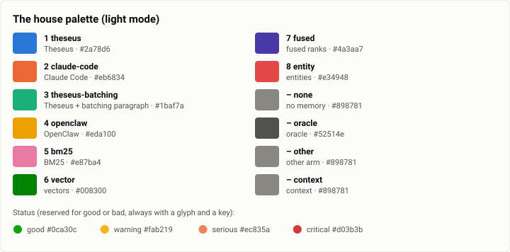

# Benchmarks

Every benchmark Theseus runs ends in a report here: a short research note that gives the answer first, then the
question the run asked, its setup, its results with their uncertainty and plots, what the run teaches, the threats to
its validity, what it cost, and the commands that run it again. Each report keeps its numbers in a data file beside
it, so every table and plot can be checked and redrawn. How a benchmark is set up and run is in
[`bench/README.md`](../../bench/README.md), which also holds the rule that every run gets its report.

## Every run, newest first

The first row is pinned: the omnibus review, the one undated page, is the living overview of every run below, and
its date is the day it was last brought up to date.

| Date | Suite | Arms | Headline | Report |
|---|---|---|---|---|
| 2026-10-08 | all | every arm | **Pinned: start here.** What all the runs say, by question: it solves 71.9% of Terminal-Bench 2.0's trials (Claude Code 81.5%; most of the gap was harness faults, now mostly fixed); its harness is the lightest measured (36.5 MiB, 17 ms a tool call, under a second to install); recall lifts a cheap model from 15% to 67%; every speed budget's median is a fifth to a half of its limit. | [The benchmarks omnibus review: what every run says](omnibus.md) |
| 2026-10-06 | `harbor` | Theseus · Theseus + paragraph · Claude Code 2.1.288 · Pi 1.0.4 | The harness apart from the model: Theseus 24 to 28 MiB peak and 16 to 25 ms CPU per tool call; Claude Code 209 to 430 MiB and 175 to 394 ms; Pi 125 MiB and 108 ms. A `fix-git` trial costs about the same in each. | [Harbor: what each harness costs to run, apart from the model, the live efficiency checks](2026-10-06-harbor-efficiency-checks.md) |
| 2026-10-06 | `gate-bench` | Theseus on main (each gate's p95 and p50) | 240 gates on main: every lifecycle phase's median far inside its budget all week (a cold start's p50 22.6 ms against 50); the slowest of ten runs crossed a limit in 32 gates (13.3% [9.6, 18.2]), more often under load; four joins moved a number. | [Gate bench: FAST's history, the gate's speed benches from Oct 1 to Oct 6](2026-10-06-gate-bench-fast-history.md) |
| 2026-10-06 | `async` | Theseus · Claude Code 2.1.288 · the oracle | Smokes, not a run (six model trials): every trial earned its reward; Theseus acted on a mid-task message in 46 to 56 s, Claude Code in 147 and 163 s, at 5 and 8 more model calls. | [Async: the async bench's smokes, before its first full run](2026-10-06-async-smokes.md) |
| 2026-10-05 | `recall` | Theseus (memory arm `baseline`) | Three paid smokes, not the full run (30 turns and 8 probes each, $1.84 in all): each found a flaw in the bench (plan overage, strict abstention, the retracted-stale rule, overhead margins). The 600-turn run is still to come. | [Recall bench: the first three smokes on the Theseus arm](2026-10-05-recall-smokes.md) |
| 2026-10-05 | `gate-bench` | Theseus before · after three fixes | Three fixes: a reply's first words reached Discord 2 to 11 ms after the model's first token, not 255 to 514 (p = 0.0012); on a disk whose flushes stall 1.4 s, a whole reply 2 ms after the stream ended, not 5,403. | [Gate bench: a greeting's reply under IO stalls, before and after three fixes](2026-10-05-gate-bench-speed-io-stalls.md) |
| 2026-10-04 | `terminal-bench` | A. Theseus plain · B. Theseus + batching paragraph · C. Claude Code 2.1.288 | Claude Code 81.5% [75.1, 86.5], Theseus 71.9% [64.9, 78.0], Theseus + paragraph 73.6% (trials, Wilson 95%); by task Claude Code better on 16, Theseus on 5 (p = 0.027). 13 of Theseus's 21 trials that did not end on their own were harness faults since fixed; $71.60. | [Terminal-Bench 2.0: Theseus against Claude Code on all 89 tasks, the first full run](2026-10-04-terminal-bench-first-full-run.md) |
| 2026-10-04 | `memory-exam` | none · bm25 · baseline (fused) · oracle | Memory's arms through the real recall pipeline (GLM-5.3 Flash, 72 items): none 15% [7, 23], BM25 and entities 46% [35, 57], fused baseline 67% [56, 78], oracle 100%. | [Memory exam: the recall pipeline's arms against no memory and the oracle](2026-10-04-memory-exam-arms.md) |
| 2026-10-04 | `gate-bench` | main · lane linux-io | One sync per job: the daemon heard of a finished job 6.6 ms sooner (16.91 → 10.31 ms at L0) and a tool-call turn ran 19.0 ms faster (179.55 → 160.55 ms; 8 against 8, p = 0.0002); a plain turn did not move. | [Gate bench: a job's completion with one sync instead of two, an A/B](2026-10-04-gate-bench-one-sync-per-job.md) |
| 2026-10-03 | `harbor` | Theseus · Theseus + paragraph · Claude Code 2.1.288 | Theseus ran public benchmarks through Harbor: 11 of 11 trials solved on four tasks ($0.42). Its 1.55× call gap reproduced a day later on its three tasks but not across all 89 (1.05×). | [Harbor: can Theseus run public benchmarks at all? The worth spike](2026-10-03-harbor-worth-spike.md) |
| 2026-10-03 | `gate-bench` | main · the ledger-reads branch | A branch's two failed join gates (shutdown p50 88.0 and 70.8 ms) were the disk, not the branch: in one hold of the gate lock main and the branch stopped alike (45.8 against 39.6 ms). Found on the way: a 716 to 887 ms first stop after an install's build. | [Gate bench: the ledger-reads branch, its slow stop that was the disk, its first stop that was not, and its reads at 10,000 sessions](2026-10-03-gate-bench-ledger-reads.md) |
| 2026-10-02 | `gate-bench` | main · lane perf1 | On 10,000 parked sessions (release), a cold start's p50 119.1 → 21.5 ms, a SIGKILL's restart 149.9 → 48.0 ms, a binary swap 149.2 → 45.6 ms (each p = 0.00001); an idle daemon 5.05% of a core → 0.10%. | [Gate bench: the start path at 10,000 parked sessions, before and after the perf1 lane](2026-10-02-gate-bench-start-path-10k.md) |
| 2026-10-02 | `gate-bench` | release-thin glibc · release · static musl | Thin LTO: about 7% slower on CPU-bound work (8 of 10 pairs), rebuilds 1.7 and 5.7 times faster. Static musl: 28% to 67% more CPU in every pair (p = 0.008), 16% to 25% less memory; its faster lifecycle held only for the swap. | [Gate bench: the install's build profile and libc, measured](2026-10-02-gate-bench-install-builds.md) |
| 2026-10-01 | `retrieval` | BM25 + entities · vectors · weighted fusion | Held out, vectors alone found all the gold in the top 6 for 22 of 34 items, BM25 and entities 14 (p = 0.02), equal-weight fusion 16; a vector weight of 6, chosen by a rule written first, 22 (p = 0.03), no more than vectors alone. | [Retrieval: BM25, entities, vectors and their fusion on the exam's items](2026-10-01-retrieval-fusion.md) |
| 2026-10-01 | `retrieval` | candle 0.11 · tract 0.23.8 | candle at f32 embeds a 128-token chunk in 351 to 364 ms on one thread, 1.27 to 1.40 times faster than tract, and adds 1.6 MiB to the binary against 22.4. A real recall query is already past recall's 250 ms deadline. | [Retrieval: which engine embeds for the index, candle or tract?](2026-10-01-retrieval-embedding-engines.md) |
| 2026-10-01 | `gate-bench` | dependencies at opt-level 0 · 2 | Dependencies at opt-level 2: a cold start's median p50 25.6 → 21.7 ms (faster in 9 of 10 interleaved pairs, p = 0.021), the config-copy start 26.8 → 21.5 ms; the gate's misses unchanged (4 and 5 of 10 runs). | [Gate bench: dependencies at opt-level 2 in debug builds, an A/B of the lifecycle bench](2026-10-01-gate-bench-opt-level-2.md) |
| 2026-10-01 | `context` | chars/4 · the class estimate | chars/4 read Claude Sonnet 5.5's tool-carrying first requests at 65.6 to 70.6% of the provider's count (GLM 97.4 to 102.2%); the shipped estimate reads first requests at +1.9 to +4.3% and later ones within 1.7%. | [Context: how far off was the token estimate, and how close is it now?](2026-10-01-context-token-estimate.md) |
| 2026-09-30 | `memory-exam` | BM25 probe · none · oracle | On 32 retrieval-hard items BM25's top 6 holds all the gold for 1 (3.1% [0.6, 15.7]), against 33 of exam-v1's 36: paraphrase, scale, time and tool output each defeat it for their own reason. | [Memory exam v2: items built so that retrieval is hard](2026-09-30-memory-exam-v2.md) |
| 2026-09-30 | `memory-exam` | none · oracle · BM25 probe | GLM-5.3 Flash passed 26% of 40 items with no memory and 100% with the needed notes shown: +74 points [+61, +86] of headroom (held out +82). But BM25's top 6 already held the gold for 33 of 36 items, so exam-v1 cannot judge a retriever. | [Memory exam: how much does a cheap model gain from being shown its past?](2026-09-30-memory-exam-headroom.md) |

## The house palette

Every chart in these reports draws an arm in the same colour, so a reader who learns "Claude Code is orange" in one
report can trust it in the next. The colours are the categorical palette of the dataviz method these reports follow,
in its fixed order, with a light and a dark step for each slot; each chart is shipped in both modes and GitHub shows
the one that matches the reader's theme. `bench/report/charts.py` owns the palette: a report names arms by key, never
by colour.

<picture>
  <source media="(prefers-color-scheme: dark)" srcset="img/palette-dark.svg">
  
</picture>

| Slot | Arm key | Arm | Light | Dark |
|---|---|---|---|---|
| 1 | `theseus` | Theseus | `#2a78d6` | `#3987e5` |
| 2 | `claude-code` | Claude Code | `#eb6834` | `#d95926` |
| 3 | `theseus-batching` | Theseus + the batching paragraph (an ablation arm) | `#1baf7a` | `#199e70` |
| 4 | `openclaw` | OpenClaw (reserved: its arm is not built yet) | `#eda100` | `#c98500` |
| 5 | `bm25` | BM25, the lexical source | `#e87ba4` | `#d55181` |
| 6 | `vector` | vectors, the dense source | `#008300` | `#008300` |
| 7 | `fused` | fused ranks (BM25, entities and vectors) | `#4a3aa7` | `#9085e9` |
| 8 | `entity` | exact entities | `#e34948` | `#e66767` |

Harness arms hold slots 1 to 4; configurations inside Theseus (memory and retrieval arms) hold 5 to 8. Four neutrals
are not slots: `none` (a no-memory baseline) and `context` (the emphasis form's de-emphasised series: a second
statistic of an arm, or the rest beside the one that matters) in the gray `#898781`; `oracle` (a ceiling) in the
secondary ink; and `other` (an arm outside the registry) in the gray, with its name on the point. Status colours
(good `#0ca30c`, warning `#fab219`, serious `#ec835a`, critical `#d03b3b`) are reserved for what means good or bad,
such as a run over its budget, and always come with a glyph and a key. A new arm takes the next free slot here and
in `charts.ARMS`, and the palette is validated again. Pi, an arm since 2026-10-06 (`bench/harbor/pi_agent.py`), has
no slot yet: the eight are taken and slot 4 is held for OpenClaw, so Pi is drawn as `other`, its name on its point
and in the legend.

**Validated** with the method's validator (OKLab ΔE × 100, Machado-Oliveira-Fernandes 2009 at severity 1), on the
chart surfaces `#fcfcfb` (light) and `#1a1a19` (dark):

| Set | Mode | Pairs | Worst CVD ΔE (target 8) | Worst normal-vision ΔE (floor 15) | Contrast against the surface |
|---|---|---|---|---|---|
| All eight slots | light | adjacent | 9.1 | 19.6 | 3 below 3:1: aqua 2.74, yellow 2.11, magenta 2.62 |
| All eight slots | dark | adjacent | 8.4 | 19.3 | all at least 3:1 |
| The three harness arms (slots 1 to 3) | light | all | 9.2 | 24.0 | aqua 2.74 |
| The three harness arms (slots 1 to 3) | dark | all | 9.4 | 20.9 | all at least 3:1 |
| Memory slots 5 to 8 | light | adjacent | 17.6 | 33.6 | magenta 2.62 |
| Memory slots 5 to 8 | dark | adjacent | 13.0 | 22.5 | all at least 3:1 |
| `bm25`, `vector`, `fused` | light / dark | all | 17.6 / 13.0 | 33.9 / 19.7 | magenta 2.62 (light) |
| A dumbbell's two steps (`theseus`) | light / dark | ordinal | monotone, ΔL ≥ 0.06 | – | light end 2.12:1 / 2.12:1 (floor 2:1) |

Every check passes. The three light-mode slots under 3:1 take the method's relief rule: no chart is the only way to
read its numbers, since each figure's values are in a table in its report and its marks are labelled or keyed. Text
is never drawn in a series colour: labels use the ink (`#0b0b0b`, 19.2:1) and the secondary ink (`#52514e`, 7.7:1;
dark `#c3c2b7`, 9.7:1). A scatter, whose points can sit beside any other, carries at most three arms: the harness
arms' three, or the three retrieval arms, each set validated over all its pairs.

## How a report is written

**Its name:** `<YYYY-MM-DD>-<suite>[-<slug>].md`, the date the run happened; its figures under `img/<same name>/`; its
data file `<same name>.json` beside it, and a per-trial (or per-task, per-probe, per-run) `<same name>.csv` when there
is one. Suites: `terminal-bench`, `swe-bench`, `harbor` (mixed samples), `gate-bench` (the gate's speed benches and
the A/Bs beside them), `memory-exam`, `retrieval`, `recall`, `async`, `context` (the context compiler against the
provider's own numbers).

**Its sections,** in order, each one there even when it is short:

1. **The answer first:** one paragraph, the headline with its numbers and their intervals.
2. A table at a glance: suite, arms, model, tasks × attempts, date and commit, cost, data.
3. **The question** the run asked, and why it mattered then.
4. **The setup:** each arm's harness and version; the model; the dataset and its task count; the limits (attempts,
   wall clock, spend and turn caps); the machine; the date and the commit.
5. **Results:** tables with uncertainty, and figures that each answer one question named in their caption.
6. **Analysis:** where each arm wins and loses, with a failure taxonomy and its examples (task ids, never
   transcripts); cost, tokens and time against success (a Pareto view where there are arms); what changed since the
   last comparable run.
7. **Threats to validity:** sample size, flaky tasks, spend parity, contamination, the harness's own bugs at the time.
8. **What it cost** to run.
9. **Reproduction:** the exact commands, from this repository, on public datasets.
10. **Data:** what the data file holds.

"Novel" means the insight, not the format: a report says what the run teaches that its tables don't, says plainly
where a run was flawed, and says so when a later look finds that an old conclusion doesn't hold.

**Its statistics** come from `bench/report/stats.py`, the same code for a past run and a future one:

- a pass rate with its Wilson 95% interval, saying whether the unit is the trial or the task;
- two arms compared on the same tasks by an exact McNemar test on the discordant pairs (a task and attempt that one
  arm passed and the other did not), with the counts beside the p;
- a mean cost or time with a seeded bootstrap 95% interval (10,000 resamples), or its range when there are fewer than
  ten values, and the median beside a skewed mean.

**Its figures** are SVG, drawn by `bench/report/charts.py` (the Python standard library, nothing to install) from
declarative specs kept in the data file's `figures`: `python3 bench/report/draft.py plot docs/benchmarks/<report>.json`
draws them again. The forms are chosen by the data's job: an interval per row for estimates (`intervals`), bars for
counts, lines and small multiples for a number over time against its budget, a scatter for a Pareto view, a strip for
a distribution of per-trial values, a matrix for each task's outcomes, and a dumbbell for before and after. One axis
per chart, recessive hairline grids, thin marks, a legend for two or more series and labels only where they carry the
story. Each figure is shipped twice, `<name>.svg` and `<name>-dark.svg`, each painting its own surface, and a report
shows them with a `<picture>` whose dark source GitHub picks for a reader in its dark theme. Every mark carries a
`<title>`, so opening a figure on its own shows each value on hover; in the report, the table beside each figure is
its readable twin. Before a figure ships, it is looked at, rendered, in both modes, and checked against the method's
list of what goes wrong (overlap, clipped labels, a dual axis, a number on every point).

**Its data** is the run's summary, never its raw outputs: numbers, task ids and figure specs. Trial transcripts stay
off this public repository.

**Its words** follow the repository's rules: no person's name (the owner is "the owner"), no private path, account,
key or address, and public datasets only.

## Drafting a report

`bench/report/draft.py` does the mechanical half of every report: it reads what a run left, computes the numbers with
their intervals, writes the data file, the CSV and both modes of every figure, and a skeleton with every section in
order, its tables filled and its figures placed. The run's lane writes the narrative into the skeleton.

```bash
# A Harbor run (Terminal-Bench, SWE-bench, the async families): one --arm per arm, KEY=JOBS.
python3 bench/report/draft.py harbor --suite terminal-bench@2.0 --date 2026-10-04 --slug first-full-run \
    --arm theseus=jobs/theseus-tb2 --arm claude-code=jobs/claude-tb2 --model anthropic/claude-sonnet-5-5

# The gate's speed benches over a span of the bench history ($THESEUS_BENCH_HISTORY).
python3 bench/report/draft.py history --since 2026-10-01 --branch main --date 2026-10-06

# The recall bench, from its scorer's scores.json; the async bench, from its Harbor jobs.
python3 bench/report/draft.py recall --scores <scores>/scores.json --date <day>
python3 bench/report/draft.py async --date <day> jobs/async-theseus jobs/async-claude

# Any report's figures again, after editing a spec.
python3 bench/report/draft.py plot docs/benchmarks/<report>.json
```

An existing report is never overwritten (`--force` rewrites its skeleton). `bench/report/efficiency.py`, the
efficiency report over Harbor jobs, draws its Pareto charts with the same renderer.

## What a Harbor run records

- The job's `result.json` from Harbor, and each trial's reward, time and spend.
- Since 2026-10-05 (the spec's Part III Item 167), each trial's efficiency record, `agent/efficiency.json`, one shape
  for every arm: tokens by class (input, cache read, cache write, output), dollars, model and tool calls, and the
  harness's own CPU and peak RSS apart from the commands it runs, sampled inside the task's container
  (`bench/harbor/sampler.py`). A job from before it, such as the first full run's, reads "not sampled" for CPU and
  RAM. Since 2026-10-06 (Items 199 and 200) the async harness's Theseus record counts a call a stop cut at its
  estimate apart (`cut_calls`, `cut_cost_usd` and `billed_usd`, with `cost_usd` their sum, what the kernel books as
  spent), its tool calls include its tasks' (`tool_calls_from`), and a trial whose ledger read hit its 1,000-row cap
  is marked `truncated`; a published async table shows `billed_usd` beside the dollars, notes that Claude Code's
  record carries no estimate for a request its interrupt cut, and footnotes a truncated trial. A recall progression
  records the overhead it was planned at, and the driver refuses a daemon more than 50 tokens over it
  (`--allow-overhead` runs on); a published run is generated at the measured overhead. `--stale retracted` binds a
  retracting phrase to the nearest value within four words in its clause; strict stays the published rule.
- Theseus's build (`theseus --version`) and the profile's settings (`THESEUS_BENCH_*`), so a run can be repeated.
- Trials that ended with an error, by Harbor's class for it: a timeout (`AgentTimeoutError`), a spend limit
  (`TheseusSpendLimitError`), a cut turn (`TheseusTurnCutError`), and so on (`bench/README.md`). Their rewards still
  count: the task's tests run after every trial.
