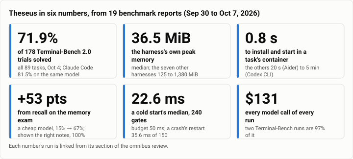
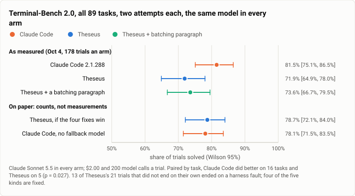
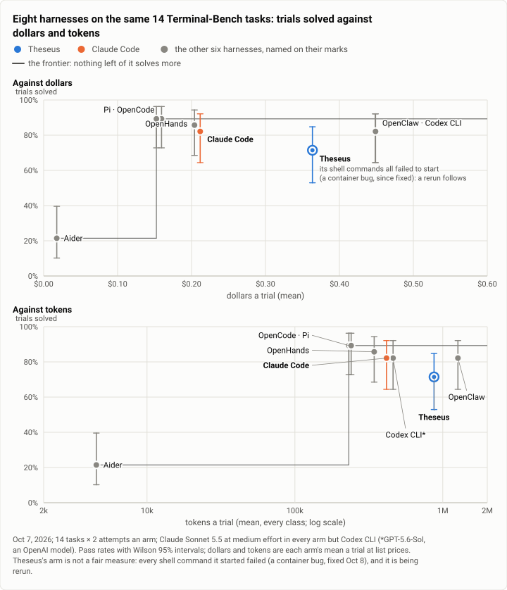
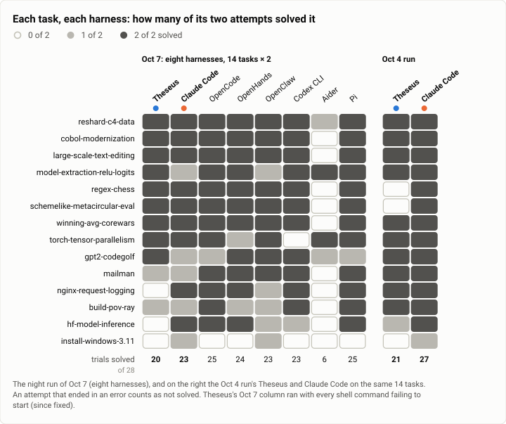
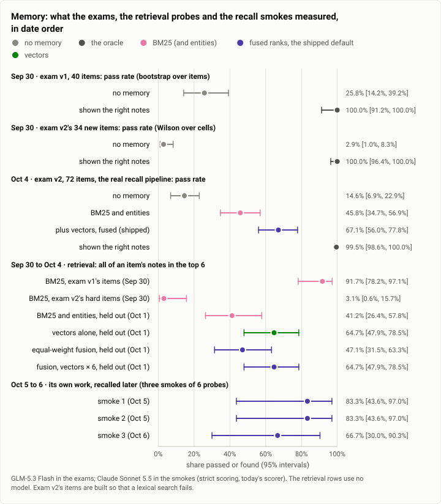
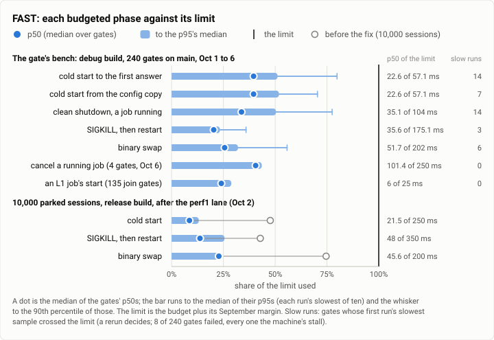
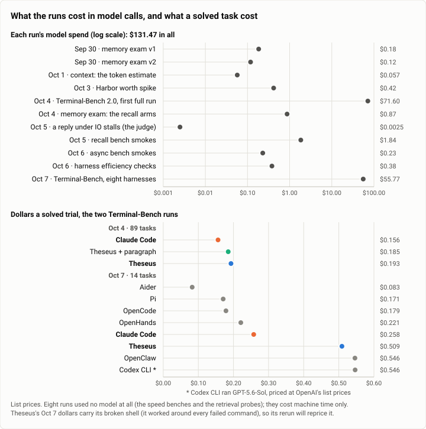
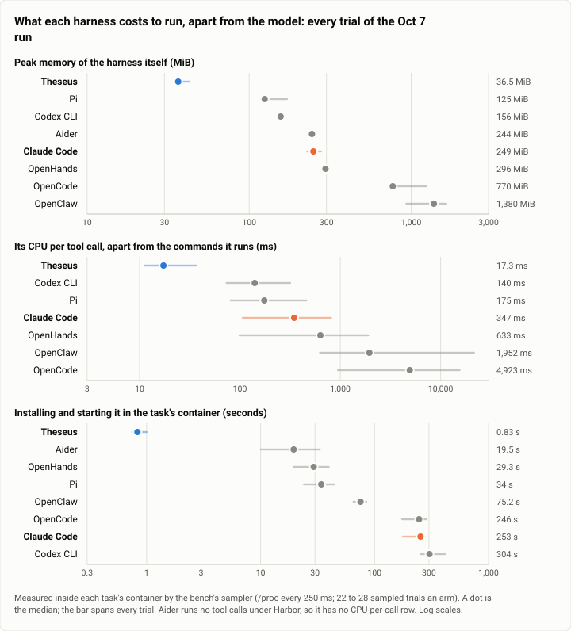
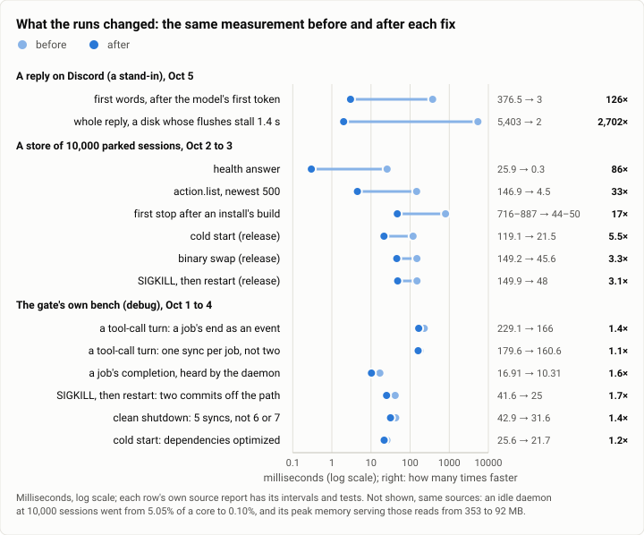

# Theseus's benchmarks as of 2026-10-08: the omnibus review

**The answer first.** Nineteen benchmark runs between Sep 30 and Oct 7, 2026 say four things about Theseus. **It is
light and fast.** Its own process holds about 36 MiB, under a third of any of the seven other harnesses measured
beside it, and spends about 17 ms of CPU per tool call, an eighth or less of theirs. It installs in under a second
where they take 20 seconds to 5 minutes. Every speed budget's median sits at a fifth to a half of its limit. **It solves most real terminal
tasks, but not yet as many as Claude Code driving the same model:** 71.9% of 178 Terminal-Bench 2.0 trials against
81.5% (Oct 4). Most of that gap was faults in the harness, and four of their five kinds are fixed; a gap on the
hardest tasks remains. **Its
memory works when retrieval finds the right note.** Recall lifts a cheap model from 15% to 67% on the memory exam,
and the same model shown the right notes passes almost every item, so what is left to win is retrieval, above all a
sense of time. **Every run changed Theseus:** fourteen measured speed-ups, from 1.2 to 2,700 times, came from findings
the runs made. The newest run (eight harnesses, Oct 7) cannot rank Theseus yet: a container bug kept every one of its
shell commands from starting, so its 20 of 28 was earned without a shell. It is rerun once the current fixes land.
All the model calls of all nineteen runs cost $131.

<picture>
  <source media="(prefers-color-scheme: dark)" srcset="img/omnibus/headline-dark.svg">
  
</picture>

*Figure 1. What do the benchmark runs say, in a sentence each? Six numbers; each section below links the runs they come from.*

| | |
|---|---|
| Runs | 19 reports, Sep 30 to Oct 7, 2026: 18 published, and the harness arms' run of Oct 7, whose report is in review |
| Questions | Does it solve real tasks? Does it remember? Is it fast? What does it cost? |
| Harnesses compared | Theseus; Claude Code; and on Oct 7 OpenCode, OpenHands, OpenClaw, Codex CLI, Aider and Pi |
| Models | Claude Sonnet 5.5 for the task runs (Codex CLI: GPT-5.6-Sol); GLM-5.3 Flash for the memory exams; none for the speed benches and the retrieval probes |
| Model spend | $131.47 at list prices, of which the two Terminal-Bench runs are $127.37 |
| Data | [`omnibus.json`](omnibus.json): every figure's numbers, a row a mark, with the reports they come from |

This page is the overview. It is updated as runs land, and each run keeps its own full report, linked from every
section below and listed at the end.

## How to read this page

- **A harness** is the program around a language model: it gives the model tools (a shell, files, the web), runs
  them, keeps the session, and decides when to stop. Theseus is a harness. So are Claude Code, OpenCode and the others
  it was measured against. Where two harnesses drive the same model, the difference between them is the harness's.
- **A trial** is one attempt by one harness at one task. A task's own tests decide whether it passed.
- **A 95% interval**, written [low, high], is the range the true value likely sits in, given how few trials there
  were. Wide intervals mean small samples. Two intervals that overlap a lot do not show a difference.
- **p50 and p95** are the median and the slow end of a set of timings. In the speed gate, the p95 of ten runs is the
  slowest of the ten.
- **The oracle** is the memory exam's ceiling: the model is handed exactly the notes the task needs.
- **The gate** is the set of checks every change must pass before it joins the main line: tests, and the speed
  benches with their budgets.
- **The frontier** is the set of harnesses no other beats on both counts at once (more tasks solved for less).

Colours hold across every figure: Theseus is always blue and Claude Code orange. The other harnesses are gray, each
named on its own mark.

## Does it solve real tasks?

Terminal-Bench 2.0 is 89 public tasks, each in its own container: build a ray tracer, repair a git history, make a
web server log its requests, crack a hash. A trial passes when the task's own tests pass. Three runs have measured
Theseus on it, each larger than the last.

**Can it run them at all? Yes ([the worth spike, Oct 3](2026-10-03-harbor-worth-spike.md)).** Through the public
Harbor runner, with a small adapter and two static binaries, Theseus solved four easy tasks as Claude Code did, 11 of
11 trials for $0.42. Its own work was 1.3% to 4.6% of a turn: the rest was the model. It made 1.55 times Claude
Code's model calls on those easy tasks, because its model split shell work into many small commands.

**How often does it succeed? 71.9%, against Claude Code's 81.5% ([the first full run, Oct 4](2026-10-04-terminal-bench-first-full-run.md)).**
All 89 tasks, two attempts each, the same model (Claude Sonnet 5.5) and the same limits ($2.00 and 200 model calls a
trial) in every arm.

<picture>
  <source media="(prefers-color-scheme: dark)" srcset="img/omnibus/tb-full-dark.svg">
  
</picture>

*Figure 2. How often does Theseus solve a real terminal task, against Claude Code? 71.9% of trials against Claude Code's 81.5%; most of the gap was harness faults, most of them since fixed.*

Paired task by task, Claude Code did better on 16 tasks and Theseus on 5 (exact sign test, p = 0.027). The run's
most useful finding was why. Of Theseus's 21 trials that did not end on their own, 13 ended on a fault of the
harness, not of the model's work:

- the model refused three security-flavoured tasks, and Theseus had no fallback (6 trials). Claude Code meets the
  same refusals by retrying on an older model, and finished all six of its trials that way;
- the bench capped the model's answer at 32,000 tokens where the model allows 128,000 (4 trials);
- an approval nobody could give, a provider timeout that was not retried, and one stop that overran (1 trial each).

Four of the five are fixed. Counting every trial they touch as solved, Theseus would reach at most 78.7%, level with
Claude Code without its fallback trials (78.1%); that is a count, not a measurement. What the fixes cannot reach is the
hard tasks: there Claude Code did better on 9 tasks to Theseus's 1 (p = 0.021). At full scale the call gap of the
spike almost vanished (8.35 against 7.98 calls a trial). One extra paragraph of instructions asking the model to
batch its shell steps (the green arm) cut calls by 11% and moved nothing else; the project gave the shell tool a
batch of steps instead, a tool rather than a prompt.

**Beside six more harnesses ([the harness arms' run, Oct 7](#every-report)).** Eight harnesses ran the same 14 tasks
twice each: the four tasks the fixes target, and ten tasks both of Oct 4's arms had solved. Every arm but one drove
Claude Sonnet 5.5 at medium effort; Codex CLI speaks only OpenAI's API, so it ran OpenAI's GPT-5.6-Sol.

<picture>
  <source media="(prefers-color-scheme: dark)" srcset="img/omnibus/frontier-dark.svg">
  
</picture>

*Figure 3. Which harnesses solve the most for the least, and where does Theseus sit? Pi and OpenCode solve the most (89%), at $0.15 to $0.16 a trial; Theseus's 71% at $0.36 is off the frontier, in a run where none of its shell commands could start.*

<picture>
  <source media="(prefers-color-scheme: dark)" srcset="img/omnibus/task-strip-dark.svg">
  
</picture>

*Figure 4. Where does each harness win and lose, task by task? Most tasks fall to nearly every harness; Aider misses most, and every harness misses install-windows-3.11 at least once. Theseus's Oct 7 column was earned without a working shell, and even so the two tasks the output-cap fix targeted went from 0 of 4 trials to 4 of 4.*

- **The field is close.** Pi and OpenCode solved 25 of 28 (89.3%), OpenHands 24, Claude Code, OpenClaw and Codex CLI
  23 each. Their intervals overlap almost entirely. Aider solved 6: under this runner it edits files but does not run
  commands.
- **Pi and OpenCode lead the frontier**: the most solved, at $0.15 to $0.16 a trial. Only Aider, which solved 6,
  spent less.
- **Theseus's 20 of 28 is not a fair measure, and is reported as measured.** Every shell command it started in this
  run failed. The task containers refuse a newer system call (`clone3`) that Theseus used to start processes, and it
  had no fallback. The model worked around it through Theseus's terminal tool, which is why it made about twice Claude
  Code's model calls (22.5 a trial against 11.9) and used about twice its tokens (873,000 a trial against 416,000). The fix (start a process the
  older way when the newer call is refused) joined the main line on Oct 8. Its live check solved
  `nginx-request-logging`, a task both of Theseus's Oct 7 trials had failed, for $0.06. Theseus's arms are rerun after
  the current round of fixes: once on the same model as every other arm, once as it ships.
- **Even without a shell, the output-cap fix shows.** The two tasks it targeted, `regex-chess` and
  `schemelike-metacircular-eval`, went from 0 of 4 trials on Oct 4 to 4 of 4 on Oct 7. Four trials is a sign, not a
  measurement.

## Does it remember?

Theseus keeps every session in a store and recalls from it: before the model answers, a recall step searches past
sessions and puts up to six notes in front of the model. The memory runs asked whether that helps, and when it fails,
whether retrieval or the model is to blame.

<picture>
  <source media="(prefers-color-scheme: dark)" srcset="img/omnibus/memory-dark.svg">
  
</picture>

*Figure 5. Does Theseus remember, and is the gap its retrieval or the model? Recall lifts a cheap model from 15% to 67%; shown the right notes it passes 100%, so the gap is retrieval.*

- **Memory has a lot to give ([memory exam v1, Sep 30](2026-09-30-memory-exam-headroom.md)).** On 40 synthetic tasks
  that each need something from an earlier session, a cheap model (GLM-5.3 Flash) passed 26% with no memory and 100%
  when shown the right notes: 74 points of headroom [+61, +86], and 82 on the half nobody tuned on. The gain is in what
  no model can guess: a port, an ID, a correction, which of two near-identical projects. But a plain keyword search
  (BM25) already found the right notes for 33 of 36 items, so this exam could not tell a good retriever from a
  perfect one.
- **So a harder exam was written the same evening ([exam v2](2026-09-30-memory-exam-v2.md)).** Four new families
  defeat keyword search on purpose: the note is a paraphrase, a statement buried among near-duplicates, a value that was
  later corrected, or a command's output. Keyword search found the notes for 1 of 32 such items. The model passed none
  of them without memory and all of them with the notes.
- **Meaning-based search wins, if it is weighted right ([retrieval, Oct 1](2026-10-01-retrieval-fusion.md)).** On
  items held out from tuning, vectors (an embedding of each note's meaning) found 22 of 34 against keyword search's 14
  (p = 0.02). Mixing the sources with equal weights threw most of that away (16), because the hard items' decoys rank
  first by keyword. A weight of 6 on the vectors, chosen on the other half by a rule written before the test, gave
  22 back. The embedding engine was picked by its own run ([engines, Oct 1](2026-10-01-retrieval-embedding-engines.md)):
  candle, 1.27 to 1.43 times faster than tract on one thread and 1.6 MiB in the binary against 22.4.
- **Through the real pipeline, recall recovers most of the gap ([memory exam arms, Oct 4](2026-10-04-memory-exam-arms.md)).**
  No memory 15% [7, 23]; keyword search 46% [35, 57]; keyword search with vectors, as shipped, 67% [56, 78]; the
  oracle 100%. When the six notes held everything an item needed, the model passed 89% to 95% of the time; when they
  held none of it, 7% to 10%. The model is not the bottleneck: what reaches it is.
- **What is left.** The corrected-value family scored 0% for every retrieval arm: similarity cannot tell a stale
  statement from the later one that corrects it. That is a third of the remaining gap, and it needs a sense of time.
  And one private item failed in every retrieval run because the reply repeated a detail from a direct-message
  session beside the right public answer. In a private session the product's rule allowed it; the exam's check was
  written for a public place. Both are open.
- **Remembering its own work ([recall smokes, Oct 5 to 6](2026-10-05-recall-smokes.md)).** A second bench replays a
  scripted day of work and later asks about facts said once in passing. Three small smokes (30 turns, 8 questions
  each, $1.84 in all) each found a flaw in the bench before the full run could pay for it: a log sized at four bytes a
  token that really tokenized 1.8 to 3.2 times denser, and a scorer that failed correct answers. Scored by today's
  rules, Theseus recalled 5, 5 and 4 of 6. The full run (600 turns) has not happened.
- **Knowing how much it holds ([context, Oct 1](2026-10-01-context-token-estimate.md)).** Theseus estimates a
  request's size before sending it, to stay inside the model's window. The old rule (bytes over four) read Claude's
  tool-heavy requests at 66% to 71% of the provider's own count, because Claude's tokenizer reads JSON densely. The new
  estimate starts from the provider's count of the last request and is within 1.7% of it after the first call (+1.9% to
  +4.3% on a session's first request).

## Is it fast?

Speed is the owner's first goal for Theseus, written as budgets that fail the gate the way a failing test does: a
cold start answers within 50 ms, a clean stop finishes within 100, a crash's restart within 150, and swapping in a new
binary within 200.

<picture>
  <source media="(prefers-color-scheme: dark)" srcset="img/omnibus/speed-budgets-dark.svg">
  
</picture>

*Figure 6. How much of each speed budget does Theseus use? Every phase's median uses a fifth to a half of its limit; only single stalled runs ever crossed one.*

- **The budgets held all week ([FAST's history, Oct 1 to 6](2026-10-06-gate-bench-fast-history.md)).** Over 240 gates
  on the main line, a cold start's median was 22.6 ms against 50, a clean stop 35.1 against 100, a crash's restart
  35.6 against 150 and a swap 51.7 against 200.
- **The misses were the machine's.** The gate judges the slowest of ten runs, and in 32 of 240 gates (13.3% [9.6,
  18.2]) one slow run crossed a limit. The chance rose with the machine's load, from 2.9% under a load of 4 to 36% to
  40% above 12, and doubled on the day a Terminal-Bench run's containers shared the disk. 19 of those gates passed on a
  rerun, 5 on the busy machine's allowance, and 8 failed. Each failed commit, or the next one, passed a later gate with no change to
  the code the bench runs.
- **Two numbers grew with no budget to catch them.** Over Oct 4 a plain turn's median rose 8 ms and the daemon's
  resident memory grew from 45 to 68 MB. Neither has a budget yet.
- **At 10,000 sessions ([the start path, Oct 2](2026-10-02-gate-bench-start-path-10k.md)).** The gate benches an
  empty store, so a lane measured a big one. A cold start took 119 ms because the start read history that grows with
  use. Once it stopped doing that, it took 21.5 ms of its 250 ms budget, and an idle daemon went from 5.05% of a core
  to 0.10%. The stored reads that grow with history became 5.5 to 228 times faster
  ([ledger reads, Oct 3](2026-10-03-gate-bench-ledger-reads.md)).
- **A reply when the disk stalls ([IO stalls, Oct 5](2026-10-05-gate-bench-speed-io-stalls.md)).** A greeting once
  took 5.4 s to answer on the owner's machine. On a test rig, a reply's first words now reach the chat 3 ms after the
  model writes them, not 376 ms (p = 0.0012); on a disk whose every flush stalls 1.4 s, the whole reply arrives 2 ms
  after the model finishes, not 5.4 s. Still open: on that disk the model call itself starts about 10 s after the
  message, behind three writes that each wait for the disk.
- **Answering while it works ([async smokes, Oct 5 to 6](2026-10-06-async-smokes.md)).** Sent a question while a
  long job ran, Theseus answered in 46 to 56 s; Claude Code in 147 and 163 s, because it waited for its command to
  finish. Theseus's number is set mostly by one setting (a command holds the turn for 60 s before it moves to the
  background), and its promptness cost 5 and 8 extra model calls. Six trials show the shape, not a ranking.
- **The build it ships ([install builds, Oct 2](2026-10-02-gate-bench-install-builds.md); [opt-level, Oct 1](2026-10-01-gate-bench-opt-level-2.md)).**
  A lighter link-time optimisation costs about 7% on CPU-bound work and rebuilds 1.7 to 5.7 times faster, so the
  install uses it. A fully static build cost 28% to 67% more CPU in every pair, so the install does not. Optimising the
  dependencies in test builds took a cold start from 25.6 to 21.7 ms, and did not stop the gate's misses.

## What does it cost?

<picture>
  <source media="(prefers-color-scheme: dark)" srcset="img/omnibus/cost-dark.svg">
  
</picture>

*Figure 7. What does benchmarking Theseus cost, and what does Theseus cost a solved task? About $131 of model calls in all; Theseus cost $0.19 a solved trial on Oct 4, Claude Code $0.16.*

- **The runs.** All the model calls of all nineteen runs came to $131.47, and the two Terminal-Bench runs are 97% of
  it. The memory exams cost cents each. Eight runs called no model at all.
- **A solved task.** On Oct 4, Theseus spent $0.193 per solved trial and Claude Code $0.156. Claude Code solved more
  for about the same spend a trial ($0.130 against $0.140), and the two intervals overlap: Claude Code is not dearer,
  but "cheaper" is not established. On Oct 7 Theseus's $0.51 a solved trial carries the cost of working around a
  broken shell; its rerun will reprice it.
- **A steady price for an easy task ([efficiency checks, Oct 3 to 6](2026-10-06-harbor-efficiency-checks.md)).** Seven
  Theseus trials of `fix-git`, across three builds, cost $0.045 to $0.055; Claude Code's six cost $0.034 to $0.054.
  That makes it a smoke check: a change that moves `fix-git` past about $0.06 is worth a look. Claude Code reads
  more of its input from the provider's cache (92.9% against 87.5% on Oct 4).

<picture>
  <source media="(prefers-color-scheme: dark)" srcset="img/omnibus/harness-weight-dark.svg">
  
</picture>

*Figure 8. How heavy is Theseus itself, beside the other harnesses? The lightest by every measure: 36.5 MiB, 17 ms a tool call, under a second to set up.*

- **The harness itself is light.** Measured inside each task's container, Theseus held 36.5 MiB at its peak, the
  others 125 to 1,380 MiB. It spent 17 ms of CPU per tool call, the others 140 to 4,923 ms. It installed and started
  in 0.83 s, the others in 19.5 s to 5 minutes. None of this moves the model's bill. It matters where many sessions
  share one machine, which is what Theseus is for. On Oct 4, Claude Code's installs alone took 14.8 hours across its
  178 trials; Theseus's 356 trials spent 6 minutes.

## What we changed because of a run

Each run is meant to change something: a bench, a default, or the code. These are the changes, each with the
measurement that judged it.

<picture>
  <source media="(prefers-color-scheme: dark)" srcset="img/omnibus/fixes-dark.svg">
  
</picture>

*Figure 9. What did acting on a benchmark's finding buy? Fourteen measured speed-ups, 1.2 to 2,700 times, each from a finding a run made.*

| Run | What it found | What changed | What it bought |
|---|---|---|---|
| [Memory exam v1](2026-09-30-memory-exam-headroom.md) | keyword search already finds 33 of 36 notes: the exam cannot judge a retriever | exam v2, with items built so that keyword search fails | 1 of 32 found by keyword search: an exam that separates retrievers |
| [Retrieval](2026-10-01-retrieval-fusion.md) | equal weights let keyword decoys bury the vectors' finds | vectors weighted 6 to 1, chosen by a rule written first | 22 of 34 held-out items against 16 (p = 0.03) |
| [Embedding engines](2026-10-01-retrieval-embedding-engines.md) | candle is faster on one thread and far smaller | the index embeds with candle at full precision | 1.27 to 1.43 times faster; 1.6 MiB in the binary, not 22.4 |
| [Context estimate](2026-10-01-context-token-estimate.md) | bytes over four read Claude's requests a third low | count from the provider's own last count | within 1.7% of the provider after the first call |
| [Opt-level](2026-10-01-gate-bench-opt-level-2.md) | unoptimised dependencies cost the debug start about 15% | dependencies optimised in test builds | cold start 25.6 → 21.7 ms |
| [Start path at 10,000 sessions](2026-10-02-gate-bench-start-path-10k.md) | the start read history that grows with use | only queued work read before serving | cold start 119.1 → 21.5 ms; idle 5.05% → 0.10% of a core |
| [Install builds](2026-10-02-gate-bench-install-builds.md) | a fully static build costs 28% to 67% more CPU | the install ships the dynamic, lighter-optimised build | rebuilds 1.7 to 5.7 times faster, at about 7% CPU |
| [Ledger reads](2026-10-03-gate-bench-ledger-reads.md) | a branch's failed gate was the disk; the first stop after a build took 0.7 to 0.9 s | reads through the index; a checkpoint at the build's end | reads 5.5 to 228 times faster; that stop 44 to 50 ms |
| [Worth spike](2026-10-03-harbor-worth-spike.md) | 1.55 times the calls on easy tasks | a batching paragraph tried, then retired for a tool | the shell tool takes a batch of steps |
| [First full run](2026-10-04-terminal-bench-first-full-run.md) | 13 of 21 unfinished trials were harness faults | the full output length, a fallback model on refusal, private addresses open to the bench, a retried timeout | the two cap-cut tasks: 0 of 4 → 4 of 4 on Oct 7 |
| [First full run](2026-10-04-terminal-bench-first-full-run.md) | unequal effort and timeouts between arms | every arm at medium effort, versions pinned, a timed-out agent stopped | the Oct 7 run compares like with like |
| [One sync per job](2026-10-04-gate-bench-one-sync-per-job.md) | a job's result paid two disk flushes | one flush, then a rename | heard 6.6 ms sooner; a tool-call turn 19 ms faster |
| [IO stalls](2026-10-05-gate-bench-speed-io-stalls.md) | a reply waited on the edit timer and the disk | text shown as the model writes it; nothing written before the judge's call | first words 376.5 → 3 ms; a stalled reply 5.4 s → 2 ms |
| [Recall smokes](2026-10-05-recall-smokes.md) | the bench sized logs wrong and scored correct answers as wrong | the bench sizes text by Theseus's own rule; the scorer fixed | the next smoke compacted where its plan said |
| [Async smokes](2026-10-06-async-smokes.md) | the bench's driver never closed Claude Code's input | the driver fixed; cut calls counted | a trial that ran to its 900 s timeout now ends in 192 s |
| [FAST's history](2026-10-06-gate-bench-fast-history.md) | misses track the machine, not the code | the gate waits for a quiet machine, with a measured allowance | 5 gates passed that a stall would have failed |
| [Efficiency checks](2026-10-06-harbor-efficiency-checks.md) | a stopped turn's last call was missing from its record | the cut call recorded | spend agrees to the cent |
| Harness arms (Oct 7) | no shell command could start in the task containers | start a process the older way when the newer call is refused | the live check solved a task Theseus had failed |

## What we don't know yet

- **The Theseus arms of Oct 7.** They are rerun after the current fixes, on the same model as the others and as
  Theseus ships. Until then the frontier has no fair point for Theseus.
- **The hard tasks.** After the fixes, the open gap with Claude Code is on long, hard tasks (9 tasks to 1 on Oct 4).
  Nothing has yet named its cause.
- **Small samples.** 14 tasks × 2 attempts give each harness an interval 23 to 32 points wide. Six async trials,
  three recall smokes of 8 questions, and a handful of sampled efficiency trials are shapes, not rankings.
- **Runs not yet made.** The recall bench's full 600-turn run, and its Claude Code arm. The async bench's full run
  (six families, both harnesses). A second full Terminal-Bench run.
- **Memory's open problems.** No retrieval arm passes a corrected value yet. The design's recall query takes about
  340 ms to embed, past recall's 250 ms deadline. The private-item check needs a rule for private places.
- **The Oct 7 task set favours two arms.** Ten of its 14 tasks were chosen because both of Oct 4's arms solved them.
- **The machine.** Every run shared one machine with builds and tests. The intervals and paired tests absorb much of
  that; timeouts on compute-heavy tasks may not.
- **Public tasks.** Terminal-Bench's tasks and solutions are public, so a model may have seen them. That lifts every
  arm alike.
- **Unbudgeted drift.** A plain turn's extra 8 ms, the daemon's extra memory, a restore step that slowed, and a turn
  that now and then runs 2 to 19 times slower than the rest: each is measured, none is explained or budgeted yet.

## Every report

| Question | Report | Date |
|---|---|---|
| Real tasks | [Harbor: can Theseus run public benchmarks at all? The worth spike](2026-10-03-harbor-worth-spike.md) | Oct 3 |
| Real tasks | [Terminal-Bench 2.0: Theseus against Claude Code on all 89 tasks, the first full run](2026-10-04-terminal-bench-first-full-run.md) | Oct 4 |
| Real tasks | Terminal-Bench 2.0: eight harnesses on the same 14 tasks, the harness arms' first run (in review; its numbers are in [`omnibus.json`](omnibus.json)) | Oct 7 |
| Memory | [Memory exam: how much does a cheap model gain from being shown its past?](2026-09-30-memory-exam-headroom.md) | Sep 30 |
| Memory | [Memory exam v2: items built so that retrieval is hard](2026-09-30-memory-exam-v2.md) | Sep 30 |
| Memory | [Retrieval: which engine embeds for the index, candle or tract?](2026-10-01-retrieval-embedding-engines.md) | Oct 1 |
| Memory | [Retrieval: BM25, entities, vectors and their fusion on the exam's items](2026-10-01-retrieval-fusion.md) | Oct 1 |
| Memory | [Context: how far off was the token estimate, and how close is it now?](2026-10-01-context-token-estimate.md) | Oct 1 |
| Memory | [Memory exam: the recall pipeline's arms against no memory and the oracle](2026-10-04-memory-exam-arms.md) | Oct 4 |
| Memory | [Recall bench: the first three smokes on the Theseus arm](2026-10-05-recall-smokes.md) | Oct 5 |
| Speed | [Gate bench: dependencies at opt-level 2 in debug builds](2026-10-01-gate-bench-opt-level-2.md) | Oct 1 |
| Speed | [Gate bench: the install's build profile and libc, measured](2026-10-02-gate-bench-install-builds.md) | Oct 2 |
| Speed | [Gate bench: the start path at 10,000 parked sessions](2026-10-02-gate-bench-start-path-10k.md) | Oct 2 |
| Speed | [Gate bench: the ledger-reads branch and its reads at 10,000 sessions](2026-10-03-gate-bench-ledger-reads.md) | Oct 3 |
| Speed | [Gate bench: a job's completion with one sync instead of two](2026-10-04-gate-bench-one-sync-per-job.md) | Oct 4 |
| Speed | [Gate bench: a greeting's reply under IO stalls, before and after three fixes](2026-10-05-gate-bench-speed-io-stalls.md) | Oct 5 |
| Speed | [Async: the async bench's smokes](2026-10-06-async-smokes.md) | Oct 6 |
| Speed | [Gate bench: FAST's history, Oct 1 to Oct 6](2026-10-06-gate-bench-fast-history.md) | Oct 6 |
| Cost | [Harbor: what each harness costs to run, apart from the model](2026-10-06-harbor-efficiency-checks.md) | Oct 6 |

How each report is written, and the house palette every figure here uses, are in the [index](README.md).
